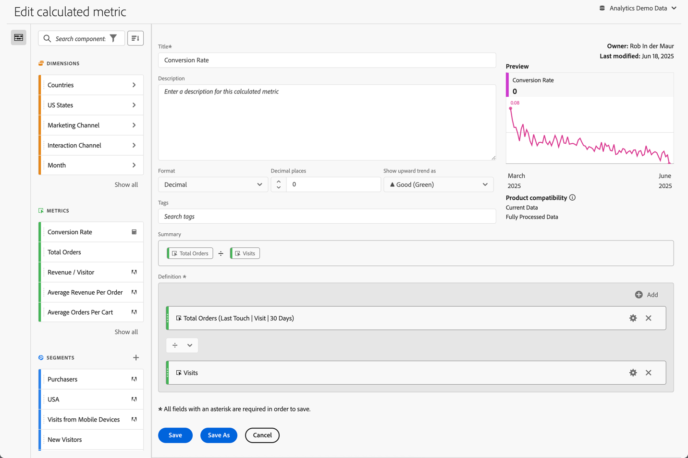

# 建置計算量度 {#build-metrics}

Adobe Analytics 提供的畫布可用來拖放維度、量度、細分群體及函數，根據容器階層邏輯、規則及運算子來建立自訂量度。此整合性開發工具可讓您建置並儲存簡單或複雜的計算量度。

您可以使用計算量度產生器來建立或編輯計算量度。用這個方式建立的計算量度會出現在元件清單中，而且之後可用於整個組織的專案。或者，您也可以快速建立僅供建立量度之專案使用的計算量度，如[量度](/help/analyze/analysis-workspace/components/apply-create-metrics.md)的[建立單一專案的計算量度](/help/analyze/analysis-workspace/components/apply-create-metrics.md#create-calculated-metrics-for-a-single-project)中所述。

[建立計算量度](../cm-workflow.md)說明可用來建立新計算量度的不同選項。

## 計算量度產生器的區域

 **[!UICONTROL 計算量度產生器]**&#x200B;對話框用於建立新註解或編輯現有的計算量度。對於您從[[!UICONTROL 計算量度]管理員](../cm-manager.md)建立或管理的量度，此對話框標題為&#x200B;**[!UICONTROL 新計算量度]**&#x200B;或&#x200B;**[!UICONTROL 編輯計算量度]**。

>[!BEGINTABS]

>[!TAB 計算量度產生器]

>[!TAB 建立或編輯計算量度]

>[!ENDTABS]

1. 指定以下詳細資料 ( 是必要的)：

   | 元素 | 說明 |
   | --- | --- |
   | **[!UICONTROL 報告套裝]** | 您可以選取計算量度的報告套裝。根據選取的報告套裝，您定義的計算量度可在 Workspace 專案中使用。 |
   | **[!UICONTROL 僅限專案的量度]** | 如[為單一專案建立計算量度](/help/analyze/analysis-workspace/components/apply-create-metrics.md#create-calculated-metrics-for-a-single-project)所述，當您編輯為單一專案所建立的計算量度時，此對話框頂部會出現一個資訊框。 
如果您希望將此計算量度套用至所有專案，請選取以下選項： **[!UICONTROL 讓此量度適用於您的所有專案並將其新增至您的元件清單中]**。
 |
   | **[!UICONTROL 標題]** | 命名計算量度，例如 `Conversion Rate`。 |
   | **[!UICONTROL 說明]** | 提供區段說明，例如 `Calculated metric to define the conversion rate.` 不必說明計算量度的公式，因為公式已自動提供在[!UICONTROL 摘要]中。 |
   | **[!UICONTROL 格式]** | 選取計算量度的格式：您可以在&#x200B;**[!UICONTROL 十進位]**、 **[!UICONTROL 時間]**、 **[!UICONTROL 百分比]**&#x200B;和&#x200B;**[!UICONTROL 貨幣]**&#x200B;之間選取。 |
   | **[!UICONTROL 小數位數]** | 指定所選格式的小數位數。只有在選取的格式為十進制、貨幣和百分比時才啟用。 |
   | **[!UICONTROL 顯示上升趨勢的方式]** | 指定計算量度的上升趨勢是否顯示為 ▲ **[!UICONTROL 良好 (綠色)]** 或 ▼ **[!UICONTROL 不良 (紅色)]**。 |
   | **[!UICONTROL 貨幣]** | 指定計算量度的貨幣。只有在選取的格式為貨幣時才啟用。 |
   | **[!UICONTROL 標記]** | 透過建立或套用一個或多個標記來安排計算量度。開始輸入內容以尋找您可以選取的現有標記。或按一下 **[!UICONTROL ENTER]** 以新增新標記。選取以移除標記。 |
   | **[!UICONTROL 預覽]** | 預覽涵蓋過去 90 天的情況，並且是衡量您是否正確定義量度的方法。 |
   | **[!UICONTROL 摘要]** | 顯示計算量度定義的摘要。 例如：   **[!UICONTROL 總訂單]**   **[!UICONTROL 工作階段]**。 |
   | **[!UICONTROL 定義]**  | 使用[定義產生器](#definition-builder)來定義區段。 |

1. 若要驗證您的計算量度定義是否正確，請使用不斷更新的計算指標結果&#x200B;**[!UICONTROL 預覽]** 。 **[!UICONTROL 預覽]**&#x200B;涵蓋過去 90 天的情況，並持續評估計算量度的定義。

   **[!UICONTROL 產品相容性]**&#x200B;表示計算量度與 Adobe Analytics 功能的相容性。請參閱[量度相容性](/help/components/calculated-metrics/cm-compatibility.md)以了解更多資訊。

1. 選取：
   * **[!UICONTROL 儲存]**&#x200B;以儲存計算量度。
   * **[!UICONTROL 另存新檔]**&#x200B;以儲存計算量度副本。
   * **[!UICONTROL 取消]**&#x200B;以取消您對計算量度所做的任何變更，或取消新計算量度的建立。

## 定義產生器

您使用定義產生器來拖放維度、量度、區段和函數，讓您根據容器階層邏輯、規則和運算子來建立自訂量度。在該構造中，您可以使用標準量度、Adobe 定義的量度、計算量度、區段、維度和函數。計算量度產生器中的元件面板都提供所有這些元件。此外，您還可以在定義中使用運算子和容器。

在&#x200B;**[!UICONTROL 定義]**&#x200B;區域中，只有量度會被定義為單一元件。所有其他元件都被定義為容器、封裝量度或其他容器。如需詳細資訊，請參閱[容器](#containers)。

### 量度

若要新增量度：

* 將  **[!UICONTROL 量度]**&#x200B;元件從元件面板拖放至&#x200B;**[!UICONTROL 將量度、維度、維度項目、區段和/或函數拖放到這裡]**。您可以使用元件列中的「」來搜尋特定元件。

當您使用計算量度作為定義的一部分時，計算量度將會擴展。

若要修改量度：

1. 在&#x200B;**[!UICONTROL 定義]**&#x200B;區域中，選取量度元件中的 。
1. 在快顯對話框中，您可以定義量度類型和歸因模型。請參閱「[量度類型和歸因](m-metric-type-alloc.md)」。

若要刪除量度：

* 選取量度中的 。

### 運算子

運算子可讓您指定元件或容器之間的運算子。運算子會自動出現在二者之間：

* 容器中的兩個或多個量度、
* 容器中的兩個或多個容器、
* 容器中的一個或多個量度以及一個或多個容器。

您可以選擇：

| 符號 | 運算子 |
|:---:|---|
|  | 除 (預設) |
|  | 乘 |
|  | 減 |
|  | 新增 |

### 靜態數字

您可以將靜態數字新增至計算量度定義。若要新增靜態數字：

* 從容器內部選取  **[!UICONTROL 新增]**。
* 選取「**[!UICONTROL 靜態數字]**」。出現靜態數字容器。
* 選取「[!UICONTROL *按一下以新增值*]」，並輸入一個值。

### 容器

您可以將維度、區段和函數做為容器，以新增至計算量度定義。您也可以新增通用容器。容器的功能類似數學運算式，用以決定運算順序。容器內的一切都會在下一個元件或容器之前獲得處理。

#### 區段容器

您可以使用區段容器的概念來建立[已劃分的量度](metrics-with-segments.md)。您可以使用區段，或使用從維度建立的區段來建構區段容器。

* 若要從維度新增區段容器：

   1. 將  **[!UICONTROL 維度]**&#x200B;元件從元件面板拖放至&#x200B;**[!UICONTROL 將量度、維度、維度項目、區段和/或函數拖放到這裡]**。您可以使用元件列中的來搜尋特定元件。
   1. 在&#x200B;**[!UICONTROL 「從維度中建立區段」]**&#x200B;快顯視窗中，定義區段的條件。從運算子清單中選取，並選取一個值或輸入一個值。例如， **[!UICONTROL 月]** **[!UICONTROL 等於]**  `Sep 2024`。
   1. 選取「**[!UICONTROL 完成]**」。將區段容器加入&#x200B;**[!UICONTROL 定義]**&#x200B;中。

* 若要從區段新增區段容器，您可以使用：

   * 將  **[!UICONTROL 區段]**&#x200B;元件從元件面板拖放至&#x200B;**[!UICONTROL 將量度、維度、維度項目、區段和/或函數拖放到這裡]**。您可以使用元件列中的來搜尋特定區段。使用區段名稱將區段容器自動加入&#x200B;**[!UICONTROL 定義]**&#x200B;中。

   * 將 **[!UICONTROL 「區段」]**&#x200B;元件從元件面板拖放到通用容器中。該容器被修改為區段容器。

   * 從容器內部選取 **[!UICONTROL 「新增」]**：

      1. 選取&#x200B;**[!UICONTROL 「區段」]**。區段容器就會新增至&#x200B;**[!UICONTROL 「定義」]**。
      1. 在新的區段容器中，從&#x200B;[!UICONTROL *「選取...」*]&#x200B;下拉式選單中選取區段。

  >[!TIP]
  >
  >您可以新增多個區段至一個容器中。

  容器中的區段是以區段元件所命名。例如，  **[!UICONTROL 網頁工作階段]**。選取 ，顯示出含有區段詳細資訊的快顯視窗。在快顯視窗中，選取「」以編輯區段定義。

若要從容器中移除區段：

* 選取區段名稱旁的「」。

請參閱[分段量度](metrics-with-segments.md)以了解更多詳細資料和範例。

#### 函數容器

若要新增函數容器，您可以使用：

* 拖放：

   1. 將  **[!UICONTROL 函數]**&#x200B;元件從元件面板拖放至&#x200B;**[!UICONTROL 將量度、維度、維度項目、區段和/或函數拖放到這裡]**。您可以使用元件列中的「」來搜尋特定函數。
   1. 使用函數名稱將函數容器自動加入「**[!UICONTROL 定義]**」中。

* 從容器內部選取  **[!UICONTROL 新增]**：

   1. 選取「**[!UICONTROL 函數]**」。
   1. 在容器中，從&#x200B;[!UICONTROL *「選取...」*]&#x200B;下拉式選單中選取一個函數。

函數容器以函數元件命名。例如，  **[!UICONTROL 平方根 (量度)]**。選取  來顯示含有函數詳細資訊的快顯視窗。選取「**[!UICONTROL 了解更多]**」，了解更多有關該函數。

請參閱「[使用函數](cm-using-functions.md)，了解如何使用函數以及可使用哪些函數來建立計算量度的詳情。

#### 通用容器

若要新增通用容器：

* 從容器內部選取  **[!UICONTROL 新增]**
* 選取「**[!UICONTROL 容器]**」。將一個空置的新通用容器加入「**[!UICONTROL 定義]**」中。您可以使用通用容器在計算量度的定義中嵌套或建立層次結構。

#### 刪除容器

若要刪除容器，請從容器層級選取  。

>[!MORELIKETHIS]
>
>[使用函數](cm-using-functions.md)
>>[區段](/help/components/segmentation/seg-overview.md)
>

<!--

Adobe Analytics provides a canvas to drag and drop dimensions, metrics, segments, and functions to create custom metrics based on container hierarchy logic, rules, and operators. This integrated development tool lets you build and save simple or complex calculated metrics.

## Begin building a calculated metric

You can use the calculated metric builder to create or edit calculated metrics. When created in this way, calculated metrics are available in the component list and can then be used in projects throughout your organization. Alternatively, you can quickly create a calculated metric that is available only for the project where it was created, as described in [Create calculated metrics for a single project](/help/analyze/analysis-workspace/components/apply-create-metrics.md#create-calculated-metrics-for-a-single-project) in [Metrics](/help/analyze/analysis-workspace/components/apply-create-metrics.md).

Access the calculated metric builder to begin creating a calculated metric that is available in the component list. 

1. Access the calculated metric builder in any of the follows ways:

   * In Analysis Workspace, open a project, then select **[!UICONTROL Components]** > **[!UICONTROL Create metric]**.
   * In Analysis Workspace, open a project, then select the **Plus** icon next to the [!UICONTROL **Metrics**] section in the left rail.
   * In [!DNL Adobe Analytics], go to **[!UICONTROL Components]** > **[!UICONTROL Calculated metrics]**, then select **[!UICONTROL + Add]** at the top of the Calculated metrics page.

1. Continue with [Areas of the calculated metric builder](#areas-of-the-calculated-metrics-builder).

## Areas of the Calculated metrics builder

The following image and accompanying table explain some of the main areas and features of the Calculated metrics builder.

| Location in image  | Name and function  |
|---|---|
| 1 | **Title:** Naming the metric is mandatory. You cannot save the metric unless it is named.  |
| 2 | **Description:** Give it a user-friendly description to show what it's used for and to distinguish it from similar ones. 
The description also appears within a report. It's best NOT to put the formula into the description - instead, describe what this metric should and should not be used for. (The formula is generated as you build the metric, underneath the Summary heading. As a result, there is no need to add the formula to the description.) 
  |
| 3 | **Format:** Choices include Decimal, Time, Percent, and Currency.  |
| 4 | **Decimal Places:** Shows how many decimal places will be shown in the report. The maximum number of decimal places you can specify is 10.  |
| 5| **Show Upward Trend As:** This metric polarity setting shows whether Analytics should consider an upward trend in the metric as good (green) or bad (red). As a result, the report's graph will show as green or red when it's going up.  |
| 6 | **Tags:** Tagging is a good way to organize metrics. All users can create tags and apply one or more tags to a metric. However, you can see tags only for those segments that you own or that have been shared with you. What kinds of tags should you create? Here are some suggestions for useful tags:<ul><li>**Team names**, such as Social Marketing, Mobile Marketing.</li><li>**Projects** (analysis tags), such as Entry-page analysis.</li><li>**Categories**, such as Women's; Geography.</li><li>**Workflows**, such as To be approved; Curated for (a specific business unit)</li></ul> |
| 7 | **Summary:** 
The Summary formula updates anytime you make a change to the metric definition. This formula also shows up in the metrics rail on the left when you hover over a metric and click the  icon. 
  |
| 8 | **Definition:** This is where you drag in metrics/calculated metrics, segments, and/or functions to build the calculated metric. <ul><li>If you drag in a calculated metric, it will expand its metric definition automatically. </li> <li>You can nest definitions with containers. However, unlike segment containers, these containers function like a math expression and determine the order of operations. </li> </ul>  |
| 9 | **Operator:** Divided by (  ) is the default operator, plus there are the +, -, and x operators. |
| 10 | **Preview:** Provides a quick read on any possible errors. The preview covers the last 90 days. This is a way of initially gauging whether you have selected the right components for your metric. An unexpected result would mean you need to take a second look at the metric definition.  |
| 11 | **Product compatibility:** Product compatibility shows you whether the metric is compatible with <a href="/help/analyze/reports-analytics/current-data.md"  > Current Data </a>, with Fully Processed Data, or only with Marketing Channel reports (first-touch allocation). 
Note:  Current Data does not support all metrics. Metrics that contain segments or functions are not compatible with current data. <a href="/help/components/calculated-metrics/cm-compatibility.md"  > More... </a> 
 
  |
| 12 | **Add:** For all types of calculated metrics, you can add containers and static numbers to the definition. For advanced calculated metrics, you can also add segments and functions. <ul><li>Containers function like a math expression and determine the order of operations. So anything in a container will get processed before the next operation.</li><li>Dragging a segment onto a container segments everything in that container. (Advanced calculated metrics only)</li><li>You can stack multiple segments in a container.</li></ul> |
| 13 | **Gear icon (Metric Type, Attribution):** Selecting the gear icon next to a metric lets you specify the <a href="/help/components/calculated-metrics/workflow/c-build-metrics/m-metric-type-alloc.md"  > metric type and attribution models </a>. |
| 14 | **New:** Lets you create a new component, such as a new segment (which takes you to the <a href="/help/components/segmentation/segmentation-workflow/seg-build.md"  > Segment Builder </a>.) |
| 15 | **Search Components:** This search bar lets you search for dimensions, metrics, segments (advanced calculated metrics only), and functions (advanced calculated metrics only). |
| 16 | **List of Dimensions:** Rather than leaving the Calculated Metric Builder in order to build a simple segment (in the Segment Builder), e.g. "Page = Homepage", you can drag in Page and select Homepage directly from the Calculated Metric Builder.
This results in a much more streamlined workflow for creating segmented calculated metrics.
 |
| 17 | **List of Metrics:** Metrics come in 3 categories: <ul> <li>Standard metrics () </li><li>Calculated metrics ( ) </li><li id="li_8735E76637ED4C3F983731A66E04C93E">Metrics templates ( ) - at the bottom of the list. </li> </ul> 
When you hover over a metric, you can see the Info icon to the right of it: . Clicking this icon gives you the following information: 
<ul> <li>The formula of how it is calculated. </li><li>A preview trend of the metric. </li><li>An edit (pencil) icon  at the top right that will take you to the Calculated Metrics Builder where you can edit this calculated metric. </li></ul> |
| 18 | **List of Segments:** (Advanced calculated metrics only) As an Admin, this list shows all segments created in your login company. If you are a non-Admin user, this list shows segments you own and those shared with you. <a href="/help/components/segmentation/segment-reference/seg-rights.md"  > More... </a> |
| 19 | **List of Functions:** (Advanced calculated metrics only) Functions are divided into two lists: <a href="/help/components/calculated-metrics/cm-reference/cm-functions.md"  > Basic </a> (used most often) and <a href="/help/components/calculated-metrics/cm-reference/cm-adv-functions.md"  > Advanced </a>. |
| 20 | **Report Suite selector:** Lets you switch to a different report suite. |

{style="table-layout:auto"}

-->
