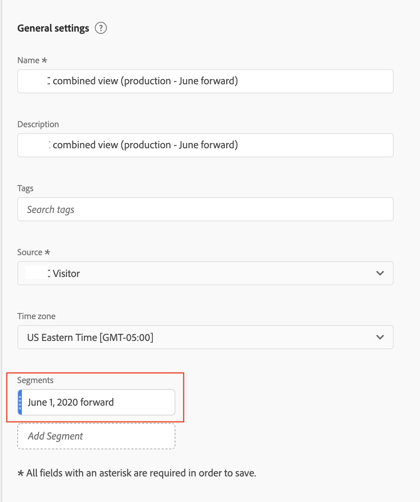

# 將 VRS 限制為特定日期

當我們開啟銜接功能時，系統會在特定日期開始銜接。假設該日期是 6 月 1 日。CDA VRS 將包含 6 月 1 日之前未銜接的資料。您可能想要在 6 月 1 日之前隱藏 VRS 中的任何資料，以便分析著重在銜接開始後的日期範圍。

您可以執行下列動作，將 VRS 資料限制為特定日期：

## 步驟 1：建立具備每日滾動日期範圍的 VRS

當您設定 VRS (在「元件」下方) 時，加入開始日期為固定的日期範圍，並具備滾動的日期範圍。固定開始日期應該是銜接開始的當日。

## 步驟 2：建立「排除-排除」區段

接著，建立點擊區段，將日期範圍放在另一個排除容器內的排除容器中。 這就是「排除-排除」。

「排除-排除」的原因是日期範圍旨在覆寫報告的日期範圍。因此，如果您只納入 6 月 1 日轉送，這會使報告日期範圍 6 月 1 日一律轉送。這將導致不想要的結果。當您「排除-排除」時，這會覆寫此行為，並只限制您可從中擷取的資料至適當的日期範圍。

## 步驟 3：將此區段套用至您的 CDA VRS

## 步驟4：檢視報告結果

請注意，現在報告是從所要的日期開始，也就是第一次實施銜接的當天：

