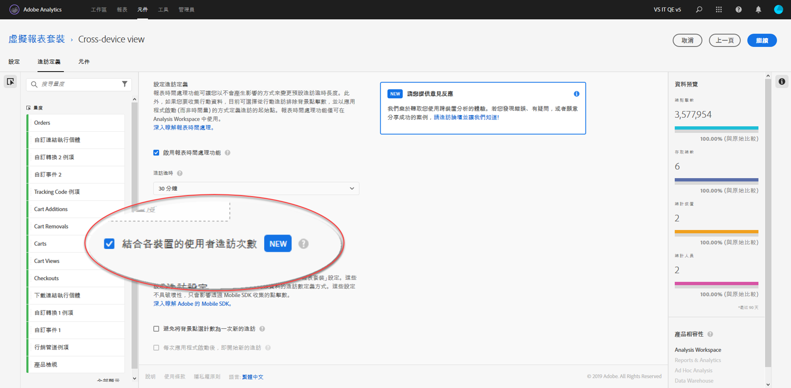

# 設定跨裝置分析

{{available-existing-customers}}

滿足所有必要條件後，請依照下列步驟啟用跨裝置分析。您必須屬於「產品設定檔管理員」群組，或在 Adobe Analytics 中擁有管理員權限，才能依照這些步驟操作。

>[!IMPORTANT]
>
>執行這些步驟之前，必須先滿足所有必要條件。如果未滿足所有必要條件，則無法使用該功能或無法順利運作。如需必要條件和限制，請參閱[概觀頁面](overview.md)及所需的拚接方法 (分別是[依欄位拚接](field-based-stitching.md)或[裝置圖表](device-graph.md))。

## 1.向客戶服務提交票證，以便在跨裝置報表套裝上布建CDA

Adobe 工程部門會將 CDA 佈建在您的跨裝置報表套裝上。 若要開始此程序，請聯絡客戶服務，並備妥以下資訊：

* 您的 Adobe Experience Cloud 組織 ID (以 @AdobeOrg 結尾的英數字串)
* 您要透過 CDA 啟用跨裝置報表套裝的報表套裝 ID
* 您要使用哪種CDA方法(依欄位彙整或Adobe裝置圖表)
* 如果使用依欄位拚接，則需使用包含使用者 ID 的 prop/eVar
* 您的重播頻率和回顧時間長度偏好設定。包括每週重播一次且回顧期間為 7 天，或每天重播一次且回顧期間為 1 天。
預設值為每週重播一次且回顧期間為 7 天。 在此情況下，上一週的資料可能會有變動 (因為該資料正在逐步拼接和更新)。

向客戶服務提供此資訊後，他們就會與 Adobe 工程部門合作，好讓您選擇的報表套裝進行 CDA 處理。

## 2.建立跨裝置虛擬報表套裝以檢視跨裝置檢視

有權限建立虛擬報表套裝的管理員可依下列步驟建立 CDA 虛擬報表套裝：

1. 導覽至 [experiencecloud.adobe.com](https://experiencecloud.adobe.com) 並使用您的 AdobeID 憑證登入。
2. 按一下頂端的 9 格線圖示，然後按一下「Analytics」。
3. 將游標暫留在頂端的&#x200B;**[!UICONTROL 元件]**&#x200B;上，然後按一下&#x200B;**[!UICONTROL 虛擬報表套裝]**。
4. 按一下「新增」。
5. 輸入虛擬報表套裝的名稱，並確認選取已啟用 CDA 的報表套裝。
6. (選用) 將區段套用至虛擬報表套裝。例如，您可以套用區段來將虛擬報表套裝限制為開啟 CDA 功能及開始連結後的日期。此區段可讓使用者在虛擬報表套裝中僅看到銜接的日期範圍。
7. 按一下「啟用報表時間處理」核取方塊，啟用包括跨裝置分析在內的多個選項。
8. 按一下「連結跨裝置使用者造訪次數」核取方塊。
9. 按一下「繼續」，完成虛擬報表套裝的設定，然後按一下「儲存」。

## 跨裝置虛擬報表套裝的新增和變更項目

為虛擬報表套裝啟用跨裝置分析時，請留意下列變更：

* 虛擬報表套裝名稱旁會出現新的跨裝置圖示。此圖示是跨裝置虛擬報表套裝的專屬圖示。
* 可以使用一個標記為[已識別的狀態](../dimensions/identified-state.md)的新維度。
* 可使用標記為「[使用者](../metrics/people.md)」、「[不重複裝置](../metrics/unique-devices.md)」、「[已識別的使用者](../metrics/identified-people.md)」、「[未識別的使用者](../metrics/unidentified-people.md)」和「[具有 Experience Cloud ID 的使用者](../metrics/people-with-exp-cloud-id.md)」的新量度。
* [「不重複訪客」](../metrics/unique-visitors.md)量度無法使用，因為它已被「使用者」和「不重複裝置」取代。
* 建立區段時，「訪客」區段容器會被「人員」容器取代。
