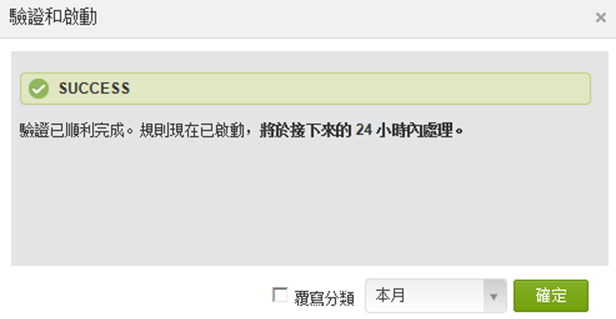
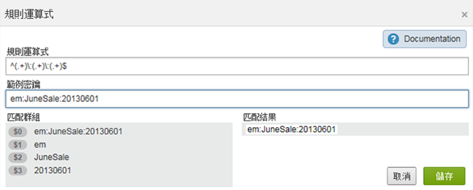
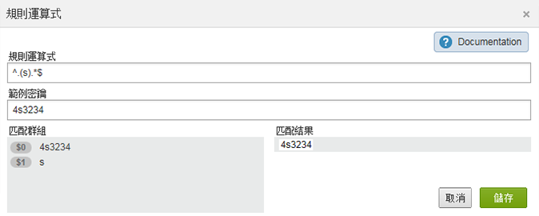
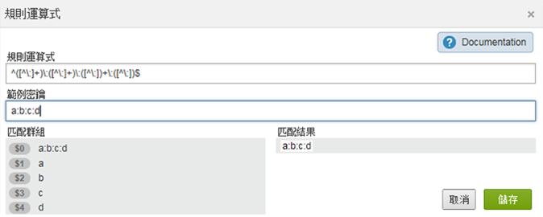
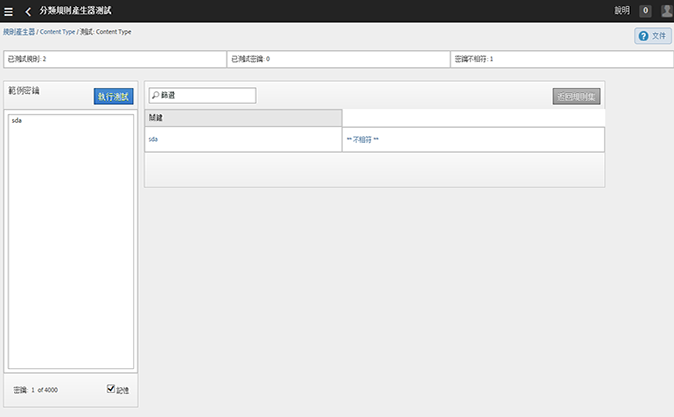

# 分類規則（舊版）

{{classification-rulebuilder-deprecation}}

分類規則會經常尋找未分類的詞語。如果找到符合規則的結果，規則會自動將詞語新增到您的分類資料表格中。您也可以使用分類規則覆寫現有的索引鍵。

**[!UICONTROL 分析]** > **[!UICONTROL 管理員]** > **[!UICONTROL 分類規則產生器]**

規則產生器可讓您建立&#x200B;*分類規則集*，這是一份&#x200B;*分類規則*&#x200B;清單。規則會匹配您指定的準則，然後執行動作。

分類規則可方便執行下列作業：

* **電子郵件**&#x200B;和&#x200B;**顯示廣告**：建立分類規則以便將個別顯示廣告行銷活動分組，好讓您了解顯示促銷活動針對電子郵件促銷活動的成效。

* **追蹤程式碼**：建立分類規則將衍生自追蹤程式碼內之字串的索引鍵值分類，並和您定義的特定準則比對。
* **搜尋詞**：使用[規則運算式](/help/components/classifications/crb/classification-quickstart-rules.md)和萬用字元來簡化分類搜尋詞的程序。例如，如果搜尋詞包含 *`baseball`*，您可將分類 *`Sports League`* 設定為 *`MLB`*。

例如，假設電子郵件促銷活動 ID 的追蹤程式碼是：

`em:Summer:20XX:Sale`。

您可以在規則集裡設定三個規則，以識別字串的各部分，然後將值分類：

| 選擇規則類型 | 輸入匹配準則 | 設定分類 | 結束日期 |
|---|---|---|---|
| 開頭為 | em: | 管道 | 電子郵件 |
| 結尾為 | Sale | 類型 | Sale |
| 包含 | 20XX | 年 | 20XX |

## 規則的處理方式 {#how-rules-are-processed}

關於如何處理分類規則的重要資訊。

<!-- 

about_classification_rules.xml

 -->

* [關於規則的重要資訊](/help/components/classifications/crb/classification-rule-builder.md)
* [規則什麼時候不會將索引鍵分類？](/help/components/classifications/crb/classification-rule-builder.md)
* [關於規則優先順序](/help/components/classifications/crb/classification-quickstart-rules.md)

>[!NOTE]
>
>[!UICONTROL 規則產生器]不支援「數值 2」分類。

## 關於規則的重要資訊

* 在[管理工具](https://experienceleague.adobe.com/docs/analytics/admin/user-product-management/user-groups/groups.html?lang=zh-Hant)中指定分類的[!UICONTROL 群組許可權]。

* **規則運算式**：[分類規則中的規則運算式](/help/components/classifications/crb/classification-quickstart-rules.md)底下提供說明。

* **報告套裝**：至少要選取一個報告套裝後，才能選擇分類。您必須先建立規則集並指派變數後，才能套用報告套裝。

  當您測試規則集時，使用報告中的索引鍵 (要分類的變數) 查看規則集對它們有何影響。（[索引鍵](/help/components/classifications/importer/c-saint-data-files.md)是要分類的變數，或分類上傳表格中的第一欄）。

* **規則優先順序**：如果一個索引鍵符合設定同一個分類的多個規則 (在「[!UICONTROL 設定分類]」欄裡)，則會使用符合分類的最後一個規則。請參閱[關於規則優先順序](/help/components/classifications/crb/classification-quickstart-rules.md)。

* **規則數目上限**：您可以建立的規則數目並無限制。但是，大量的規則可能會影響瀏覽器效能。
* **處理**：視您的分類相關流量大小而定，會以頻繁間隔處理規則。

  每 4 小時會處理作用中的規則，通常會往回追溯一個月內的分類資料並予以檢查。規則會自動檢查是否有新值，並使用匯入工具上傳分類。

* **覆寫現有的分類**：請參閱「[規則什麼時候不會將索引鍵分類？」](/help/components/classifications/crb/classification-quickstart-rules.md) 如有必要，您可以使用匯入工具來刪除或移除現有的分類。

## 規則什麼時候不會將索引鍵分類？

當您啟動規則時，可以覆寫現有的分類。在下列情況下，分類規則不會分類[索引鍵](/help/components/classifications/importer/c-saint-data-files.md)（變數），如果：

* 索引鍵已經分類，而您並未選取「[覆寫分類](/help/components/classifications/crb/classification-rule-definitions.md)」。

  [新增和啟用](/help/components/classifications/crb/classification-quickstart-rules.md)規則以及啟用Data Connectors整合時，您可以覆寫分類。 (若是 Data Connectors，規則由合作夥伴於開發中心建立，並顯示於[!UICONTROL 分類規則產生器]中)。

* 覆寫索引鍵時，在指定的時間範圍後，即使在您啟用「[覆寫分類](/help/components/classifications/crb/classification-rule-definitions.md)」後，分類的索引鍵仍未在資料中顯示。
* 索引鍵並未分類，而且在約一個月之前開始的時間範圍之後，索引鍵從未傳入 [!DNL Adobe Analytics]。

  >[!NOTE]
  >
  >在報表中，只要有索引鍵存在，分類就會套用到任何指定的時間範圍。報告的日期範圍不會影響報告。



## 分類規則裡的規則運算式 {#regex-in-classification-rules}

使用規則運算式匹配格式一致的字串值和分類。例如，您可以利用追蹤程式碼中的特定字元建立分類。您可以匹配特定的字元、字詞或字元模式。

>[!NOTE]
>
>最佳做法是，規則運算式最適合使用分隔字元的追蹤程式碼。

## 規則運算式 - 追蹤程式碼範例 {#section_2EF7951398EB4C2F8E52CEFAB4032669}

>[!NOTE]
>
>如果追蹤程式碼為URL編碼，它將&#x200B;**不會**&#x200B;由規則產生器分類。

在這個範例中，假設您要將以下的促銷活動 ID 分類：

範例金鑰： `em:JuneSale:20XX0601`

您要分類的追蹤程式碼的部分為：

* `em` = 電子郵件
* `JuneSale` = 行銷活動名稱
* `20XX0601` = 日期

規則運算式： `^(.+)\:(.+)\:(.+)$`

規則運算式如何與促銷活動 ID 關聯：


匹配群組：顯示規則運算式對應到促銷活動ID字元的情形，以便您能夠將促銷活動ID中的位置分類。



這個範例告訴規則，促銷活動日期 `20XX0601` 是在第三個群組 `(.+)`，以 `$3` 識別。

**[!UICONTROL 規則產生器]**

在[!UICONTROL 規則產生器]中，設定規則如下：

| 選擇規則類型 | 輸入匹配準則 | 設定分類 | 結束日期 |
|---|---|---|---|
| 規則運算式 | &Hat;(.+)\：(.+)\：(.+)$ | 促銷活動日期 | $3 |

**語法**

| 規則運算式 | 字串或匹配結果 | 對應的匹配群組 |
|--- |--- |--- |
| `^(.+)\:(.+)\:(.+)$` | `em:JuneSale:20XX0601` | `$0`： `em:JuneSale:20XX0601` `$1`： em `$2`： JuneSale `$3`： 20XX0601 |
| 建立語法 | `^` = 以該行開始 () = 將字元分組，並且讓您以括號擷取相符字元。`(.+)` = 擷取一個 ( .) 字元和 ( + ) 任何其他項目 \ = 字串的開始。`$` = 指示前面的字元 (或字元群組) 是行裡面最後一個。 |

關於規則運算式中的字元代表意義的詳細資訊，請參閱[規則運算式 - 參考表格](/help/components/classifications/crb/classification-quickstart-rules.md)。

## 規則運算式 - 將特定字元分類 {#section_5D300C03FA484BADACBFCA983E738ACF}

使用規則運算式的一種方式，是將字元字串裡的特定字元分類。例如，假設以下追蹤程式碼包含兩個重要的字元：

範例金鑰： `4s3234`

* `4` = 品牌名稱
* `s` = 識別搜尋引擎，例如 Google



**[!UICONTROL 規則產生器]**

在[!UICONTROL 規則產生器]中，設定規則如下：

| 選擇規則類型 | 輸入匹配準則 | 設定分類 | 結束日期 |
|--- |--- |--- |--- |
| 規則運算式 | `^.(s).*$` | 品牌和引擎 | `$0` (擷取品牌名稱和搜尋引擎的前兩個字元。) |
| 規則運算式 | `^.(s).*$` | 搜尋引擎 | `$1` (擷取 Google 的第 2 個字元。) |

## 規則運算式 - 比對各種長度的追蹤程式碼 {#section_E86F5BF5C2F44ABC8FFCE3EA67EE3BB2}

這個範例顯示如果有各種長度的追蹤程式碼，要如何識別冒號分隔字元間的特定字元。Adobe 建議針對每個追蹤程式碼使用一個規則運算式。

範例密鑰：

* `a:b`
* `a:b:c`
* `a:b:c:d`

**語法**




**[!UICONTROL 規則產生器]**

在[!UICONTROL 規則產生器]中，設定規則如下：

| 選擇規則類型 | 輸入匹配準則 | 設定分類 | 結束日期 |
|--- |--- |--- |--- |
| 比對字串`a:b`的規則運算式 | `^([^\:]+)\:([^\:]+)$` | a | `$1` |
| 比對字串`a:b`的規則運算式 | `^([^\:]+)\:([^\:]+)$` | b | `$2` |
| 比對字串`a:b:c`的規則運算式 | `^([^\:]+)\:([^\:]+)\:([^\:]+)$` | a | `$1` |
| 比對字串`a:b:c`的規則運算式 | `^([^\:]+)\:([^\:]+)\:([^\:]+)$` | b | `$2` |
| 比對字串`a:b:c`的規則運算式 | `^([^\:]+)\:([^\:]+)\:([^\:]+)$` | c | `$3` |
| 比對字串`a:b:c:d`的規則運算式 | `^([^\:]+)\:([^\:]+)\:([^\:]+)\:([^\:])$` | d | `$4` |

## 規則運算式 - &quot;Does Not Contain&quot; 範例 {#section_FCA88A612A4E4B099458E3EF7B60B59C}

這個範例提供一個規則運算式，會匹配不包含特定字元的任何字串，在這個例子裡是 `13`。

規則運算式：

`^(?!.*13.*).*$`

測試字串：

```
a:b:
a:b:1313
c:d:xoxo
c:d:yoyo
```

匹配結果：

```
a:b:
c:d:xoxo
c:d:yoyo
```

在這個結果中，`a:b:1313` 不表示匹配。

## 規則運算式 - 參考表格 {#section_0211DCB1760042099CCD3ED7A665D716}

| 運算式 | 說明 |
|---|---|
| `(?ms)` | 讓整個規則運算式配對多行輸入，可讓 .萬用字元符合任何新行字元 |
| (`?i`) | 讓整個規則運算式不區分大小寫 |
| [`abc`] | a、b 或 c 其中一個字元 |
| [`^abc`] | 除了下列之外的任何單一字元：a、b 或 c |
| [`a-z`] | a-z 範圍內的任何單一字元 |
| [`a-zA-Z`] | a-z 或 A-Z 範圍內的任何單一字元 |
| `^` | 行的開始 (匹配行的開始) |
| `$` | 匹配行的結尾 (或結尾處的新行之前) |
| `\A` | 字串的開始 |
| `\z` | 字串的結尾 |
| `.` | 匹配任何字元 (新行除外) |
| `\s` | 任何空白字元 |
| `\S` | 任何非空白字元 |
| `\d` | 任何數字 |
| `\D` | 任何非數字 |
| `\w` | 任何單詞字元 (字母、數字、底線) |
| `\W` | 任何非單詞字元 |
| `\b` | 任何單詞邊界 |
| `(...)` | 擷取括住的所有內容 |
| `(a\b)` | a 或 b |
| `a?` | 零個或一個 a |
| `a*` | 零個或更多 a |
| `a+` | 一或多個 a |
| `a{3}` | 剛好 3 個 a |
| `a{3,}` | 3 個或更多 a |
| `a{3,6}` | 介於 3 到 6 個 a |

測試規則運算式有效性的實用資源為 [https://rubular.com/](https://rubular.com/)。

## 關於規則優先順序

如果一個索引鍵符合多個規則，而且設定的分類欄和「[!UICONTROL 設定分類]」欄裡顯示的相同，會使用最後一個規則。因此，您可能要將最重要的規則排在規則集的最後面。

<!-- 

rule_priority.xml

 -->

如果您建立未共用同一個分類的多個規則，那麼處理順序並不重要。

以下是將運動員的搜尋類型分類的搜尋詞規則範例：

| 規則編號 | 規則類型 | 符合 | 設定分類 | 結束日期 |
|---|---|---|---|---|
| 1 | 包含 | Cowboys | 搜尋類型 | Team |
| 2 | 包含 | Fantasy | 搜尋類型 | Fantasy |
| 3 | 包含 | Romo | 搜尋類型 | Player |

如果使用者搜尋&#x200B;*`Cowboys fantasy Tony Romo`*，會分類字詞&#x200B;*`Player`*，因為它符合「設定分類」欄中顯示的最後一個指定分類。

同樣地，假設您在一個規則集裡面為下列搜尋詞設定兩個規則：

| 規則編號 | 規則類型 | 符合 | 設定分類 | 結束日期 |
|---|---|---|---|---|
| 1 | 包含 | Cowboys | 城市 | Dallas |
| 2 | 包含 | Broncos | 城市 | Denver |

使用者搜尋&#x200B;*`Cowboys vs. Broncos`*。 如果規則產生器在規則比對中發現衝突，則會將第二個規則的分類 (Denver) 套用到這項搜尋。

## 將分類規則新增至規則集 {#add-classification-to-rule-set}

<!-- 

t_classification_rule.xml

 -->

匹配條件與分類，並指定動作以新增規則。

>[!NOTE]
>
>在這個程序中，您必須套用規則到一個或多個報告套裝。每個規則集的建議規則數是介於 500 到 1000 個規則之間，但是沒有限制。如果您有超過100個規則，請考慮使用[子分類](/help/components/classifications/importer/subclassifications.md)來簡化規則集。

若要新增或編輯分類規則：

1. [建立分類規則集](/help/components/classifications/crb/classification-rule-set.md)。
1. 在規則集頁面上，按一下&#x200B;**[!UICONTROL 「新增規則」]**。

   

1. 在&#x200B;**[!UICONTROL 報告套裝]**&#x200B;旁邊，按一下&#x200B;**[!UICONTROL 「新增套裝」]**&#x200B;以指定要指派到這個規則集的一個或多個報告套裝。

   接著會顯示&#x200B;**[!UICONTROL 「選取報告套裝」]**&#x200B;頁面。

   >[!NOTE]
   >
   >*只有*&#x200B;在符合下列條件時，報告套裝才會顯示在此頁面上：
   >
   >* 報告套裝的「[!UICONTROL 管理工具]」中，至少為該變數定義了一個分類。
   >
   >   (請參閱[分類規則集](/help/components/classifications/crb/classification-rule-set.md)中的&#x200B;*變數*，取得此先決條件的說明。)
   >
   >* 您在&#x200B;**[!UICONTROL 可用報告套裝]**&#x200B;頁面上，選取您按一下[「新增規則集」](/help/components/classifications/crb/classification-rule-set.md)來建立規則集後所顯示的報告套裝。

1. 指定是否覆寫現有規則：

   | **規則會覆寫任何現有的值** | (預設設定) 一律覆寫現有分類索引，包括透過匯入工具 (SAINT) 上傳的分類。 |
   |---|---|
   | **規則僅會覆寫未設定的值** | 只會填入空白 (未設定) 的儲存格。現有分類不會變更。 |

1. [定義一個或多個規則](/help/components/classifications/crb/classification-rule-definitions.md#section_4A5BF384EEEE4994B6DC888339833529)。

   

   如需建立規則的範例，請參閱[分類規則產生器](/help/components/classifications/crb/classification-rule-builder.md)和[分類規則中的規則運算式](/help/components/classifications/crb/classification-quickstart-rules.md)。

   >[!NOTE]
   >
   >如果一個索引鍵符合設定同一個分類的多個規則 (在「設定分類」欄裡)，則會使用符合分類的最後一個規則。請參閱上文的&#x200B;**關於規則優先順序**，以取得關於排序規則的詳細資訊。

1. [測試您的規則集](/help/components/classifications/crb/classification-quickstart-rules.md)。
1. 測試之後，按一下&#x200B;**[!UICONTROL 「作用中」]**&#x200B;以驗證及啟動規則。

   啟動規則會自動建立 檔案，並幫您上傳檔案。

   欄位定義：請參閱[分類規則產生器](/help/components/classifications/crb/classification-rule-definitions.md)，以取得這個頁面上之介面選項的完整定義。

## 測試分類規則集

<!-- 

t_classifications_test_rule.xml

 -->

您可以測試分類規則或規則集。執行測試會檢查規則集內所有的規則。

若要測試分類規則集：

1. [建立分類規則集](/help/components/classifications/crb/classification-rule-set.md)。
1. 在「[!UICONTROL 分類規則產生器]」上，按一下規則集名稱。
1. 確定規則集已和一個報告套裝關聯。
1. 在規則編輯器上，按一下&#x200B;**[!UICONTROL 「測試規則集」]**。

   

1. 在「[!UICONTROL 範例索引鍵]」欄位中輸入或貼上測試索引鍵。

   範例索引鍵包括：

   * 追蹤程式碼
   * 搜尋關鍵字或片語

   如需有關測試規則運算式的資訊，請參閱分類規則中的[規則運算式](/help/components/classifications/crb/classification-quickstart-rules.md)。
1. 按一下&#x200B;**[!UICONTROL 「執行測試」]**。

   符合的規則會在「[!UICONTROL 結果]」表格裡顯示。
1. (選用) 按一下&#x200B;**[!UICONTROL 「啟動」]**&#x200B;以啟動規則，並覆寫現有的分類。

   查看有關使用規則來覆寫現有分類的詳細資訊。

## 驗證和啟動分類規則

<!-- 

t_validate_rules.xml

 -->

若要驗證和啟動分類規則：

1. [建立分類規則集](/help/components/classifications/crb/classification-rule-set.md)，然後[新增分類規則](/help/components/classifications/crb/classification-quickstart-rules.md)至該集。
1. 在規則編輯器上，按一下&#x200B;**[!UICONTROL 「啟動」]**。

   

1. (選用) 若要覆寫分類，請啟用「&lt;*選取項目*> 的&#x200B;**[!UICONTROL 覆寫分類]**」。

   此選項可讓您覆寫受影響索引鍵的現有分類。

   如需此選項的定義，請參閱「[規則頁面](/help/components/classifications/crb/classification-rule-definitions.md#section_4A5BF384EEEE4994B6DC888339833529)」。
