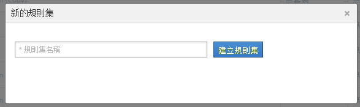
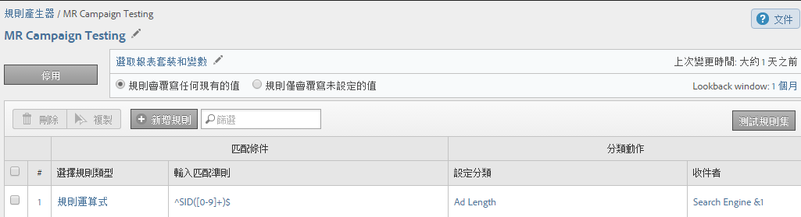

# 分類規則集（舊版）

{{classification-rulebuilder-deprecation}}

*此頁面說明分類規則集是[分類規則產生器](classification-rule-builder.md)的一部分。 請參閱[分類集](../sets/overview.md)，以瞭解Adobe Analytics中目前的資料分類方法。*

規則集是一組特定變數的分類規則。您將變數套用到規則集。如果要為一個變數建立多個規則集，必須將每個規則集套用到多個報表套裝。

## 分類規則產生器頁面 {#section_C60B0888C76D49C596EF19F11808B718}

**[!UICONTROL 分析]** > **[!UICONTROL 管理員]** > **[!UICONTROL 分類規則產生器]**

「[!UICONTROL 分類規則產生器]」上有下列的欄位和選項。

<table id="table_A5D92409969747E39E041216A5AA32CD"> 
 <thead> 
  <tr> 
   <th colname="col1" class="entry"> 元素 </th> 
   <th colname="col2" class="entry"> 說明 </th> 
  </tr> 
 </thead>
 <tbody> 
  <tr> 
   <td colname="col1"> 
<a href="/help/components/classifications/crb/classification-rule-set.md"  > 新增規則集</a> 
 </td> 
   <td colname="col2"> 
建立規則集。 
 </td> 
  </tr> 
  <tr> 
   <td colname="col1"> 
規則 
 </td> 
   <td colname="col2"> 顯示規則集內包含的規則數目。 </td> 
  </tr> 
  <tr> 
   <td colname="col1"> 
狀態 
 </td> 
   <td colname="col2"> 顯示規則集的活動狀態，例如「草稿」或「作用中」。每日均會處理作用中的規則，通常會往回追溯一個月內的分類資料並予以檢查。規則會自動檢查是否有新值並上傳分類。 </td> 
  </tr> 
  <tr> 
   <td colname="col1"> 
上次變更時間 
 </td> 
   <td colname="col2"> 指示上次編輯規則集的時間。 </td> 
  </tr> 
  <tr> 
   <td colname="col1"> 
複製 
 </td> 
   <td colname="col2"> 複製 (拷貝) 規則集，以便將規則集套用到其他變數，或套用到不同報表套裝裡的同一個變數。 </td> 
  </tr> 
 </tbody> 
</table>

## 建立分類規則集 {#create-classification-rule-set}

命名分類規則集、套用變數及指定覆寫設定。

1. (先決條件) 在&#x200B;**[!UICONTROL 「管理員]** > **[!UICONTROL 報表套裝」]**&#x200B;中定義分類結構。

   必須先為變數定義至少一個分類，變數才會顯示在[!UICONTROL 「新的規則集」]面板中。

   您可以在&#x200B;**[!UICONTROL 「管理員]** > **[!UICONTROL 報表套裝]** > **[!UICONTROL 流量]** > **[!UICONTROL 流量分類」]**(或&#x200B;**[!UICONTROL 「轉換]** > **[!UICONTROL 轉換分類」]**) 中建立變數的分類。然後選取變數，再按一下&#x200B;**[!UICONTROL 「新增分類」]**。

1. 若要建立規則集，請按一下&#x200B;**[!UICONTROL 「管理員]** > **[!UICONTROL 分類規則產生器]** > **[!UICONTROL 新增規則集」]**。

   

1. 命名規則集，然後按一下&#x200B;**[!UICONTROL 「建立規則集」]**。
1. 選取要編輯的規則集。

   

1. 按一下&#x200B;**[!UICONTROL 「選取報表套裝和變數」]**。

   報表套裝和變數清單會填入您的登入公司裡所有報表套裝中可用的所有分類變數。報表套裝中單一的變數只能屬於一個規則集。

   請參閱&#x200B;*`Variable`*&#x200B;分類規則產生器[頁面所列定義中的](/help/components/classifications/crb/classification-rule-definitions.md)以取得詳細資訊。
1. 指定要使用的報表套裝和變數，然後按一下&#x200B;**[!UICONTROL 「儲存」]**。
1. [將分類規則新增](/help/components/classifications/crb/classification-rule-set.md)到規則集以繼續執行。
