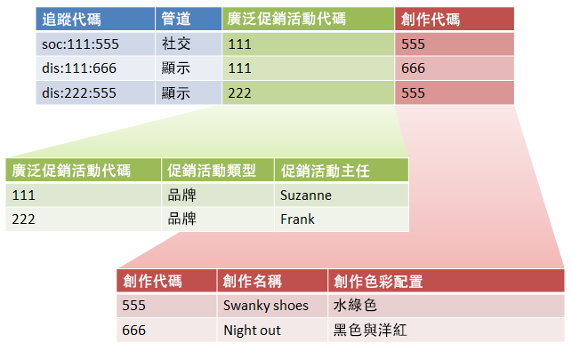

# 子分類和規則產生器（舊版）

{{classification-rulebuilder-deprecation}}

如果您確定每個子分類都有上層變數值，即可結合「分類規則產生器」與子分類。

結合「分類規則產生器」和子分類，即可簡化分類管理並減少所需的規則數目。若您的追蹤程式碼包含想要個別分類的程式碼，則您可能會想要執行此動作。

請參閱[子分類](/help/components/classifications/importer/subclassifications.md)，瞭解子分類的概念資訊。

## 範例

假設使用下列追蹤程式碼：

`channel:broad_campaign:creative`

分類階層可以讓您將分類套用到分類 (稱為 *`sub-classification`*)。亦即，您可將諸如關聯式資料庫等匯入工具，與多個表格搭配使用。其中一個表格會將完整追蹤程式碼對應至索引鍵，而另外的表格則會將這些索引鍵對應至其他表格。

建立好此結構後，您可以使用[分類規則產生器](/help/components/classifications/crb/classification-rule-builder.md)來上傳只會更新查詢表格（亦即上圖中的綠色與紅色表格）的小型檔案。 之後，您即可使用規則產生器讓主要分類表格維持在最新狀態。

下列工作說明完成此動作的方式。

## 使用規則產生器設定子分類

說明如何使用規則產生器上傳子分類的範例步驟。

1. 在分類管理員中建立分類和子分類。

   範例：

   

1. 在[分類規則產生器](/help/components/classifications/crb/classification-rule-builder.md)中，分類來自原始追蹤程式碼的子分類索引鍵。

   您可使用規則運算式執行此動作。在此範例中，填入&#x200B;*`Broad Campaign code`*&#x200B;的規則會使用此規則運算式：

   | `#` | 規則類型 | 符合 | 設定分類 | 結束日期 |
   |---|---|---|---|---|
   |   | 規則運算式 | `[^\:]:([^\:]):([^\:])` | 廣泛促銷活動代碼 | `$1` |
   |   | 規則運算式 | `[^\:]:([^\:]):([^\:])` | 創作代碼 | `$2` |

   >[!NOTE]
   >
   >此時不要填入子分類 *`Campaign Type`* 和 *`Campaign Director`*。

1. 上傳僅含指定子分類的分類檔案。

   請參閱[多級分類](/help/components/classifications/importer/subclassifications.md)。

   範例：

   | 金鑰 | 管道 | 廣泛促銷活動代碼 | 廣泛促銷活動代碼&Hat;促銷活動類型 | 廣泛促銷活動代碼&Hat;促銷活動主管 | ... |
   |---|---|---|---|---|---|
   | &#42; |  | 111 | 品牌 | Suzanne |  |
   | &#42; |  | 222 | 品牌 | Frank |  |

1. 若要維護查詢表格，請上傳小型檔案 (如以上所示)。

   例如，您可在導入新 *`Broad Campaign code`* 時上傳此檔案。此檔案會套用至先前已分類的值。同樣地，如果您建立新的子分類（例如&#x200B;*`Creative Theme`*&#x200B;作為&#x200B;*`Creative code`*&#x200B;的子分類），您只會上傳子分類檔案，而不會上傳整個分類檔案。

   針對報告，這些子分類的功用與最上層分類完全相同。這可減輕使用分類所產生的管理負擔。
