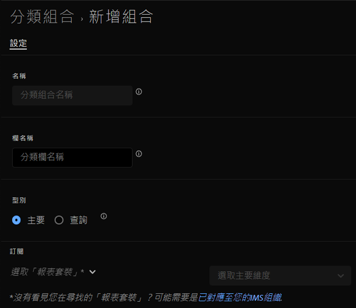

# 建立「分類設定」

您可以使用分類設定管理員來建立「分類設定」。

>[!NOTE]
>
>所有將其報表套裝移轉至新分類架構的客戶，都能使用此功能。 如需詳細資訊，請連絡Adobe客戶服務或您的客戶經理。

**[!UICONTROL 元件]** > **[!UICONTROL 分類設定]** > **[!UICONTROL 設定]** > **[!UICONTROL 新增]**

建立「分類設定」時，以下欄位可供使用。

* **[!UICONTROL 姓名]**：用於識別「分類設定」的文字欄位。此欄位無法在建立時即進行編輯，但可稍後重新命名。
* **[!UICONTROL 欄名稱]**：要建立的分類維度名稱。此欄位是用於 Analysis Workspace 的維度名稱以及匯出分類資料時的欄名稱。
* **[!UICONTROL 類型]**：指示分類類型的選項按鈕。通常會使用主要分類；查詢分類代表[子分類](../c-sub-classifications.md)。
* **[!UICONTROL 訂閱]**&#x200B;套用此「分類設定」的報告套裝和維度。計畫對多個報告套裝提供支援。

若特定報告套裝 + 變數存在有「分類設定」，反而會對結構描述新增分類。
