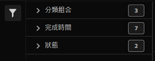

# 分類集作業管理器

分類集任務管理器允許您查看從分類集生成的當前和已完成的分類任務。 您還可以使用此介面下載特定作業的分類資料或模板，或將其他資料上載到作業。

**[!UICONTROL 元件]** > **[!UICONTROL 分類集]** > **[!UICONTROL 作業]**

請注意，您無法通過此介面建立作業。 相反，您可以通過將資料上載到分類集、請求下載檔案或請求模板檔案來建立作業。

## 篩選分類集

分類集作業管理器的左側提供篩選器設定以查找所需作業。 按一下篩選器表徵圖可切換篩選器設定的可見性。 可以按 **[!UICONTROL 分類集]**。 **[!UICONTROL 完成時間]**&#x200B;或 **[!UICONTROL 狀態]**。

在「分類集作業管理器」(Classification Set Job Manager)列上方提供了其他篩選器選項：

* **[!UICONTROL 按標題搜索]**:按檔案名搜索作業。
* **[!UICONTROL 載入更多]**:「分類集作業管理器」最初最多顯示1000個作業。 按一下此按鈕可載入1000個其他作業。
* **顯示/隱藏列**:切換除列之外的任何列的可見性 [!UICONTROL 檔案名] 和 [!UICONTROL 完成時間]。

## 分類集作業管理器列

「分類集作業管理器」中提供以下列：

* **[!UICONTROL 檔案名]**:上載或下載檔案的名稱。
* **[!UICONTROL 分類集]**:檔案所應用的分類集的名稱。 可以按一下「分類集」名稱以訪問「分類集」 [設定](settings.md)。
* **[!UICONTROL 大小]**:檔案的大小。
* **[!UICONTROL 狀態]**:處理檔案的作業的狀態。
   * **[!UICONTROL 已建立]**:作業已提交。
   * **[!UICONTROL 已排隊]**:檔案已準備好處理，正在等待分類伺服器處理該檔案。
   * **[!UICONTROL 已驗證]**:檔案有效，正在等待處理。
   * **[!UICONTROL 驗證失敗]**:檔案格式不正確或無效。 檔案未經過處理。
   * **[!UICONTROL 處理]**:檔案正在由Adobe處理。
   * **[!UICONTROL 處理失敗]**:檔案處理失敗。
   * **[!UICONTROL 完成]**:處理完成。 分類資料在報告中可見。
   * **[!UICONTROL 失敗]**:常規故障與驗證或處理無關。
* **[!UICONTROL 類型]**:作業的類型。
* **[!UICONTROL 檔案下載]**:僅適用於下載作業，如下載分類資料或下載模板。 下載就緒後，此列將提供下載連結。
* **[!UICONTROL 完成時間]**:作業完成（或失敗）的日期和時間。
