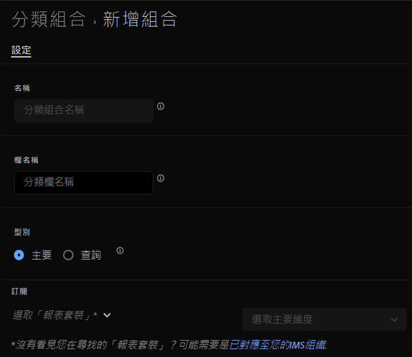

# 建立分類集

您可以使用分類設定管理員來建立分類設定。

**[!UICONTROL 元件]** > **[!UICONTROL 分類設定]** > **[!UICONTROL 設定]** > **[!UICONTROL 新增]**

建立分類設定時，以下欄位可供使用。

* **[!UICONTROL 名稱]**：用來識別分類集的文字欄位。 此欄位無法在建立時即進行編輯，但可稍後重新命名。
* **[!UICONTROL 欄名稱]**：您要建立的第一個分類維度名稱。 此欄位是Analysis Workspace中使用的維度名稱，以及匯出分類資料時的欄名稱。 建立分類設定後，您可以新增更多欄名稱。
* **[!UICONTROL 型別]**：指示分類型別的選項按鈕。
   * **[!UICONTROL 主要]**：套用至Analytics中收集的維度。 這些維度值是分組（分類）精細維度值，使其成為更有意義的資料層級的方法。 例如，您可能會想要將內部搜尋關鍵字分組為內部搜尋類別，以便更清楚瞭解搜尋資料中的主題。
   * **[!UICONTROL 查詢]**：通常稱為子分類或子分類，查詢表格是主要分類的分類。 這是有關分類值的中繼資料，而非原始維度。 例如，產品變數可能有「顏色代碼」的主要分類。 「色彩名稱」的查詢表可附加至「色彩代碼」，以進一步說明每個代碼的含義。
* **[!UICONTROL 訂閱]**&#x200B;套用此分類集的報表套裝和維度。 您可以將多個報表套裝和維度組合新增至「分類設定」。

如果特定報告套裝+變數存在分類設定，則會將分類新增至結構描述。 指定的報告套裝+變陣列合不得屬於多個分類設定。
