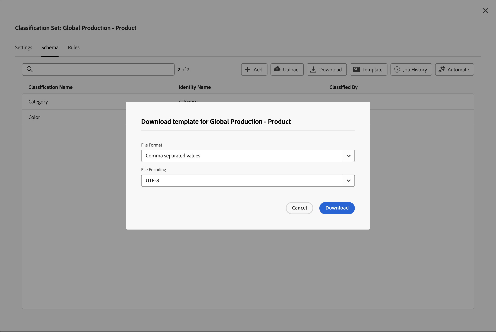
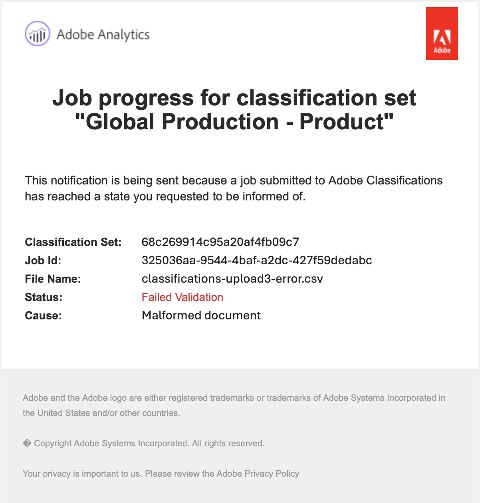

# 分類集結構描述

此結構描述是您要套用至您為分類設定定義之關鍵維度的分類清單。 例如，如果您已將產品定義為關鍵維度，而此欄位包含產品SKU，則您會使用結構描述來新增產品名稱、產品顏色、產品大小等分類。

若要編輯分類設定的綱要：

1. 從Adobe Analytics頂端功能表列選取&#x200B;**[!UICONTROL 元件]**，然後選取&#x200B;**[!UICONTROL 分類設定]**。
1. 在&#x200B;**[!UICONTROL 分類設定]**&#x200B;中，選取&#x200B;**[!UICONTROL 分類設定]**&#x200B;索引標籤。
1. 在&#x200B;**[!UICONTROL 分類集]**&#x200B;管理員中，選取您要編輯其結構描述的分類集。
1. 在&#x200B;**[!UICONTROL 分類設定： _分類設定名稱_]**對話方塊中，選取&#x200B;**[!UICONTROL 結構描述]**索引標籤。 該標籤包含下列介面元素：

   

   * [分類清單](#classification-list)
   * [搜尋](#search)
   * [動作](#actions)
   * [動作列](#action-bar)

## 分類清單

分類清單包含下列各欄：

| 欄 | 說明 |
|---|---|
| **[!UICONTROL 分類名稱]** | 您為分類提供的名稱。 |
| **[!UICONTROL 識別名稱]** | 系統針對分類所衍生的名稱。 這是唯讀值，您可以使用身分名稱 |
| **[!UICONTROL 已由]**&#x200B;分類 | 若使用，會連結至用來分類此分類的查詢分類設定。 |

## 搜尋

您可以快速搜尋一或多個分類。 使用清除搜尋。

## 動作

下列動作可作為按鈕位於分類清單頂端：

| 圖示 | 動作 | 說明 |
|---|---|---|
|  | **[!UICONTROL 新增]** | [新增分類](#add)至清單。 |
|  | **[!UICONTROL 上傳]** | [上傳JSON、CSV、TSV或TAB檔案](#upload)。 |
|  | **[!UICONTROL 下載]** | [下載分類資料](#download)。 |
|  | **[!UICONTROL 範本]** | [下載分類資料的範本](#template)。 |
|  | **[!UICONTROL 工作歷史記錄]** | 顯示[分類設定作業管理員](/help/components/classifications/sets/job-manager.md)，已針對選取的分類設定進行篩選。 |
|  | **[!UICONTROL 自動化]** | [透過使用雲端位置，自動擷取分類資料](#automate)。 |

### 新增

若要新增分類，請選取 **[!UICONTROL 新增]**。

在&#x200B;**[!UICONTROL 新增&#x200B;_分類集名稱_]**對話方塊的新分類中，輸入&#x200B;**[!UICONTROL 分類名稱]**並選取&#x200B;**[!UICONTROL 新增]**。 分類會新增至清單中。

### 上傳

若要將分類資料匯入分類的結構描述，請選取 **[!UICONTROL Upload]**。

1. 在&#x200B;**[!UICONTROL 新增分類]**&#x200B;對話方塊中：

   * 將包含分類資料的檔案拖放到&#x200B;**[!UICONTROL 拖放到這裡]**。
   * 選取&#x200B;**[!UICONTROL 瀏覽]**&#x200B;並從您的電腦或網路選取檔案。

   您看到檔案內容的&#x200B;**[!UICONTROL 結構描述預覽]**。 預覽會顯示檔案中的資料欄。 若要調整資料行大小，請選取，然後選取&#x200B;**[!UICONTROL 調整資料行大小]**。 會出現一個控點，可讓您調整欄大小。

   當欄的分類設定中未定義分類時，會顯示警示。 此警報說明分類不存在於現有的分類結構描述集中，並將在匯入時建立。

1. 選取&#x200B;**[!UICONTROL 發生衝突時覆寫資料？]** （如果要以匯入的新資料覆寫目前的分類資料）。 例如：

   | | 金鑰 | 目前產品顏色 | 匯入檔案 | 新產品色彩 |
   |---|---|---|---|---|
   |  **[!UICONTROL 在衝突時覆寫資料？]** | 1234 | 綠色 | 藍色 | 藍色 |
   |  **[!UICONTROL 在衝突時覆寫資料？]** | 1234 | 綠色 | 藍色 | 綠色 |

1. 選取&#x200B;**[!UICONTROL 「套用」]**。如果欄未顯示為現有結構描述集中的分類，則會顯示警報。 當您確認上傳時，這些欄會新增為新分類。

   

   選取&#x200B;**[!UICONTROL 確認上傳]**&#x200B;以確認上傳。 選取&#x200B;**[!UICONTROL 取消上傳]**&#x200B;以取消上傳。

### 下載

若要下載分類資料，請選取 **[!UICONTROL 下載]**。

在&#x200B;**[!UICONTROL 下載&#x200B;_分類集名稱_]**的資料對話方塊中：

1. 輸入您要下載的&#x200B;**[!UICONTROL 資料列數目]**。 例如：`10000`。
1. 若要選取您要下載分類資料列的期間，請為&#x200B;**[!UICONTROL 下載介於]**&#x200B;之間收到的資料列，輸入開始和結束資料。 或使用使用行事曆快顯功能來選取期間。
1. 若要選取要傳回的資料，請從&#x200B;**[!UICONTROL 傳回的資料]**&#x200B;中選取選項。

   * **[!UICONTROL 所有值]**&#x200B;會傳回目前分類資料的所有值。
   * **[!UICONTROL 任何空白資料行]**&#x200B;會傳回包含現有分類資料之索引鍵值的資料行。 以及不存在任何值的分類資料沒有值的欄。
   * **[!UICONTROL 所有資料行空白]**&#x200B;傳回索引鍵資料行，其中包含現有分類資料的值。 和分類資料沒有值的欄。
1. 若要選取已下載分類資料的[檔案格式](/help/components/classifications/sets/data-files.md#general-file-requirements)，請從&#x200B;**[!UICONTROL 檔案格式]**&#x200B;下拉式功能表中選取選項。 選項有:

   * **[!UICONTROL JSON]**。
   * **[!UICONTROL 逗號分隔值]** (CSV)。
   * **[!UICONTROL Excel索引標籤分隔值]** （TSV或TAB）。

1. 若要在下載檔案時選取[檔案編碼](/help/components/classifications/sets/data-files.md#general-file-requirements)，請從[File-Encoding]下拉式功能表中選取選項。 選項有:

   * **[!UICONTROL UTF-8]**。
   * **[!UICONTROL 拉丁文–1]**。

1. 選取&#x200B;**[!UICONTROL 下載]**&#x200B;以下載分類資料。 您可以在瀏覽器的預設下載目錄中找到下載的檔案，該檔案的標題為<code><i>分類設定</i>。<i>json</i>|<i>csv</i>|<i>tsv</i></code>。如果檔案已經存在，則序號為<code>(<i>x</i>)</code> 會新增至檔案名稱。 如果您指定了不會傳回任何資料的選項，您會看到&#x200B;**[!UICONTROL 通知]**&#x200B;對話方塊，通知您變更日期範圍和傳回資料的選項。

### 範本

若要下載分類資料的範本，請選取 **[!UICONTROL 範本]**。

在&#x200B;**[!UICONTROL 分類集名稱&#x200B;_對話方塊的_]**下載範本中：

1. 若要選取已下載分類資料的[檔案格式](/help/components/classifications/sets/data-files.md#general-file-requirements)，請從&#x200B;**[!UICONTROL 檔案格式]**&#x200B;下拉式功能表中選取選項。 選項有:

   * **[!UICONTROL 逗號分隔值]**。
   * **[!UICONTROL Excel索引標籤分隔值]**。

1. 若要在下載檔案時選取[檔案編碼](/help/components/classifications/sets/data-files.md#general-file-requirements)，請從[File-Encoding]下拉式功能表中選取選項。 選項有:

   * **[!UICONTROL UTF-8]**。
   * **[!UICONTROL 拉丁文–1]**。

1. 選取&#x200B;**[!UICONTROL 下載]**&#x200B;以下載分類資料範本。 您可以在瀏覽器的預設下載目錄中找到下載的檔案，其標題為<code><i>分類設定</i>。<i>csv</i>|<i>tsv</i></code>。如果檔案已經存在，則序號為<code>(<i>x</i>)</code> 會新增至檔案名稱。

### 自動化 {#automate}

>[!CONTEXTUALHELP]
>id="classificationsets_schema_automate_locationaccount"
>title="位置帳戶"
>abstract="支援匯入分類資料之帳戶型別的位置帳戶清單。 選取&#x200B;**[!UICONTROL 新帳戶]**&#x200B;以建立新的位置帳戶。"
>additional-url="https://experienceleague.adobe.com/docs/analytics/components/locations/configure-import-accounts.html?lang=en" text="設定雲端匯入和匯出帳戶"

>[!CONTEXTUALHELP]
>id="classificationsets_schema_automate_location"
>title="位置"
>abstract="位於所選位置支援匯入分類資料之帳戶的位置清單。 選取&#x200B;**[!UICONTROL 新位置]**&#x200B;以建立新位置。"
>additional-url="https://experienceleague.adobe.com/docs/analytics/components/locations/configure-import-locations.html?lang=en" text="設定雲端匯入和匯出位置"

若要自動擷取分類，請選取 **[!UICONTROL 自動化]**。

在&#x200B;**[!UICONTROL 關聯/更新&#x200B;_分類集名稱_]**的擷取位置對話方塊中：

1. 若要選取雲端位置，請從&#x200B;**[!UICONTROL 位置帳戶]**&#x200B;中選取選項。 只會顯示允許匯入分類資料[之支援帳戶型別的](https://experienceleague.adobe.com/zh-hant/docs/analytics/components/locations/configure-import-accounts)位置帳戶。 若要建立新帳戶，請選取&#x200B;**[!UICONTROL 新帳戶]**。
1. 若要選取位置，請從&#x200B;**[!UICONTROL 位置]**&#x200B;選取選項。 只顯示用於匯入分類資料的所選帳戶型別的位置。 若要建立新位置，請選取&#x200B;**[!UICONTROL 新位置]**。

   >[!IMPORTANT]
   >
   >您建立或選取的位置應在&#x200B;**[!UICONTROL 貯體]**&#x200B;內包含&#x200B;**[!UICONTROL 首碼]** （資料夾），以託管分類資料檔案。 例如，名為`files`的資料夾。 在貯體的根託管檔案不適用於大多數雲端位置。
   >

1. 若要選取分隔符號，請從&#x200B;**[!UICONTROL 清單分隔符號]**&#x200B;下拉式功能表中選取選項。 選項包括：
   * **[!UICONTROL 逗號，]**
   * **[!UICONTROL 分號；]**
   * **[!UICONTROL 冒號：]**
   * **[!UICONTROL 垂直條 |]**
   * **[!UICONTROL 空間]**
   * **[!UICONTROL 標籤]**
1. 若要在下載檔案時選取[檔案編碼](/help/components/classifications/sets/data-files.md#general-file-requirements)，請從&#x200B;**[!UICONTROL 檔案編碼]**&#x200B;下拉式功能表中選取選項。 選項有:

   * **[!UICONTROL UTF-8]**。
   * **[!UICONTROL 拉丁文–1]**。

1. 若要通知使用者擷取工作已完成，請輸入電子郵件地址（以逗號分隔），以便&#x200B;**[!UICONTROL 電子郵件在擷取工作完成時通知（以逗號分隔）]**。
1. 選取&#x200B;**[!UICONTROL 驗證]**。 已驗證與雲端位置的連線。
1. 如果驗證成功，您會看到一則快顯通知訊息，顯示 **[!UICONTROL 位置驗證成功。 已驗證與雲端儲存空間的連線。]** 如果您已建立與雲端連線的連線，請選取**[!UICONTROL &#x200B;儲存&#x200B;]**。 否則，請選取**[!UICONTROL &#x200B;更新&#x200B;]**。 或選取**[!UICONTROL &#x200B;取消&#x200B;]**以取消雲端位置的設定。

當您上傳檔案到雲端位置時，會在15分鐘內偵測到檔案並將其作為匯入工作提交。 該匯入工作的結果會在[分類工作管理員](/help/components/classifications/sets/job-manager.md)中報告。 如果您被新增到使用者清單，以通知擷取工作已完成，您也會收到電子郵件訊息。

例如：

{width="400"}

## 動作列

動作列會顯示所選分類可用的動作。 可選擇下列選項：

| 圖示 | 動作 | 說明 |
|---|---|---|
|  | **[!UICONTROL 新增查詢]** | 新增分類設定作為查詢（子分類）。 在&#x200B;**[!UICONTROL 附加查閱]**&#x200B;資料表中： <ol><li>從&#x200B;**[!UICONTROL 分類名稱]**&#x200B;下拉式功能表中選取查詢分類。</li><li>選取&#x200B;**[!UICONTROL 新增]**。</li></ol>查詢分類已新增至分類，並使用內部ID列在&#x200B;**[!UICONTROL 分類者]**&#x200B;欄中。 |
|  | **[!UICONTROL 移除查詢]** | 移除分類設定做為查詢。 若要從分類中永久刪除查詢，請在&#x200B;**[!UICONTROL 從&#x200B;_分類_確認對話方塊中，移除&#x200B;_分類集_]**並選取&#x200B;**[!UICONTROL 刪除]**。 |
|  | **[!UICONTROL 重新命名]** | 重新命名分類的&#x200B;**[!UICONTROL 分類名稱]**。 在&#x200B;**[!UICONTROL 重新命名： _分類名稱_]**對話方塊中，輸入新名稱並選取&#x200B;**[!UICONTROL 重新命名]**。 |
|  | **[!UICONTROL 刪除]** | 刪除分類。 **[!UICONTROL 刪除&#x200B;_分類名稱_]**對話方塊就會顯示。 選取&#x200B;**[!UICONTROL 刪除]**以刪除分類。 |

<!--

View currently configured classification dimensions for this classification set.

**[!UICONTROL Components]** > **[!UICONTROL Classification sets]** > **[!UICONTROL Sets]** > Click the desired classification set name > **[!UICONTROL Schema]**

The following buttons are available:

* **[!UICONTROL Upload]**: Manually upload classification data for a classification dimensions. `JSON`, `CSV`, `TSV`, and `TAB` files are supported. Uploading a valid file shows a table preview of data to classify.
  * **[!UICONTROL File encoding]**: Select the correct file encoding using this drop-down. Valid options include [!UICONTROL UTF-8] and [!UICONTROL Latin1].
  * **[!UICONTROL List delimiter]**: Select the correct list delimiter. If using a downloaded file or template file, make sure that the [!UICONTROL List delimiter] here matches the [!UICONTROL List delimiter] when the file was downloaded.
  * **[!UICONTROL Apply]**: Save the uploaded classification data to the classification set.

  

* **[!UICONTROL Download]**: Download key values and their classification columns.
  * **[!UICONTROL Rows]**: The maximum number of rows to include in the download file.
  * **[!UICONTROL Download rows received between]**: A calendar date picker that allows you to filter key values by when they appear in reporting. If a key value was not collected in this date range, it does not appear in the downloaded file.
  * **[!UICONTROL Data returned]**: A drop-down list that lets you filter key values included in the downloaded file based on their associated classification data.
    * **[!UICONTROL All classified values]**: Includes rows where classification data is included in at least one column.
    * **[!UICONTROL All unclassified values]**: Includes rows where classification data is missing in at least one column.
  * **[!UICONTROL File format]**: A drop-down list that determines the file format that the download file is in. Options include [!UICONTROL JSON], [!UICONTROL Comma separated values], and [!UICONTROL Excel tab separated values].
  * **[!UICONTROL File encoding]**: A drop-down list that determines the file encoding. Options include [!UICONTROL UTF-8] and [!UICONTROL Latin1]. UTF-8 is recommended.

  

* **[!UICONTROL Template]**: Download a template file. This file is similar to the [!UICONTROL Download] button, except it does not contain any classification data or key values.
  * **[!UICONTROL File format]**: A drop-down list that determines the file format that the template file is in. Options include [!UICONTROL Comma separated values], and [!UICONTROL Excel tab separated values].
  * **[!UICONTROL File encoding]**: A drop-down list that determines the file encoding. Options include [!UICONTROL UTF-8] and [!UICONTROL Latin1]. UTF-8 is recommended.
  * **[!UICONTROL List delimiters]**: A drop-down list that determines the list delimiter separating classification columns on each row.

  

* **[!UICONTROL Job history]**: A shortcut link that takes you to the [Job manager](../job-manager.md), showing jobs only for this classification set.
* **[!UICONTROL Automate]**: Automatically ingest data from external storage locations.
  * **[!UICONTROL Location account]**: A drop-down list showing existing location accounts that your organization has configured. If your organization hasn't already configured a location account, you can configure one by selecting [!UICONTROL **Create a new account**].
    
    For information about configuring the location account, see [Configure cloud import and export accounts](/help/components/locations/configure-import-accounts.md).

  * **[!UICONTROL Location]**: A drop-down list showing existing locations that your organization has configured. If your organization hasn't already configured a location, you can configure one by selecting [!UICONTROL **Create a new location**]. 

    For information about configuring a location, see [Configure cloud import and export locations](/help/components/locations/configure-import-locations.md). 

  * **[!UICONTROL Delimiter]**: The column delimiter for uploaded files. Options include [!UICONTROL Comma], [!UICONTROL Semicolon], [!UICONTROL Colon], [!UICONTROL Vertical bar], [!UICONTROL Space], [!UICONTROL Forward slash], [!UICONTROL Backward slash], [!UICONTROL Dash], or [!UICONTROL Underscore].

  * **[!UICONTROL Encoding]**: A drop-down list that determines the file encoding. Options include [!UICONTROL UTF-8] and [!UICONTROL Latin1]. UTF-8 is recommended.

The following actions are available only after selecting a classification.

* **Add lookup**: A lookup table is a classification of a classification. It is metadata about a classification value, rather than the variable itself. For example, the Product variable might have a classification of "color code". A lookup table of "color name" might be attached to "color code" to explain what the colors are.

  

* **Rename**: Lets you rename the classification.

* **Delete**: Lets you delete the classification.
-->