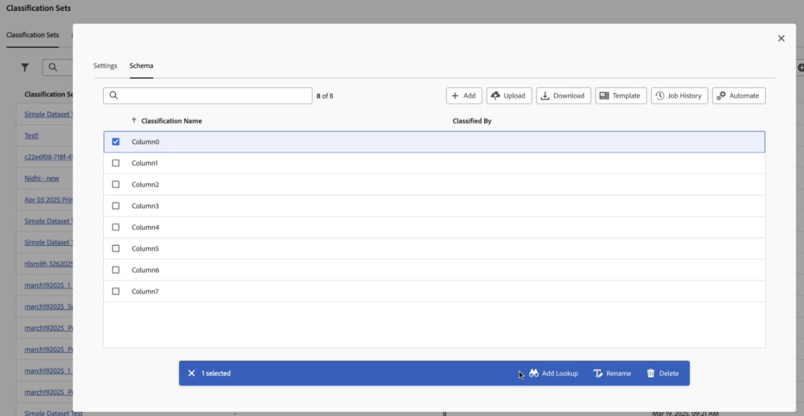

# 結構描述

檢視目前為此分類設定設定的分類維度。

**[!UICONTROL 元件]** > **[!UICONTROL 分類設定]** > **[!UICONTROL 設定]** >按一下想要的分類設定名稱> **[!UICONTROL 結構描述]**

有以下按鈕可供使用：

<!--* **[!UICONTROL Add]**: Adds an empty row so that you can add a classification dimension to the schema.-->
* **[!UICONTROL 上傳]**：手動上傳分類維度的分類資料。 支援`JSON`、`CSV`、`TSV`和`TAB`檔案。 上傳有效檔案會顯示要分類的資料的表格預覽。
   * **[!UICONTROL 檔案編碼]**：使用此下拉式清單選取正確的檔案編碼。 有效的選項包括 [!UICONTROL UTF-8] 和 [!UICONTROL Latin1]。
   * **[!UICONTROL 清單分隔符號]**：選取正確的清單分隔符號。若使用已下載的檔案或範本檔案，請確保這裡的[!UICONTROL 清單分隔符號]和下載該檔案時的[!UICONTROL 清單分隔符號]相符。
   * **[!UICONTROL 套用]**：將已上傳的分類資料儲存至分類集。

  

* **[!UICONTROL 下載]**：下載索引鍵值及其分類欄。
   * **[!UICONTROL 列]**：下載檔案中可包含的最多列數。
   * **[!UICONTROL 下載之間收到的列]**：一個日曆日期選擇器，可讓您依據索引鍵值出現在報表中的時間進行篩選。如果在此日期範圍內未收集到索引鍵值，則它不會出現在已下載的檔案中。
   * **[!UICONTROL 傳回的資料]**：下拉式清單，可讓您根據索引鍵值相關聯的分類資料，篩選包含在已下載檔案中的索引鍵值。
      * **[!UICONTROL 所有已分類值]**：包含了在至少一欄中有分類資料的列。
      * **[!UICONTROL 所有未分類值]**：包含了在至少一欄中缺少分類資料的列。
   * **[!UICONTROL 檔案格式]**：確定下載檔案所使用檔案格式的下拉式清單。 選項包括 [!UICONTROL JSON]、[!UICONTROL 逗號分隔值]和 [!UICONTROL Excel 索引鍵分隔值]。
   * **[!UICONTROL 檔案編碼]**：決定檔案編碼的下拉式清單。 選項包括 [!UICONTROL UTF-8] 和 [!UICONTROL Latin1]。建議使用 UTF-8。

  

* **[!UICONTROL 範本]**：下載範本檔案。這個檔案會和[!UICONTROL 下載]按鈕類似，但不包括任何分類資料或索引鍵值。
   * **[!UICONTROL 檔案格式]**：決定範本檔案所使用檔案格式的下拉式清單。 選項包括[!UICONTROL 逗號分隔值]和 [!UICONTROL Excel 索引鍵分隔值]。
   * **[!UICONTROL 檔案編碼]**：決定檔案編碼的下拉式清單。 選項包括 [!UICONTROL UTF-8] 和 [!UICONTROL Latin1]。建議使用 UTF-8。
   * **[!UICONTROL 清單分隔符號]**：確定分隔每列分類欄的清單分隔符號的下拉式清單。

  

* **[!UICONTROL 工作歷史記錄]**：將您帶往[工作管理員](../job-manager.md)的快速鍵連結，僅顯示適用於此分類集的工作。
* **[!UICONTROL 自動化]**：自動從外部儲存位置擷取資料。
   * **[!UICONTROL 位置帳戶]**：下拉式清單，顯示貴組織已設定的現有位置帳戶。 如果您的組織尚未設定位置帳戶，您可以選取&#x200B;[!UICONTROL **「建立新帳戶」**]&#x200B;來設定一個位置帳戶。

     如需有關設定位置帳戶的資訊，請參閱[設定雲端匯入和匯出帳戶](/help/components/locations/configure-import-accounts.md)。

   * **[!UICONTROL 位置]**：下拉式清單，顯示貴組織已設定的現有位置。 如果您的組織尚未設定位置，您可以選取&#x200B;[!UICONTROL **「建立新位置」**]&#x200B;來設定位置。

     如需設定位置的詳細資訊，請參閱[設定雲端匯入和匯出位置](/help/components/locations/configure-import-locations.md)。

   * **[!UICONTROL 分隔符號]**：已上傳檔案的欄分隔符號。 選項包括[!UICONTROL 逗號]、[!UICONTROL 分號]、[!UICONTROL 冒號]、[!UICONTROL 垂直線]、[!UICONTROL 空格]、[!UICONTROL 正斜線]、[!UICONTROL 反斜線]、[!UICONTROL 破折號]或[!UICONTROL 底線]。

   * **[!UICONTROL 編碼]**：決定檔案編碼的下拉式清單。 選項包括 [!UICONTROL UTF-8] 和 [!UICONTROL Latin1]。建議使用 UTF-8。

下列動作只有在選取分類後才能使用。

* **新增查詢**：查詢表格是分類的分類。 這是分類值的相關中繼資料，而非變數本身。 例如，產品變數可能會有「顏色代碼」的分類。 「顏色名稱」的查詢表可能會附加至「顏色代碼」，以說明顏色。

  

* **重新命名**：讓您重新命名分類。

* **刪除**：可讓您刪除分類。
