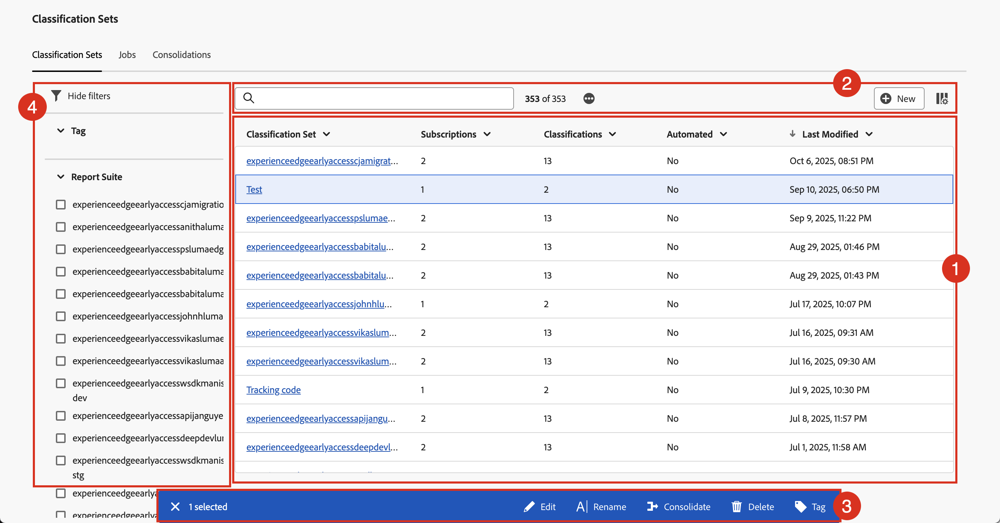
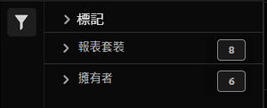

# 管理分類集

您可以在「分類設定」管理介面中建立、重新命名、編輯、合併、刪除和標籤「分類設定」。 您也可以篩選及搜尋特定分類設定。

若要管理「分類設定」：

1. 在主介面中選取&#x200B;**[!UICONTROL 元件]**，然後選取&#x200B;**[!UICONTROL 分類集]**。
1. 在&#x200B;**[!UICONTROL 分類設定]**&#x200B;中，選取&#x200B;**[!UICONTROL 分類設定]**&#x200B;索引標籤。

## 分類設定管理員

**[!UICONTROL 分類集]**&#x200B;管理員有下列介面元素：

### 「分類設定」清單

**[!UICONTROL 分類設定]**&#x200B;清單➊會顯示所有分類設定。 清單有以下欄位：

| 欄 | 說明 |
|---|---|
| **[!UICONTROL 分類設定]** | 分類設定的標題。 選取標題以[編輯分類集](create.md#edit-a-classification-set)。 |
| **[!UICONTROL 訂閱]** | 套用分類設定的訂閱數目。 |
| **[!UICONTROL 分類]** | 分類設定包含的分類維度數。 |
| **[!UICONTROL 自動化]** | 分類設定是否已設定為自動從雲端位置匯入資料？ 此自動化可設定為[分類集結構描述](schema.md)的一部分。 |
| **[!UICONTROL 上次修改日期]** | 分類設定上次修改的時間戳記。 |

若要調整分類設定清單中欄的大小，您可以：

* 暫留在欄分隔符號上，並將欄分隔符號拖曳到所需的欄寬。
* 選取並選取&#x200B;**[!UICONTROL 調整資料行大小]**。 帶有調整大小按鈕的垂直線允許您使用將欄大小調整到所需的大小。

若要排序分類集清單中的欄

* 選取並選取&#x200B;**[!UICONTROL 遞增排序]**&#x200B;或&#x200B;**[!UICONTROL 遞減排序]**。 箭頭(↑↓)表示哪一欄以及該欄的排序方式。

### 搜尋和按鈕

在「分類設定」清單頂端的區域➋中，您可以：

* 搜尋以取得分類集。 結果會顯示在「分類設定」清單中。 選取以清除搜尋。
* 移除套用至「分類設定」清單的任何篩選器。 選取以移除篩選器。
* 選取以載入額外的1000個分類集。 最初，「分類設定」清單會顯示最多1000個「分類設定」。
* 選取 **[!UICONTROL New]**&#x200B;以[建立新的分類集](create.md#create-a-classification-set)。
* 定義分類設定清單的欄。 選取，並在&#x200B;**[!UICONTROL 自訂表格]**&#x200B;對話方塊中選取要顯示在&#x200B;**[!UICONTROL 下方的欄，並選取要顯示的欄]**。 選取&#x200B;**[!UICONTROL 套用]**&#x200B;以套用資料行設定。

### 動作列

當您在「分類設定」清單中選取一或多個分類設定時，會顯示藍色動作列➌。 動作列中可提供下列動作：

| 圖示 | 動作 | 說明 |
|---|---|---|
|  | **[!UICONTROL Edit]** | [在分類設定產生器中編輯分類設定](create.md#edit-a-classification-set)。 |
|  | **[!UICONTROL 重新命名]** | 重新命名分類設定。 在&#x200B;**[!UICONTROL 重新命名： _分類集_]**&#x200B;對話方塊中，輸入新名稱並選取&#x200B;**[!UICONTROL 重新命名]**。 |
|  | **[!UICONTROL 合併]** | [合併分類集](/help/components/classifications/sets/consolidations/manage.md)。 |
|  | **[!UICONTROL 刪除]** | 刪除分類設定。  **[!UICONTROL 刪除&#x200B;_分類集_？]**&#x200B;對話方塊出現。 無法復原刪除分類集。 任何使用此分類集的已排程專案或合併會繼續使用此分類集的定義，直到您重新儲存已排程專案或重新驗證已排程合併為止。 選取&#x200B;**[!UICONTROL 刪除]**&#x200B;以刪除分類設定。 |
|  | **[!UICONTROL 標記]** | 標籤分類設定。 在&#x200B;**[!UICONTROL 標籤： _分類設定_]**&#x200B;對話方塊中，從&#x200B;**[!UICONTROL 標籤]**&#x200B;下拉式功能表中選取一或多個標籤以新增標籤。 或輸入一或多個新標籤。 使用移除標籤。  選取&#x200B;**[!UICONTROL 儲存]**&#x200B;以儲存標籤。 |

### 篩選面板

選取以顯示可讓您篩選分類集清單的篩選器面板➍。 您可以篩選：

* **[!UICONTROL 標記]**。選取一或多個標籤以篩選標籤上的分類設定清單。
* **[!UICONTROL 報告套裝]**。 選取一或多個報告套裝，以篩選報告套裝上的「分類設定」清單。

選取 **[!UICONTROL 隱藏篩選器]**&#x200B;以隱藏篩選器面板。

請注意，「篩選器」面板中顯示的篩選器會反映預先載入之分類集的選項。

<!-- old content

The Classification set manager allows you to create, edit, or delete classification sets.

**[!UICONTROL Components]** > **[!UICONTROL Classification sets]** > **[!UICONTROL Sets]**

Classification sets consist of **Subscriptions** (report suite and dimension combinations) and **Classification names** (dimensions containing classification data). Subscriptions are configured under [Settings](settings.md), while classification names are configured under [Schema](schema.md).

## Filter classification sets

The left side of the Classification set manager provides filter settings to locate the desired classification set. Clicking the filter icon toggles the filter settings visibility. You can filter classification sets by **[!UICONTROL Tags]** or **[!UICONTROL Report suite]**.

Note that 1,000 classification sets are preloaded at a time. The filters shown in the left rail reflect the options for the sets that are preloaded.

## Classification set manager columns

The following columns are available in the Classification set manager:

* **[!UICONTROL Classification set]**: The classification set name. Clicking a classification set name edits its [settings](settings.md).
* **[!UICONTROL Subscriptions]**: The number of subscriptions that this classification set applies to.
* **[!UICONTROL Classifications]**: The number of classification dimensions that the classification set contains.
* **[!UICONTROL Automated]**: Determines if the classification set is configured to automatically import data from a cloud location. Automation can be configured in the classification set's [schema](schema.md).
* **[!UICONTROL Last Modified]**: The date and time that the classification set was last modified.

## Create or edit options

The following buttons are available in the Classification set manager:

* **[!UICONTROL Add]**: [Create](create.md) a classification set.
* **[!UICONTROL Search by title]**: Search for classification sets by name.
* **[!UICONTROL Load more]**: The Classification set manager initially displays up to 1000 classification sets. This button loads 1000 more classification sets.
* **Show/Hide columns**: Toggle visibility for any column besides [!UICONTROL Classification set].

Select one or more classification sets by clicking the checkbox next to the desired classification set. Selecting a classification set reveals the following options:

* **[!UICONTROL Tag]**: Add one or more tags to the selected classification sets, which allows you to organize or group classification sets to make them easier to locate in the future.
* **[!UICONTROL Delete]**: Deletes the classification set. Classification dimensions based on this classification set are no longer available. Scheduled projects using the deleted classification set continue using dependent dimensions until you resave the scheduled project.
* **[!UICONTROL Consolidate]**: Start a new [consolidation](../consolidations/process.md).
* **[!UICONTROL Rename]**: Rename the selected classification set.

-->