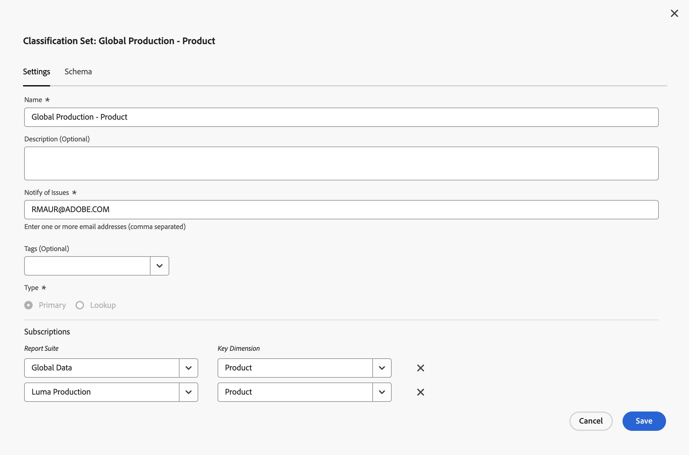

# 分類集設定

您可以編輯分類設定的初始設定。

若要編輯分類設定的設定：

1. 在&#x200B;**[!UICONTROL 分類集]**&#x200B;管理員中，選取您要編輯其結構描述的分類集。
1. 在&#x200B;**[!UICONTROL 分類設定： _分類設定_]**&#x200B;對話方塊中，選取&#x200B;**[!UICONTROL 設定]**&#x200B;索引標籤。

1. 在&#x200B;**[!UICONTROL 分類設定： _分類設定_]**&#x200B;對話方塊中，適當時：

   

   1. 編輯&#x200B;**[!UICONTROL 名稱]**。
   1. 編輯&#x200B;**[!UICONTROL 描述（選擇性）]**。
   1. 在&#x200B;**[!UICONTROL 通知問題]**&#x200B;中編輯電子郵件地址清單（逗號分隔符號）。 如有任何問題，系統會以電子郵件通知這些使用者。
   1. 新增一或多個&#x200B;**[!UICONTROL 標籤（選擇性）]**&#x200B;至分類設定。 從&#x200B;**[!UICONTROL 標籤]**&#x200B;下拉式功能表中選取現有標籤，或輸入新標籤。 使用移除標籤。
   1. 編輯&#x200B;**[!UICONTROL 訂閱]**。
      * 您可以定義多個&#x200B;**[!UICONTROL 報告套裝]**&#x200B;和&#x200B;**[!UICONTROL Dimension]**&#x200B;組合至一個分類集。
      * 選取以刪除&#x200B;**[!UICONTROL 報表套裝]**&#x200B;和&#x200B;**[!UICONTROL 金鑰Dimension]**&#x200B;組合。

      如需詳細資訊，請參閱[建立分類集](create.md)。

   1. 選取&#x200B;**[!UICONTROL 儲存]**&#x200B;以儲存設定。 選取「**[!UICONTROL 取消]**」即可取消。

<!--

Configure a classification set's settings.

**[!UICONTROL Components]** > **[!UICONTROL Classification sets]** > **[!UICONTROL Sets]** > Click the desired classification set name > **[!UICONTROL Settings]**

The following fields are available in this tab:

* **[!UICONTROL Name]**: The classification set name.
* **[!UICONTROL Description]**: The description for the classification set.
* **[!UICONTROL Notify of issues]**: A comma-delimited list of email addresses that are notified of issues with this classification set.
* **[!UICONTROL Tags]**: Add one or more tags to the selected classification set. Tags allow you to organize or group classification sets so that it is easier to locate them in the future.
* **[!UICONTROL Type]**: The type of classification between [!UICONTROL Primary] and [!UICONTROL Lookup]. Primary classifications are typically used. You cannot alter a classification set's type after it is created.
* **[!UICONTROL Subscriptions]**: The report suite and dimension combinations that the classification set applies to.

-->