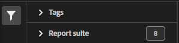

# 分類集管理器

分類集管理器允許您建立、編輯或刪除分類集。

**[!UICONTROL 元件]** > **[!UICONTROL 分類集]** > **[!UICONTROL 集]**

分類集由 **訂閱** （此分類集適用的報表套件）和 **分類名稱** （包含分類資料的附加維）。

## 篩選分類集

「分類集管理器」(Classification Set Manager)的左側提供了篩選器設定，以查找所需的分類集。 按一下篩選器表徵圖可切換篩選器設定的可見性。 可以按 **[!UICONTROL 標籤]**。 **[!UICONTROL 報表套件]**&#x200B;或 **[!UICONTROL 所有者]**。

## 分類集管理器列

「分類集管理器」(Classification Set Manager)中提供以下列：

* **[!UICONTROL 分類集]**:分類集名稱。 按一下分類集名稱以 [編輯其設定](settings.md)。
* **[!UICONTROL 訂閱]**:此分類集應用於的訂閱數或報告套件數。
* **[!UICONTROL 所有者]**:分類集的所有者。
* **[!UICONTROL 分類]**:分類集包含的分類維數。
* **[!UICONTROL 自動化]**:指示分類集是否配置為自動從FTP站點提取資料。
* **[!UICONTROL 上次修改時間]**:上次修改分類集的日期和時間。
* **[!UICONTROL FTP主機+路徑]**:如果自動化，分類集從中提取資料的FTP位置。

## 建立或編輯選項

「分類集管理器」中提供以下按鈕：

* **[!UICONTROL 添加]**: [建立](create.md) a分類集。
* **[!UICONTROL 按標題搜索]**:按名稱搜索分類集。
* **[!UICONTROL 載入更多]**:分類集管理器最初最多顯示1000個分類集。 按一下此按鈕可載入1000個以上分類集。
* **顯示/隱藏列**:切換除列之外的任何列的可見性 [!UICONTROL 分類集]。

按一下所需分類集旁邊的複選框，選擇一個或多個分類集。 選擇分類集可顯示以下選項：

* **[!UICONTROL 標籤]**:將一個或多個標籤添加到選定的分類集中，這樣您就可以組織或分組分類集，以便將來更容易找到它們。
* **[!UICONTROL 更名]**:更名所選分類集。
