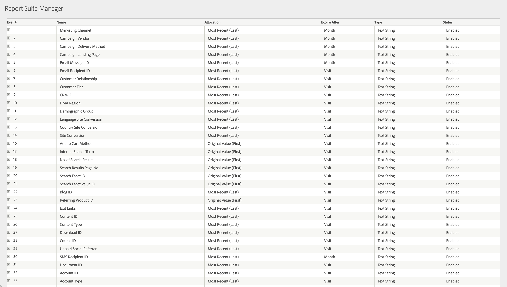

# eVar

*此說明頁面將說明 eVar 做為[維度](overview.md)的運作方式。如需實作 eVar 的相關資訊，請參閱實作使用手冊中的「[eVar](/help/implement/vars/page-vars/evar.md)」。*

eVar 是自訂變數，您可以視需要使用。如果您有[解決方案設計文件](/help/implement/prepare/solution-design.md)，則除了 Adobe Analytics 提供的預設維度 (例如「頁面名稱」、「反向連結網域」、「頻道」)，您組織專屬的大部分維度最終都會變成 [!UICONTROL eVars]。如需詳細資訊，請參閱「[維度概觀](overview.md)」。

依預設，eVar 可保存在其設定所在的點擊之外。 您可以在[轉換變數](/help/admin/admin/c-manage-report-suites/c-edit-report-suites/conversion-var-admin/conversion-var-admin.md) (位在[!UICONTROL 報告套裝設定]中) 底下自訂其到期日和配置。請參閱下面的轉換變數 UI 中的 eVar 定義範例。

可用的 eVar 數量取決於您與 Adobe 訂定的合約。在您的 Adobe 合約支援的前提下，最多可使用 250 個 eVar。

報告中使用的 (大寫或小寫) 大小寫是根據後端系統註冊的第一個值。 此值可能是第一次出現，也可能在某個時段（例如，每月）發生變化，具體取決於與報告套裝關聯的資料種類和數量。

## 將資料填入 eVar 中

每個 eVar 會分別從影像要求中的 [`v1` - `v250` 查詢字串](/help/implement/validate/query-parameters.md)收集資料。例如，`v1` 查詢字串參數會收集 eVar1 的資料，而 `v222` 查詢字串參數則會收集 eVar222 的資料。

AppMeasurement (會將 JavaScript 變數編譯為影像要求以進行資料收集) 會使用變數 `eVar1` - `eVar250`。如需實作準則，請參閱「實作使用指南」中的 [eVar](/help/implement/vars/page-vars/evar.md)。

## 維度項目

由於 eVar 包含您的實作中的自訂字串，因此您的組織會決定每個 eVar 的維度項目。請務必將每個 eVar 的用途和常用的維度項目記錄在[解決方案設計文件](/help/implement/prepare/solution-design.md)中。

## eVar 的運作方式

當您傳送資料至 Adobe Analytics 時，資料收集伺服器會將點擊轉換為有數百欄的單一資料列。每個 eVar 有兩個專用欄位；一個供直接資料收集用，另一個則供持續值用。

* 標準欄包含影像要求傳送至 Adobe 的資料。
* 「Post」欄包含持續資料，這取決於 eVar 的到期日和配置。

在大部分情況下，報告都會使用 `post_evar` 欄。

### eVar 連結至量度的方式

成功事件和 eVar 通常定義在不同的影像要求中。`post_evar` 欄可讓 eVar 值連結至事件，並顯示報告中的資料。以下列造訪為例：

1. 訪客造訪您的網站，首先停留在首頁上。
2. 他們使用您網站的內部搜尋功能來搜尋「貓」。您的實作使用 eVar1 進行內部搜尋。
3. 他們檢視產品，並完成結帳程序。

原始資料的簡化版本看起來類似下列結果：

| `visitor_id` | `pagename` | `evar1` | `post_evar1` | `event_list` |
| --- | --- | --- | --- | --- |
| `examplevisitor_987` | `Home page` | | | |
| `examplevisitor_987` | `Search results` | `cats` | `cats` | `event1` |
| `examplevisitor_987` | `Product page` | | `cats` | `prodView` |
| `examplevisitor_987` | `Cart` | | `cats` | `scAdd` |
| `examplevisitor_987` | `Checkout` | | `cats` | `scCheckout` |
| `examplevisitor_987` | `Purchase confirmation` | | `cats` | `purchase` |

* `visitor_id` 欄會將點擊連結至相同的訪客。在實際原始資料中，`visid_high` 和 `visid_low` 的串連值將決定訪客 ID。
* `pagename` 欄中會填入「頁面」維度。
* `evar` 欄會決定 eVar1 明確設定時的點擊。
* `post_evar1` 包含先前值 (取決於報告套裝設定下的變數配置和到期日設定)。
* `event_list` 欄包含所有量度資料。在此範例中，`event1` 是「搜尋」，其他事件則是標準購物車量度。在實際原始資料中，`event_list` 包含一組以逗號分隔的數字，而查找表格會將這些數字連結至量度。

### 將資料收集轉換為報告

Adobe Analytics 中的工具 (例如 Analysis Workspace) 運作時，會使用這份收集來的資料。例如，如果您用 eVar1 作為維度，並用「訂單」作為量度來提取報告，就會看到類似下列的報告：

| `Internal search term (eVar1)` | `Orders` |
| --- | --- |
| `cats` | `1` |

Analysis Workspace 使用下列邏輯提取此報告：

* 檢視所有 `event_list` 值，並挑選出所有包含 `purchase` 的點擊。
* 顯示這些點擊中的 `post_evar1` 值。

### 配置和到期日的重要性

由於配置和到期日會決定哪些值會能持續存在，因此在從 Analytics 實作中取得最多值時十分重要。Adobe 強烈建議您與貴組織討論要如何處理 (配置) 每個 eVar 的多個值，以及讓 eVar 停止儲存資料的時間 (到期日)。

* 依預設，eVar 會使用最後一個配置。新值會覆寫持續值。
* 依預設，eVar 會使用造訪的到期日。造訪結束後，值即停止在 `post_evar` 欄中逐列複製。

您可以在報告套裝設定中的[「轉換變數」](/help/admin/admin/c-manage-report-suites/c-edit-report-suites/conversion-var-admin/conversion-var-admin.md)下變更 eVar 配置和到期日。

## eVar 優於 Prop 之處

Adobe 建議在大部分情況下使用 eVar，其支援基礎如下：

* eVar 在報告中的長度限制為 255 個位元組。eVar 的長度限制為 100 個位元組。
* 依預設，prop 不會持續存在超過設定的點擊。eVar 有自訂的過期時間，可讓您判斷 eVar 何時不再獲得後續事件的評分。不過，如果您使用[報告時間處理](/help/components/vrs/vrs-report-time-processing.md)，prop 和 eVar 都可以使用自訂歸因模式。
* Adobe 最多可支援 250 個 eVar，而僅支援 75 個 Prop。

如需 Prop 與 eVar 之間的更多比較，請參閱 [Prop](prop.md)。
