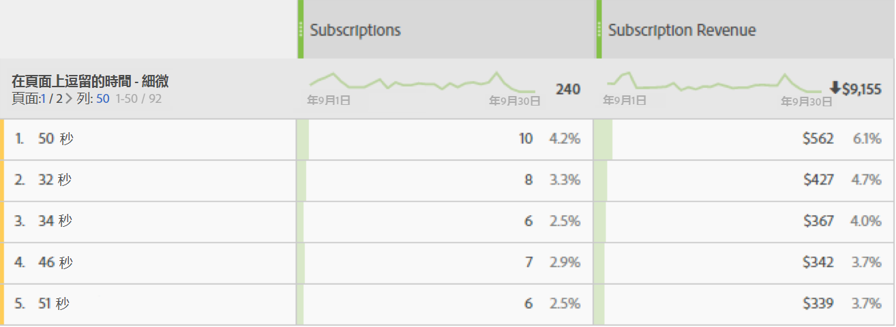

# 頁面逗留時間

「頁面逗留時間」[維度](overview.md)會記錄訪客在頁面上逗留的時間量。 此維度使用下列步驟來測量計算：

1. 對於指定的點擊，查看時間戳記。
2. 將此點擊與造訪的下次點擊時間戳記進行比較。 頁面檢視和連結追蹤點擊都會計入。
3. 這兩次點擊之間經過的時間會計為逗留時間。

如果您想要瞭解訪客在您的網站上與指定量度互動的時間長度，此維度就十分實用。

>[!TIP]
>
>對於造訪的最後一次點擊不會測量逗留時間，因為沒有後續影像要求可測量經過的時間。 此概念也適用於包含單一點擊 (跳出) 的造訪。

此維度以點擊為基礎，這表示每個點擊的值都不同。 將此維度與[每次造訪逗留時間](time-spent-per-visit.md) (以造訪為基礎的維度) 作比較。 逗留時間較長，表示訪客在頁面 (點擊) 上停留的時間較長。

## 將資料填入此維度中

此維度可直接用於所有實施作業。 如果報告套裝包含資料，此維度即會運作。

## 維度項目

頁面逗留時間有多個維度：

* **頁面逗留時間 - 分段**：時間量會分段。 維度項目的範圍介於 `"Less than 15 seconds"` 到 `"More than 30 minutes"` 之間。 點選之間的時間通常不超過30分鐘；但是，如果使用時間戳記點選或資料來源，點選之間的時間可能會超過30分鐘。
* **頁面逗留時間 - 精細**：每個秒數都是一個不重複的維度項目。

如需更多關於逗留時間的一般資訊，請參閱[逗留時間概觀](../metrics/time-spent.md)。
