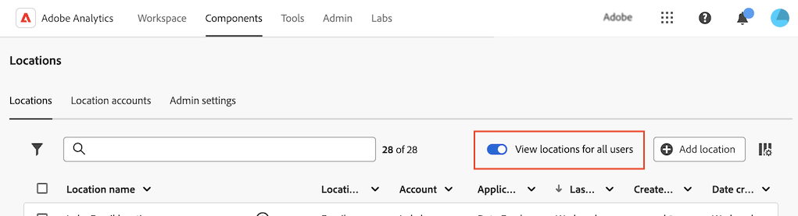

# 設定雲端匯入和匯出位置

<!-- This page is almost duplicated with the "Configure cloud export locations" article in CJA. Differences are that Snowflake isn't supported here and there is a Suffix field for each account type. -->

>[!NOTE]
>
>建立及編輯位置時，請考量下列事項：<ul><li>系統管理員可以限制使用者建立位置，如中所述 [設定使用者是否可以建立位置](/help/components/locations/locations-manager.md#configure-whether-users-can-create-locations). 如果您無法依照本節所述建立位置，請連絡您的系統管理員。</li><li>位置只能由建立該位置的使用者或系統管理員編輯。</li></ul>

在您之後 [設定雲端帳戶](/help/components/locations/configure-import-accounts.md)，則您可在該帳戶上設定位置。 單一位置可用於下列任一用途（單一位置無法與多個用途相關聯）：

* 匯出檔案，使用 [資料摘要](/help/export/analytics-data-feed/create-feed.md)
* 匯出報告，使用 [Data Warehouse](/help/export/data-warehouse/create-request/dw-request-report-destinations.md)
* 使用匯入結構描述 [分類設定](/help/components/classifications/sets/overview.md)

您必須使用存取雲端帳戶的必要資訊來設定Adobe Analytics。 此程式包括新增及設定帳戶(例如Amazon S3角色ARN、Google Cloud Platform等)，如所述 [設定雲端匯入和匯出帳戶](/help/components/locations/configure-import-accounts.md)，然後新增並設定該帳戶中的位置（如本文所述）。

如需有關如何檢視和刪除現有位置的資訊，請參閱 [位置管理員](/help/components/locations/locations-manager.md).

## 開始建立或編輯位置

1. 在Adobe Analytics中，選取 [!UICONTROL **元件**] > [!UICONTROL **位置**].

1. 在 [!UICONTROL 位置] 頁面，選取 [!UICONTROL **位置**] 標籤。

1. （視條件而定）如果您是系統管理員，則可以啟用 [!UICONTROL **檢視所有使用者的位置**] 用來檢視組織中所有使用者建立的位置的選項。
   

1. 若要新增位置，請選取 [!UICONTROL **新增位置**]. （如果您尚未新增帳戶，請依照中的說明新增帳戶） [設定雲端匯入和匯出帳戶](/help/components/locations/configure-import-accounts.md).)

   此 [!UICONTROL **新增位置**] 對話方塊顯示

   或

   若要編輯現有位置，請選取位置名稱旁的3點選單，然後選取 [!UICONTROL **編輯**].

   此 [!UICONTROL **位置詳細資料**] 對話方塊隨即顯示。

1. 指定下列資訊： |欄位 | 函式 | ---------|----------| | [!UICONTROL **名稱**] | 位置的名稱。  |
| [!UICONTROL **說明**] | 提供帳戶的簡短說明，有助區分該帳戶與相同帳戶類型的其他帳戶。| | [!UICONTROL **搭配使用**] | 選擇您是否想要將此位置與 [!UICONTROL **資料摘要**]， [!UICONTROL **Data Warehouse**]，或 [!UICONTROL **分類設定**]. 
進行選取時，請考量下列事項：
<ul><li>單一位置無法用於多種用途。 例如，用於資料摘要的位置不能也用於「Data Warehouse」或「分類設定」。</li><li>若要避免位置內的檔案衝突，請勿變更 [!UICONTROL **搭配使用**] 位置之後的欄位。</li><li>如果您要建立電子郵件帳戶的位置，請選取 [!UICONTROL **Data Warehouse**] 在此欄位中。 資料摘要和分類集不支援電子郵件位置。</li></ul> | | [!UICONTROL **讓位置可供組織中的所有使用者使用**] | 啟用此選項可允許組織中的其他使用者使用該位置。
共用位置時，請考量下列事項：
<ul><li>您無法取消共用您共用的位置。</li><li>共用位置只能由位置擁有者編輯。</li><li>只有在與位置關聯的帳戶也共用時，才能共用位置。</li></ul> | | [!UICONTROL **位置帳戶**] | 選取您要建立此位置的位置帳戶。 如需有關如何建立帳戶的資訊，請參閱 [設定雲端匯入和匯出帳戶](/help/components/locations/configure-import-accounts.md). |

1. 若要完成設定位置的表單，請繼續以下對應於您在 [!UICONTROL **位置帳戶**] 欄位。 （也可使用其他舊帳戶型別，但不建議使用。）

### Amazon S3 Role ARN

若要設定Amazon S3角色ARN位置，請指定下列資訊：

1. [開始建立或編輯位置](#begin-creating-or-editing-a-location)，如上所述。

   | 欄位 | 函數 |
   |---------|----------|
   | [!UICONTROL **貯體**] | 在您的 Amazon S3 帳戶內，您希望 Adob&#x200B;&#x200B;e Analytics 資料傳送的貯體。 
請確定Adobe提供的使用者ARN具有 `S3:PutObject` 許可權可將檔案上傳至此貯體。 

貯體名稱必須符合特定的命名規則。例如，這些名稱長度必須在 3 至 63 個字元之間，只能由小寫字母、數字、點 (.) 和連字號 (-) 組成，並且必須以字母或數字開頭和結尾。[AWS 文件中有命名規則的完整清單](https://docs.aws.amazon.com/AmazonS3/latest/userguide/bucketnamingrules.html)。 
 |
   | [!UICONTROL **前置詞**] | 在貯體內，您希望資料放置的資料夾。註明資料夾名稱，然後在名稱後面加上反斜線以建立資料夾。例如，folder_name/ |

   {style="table-layout:auto"}

1. 選取「[!UICONTROL **儲存**]」。

   您現在可以將資料匯入或匯出至您設定的帳戶和位置，或從這些帳戶和位置匯出資料。 若要匯出資料，請使用 [資料摘要](/help/export/analytics-data-feed/create-feed.md) 或 [Data Warehouse](/help/export/data-warehouse/create-request/dw-request-report-destinations.md). 若要匯入資料，請使用 [分類設定](/help/components/classifications/sets/overview.md).

   匯入的資料匯入後，不會從雲端目的地刪除。

   >[!NOTE]
   >
   >   如果您先前曾使用 [FTP以匯入分類](/help/components/classifications/importer/c-uploading-saint-data-files-via-ftp.md) 若為Adobe Analytics，您需要上傳FIN檔案。 從雲端帳戶匯入時，不需要此FIN檔案。

### Google Cloud Platform

若要設定 Google Cloud Platform 位置，請註明以下資訊：

1. [開始建立或編輯位置](#begin-creating-or-editing-a-location)，如上所述。

   | 欄位 | 函數 |
   |---------|----------|
   | [!UICONTROL **貯體**] | 您想要將Adobe Analytics資料傳送至的GCP帳戶中的貯體。 確保您已授予Adobe所提供之主體的許可權，可將檔案上傳至此儲存貯體。 |
   | [!UICONTROL **前置詞**] | 在貯體內，您希望資料放置的資料夾。註明資料夾名稱，然後在名稱後面加上反斜線以建立資料夾。例如，folder_name/ |

   {style="table-layout:auto"}

1. 選取「[!UICONTROL **儲存**]」。

   您現在可以將資料匯入或匯出至您設定的帳戶和位置，或從這些帳戶和位置匯出資料。 若要匯出資料，請使用 [資料摘要](/help/export/analytics-data-feed/create-feed.md) 或 [Data Warehouse](/help/export/data-warehouse/create-request/dw-request-report-destinations.md). 若要匯入資料，請使用 [分類設定](/help/components/classifications/sets/overview.md).

   匯入的資料匯入後，不會從雲端目的地刪除。

   >[!NOTE]
   >
   >   如果您先前曾使用 [FTP以匯入分類](/help/components/classifications/importer/c-uploading-saint-data-files-via-ftp.md) 若為Adobe Analytics，您需要上傳FIN檔案。 從雲端帳戶匯入時，不需要此FIN檔案。

### Azure SAS

若要設定 Azure SAS 位置，請註明以下資訊：

1. [開始建立或編輯位置](#begin-creating-or-editing-a-location)，如上所述。

   | 欄位 | 函數 |
   |---------|----------|
   | [!UICONTROL **容器**] | 在您指定的帳戶內，您希望 Adob&#x200B;&#x200B;e Analytics 資料傳送的容器。 |
   | [!UICONTROL **前置詞**] | 在容器內，您希望資料放置的資料夾。註明資料夾名稱，然後在名稱後面加上反斜線以建立資料夾。例如， `folder_name/` |

   {style="table-layout:auto"}

1. 選取「[!UICONTROL **儲存**]」。

   您現在可以將資料匯入或匯出至您設定的帳戶和位置，或從這些帳戶和位置匯出資料。 若要匯出資料，請使用 [資料摘要](/help/export/analytics-data-feed/create-feed.md) 或 [Data Warehouse](/help/export/data-warehouse/create-request/dw-request-report-destinations.md). 若要匯入資料，請使用 [分類設定](/help/components/classifications/sets/overview.md).

   匯入的資料匯入後，不會從雲端目的地刪除。

   >[!NOTE]
   >
   >   如果您先前曾使用 [FTP以匯入分類](/help/components/classifications/importer/c-uploading-saint-data-files-via-ftp.md) 若為Adobe Analytics，您需要上傳FIN檔案。 從雲端帳戶匯入時，不需要此FIN檔案。

### Azure RBAC

若要設定 Azure RBAC 位置，請註明以下資訊：

1. [開始建立或編輯位置](#begin-creating-or-editing-a-location)，如上所述。

   | 欄位 | 函數 |
   |---------|----------|
   | [!UICONTROL **帳戶**] | Azure儲存體帳戶。 |
   | [!UICONTROL **容器**] | 在您指定的帳戶內，您希望 Adob&#x200B;&#x200B;e Analytics 資料傳送的容器。確保您授予權限可上傳檔案至先前已建立的 Azure 應用程式。 |
   | [!UICONTROL **前置詞**] | 在容器內，您希望資料放置的資料夾。註明資料夾名稱，然後在名稱後面加上反斜線以建立資料夾。例如， `folder_name/` |

   {style="table-layout:auto"}

1. 選取「[!UICONTROL **儲存**]」。

   您現在可以將資料匯入或匯出至您設定的帳戶和位置，或從這些帳戶和位置匯出資料。 若要匯出資料，請使用 [資料摘要](/help/export/analytics-data-feed/create-feed.md) 或 [Data Warehouse](/help/export/data-warehouse/create-request/dw-request-report-destinations.md). 若要匯入資料，請使用 [分類設定](/help/components/classifications/sets/overview.md).

   匯入的資料匯入後，不會從雲端目的地刪除。

   >[!NOTE]
   >
   >   如果您先前曾使用 [FTP以匯入分類](/help/components/classifications/importer/c-uploading-saint-data-files-via-ftp.md) 若為Adobe Analytics，您需要上傳FIN檔案。 從雲端帳戶匯入時，不需要此FIN檔案。

### 電子郵件

若要設定電子郵件位置，請指定下列資訊：

1. [開始建立或編輯位置](#begin-creating-or-editing-a-location)，如上所述。

   | 欄位 | 函數 |
   |---------|----------|
   | [!UICONTROL **主旨**] | 電子郵件訊息的主旨。 |
   | [!UICONTROL **附註**] | 電子郵件訊息的內容。 |

   {style="table-layout:auto"}

1. 選取「[!UICONTROL **儲存**]」。

   您現在可以使用將資料匯出至您設定的帳戶和位置 [資料摘要](/help/export/analytics-data-feed/create-feed.md). (不支援電子郵件位置 [Data Warehouse](/help/export/data-warehouse/create-request/dw-request-report-destinations.md) 或 [分類設定](/help/components/classifications/sets/overview.md))。

### 舊版帳戶型別

這些舊帳戶型別僅在透過匯出資料時可用 [資料摘要](/help/export/analytics-data-feed/create-feed.md) 和 [Data Warehouse](/help/export/data-warehouse/create-request/t-dw-create-request.md). 使用匯入資料時，這些選項無法使用 [分類設定](/help/components/classifications/sets/manage/schema.md).

+++FTP

資料摘要資料可以傳送至Adobe或客戶託管的FTP位置。 指定目錄使用路徑欄位將摘要檔案放在資料夾中。

| 欄位 | 函數 |
|---------|----------|
| [!UICONTROL **目錄路徑**] | 輸入FTP伺服器上目錄的路徑。 資料夾必須已存在；如果指定的路徑不存在，摘要會傳回錯誤。  例如， `/folder_name/folder_name`. |

{style="table-layout:auto"}

+++

+++SFTP

資料摘要資料可以傳送至Adobe或客戶託管的SFTP位置。 目的地網站必須包含有效的RSA或DSA公開金鑰。 建立摘要時，您可以下載相關的公開金鑰。

| 欄位 | 函數 |
|---------|----------|
| [!UICONTROL **目錄路徑**] | 輸入FTP伺服器上目錄的路徑。 資料夾必須已存在；如果指定的路徑不存在，摘要會傳回錯誤。  例如， `/folder_name/folder_name`. |

{style="table-layout:auto"}

+++

+++S3

您可以直接傳送倉儲資料至 Amazon S3 貯體。此目的地類型需要貯體名稱、存取金鑰 ID 和機密金鑰。 如需詳細資訊，請參閱 Amazon S3 文件中的「[Amazon S3 貯體命名規定](https://docs.aws.amazon.com/awscloudtrail/latest/userguide/cloudtrail-s3-bucket-naming-requirements.html)」。

您提供來上傳 Data Warehouse 資料的使用者必須具備以下[權限](https://docs.aws.amazon.com/AmazonS3/latest/API/API_Operations_Amazon_Simple_Storage_Service.html)：

* s3:GetObject
* s3:PutObject
* s3:PutObjectAcl

下列 16 個標準 AWS 區域有受到支援 (必要時會使用適當的簽章演算法)：

* us-east-2
* us-east-1
* us-west-1
* us-west-2
* ap-south-1
* ap-northeast-2
* ap-southeast-1
* ap-southeast-2
* ap-northeast-1
* ca-central-1
* eu-central-1
* eu-west-1
* eu-west-2
* eu-west-3
* eu-north-1
* sa-east-1

>[!NOTE]
>
>不支援 cn-north-1 區域。

+++

+++Azure Blob

Data Warehouse 支援 Azure Blob 目標。容器、帳戶和金鑰為必填。Amazon 會自動加密閒置的資料。下載資料時，則會自動解密。如需詳細資訊，請參閱 Microsoft Azure 文件中的[建立儲存帳戶](https://docs.microsoft.com/zh-tw/azure/storage/common/storage-quickstart-create-account?tabs=azure-portal#view-and-copy-storage-access-keys)。

>[!NOTE]
>
>您必須實作自己的處理程序，才能管理 Data Warehouse 目標的磁碟空間。Adobe 不會從伺服器刪除任何資料。

+++

