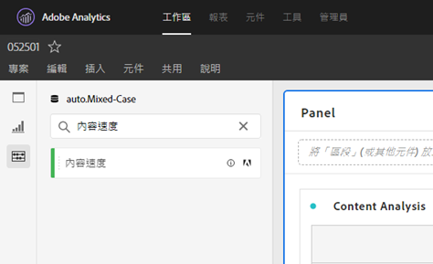

# [!UICONTROL 內容速度]

[!UICONTROL 內容速度] 是標準的Adobe Analytics量度範本。 [!UICONTROL 內容速度] 」定義為[頁[!UICONTROL 面檢視] |瀏 [!UICONTROL 覽參與率]] / [[!UICONTROL 瀏覽次數]]並協助您測量特定內容片段（頁面、網站區段等）的影響力 在下游播放。 它可協助您瞭解哪些內容是，而且不會將使用者保留在網站或行動應用程式上。

[!UICONTROL 透過搜尋或使用標籤] （#Adobe範本）來篩選左側導軌，即可在「分析工作區」中找到內容速度。

[!UICONTROL 內容速度] (Content Velocity [!UICONTROL )常用於內容分析，以及其他關鍵量度，]例如頁面檢視 [!UICONTROL 、瀏覽]和 [!UICONTROL 反彈率]。

