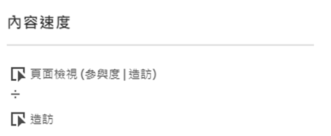
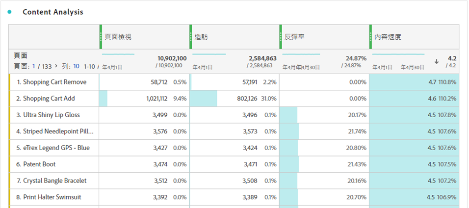

# 內容速度

「內容速度」計算量度可協助您測量維度（通常為[[!UICONTROL 頁面]](/help/components/dimensions/page.md)）對使用者在您網站或應用程式上花費時間的貢獻度。

此量度使用[頁面檢視次數](page-views.md)量度上的[參與率歸因](/help/analyze/analysis-workspace/attribution/models.md)作為其計算的一部分。 透過造訪參與率，每次點選頁面時，先前在同一次造訪期間點選的所有頁面都會獲得頁面檢視的評分。 此公式通常表示造訪期間越早點選頁面，其獲得的評分就越多。 (請參閱[頁面檢視（參與率） |造訪)或「造訪參與率」](#page-views-participation--visit-or-visit-participation)以取得詳細資訊。)

## 計算

「內容速度」是預設計算[量度](overview.md)，它使用公式`Page views (Visit participation)`除以`Visits`。

## 常見用法

[!UICONTROL 「內容速度」]常與其他關鍵量度搭配用於內容分析，例如[!UICONTROL 頁面檢視]、[!UICONTROL 造訪]和[!UICONTROL 跳出率]等量度。

## 範例

下列範例會劃分「內容速度」的2個部分：「頁面檢視（參與率）」 |造訪)&#39;和&#39;造訪&#39;。

### 頁面檢視（參與率） |造訪)或「造訪參與率」

請考量下列造訪參與率如何影響歸因的範例：

在網站上，使用者依此順序造訪下列頁面：

* 頁面A
* 頁面B
* 頁面C
* 頁面D

在上述範例中，頁面A接收4次點選的評分、頁面B接收3次點選、頁面C接收2次點選，而頁面D接收1次點選。

以下範例說明相同的原則，但有些頁面被多次造訪。

* 頁面A
* 頁面B
* 頁面C
* 頁面B
* 頁面D
* 頁面A

在上述範例中，頁面A接收7次點選、頁面B接收8次點選、頁面C接收4次點選，而頁面D接收2次點選。

### 造訪次數

計算造訪參與率後，結果會除以造訪次數。
