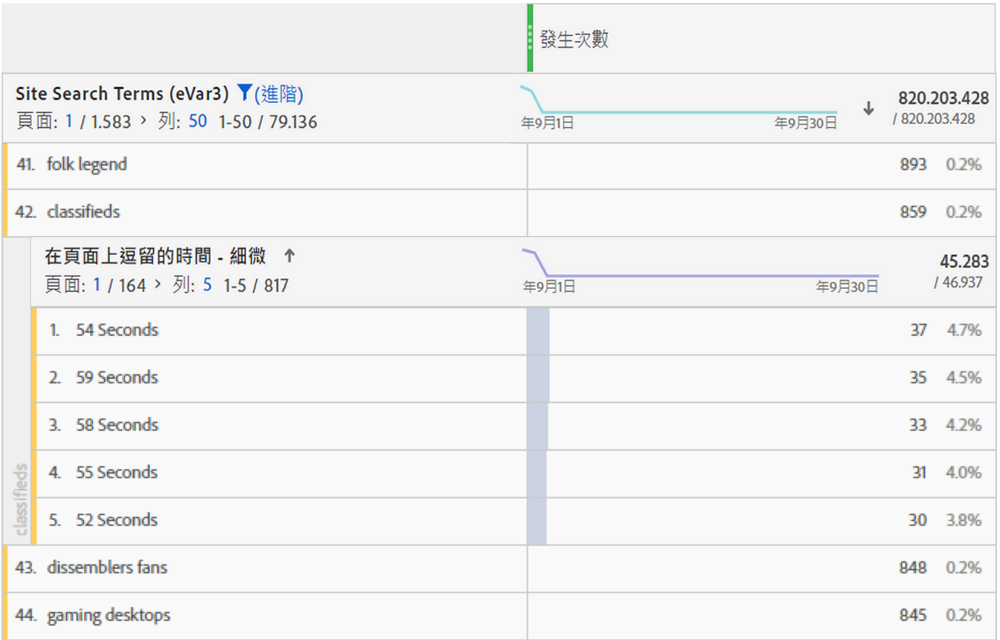

# 逗留時間概觀

Adobe Analytics產品提供各種[!UICONTROL 逗留時間] [量度](overview.md)和維度。 此頁面可協助您去除想要的維度或量度之歧義。

## 「逗留時間」量度

| 量度 | 定義 | 適用於 |
|---|---|---|
| [[!UICONTROL 花費秒數總計]](total-seconds-spent.md) | 代表訪客與特定維度項目互動的總時間量。包括值的例項和在所有後續點擊中持續的項目。如果是 prop，則會對後續連結事件一併計算逗留時間。 | Analysis Workspace、Report Builder（稱為「總逗留時間」）、Data Warehouse |
| [[!UICONTROL 每次造訪逗留時間] （秒）](time-spent-per-visit.md) | 大約&#x200B;*總逗留秒數/（造訪彈回數）* &#x200B;代表訪客每次造訪時與特定維度專案互動的平均時間量。 **注意**：此量度無法獨立計算，因為此函式的分母是內部量度。 | Analysis Workspace |
| 每位訪客逗留時間[[!UICONTROL 1} （秒）](time-spent-per-visitor.md)] | 大約總逗留秒數/不重複訪客&#x200B;* 代表訪客在訪客期限內（Cookie的存留時間長度內期間）與特定維度專案互動的平均時間量。***注意**：此量度無法獨立計算，因為此函式的分母是內部量度。 | Analysis Workspace |
| [!UICONTROL 逗留時間/使用者（狀態）] | 大約&#x200B;*行動應用程式總逗留秒數/不重複行動應用程式訪客* &#x200B;代表行動應用程式訪客在訪客期限內（Cookie的存留時間長度內期間）與特定維度專案互動的平均時間量。 **注意**：此量度無法獨立計算，因為此函式的分母是內部量度。 | Analysis Workspace |
| [[!UICONTROL 網站平均逗留時間] （秒）](average-time-on-site.md) | 代表訪客與特定維度項目互動的總時間量，每個序列與一個維度項目互動。這不只限於名稱所建議的「網站」平均值。 如需有關序列的詳細資訊，請參閱「逗留時間計算方式」一節。 **注意**：因為在計算中使用不同的分母，此量度與維度項目層級的「每次造訪逗留時間」可能有所差異。 | Analysis Workspace，Report Builder（以分鐘為單位顯示） |
| [[!UICONTROL 網站平均逗留時間]](average-time-on-site.md) | 這是與&#x200B;*網站平均逗留時間（秒）*&#x200B;相同的量度，除了格式為時間(`hh:mm:ss`) | Analysis Workspace |
| [!UICONTROL 平均頁面逗留時間] | 已停用的量度。 反之，Adobe建議您在需要維度專案的平均時間時，使用[[!UICONTROL 網站平均逗留時間]](average-time-on-site.md)。 | Report Builder (請求中包含維度時) |

## 「逗留時間」維度

| 維度 | 定義 | 適用於 |
| --- | --- | --- |
| [[!UICONTROL 每次造訪逗留時間 - 精細]](../dimensions/time-spent-per-visit.md) | 將瀏覽時的總逗留時間去除尾數後的為最接近的秒數，適用於可套用至屬於瀏覽一部分的每一次點擊。這是造訪層級維度。 | Analysis Workspace |
| [[!UICONTROL 每次瀏覽逗留時間 - 分組]](../dimensions/time-spent-per-visit.md) | 詳細程度維度分成 9 個不同的範圍。這是造訪層級維度。這些範圍包括：<ul><li>少於 1 分鐘</li><li>1-5 分鐘</li><li>5-10 分鐘</li><li>10-30 分鐘</li><li>30-60 分鐘</li><li>1-2 小時</li><li>2-5 小時</li><li>5-10 小時</li><li>10-15 小時</li></ul>**注意**：時間區間不可高於此設定，因為一次造訪在經過 12 小時的活動後就會到期。 | Analysis Workspace，Report Builder |
| [[!UICONTROL 頁面逗留時間 - 精細]](../dimensions/time-spent-on-page.md) | 每次點擊的總逗留時間，去除尾數後為最接近的秒數。這個項目是點擊層級維度，且包含頁面檢視和連結事件。雖然名稱有別，但不僅限於「頁面」維度。 | Analysis Workspace |
| [[!UICONTROL 頁面逗留時間 – 分段]](../dimensions/time-spent-on-page.md) | 詳細程度維度分成 10 個不同範圍；不過分段的維度只會計算頁面檢視次數 (而排除連結事件)。這是點擊層級維度。這些範圍包括：<ul><li>少於 15 秒</li><li>15 至 29 秒</li><li>30 至 59 秒</li><li>1 至 3 分鐘</li><li>3 至 5 分鐘</li><li>5 至 10 分鐘</li><li>10 至 15 分鐘</li><li>15 至 20 分鐘</li><li>20 至 30 分鐘</li><li>超過 30 分鐘</li></ul> | Analysis Workspace |

## 「逗留時間」的計算方式

Adobe Analytics使用明確值（包括連結事件和視訊檢視）來計算逗留時間。

>[!NOTE]
>
>若沒有[!UICONTROL 視訊檢視]或[!UICONTROL 退出連結]等連結事件，即無法得知造訪的最後點擊逗留時間。基於類似的理由，[!UICONTROL 反彈造訪] (亦即含有單一點擊的造訪) 也不會有與造訪相關聯的逗留時間。

計算逗留時間時所使用的&#x200B;**分子**&#x200B;均為總逗留秒數。

**分母**&#x200B;在 Adobe Analytics 中不是獨立量度。如果是點擊層級的逗留時間量度，分母則為序列。序列是一組連續點擊，其中的指定變數會包含相同的值 (不論是透過設定、擴散或持續)。「擴散」是指計算逗留時間時，Prop 在個別頁面檢視之間持續沿用的情形 (亦即後續連結事件中使用)。

* 例如，如果是[!UICONTROL 頁面名稱]或點擊層級的其他維度，分母實際上為[!UICONTROL 例項]或[!UICONTROL 頁面檢視]，但重新載入和未設定的值 (例如連結事件) 則計為單一互動 (序列)。

* 彈回和退出點擊也會從分母中移除，因為無法得知逗留時間。

## 常見問題解答

+++所有「逗留時間」量度都能套用至任何維度嗎？

可套用至任何維度的「逗留時間」量度包括：

* [[!UICONTROL 花費秒數總計]](total-seconds-spent.md)

* [[!UICONTROL 每次造訪逗留時間] (秒數)](time-spent-per-visit.md)

* [[!UICONTROL 每位訪客逗留時間] (秒數)](time-spent-per-visitor.md)

* [[!UICONTROL 網站平均逗留時間] (秒數)](average-time-on-site.md)

+++

+++哪一個逗留時間維度最適合搭配其他維度專案來進行劃分？

[[!UICONTROL 頁面逗留時間 — 精細]](../dimensions/time-spent-on-page.md)維度是點選層級維度。 使用由其他維度來劃分這個項目會告訴您當劃分維度也存在時點擊持續的秒數。在以下範例中，搜尋辭彙「已分類」與54秒、59秒等點選時間相關聯，可能表示訪客正在花時間閱讀該辭彙傳回的內容。

+++

+++哪個量度適合搭配[!UICONTROL 頁面逗留時間 — 精細]的維度？

任意量度皆可。此維度會顯示事件發生時確切點擊的逗留時間。較長的逗留時間表示訪客在事件發生的頁面 (點擊) 上停留較長時間。

搭配使用的自訂量度

+++

+++[!UICONTROL 網站平均逗留時間]與[!UICONTROL 每次造訪逗留時間]有何不同？

差異在於量度中的分母:

* [[!UICONTROL 網站平均逗留時間]](average-time-on-site.md)使用的序列包含了維度項目。

* [[!UICONTROL 每次造訪逗留時間]](time-spent-per-visit.md)使用造訪次數

因此，這些量度可能會在造訪層級產生類似的結果，但在點選層級就會有所差異。

+++

+++為什麼[!UICONTROL 網站平均逗留時間]的劃分總計與父條列專案不符？

因為[!UICONTROL 網站平均逗留時間]取決於維度的連續序列，而內部報表在計算這些執行時並不依賴外部報表。

例如，請考量下列造訪。

| 點選# | 1 | 2 | 3 |
|---|---|---|---|
| **花費秒數** | 30 | 100 | 10 |
| **頁面名稱** | 首頁 | 產品 | 首頁 |
| **日期** | 1 月 1 日 | 1 月 1 日 | 1 月 1 日 |

計算首頁的逗留時間時，算式會是 (30+10)/2=20，但依日劃分時，算式則是 (30+10)/1=40，因為 1 月 1 日當天有單一連續執行。

因此，這些量度可能會在造訪層級產生類似的結果，但在點選層級就會有所差異。

+++

## [!UICONTROL 逗留時間]計算範例

假設以下幾組伺服器呼叫是針對一次造訪期間內的單一訪客：

| 造訪點擊編號 | 1 | 2 | 3 | 4 | 5 | 6 | 7 |
|---|---|---|---|---|---|---|---|
| **造訪間隔時間 (以秒計算)** | 0 | 30 | 80 | 180 | 190 | 230 | 290 |
| **花費秒數** | 30 | 50 | 100 | 10 | 40 | 60 | - |
| **點擊類型** | 頁面 | 連結 | 頁面 | 頁面 | 頁面 | 頁面 | 頁面 |
| **頁面名稱** | 首頁 | - | 產品 | 首頁 | 首頁 (重新載入) | 購物車 | 訂購確認 |
|  |  |  |  |  |  |  |  |
| **prop1** | A (設定) | A (擴散) | 未設定 | B (設定) | B (設定) | A (設定) | C (設定) |
| **prop1 花費秒數** | 30 | 50 | - | 10 | 40 | 60 | - |
|  |  |  |  |  |  |  |  |
| **eVar1** | 紅色 (設定) | 紅色 (持續) | (已過期) | 藍色 (設定) | 藍色 (設定) | 藍色 (持續) | 紅色 (設定) |
| **eVar1 花費秒數** | 30 | 50 | - | 10 | 40 | 60 | - |

根據上表，「逗留時間」量度的計算結果如下：

| prop1 | 花費秒數總計 | 每次造訪逗留時間 | 每位訪客逗留時間 | 序列計數 | 網站平均逗留時間 |
|---|---|---|---|---|---|
| A | 30+50+60=140 | 140/1=140 | 140/1=140 | 2 | 140/2=70 |
| B | 10+40=50 | 50/1=50 | 50/1=50 | 1 | 50/1=50 |
| C | 0 | 0 | 0 | 0 | 0 |
| 未歸類的時間 | 100 | - | - | - | - |

| eVar1 | 花費秒數總計 | 每次造訪逗留時間 | 每位訪客逗留時間 | 序列計數 | 網站平均逗留時間 |
|---|---|---|---|---|---|
| 紅色 | 30+50=80 | 80/1=80 | 80/1=80 | 1 | 80/1=80 |
| 藍色 | 10+40+60=110 | 110/1=110 | 110/1=110 | 1 | 110/1=110 |
| 未歸類的時間 | 100 | - | - | - | - |

每次造訪逗留時間 (精細)：290
頁面逗留時間 (精細)：10、30、40、50、60、100

可支持此範例的其他附註：

* 所有逗留時間均係根據造訪間隔時間 (於造訪的首次點擊從零開始) 計算而得。

* 花費秒數是指目前點選時間戳記與下次點選時間戳記之間的差異。 因此，造訪 (和彈回) 的最後一次點擊沒有逗留時間。

* 「序列」是一組連續的點選，其中的指定變數會包含相同的值（不論是透過設定、擴散或持續存在的方式）。 例如，prop1「A」有兩個序列：點選1和2以及點選6。 造訪的最後一次點擊的值不會開始新的序列，因為最後一次點擊沒有逗留時間。網站平均逗留時間會使用序列作為分母。

   * 僅就逗留時間而言，prop是從頁面點選「擴散」至後續連結點選，如上方針對點選2的prop1所示。 這可讓點選1上的prop1所設定的值(「A」)將逗留時間累積在點選2上。

   * eVar 會將逗留時間累積在 eVar 已設定或持續存在的點擊上。eVar 持續性是由Analytics > 管理員中的 eVar 設定所定義。
