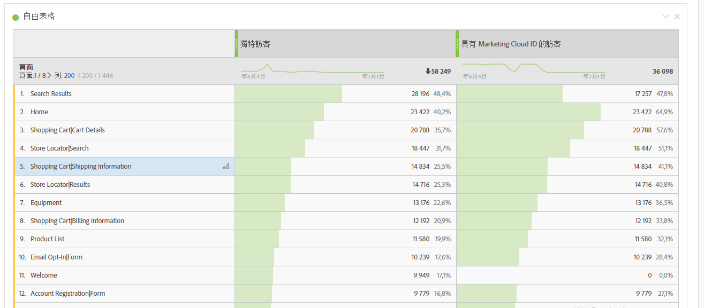
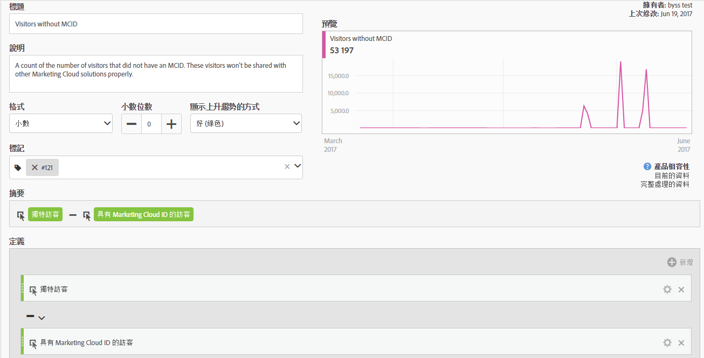
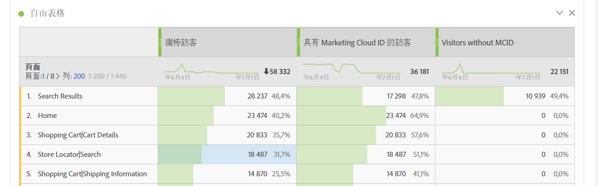

# 具有 Experience Cloud ID 的訪客

「具有Experience CloudID的訪客」 [量度](overview.md)顯示使用[Experience CloudID服務](https://experienceleague.adobe.com/docs/id-service/using/home.html?lang=zh-Hant)的Adobe所識別的不重複訪客數量。 該量度有助於和「[不重複訪客](unique-visitors.md)」量度進行比較，以確保您網站上的大多數訪客都使用此 ID 服務。若大部分的訪客都未使用 ID 服務 Cookie，此維度將可指出您實作中的問題。

>[!NOTE]
>
>如果您使用多個 Experience Cloud 服務 (例如 Adobe Target 或 Adobe Audience Manager)，此量度在除錯方面尤其重要。在多項 Experience Cloud 產品間共用的區段，不會包含沒有 Experience Cloud ID 的訪客。

## 此量度的計算方式

此量度以[不重複訪客](unique-visitors.md)量度為基礎，但僅包含以 `mid` 查詢字串識別的個人 (根據 [`s_ecid`](https://experienceleague.adobe.com/docs/core-services/interface/ec-cookies/cookies-analytics.html?lang=zh-Hant) Cookie)。

## 對您的 Experience Cloud ID 設定進行除錯

「具有 Experience Cloud ID 的訪客」量度可用於 Experience Cloud 整合的疑難排解，或用來識別未部署 ID 服務的網站區域。

拖曳「具有 Experience Cloud ID 的訪客」與「不重複訪客」而使其並排，以便相互比較：

在此範例中，請注意每個頁面的「不重複訪客」數量都與「具有 Experience Cloud ID 的訪客」數量相同。但是，「不重複訪客」的總數卻大於「具有 Experience Cloud ID 的訪客」總數。您可以建立[計算量度](../c-calcmetrics/cm-overview.md)，找出未設定 ID 服務的頁面。您可以使用下列定義：

將計算量度加入報表後，您便可為「頁面」報表排序，進而顯示沒有 MCID 的訪客最多頁面：

請注意，「產品快速檢視」維度項目無法透過 Identity Service 正確實施作業。您可以與組織內的適當團隊合作，以盡快更新這些頁面。您可以使用任何類型的維度 (例如[瀏覽器類型](../dimensions/browser-type.md)、[網站區段](../dimensions/site-section.md)或任何 [eVar](../dimensions/evar.md)) 來建構類似的報表。
