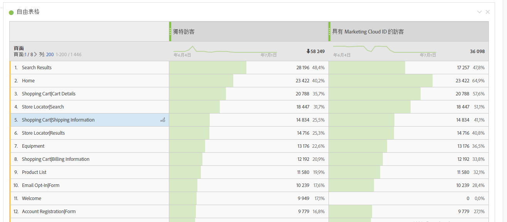
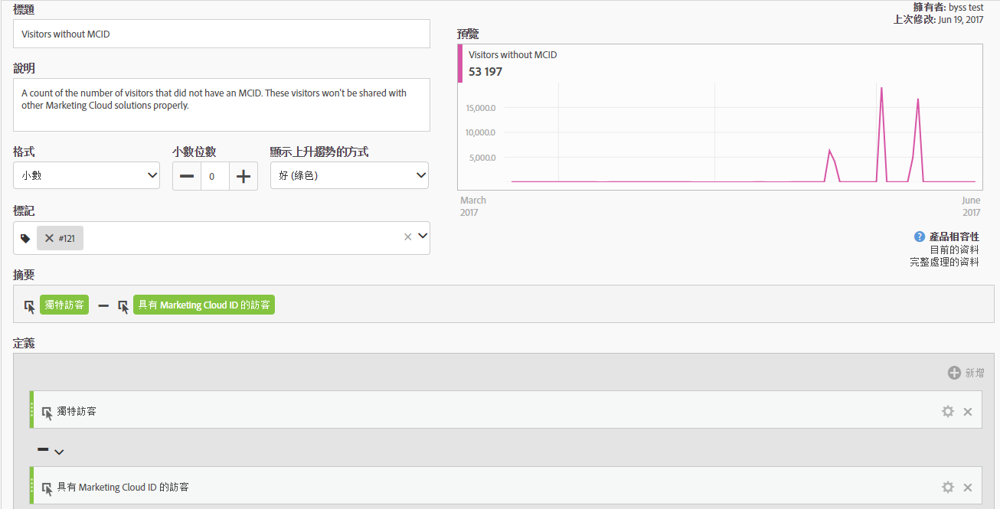
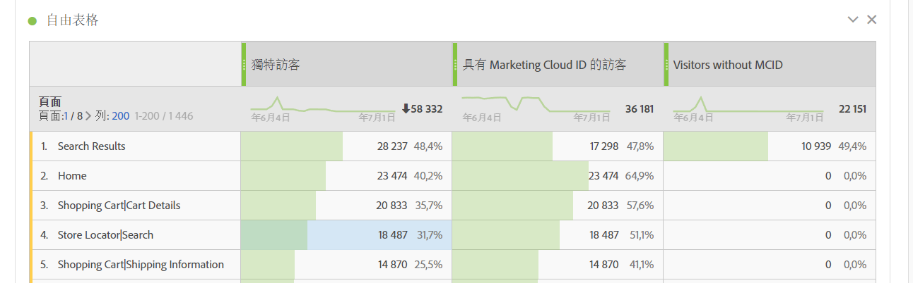

# 具有 Experience Cloud ID 的訪客

具有Experience Cloud ID &#39; [量度](overview.md)的&#39;訪客顯示Adobe識別的ECID不重複訪客數量（使用[訪客ID服務](https://experienceleague.adobe.com/tw/en/docs/id-service/using/home)或[Experience Platform身分識別服務](https://experienceleague.adobe.com/zh-hant/docs/experience-platform/identity/home)）。 此量度有助於與[不重複訪客](unique-visitors.md)量度進行比較，以確保您網站上的大多數訪客都使用ECID。 如果大部分的訪客都未使用此識別碼，此識別碼可能表示您實施作業中的問題。

>[!NOTE]
>
>如果您使用多種CX Enterprise服務（例如Adobe Target或Adobe Audience Manager），此量度在除錯方面尤其重要。 CX Enterprise產品共用的區段不包含沒有ECID的訪客。

## 此量度的計算方式

此量度以[不重複訪客](unique-visitors.md)量度為基礎，但僅包含以 `mid` 查詢字串識別的個人 (根據 [`s_ecid`](https://experienceleague.adobe.com/zh-hant/docs/core-services/interface/data-collection/cookies/analytics) Cookie)。

## 對您的ECID設定進行偵錯

具有Experience Cloud ID 的&#39;訪客&#39;量度可用於CX Enterprise整合的疑難排解，或用來識別未部署訪客ID服務或Experience Platform Identity服務的網站區域。

將Experience Cloud ID為的&#39;訪客與「不重複訪客」並排拖曳，以便比較：

在此範例中，請注意每個頁面的&#39;[!UICONTROL 不重複訪客]&#39;數量與&#39;[!UICONTROL 位具有Experience Cloud ID]&#39;的訪客相同。 但是，&#39;[!UICONTROL 不重複訪客]&#39;的總數大於Experience Cloud ID為&#39;的&#39;訪客總數。 您可以使用下列定義來建立[計算量度](../calculated-metrics/cm-overview.md)，以找出哪些頁面未使用ECID：

將計算量度新增至報表後，您便可為「頁面」報表排序，進而顯示無ECID的訪客最多頁面：

請注意，「產品快速檢視」維度專案無法透過ECID正確實作。 您可以與組織內的適當團隊合作，以盡快更新這些頁面。 您可以使用任何類型的維度 (例如[瀏覽器類型](../dimensions/browser-type.md)、[網站區段](../dimensions/site-section.md)或任何 [eVar](../dimensions/evar.md)) 來建構類似的報表。
