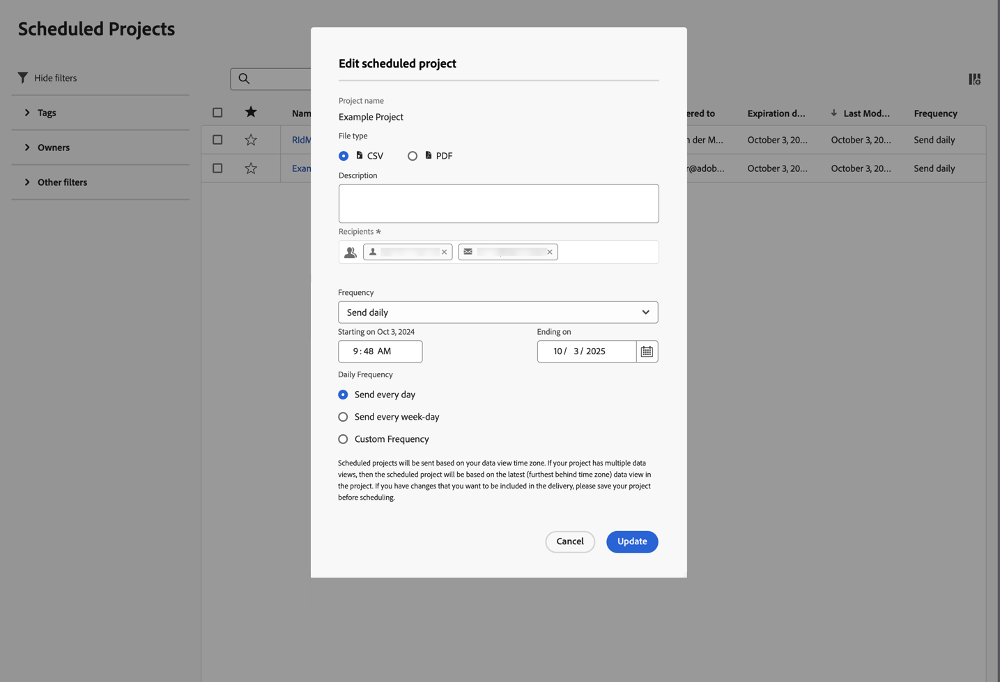

# 已排程的專案

可在Adobe Analytics中使用&#x200B;**[!UICONTROL 元件]** > **[!UICONTROL 已排程專案]**&#x200B;來管理已排程的Analysis Workspace專案。

在&#x200B;**[!UICONTROL 已排程專案]**&#x200B;中，您可以編輯和刪除週期性專案排程。  [排程專案清單](#scheduled-project-list)會顯示特定使用者建立的專案。 如果應用程式內的使用者帳戶已停用，所有已排程的傳送都將停止。

## 排程專案清單

排程專案清單➊顯示下列專案的欄：

| 欄 | 說明 |
| --- | --- |
|  | 選取一或多個已排程專案時，「已排程專案」介面的底部會出現一個藍色動作列。 如需詳細資訊，請參閱「[動作](#actions)」。 |
|  | 選取以偏好或取消偏好排程專案。 |
| **[!UICONTROL 排程 ID]** | 主要用於偵錯用途的ID。 |
| **[!UICONTROL 名稱]** | 此專案的名稱。 選取以檢視排程專案的詳細資料。 選取以開啟內容功能表。 從此功能表，您可以：<ul><li> **[!UICONTROL 刪除]**&#x200B;排程專案。</li><li> **[!UICONTROL 標籤]**&#x200B;排程專案。</li><li> **[!UICONTROL 核准]**&#x200B;排程專案。</li><li> **[!UICONTROL 匯出CSV]**：將排程專案匯出為CSV檔案。</li></ul> |
| **[!UICONTROL 所有者]** | 建立及擁有專案的人。 |
| **[!UICONTROL 標記]** | (選擇性) 標記是組織專案的好方法。 所有使用者都可建立標記，並將一個或多個標記套用到專案。 不過，您只能看見自己所擁有或他人與您共用的那些專案的標記。 |
| **[!UICONTROL 已傳送至]** | 此排程專案的收件者。 |
| **[!UICONTROL 過期日]** | 無論排程頻率如何，您都可以將到期日設定為最長一年。 |
| **[!UICONTROL 頻率]** | 您想要將此排程專案傳送給一或多個收件者的頻率。 |
| **[!UICONTROL 執行時間]** | 在一天中的什麼時間傳送此排程專案。 |
| **[!UICONTROL 查詢數]** | 針對此專案執行的查詢數。 |
| **[!UICONTROL 最大日期範圍]** | 為排程專案定義的最長日期範圍。 此值可能與調查效能問題相關。 如需詳細資訊，請參閱[報告活動管理員](/help/admin/tools/reporting-activity-manager/reporting-activity-overview.md)。 |
| **[!UICONTROL 查詢數]** | 針對排程專案執行的查詢數。 此值可能與調查效能問題相關。 如需詳細資訊，請參閱[報告活動管理員](/help/admin/tools/reporting-activity-manager/reporting-activity-overview.md)。 |

您可以使用來設定要顯示哪些欄。

使用來搜尋排程專案。 您也可以檢視是否從「篩選器」面板套用任何篩選器。 若要移除篩選器，請為篩選器選取。 若要移除所有篩選器，請選取&#x200B;**[!UICONTROL 全部清除]**。

若要編輯排程專案，請選取排程專案的標題。 使用&#x200B;**[!UICONTROL 編輯排程專案]**&#x200B;對話方塊來更新排程詳細資料。 如需詳細資訊，請參閱[將檔案傳送至其他](../analyze/analysis-workspace/curate-share/t-schedule-report.md)。

選取&#x200B;**[!UICONTROL 更新]**&#x200B;以更新排程。

## 動作

下列是「已排程的專案管理員」中的常見動作。您可以從內容功能表或選取一或多個排程專案時從藍色動作列選取動作。

| 圖示 | 動作 | 說明 |
|:---:|---|---|
|  | **[!UICONTROL *x *已選取]** | 選取以取消選取您所選的排程專案。 |
|  | **[!UICONTROL 刪除]** | 刪除為專案選取的排程專案；不會刪除專案。 
如需有關刪除專案的資訊，請參閱[專案概述](/help/analyze/analysis-workspace/build-workspace-project/freeform-overview.md)。
 |
|  | **[!UICONTROL 標記]** | 標籤所選的排程專案。 在&#x200B;**[!UICONTROL 標籤排程專案]**&#x200B;中，選取標籤並選取&#x200B;**[!UICONTROL 儲存]**&#x200B;以儲存。 |
|  | **[!UICONTROL 核准]** | 核准所選的排程專案。 |
|  | **[!UICONTROL 匯出至 CSV]** | 將選取的排程專案匯出至名為`Export Scheduled Projects List.csv`的檔案。 |

## 篩選器

您可以使用篩選面板[來篩選排程專案](#scheduled-project-list)排程專案清單➌。 若要顯示或隱藏篩選器面板，請使用「」。

篩選器面板由以下部分組成。

### 標記

| 標記 | 說明 |
|---|---|
| {width="300"} | 「**[!UICONTROL 標記]**」部分可讓您按標記進行篩選。 <ul><li>您可以使用  **[!UICONTROL 「搜尋標記」]**&#x200B;來搜尋您想要用來篩選的標記。</li><li>您可以選取多個標記。適用標記取決於篩在篩選器面板其他部分所做的選擇。</li><li>這些數字是表示：<ul><li>⃣7︎：與特定標籤相關聯的已排程專案數目。</li></ul></li></ul> |

### 所有者

| 所有者 | 說明 |
|---|---|
| {width="300"} | 「**[!UICONTROL 所有者]**」部分可讓您篩選所有者。 <ul><li>您可使用  *「搜尋所有者」*&#x200B;來搜尋您想要用來篩選的所有者。</li><li>您可以選取多個所有者。適用的所有者取決於在篩選器面板其他部分所做的選擇。</li><li>這些數字是表示：<ul><li>⃣4︎：與特定擁有者相關聯的已排程專案數目。</li></ul></li></ul> |

### 其他篩選器

| 其他篩選器 | 說明 |
|---|---|
| {width="300"} |  **[!UICONTROL 其他篩選器]**&#x200B;部分可讓您根據其他預先定義的篩選器進行篩選。<ul><li>您可以選取下列其中一個或更多選項:<ul><li> **[!UICONTROL 已過期]**：篩選已過期的排程專案。</li><li>**[!UICONTROL 失敗]**：篩選排程失敗的已排程專案。</li></ul>您可以選取的內容取決於您的角色和權限。</li><li>您可以選取多個其他篩選器。適用的其他篩選器取決於在篩選器面板其他部分所做的選擇。</li><li>這些數字是表示：<ul><li>⃣4︎：與特定其他篩選器相關聯的排程專案數。</li></ul></li></ul> |

<!--
# Scheduled projects

Scheduled Analysis Workspace projects can be managed under **Analytics > Components > Scheduled Projects**.

When you manage scheduled projects, you can edit and delete recurring project schedules:

*  Change the file type (.csv or PDF)
*  Update the project description
*  Add or remove recipients
*  Change the frequency

To modify a scheduled project

1.  Select **Analytics > Components > Scheduled Projects**.
1.  Search for a schedule in the search bar or by using the filter options in the left rail. You can filter by [!UICONTROL Tags], [!UICONTROL Owners], [!UICONTROL Favorites], and more.

## Available columns

| Field | Description |
| --- | --- |
| [!UICONTROL Favorites] | Selecting the star icon makes this schedule a favorite. |
| [!UICONTROL Schedule ID] | This ID is used mainly for debugging purposes. |
| [!UICONTROL Title and description] | Title and description of this project. |
| [!UICONTROL Owner] | The person who created and owns the project. |
| [!UICONTROL Tags] | (optional) Tagging is a good way to organize projects. All users can create tags and apply one or more tags to a project. However, you can see tags only for those projects that you own or that have been shared with you.  |
| [!UICONTROL Delivered to] | The recipient(s) of this scheduled project. |
| [!UICONTROL Expiration date] | For any scheduled project frequency, you can set the expiration date for up to one year in the future. |
| [!UICONTROL Frequency] | How often you want to have this schedule project sent to the recipient(s). |
| [!UICONTROL Execution time] | At what time of day this scheduled project gets sent. |
| [!UICONTROL Number of queries] | The number of queries against this project. |

## Common actions

The following are common actions in the Scheduled Projects manager:

|Action|Description|
|---|---|
|**[!UICONTROL Edit]**|Select the title of the schedule to update its delivery settings.|
|**[!UICONTROL Delete]**|Select the scheduled project in the list and then click Delete from the menu. This will delete the selected schedule for the project; the project itself will not be deleted.|
|**[!UICONTROL Tag]**|Select the scheduled project in the list and then choose "Tag" or "Approve" to organize your schedules and make them easier to search for.|
|**[!UICONTROL View failed schedules]**|Navigate to the left rail > Other filters > Failed to see schedules that have failed.|
|**[!UICONTROL View expired schedules]**|Navigate to the left rail > Other filters > Expired to see schedules that have expired. Click the title of the schedule to setup a new delivery schedule.|
|**[!UICONTROL View schedule ID]**|Navigate to column options in the top right and add the Schedule ID column to the table. The scheduled ID is often useful for debugging.|

The Scheduled Projects manager shows the items that a specific user created. If the user account is disabled in the application, all scheduled deliveries stop. Scheduled project ownership can be transferred to a new user under **Admin** > **Analytics Users & Assets** > **Transfer Assets**.
-->