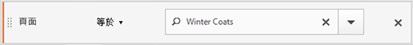

# 區段容器

區段會設定條件，以根據訪客的屬性或與網站的互動來篩選訪客。 若要在區段中設定條件，您必須設定規則，以依據訪客特性和/或導覽特徵來篩選訪客。若要進一步劃分訪客資料，您可以根據每個訪客的特定造訪和/或頁面檢視點擊進行篩選。「區段產生器」提供簡易的架構，您能以巢狀內嵌、階層的「訪客」、「造訪」或「點擊」容器形式建立這些子集並套用規則。

區段產生器中採用的容器架構會定義

-  **[!UICONTROL 訪客]** 作為最外層的容器，包含各造訪和頁面檢視的訪客特定整體資料。
-  巢狀 **[!UICONTROL 造訪]** 容器可讓您設定規則，以根據瀏覽來劃分訪客的資料，並且
-  巢狀 **[!UICONTROL 點選]** 容器可讓您根據個別頁面檢視來劃分訪客資訊。

每個容器均可讓您根據訪客的記錄和依瀏覽劃分的互動來進行報告，或是劃分個別點擊。

<table style="table-layout: fixed; border: none;">

<tr>
<td style="background-color: #FFFFFF; border: 0; " colspan="5">
</tr>

<tr style="border: none;">
<td style="background-color: #FFFFFF; border: 0;"></td>
<td style="background-color: #E5E4E2;" colspan="3" width="200" height="100"> 訪客</td>
<td></td>
</tr>

<tr>
<td></td>
<td style="background-color: #E5E4E2;" width="200"></td>
<td style="background-color: #D3D3D3;" colspan="2" width="200" height="100"> 瀏覽</td>
<td></td>
</tr>

<tr>
<td></td>
<td style="background-color: #E5E4E2;" width="200" height="100"></td>
<td style="background-color: #D3D3D3;" width="200" height="100"></td>
<td style="background-color: #C0C0C0;" width="200" height="100" colspan="1"> 點擊</td>
<td></td>
</tr>

<tr>
<td colspan="5">
<tr>
</table>


以下是區段容器的影片概觀：

>[!VIDEO](https://video.tv.adobe.com/v/25401/?quality=12)

## 訪客容器

「訪客」容器包含訪客在指定時間範圍內的每次造訪和頁面檢視。「訪客」層級的區段會傳回符合條件的頁面，加上訪客檢視的所有其他頁面 (並且僅限於定義的日期範圍)。「訪客」容器是定義範圍最廣的容器，在此層級產生的報表會傳回所有造訪的頁面檢視，且可讓您產生多造訪分析。 因此，根據定義的日期範圍，訪客容器最容易變更。

「訪客」容器可以包含以訪客整體歷史記錄為基礎的值：

- 首次購買間隔天數
- 原始登入頁面
- 原始反向連結網域

## 「造訪」容器

「瀏覽」容器可讓您識別特定 Web 工作階段的頁面互動、促銷活動或轉換。造訪層級的區段會傳回符合條件的頁面，以及所有被視為造訪工作階段一部分的其他頁面（且僅受定義的日期範圍限制）。 造訪容器是最常使用的容器，因為它會在符合規則時擷取整個造訪工作階段的行為。 造訪容器可讓您定義在建立和套用區段時要包含或排除的造訪。 它可以幫助您解惑，像是有多少個訪客在同次瀏覽中檢視了「新聞與體育」區段？或是，成功的銷售是來自哪些頁面？

「瀏覽」容器包括以每次瀏覽的出現次數為基礎的值：

- 訪問次數
- 登入頁面
- 回訪頻度
- 參與率量度
- 線性配置的量度

## 點擊容器

「點擊」容器定義您要在區段中納入或排除的頁面點擊。「點選」容器是可用容器中最窄的一個，可讓您識別條件為真的特定點按和頁面檢視。 您可以檢視單一追蹤程式碼，或隔離網站特定區段內的行為。 您可能也想要找出動作發生時的特定值 (例如提出訂單時所用的行銷管道)。

「點擊」容器包含以單一頁面劃分為基礎的值：

- 產品
- 清單 Prop
- eVar 清單
- 促銷 eVar (在事件的範圍中)

   >[!NOTE]
   >
   >如果您對持續存在的值（例如evar）使用此容器，則會提取該值持續存在的每次點選。 如果追蹤程式碼在一週後過期，該值可跨多次造訪持續存在。

## 邏輯群組容器

邏輯群組容器可讓您在區段規則中提供個別容器，用以不依據階層篩選實體。例如，您可能會想在區段中提供嵌套的容器，用以依據訪客篩選。此型別的邏輯需要您中斷階層（因為您已使用頂層訪客容器）以僅篩選選取的訪客。 另請參閱 [邏輯群組範例](/help/components/segmentation/segmentation-workflow/seg-sequential-build.md) 以取得其他資訊。

## 巢狀容器 {#nest-containers}

在其他容器內建立區段容器時，其實是在區段內建立區段。對巢狀內嵌的容器使用的邏輯如下：

1. 使用最外層的容器，判斷包含的是什麼資料。不符合此外層規則的資料將在劃分的報表中遭到捨棄。
1. 套用巢狀內嵌的規則至其餘資料。巢狀內嵌的規則「不會」套用至第一個規則所排除的任何點擊。
1. 重複此動作，直到計算了所有巢狀內嵌的容器規則為止。然後，留下的資料便會納入到產生的報表中。

您可以在容器之間或容器內的規則之間使用巢狀。 以下是您可以在每個容器中巢狀內嵌的項目：

| 容器名稱 | 您可以在其內巢狀內嵌的項目 |
|---|---|
| 點擊 | 僅限「事件」 |
| 瀏覽 | 「點擊」容器、「事件」 |
| 訪客 | 「瀏覽」容器、「點擊」容器、「事件」 |
| 邏輯群組中 | 「訪客」容器、「瀏覽」容器、「點擊」容器 |

### 在單一定義中納入多個容器

您可以將多個區段納入到新的複合區段中，以再進一步調整資料。將兩個現有區段一起拖曳，等於是在指定篩選訪客時要使用「OR」陳述式。所有資料都會受到畫布中所有容器的檢查，而任何符合容器的資料都會納入到報表中。

例如，將「國家」=「美國」的「瀏覽」容器與「訂購」=「True」的「瀏覽」容器一起拖曳、

```
Country = United States + Order = True
```

會建立行為順序如下的區段：

1. 此區段會先查看您整個資料，找出美國境內的所有訪客。
2. 然後，區段會再次檢視您的所有資料，搜尋以檢視是否有任何訪客下訂單。
3. 最後，這兩組資料都會套用至報表。

## 循序區段的容器 {#containers-sequential}

循序劃分運用的是相同的基本容器，包括依階層巢狀內嵌的[!UICONTROL 訪客]、[!UICONTROL 瀏覽]和[!UICONTROL 點擊] (包括頁面檢視或其他維度)。

<table style="table-layout:fixed;">
<tr>
<td style="background-color: #FFFFFF; " colspan="5">
<tr>
<tr style="border: 0;">
<td style="background-color: #FFFFFF; border: 0;"></td>
<td style="background-color: #E5E4E2;" colspan="3" width="200" height="100"> 訪客</td>
<td></td>
</tr>
<tr>
<td></td>
<td style="background-color: #E5E4E2;" width="200"></td>
<td style="background-color: #D3D3D3;" colspan="2" width="200" height="100"> 瀏覽</td>
<td></td>
</tr>
<tr>
<td></td>
<td style="background-color: #E5E4E2;" width="200" height="100"></td>
<td style="background-color: #D3D3D3;" width="200" height="100"></td>
<td style="background-color: #C0C0C0;" width="200" height="100" colspan="1"> 點擊</td>
<td></td>
</tr>
<tr>
<td colspan="5">
<tr>
</table>


[!UICONTROL 訪客]是循序劃分中最高順序的容器，而[!UICONTROL 訪客]中包含[!UICONTROL 瀏覽]、[!UICONTROL 訪客]或[!UICONTROL 瀏覽]容器中包含[!UICONTROL 點擊]。必須維護這種[容器階層](/help/components/segmentation/seg-overview.md#section_7FDF47B3C6A94C38AE40D3559AFFAF70)，才能建立順序良好的循序區段。

**若要建立循序區段**，請使用 [!UICONTROL THEN]`true` 運算子將容器巢狀內嵌並以循序邏輯連結起來，此作業要求每個容器根據訪客次序都為 

<table style="table-layout:fixed;">
<tr>
<td style="background-color: #FFFFFF; " colspan="5">
<tr>
<tr style="border: 0;">
<td style="background-color: #FFFFFF; border: 0;"></td>
<td style="background-color: #E5E4E2;" colspan="3" width="200" height="100"> 訪客</td>
<td></td>
</tr>
<tr>
<td></td>
<td style="background-color: #E5E4E2;" width="200"></td>
<td style="background-color: #D3D3D3;" colspan="2" width="200" height="100"> 瀏覽</td>
<td></td>
</tr>
<tr>
<td></td>
<td style="background-color: #E5E4E2;" width="200" height="100"></td>
<td style="background-color: #D3D3D3;" width="200" height="100"></td>
<td style="background-color: #C0C0C0;" width="200" height="100" colspan="1"> 點擊</td>
<td></td>
</tr>
<tr><td ></td><td style="background-color: #E5E4E2;"></td><td colspan="2">THEN</td></td><td></td></tr>
<tr>
<td></td>
<td style="background-color: #E5E4E2;" width="200"></td>
<td style="background-color: #D3D3D3;" colspan="2" width="200" height="100"> 造訪數</td>
<td></td>
</tr>
<tr>
<td></td>
<td style="background-color: #E5E4E2;" width="200" height="100"></td>
<td style="background-color: #D3D3D3;" width="200" height="100"></td>
<td style="background-color: #C0C0C0;" width="200" height="100" colspan="1"> 點擊</td>
<td></td>
</tr>
<tr>
<td colspan="5">
<tr>
</table>


此容器階層的唯一例外是使用 [邏輯群組容器](/help/components/segmentation/segmentation-workflow/seg-sequential-build.md). [!UICONTROL 邏輯群組]容器可讓您不依順序在容器內巢狀內嵌點擊，不依順序擷取事件和維度。

<table style="table-layout:fixed;">
<tr>
<td style="background-color: #FFFFFF; " colspan="5">
<tr>
<tr style="border: 0;">
<td style="background-color: #FFFFFF; border: 0;"></td>
<td style="background-color: #E5E4E2;" colspan="3" width="200" height="100"> 訪客</td>
<td></td>
</tr>
<tr>
<td></td>
<td style="background-color: #E5E4E2;" width="200"></td>
<td style="background-color: #D3D3D3;" colspan="2" width="200" height="100"> 瀏覽</td>
<td></td>
</tr>
<tr>
<td></td>
<td style="background-color: #E5E4E2;" width="200" height="100"></td>
<td style="background-color: #D3D3D3;" width="200" height="100"></td>
<td style="background-color: #C0C0C0;" width="200" height="100" colspan="1"> 點擊</td>
<td></td>
</tr>
<tr><td ></td><td style="background-color: #E5E4E2;"></td><td colspan="2">THEN</td></td><td></td></tr>
<tr>
<td></td>
<td style="background-color: #E5E4E2;" width="200"></td>
<td style="background-color: #D3D3D3;" colspan="2" width="200" height="100"> 群組</td>
<td></td>
</tr>
<tr>
<td></td>
<td style="background-color: #E5E4E2;" width="200" height="100"></td>
<td style="background-color: #D3D3D3;" width="200" height="100"></td>
<td style="background-color: #C0C0C0;" width="200" height="100" colspan="1"> 點擊</td>
<td></td>
</tr>
<tr>
<td></td>
<td style="background-color: #E5E4E2;" width="200" height="100"></td>
<td style="background-color: #D3D3D3;" width="200" height="100"></td>
<td style="background-color: #C0C0C0;" width="200" height="100" colspan="1"> 造訪數</td>
<td></td>
</tr>
<tr>
<td colspan="5">
<tr>
</table>


## 以容器資料為基礎的報表 {#reports}

容器可讓您根據報表值，用不同方式篩選不同的資料，以劃分區段並將區段套用至報表。

在「訪客」>「瀏覽」>「點擊」容器階層的每個層級擷取的資料都會影響您建立區段的情形。如果您使用相同的資料集，將相同的區段套用至相同的報表，會根據產生報表的容器獲得不同的值。 容器報告層級和點選之間值的持續性等因素可能意味著報告準確性會發生重大變化。

### 容器資料基本概念 {#container-data}

例如，下圖中的訪客第一次瀏覽某個網站；他進到首頁後，瀏覽了另外三個頁面，然後與網站完成了一筆銷售。這位訪客後來又瀏覽一次這個網站，但這次是先進到「產品」頁面，然後進到「首頁」、回到「產品」頁面，最後在查看「冬季帽子」後關閉工作階段。根據為區段每個容器擷取的資料，報表中會顯示不同的值。

以下的&#x200B;*頁面等於冬季外套*&#x200B;區段會套用到&#x200B;**頁面報表**。



根據所選容器的不同，報表顯示的結果也會不同。

<table style="table-layout:fixed;">
<tr>
<td style="background-color: #FFFFFF; " colspan="7">
</tr>
<tr>
<td></td>
<td style="background-color: #E5E4E2;"></td>
<td style="background-color: #E5E4E2;"colspan="5"><b>造訪1</b></td>
</tr>
<tr>
<tr style="border: 0;">
<td style="background-color: #FFFFFF; border: 0;"></td>
<td style="background-color: #E5E4E2;">

</td>
<td style="background-color: #FFFFFF; "><br/>首頁</td>
<td style="background-color: #FFFFFF;"><br/>冬季服飾</td>
<td style="background-color: #FFFFFF;"><br/>Winter Coat</td>
<td style="background-color: #FFFFFF;"><br/>購買$100</td>
<td></td>
</tr>
<tr>
<td colspan="7">
</tr>
<tr>
<td></td>
<td style="background-color: #E5E4E2;"></td>
<td style="background-color: #E5E4E2;"colspan="5"><b>造訪2</b></td>
</tr>
<tr>
<tr style="border: 0;">
<td style="background-color: #FFFFFF; border: 0;"></td>
<td style="background-color: #E5E4E2;">

</td>
<td style="background-color: #FFFFFF; "><br/>冬季服飾</td>
<td style="background-color: #FFFFFF;"><br/>冬季靴子</td>
<td style="background-color: #FFFFFF;"><br/>冬季服飾</td>
<td style="background-color: #FFFFFF;"><br/>冬季帽子</td>
<td></td>
</tr>
<tr>
<td colspan="7">
</tr>
</table>


### 從點擊容器建立報表

當此條件是位在「點擊」容器內時，報表只會列出&#x200B;*頁面 = 冬季外套*&#x200B;的頁面。因為此條件是位在只有一個頁面的容器中，而只有一個頁面符合此條件，所以只會顯示「冬季外套」頁面。

| 頁面 | 頁面檢視次數 |
|---|--:|
| Winter Coat | 1 |


從「點選」容器建立報表時，您可以檢視不同容器的報表如何影響整體報表值。 檢視區段報表，請注意頁面檢視約略等同於造訪（約2,000名訪客在造訪中看到重複頁面，相較於頁面檢視總數有所增加）。不重複訪客數約等於造訪次數（約2,000位不重複訪客造訪多次）。


>[!IMPORTANT]
>
>在此範例中，無論您以何種方式檢視資料（從「點選」、「造訪」或「訪客」容器），它們的訪客數都相同，為63,541。 無論您如何產生報表，初始訪客條件（已檢視Winter Coats頁面的訪客）保持不變。 不同的是您在不同層級報告的資料子集。

### 從造訪容器建立報表

如果此相同條件是位在「瀏覽」容器內，報表會列出在令&#x200B;*頁面等於冬季外套*&#x200B;成立的瀏覽中檢視的所有頁面。如此會篩選「冬季外套」頁面，但也會擷取在令此條件成立的瀏覽中查看的所有其他頁面。由於訪客也在造訪中造訪了首頁、產品和購買頁面，所以當使用訪客容器資料報告時，這些額外的頁面會列在報告中。

| 頁面 | 頁面檢視次數 |
|---|--:|
| 首頁 | 1 |
| 產品 | 1 |
| Winter Coat | 1 |
| 購買 | 1 |


從「瀏覽」容器顯示區段值後可發現，頁面檢視次數已顯著增加。此增加是因為來自瀏覽容器的報告會識別符合條件的所有頁面，以及在瀏覽中檢視的所有其他頁面（以及在每個瀏覽容器中擷取的所有頁面檢視）。


### 從訪客容器建立報表

如果此相同條件是位在「訪客」容器內，報表會列出任何令&#x200B;*頁面等於冬季外套*&#x200B;成立的訪客所檢視的所有頁面。此條件表示，如果訪客檢視了「冬季外套」頁面，則會列出「訪客」容器中的所有頁面（包括其他造訪中的頁面檢視）。 因此，不符合條件的頁面也會列在報表中，因為訪客先前已檢視這些頁面。 「訪客」容器中的所有頁面都會列在報表中，即使先前發生且未明確符合條件亦然。

| 造訪1<br/>頁面 | <br/>頁面檢視次數 |
|---|--:|
| 首頁 | 1 |
| 冬季服飾 | 1 |
| Winter Coat | 1 |
| 購買 | 1 |

| 造訪2<br/>頁面 | <br/>頁面檢視次數 |
|---|--:|
| 冬季服飾 | 2 |
| 冬季靴子 | 1 |
| 冬季帽子 | 1 |

| 造訪1 +造訪2<br/>頁面 | <br/>頁面檢視次數 |
|---|--:|
| 冬季服飾 | 3 |
| 首頁 | 1 |
| Winter Coat | 1 |
| 購買 | 1 |
| 冬季靴子 | 1 |
| 冬季帽子 | 1 |


從「訪客」容器的區段後可發現，「頁面檢視」和「瀏覽」次數已增加。增加的原因是，從訪客層級來看，如果訪客僅造訪過一次冬季外套頁面（將條件設為true），則系統會為該訪客擷取所有其他頁面檢視和所有其他造訪。


總而言之，了解劃分對各種資料劃分的作用方式，是正確解讀所傳回資料的關鍵。

## 根據容器建立報表 {#reporting}

每個區段資料劃分皆各自有套用的範圍。多數的劃分是以&#x200B;*頁面檢視*&#x200B;為基礎，但許多寶貴區段是以&#x200B;*造訪*&#x200B;容器為基礎，有些則是以&#x200B;*訪客*&#x200B;容器為基礎。根據容器的範圍來了解報表很重要。

使用 *頁面=冬季外套* 區段範例，以下是此區段結果的範例，根據是容器資料的應用方式以及資料範圍符合區段型別的方式。

### 依據相符區段規則建立的區段容器

對自然範圍的資料套用區段容器，可在行項目符合區段規則時帶來預期結果。

- **頁面等於「冬季外套」時的點擊容器***：檢視具有此區段的頁面報表只會傳回等於「冬季外套」的值。*&#x200B;所有其他頁面則會從報表中排除。
- **登入頁面等於「冬季服飾」時的瀏覽容器***：使用此區段檢視登入頁面報表只會傳回第二次瀏覽，因為其登入頁面符合區段規則。*
- **瀏覽次數等於 1 時的瀏覽容器**：檢視第一次瀏覽中的「瀏覽全部」頁面檢視會納入到報表中，因為其符合區段規則。

### 瀏覽容器層級的頁面檢視

許多區段規則都會識別每次瀏覽的頁面檢視數。發生此識別時，如果只有單一點選符合規則，則會套用整個訪客容器。 此區段報表格外寶貴，因為以瀏覽為基礎的頁面檢視，可提供以每次瀏覽的頁面檢視數為基礎的分析。

- **頁面等於「冬季外套」頁面時的瀏覽容器**：「訪客」容器層級的「頁面」報表中會針對檢視了「冬季服飾」頁面的瀏覽，顯示這幾次瀏覽中的所有頁面檢視。如果有頁面符合區段規則，則與該次瀏覽關聯的所有頁面檢視都會納入到報表中。
- **頁面等於「首頁」頁面的瀏覽容器**：在含有此區段的「頁面」報表中，只會顯示第一次造訪的資料，因為訪客在第二次造訪時並未檢視「首頁」頁面。
- **頁面等於「冬季服飾」時的訪客容器**：在「頁面」報表中，此區段會擷取這兩次瀏覽的所有資料，因為在這兩次瀏覽中，訪客都檢視了「冬季服飾」頁面。

### 區段容器識別比頁面檢視還小的點擊

使用容器比劃分範圍還小的區段會傳回未預期的資料。使用較小的劃分仍會提取該資料範圍中的所有點擊。

- **登入頁面等於產品頁面時的點擊容器**：每個頁面皆與該次瀏覽的登入頁面關聯，形成以瀏覽為基礎的劃分。使用此區段不僅會拉入登入頁面「產品頁面」，也會拉入該次造訪的所有點選。
- **清單 Var 1 包含 ValueA 時的點擊容器**：如果已有多個值定義於與清單 Var 相同的點擊上，則所有變數值都會納入到區段中。您無法將發生在同次頁面檢視中的值再做區分，因為「點擊」容器是劃分點擊時的最小區段容器。
- **頁面等於「購買」時的點擊容器**：如果以頁面檢視作為量度，則只會顯示「購買」頁面 (如預期)。如果使用「收入參與率」報表，則第一次瀏覽中的所有頁面都會得到 $100，因為參與率量度是以瀏覽為基礎。
- **頁面等於「冬季外套」時的點擊容器**：如果以頁面檢視作為量度，則只會顯示「冬季外套」頁面 (如預期)。如果使用「收入參與率」報表，則沒有頁面會得到評價，因為此維度需要永久性維度。實際上發生購買的頁面檢視 (「購買」頁面) 不會納入到「點擊」容器中，因此沒有項目會得到收入參與值。不過，從「瀏覽」容器執行報表則會納入該次瀏覽中的所有頁面檢視，並將收入參與值 ($100) 分散給工作階段中檢視的所有頁面。

## 跨容器的持續存在性 {#persistence}

依跨某個範圍頁面持續存在的維度(例如促銷活動eVar或反向連結維度)進行篩選，會影響在容器層級收集的資料，且必須瞭解報表的準確性。

區段資料可能因維度或所套用的變數在所有所選頁面上的持續存在性而有所不同。有些維度 (例如「頁面」維度) 會在頁面層級提供唯一值，而且會根據「點擊」容器中的資料受到篩選。(請參閱[以容器資料為基礎的報表](/help/components/segmentation/seg-overview.md)範例)。其他維度 (例如「反向連結網域」維度) 則會在同次瀏覽的多個頁面上持續存在。有些維度或套用的變數 (例如「瀏覽期間」) 則會跨訪客的整個歷史記錄。


與「頁面」維度相反，「反向連結網域」值會附加至此次瀏覽中的每個頁面。例如，以下訪客是從某個網站轉來首頁。因此，該次造訪內的所有頁面都會被指派相同的反向連結網域值。

以下的&#x200B;*反向連結網域等於 aol.com* 的區段會套用至&#x200B;**頁面報表**。

<table style="table-layout:fixed;">
<tr>
<td style="background-color: #FFFFFF; " colspan="7">
</tr>
<tr>
<td></td>
<td style="background-color: #E5E4E2;"></td>
<td style="background-color: #E5E4E2;"colspan="5"><b>造訪1</b></td>
</tr>
<tr>
<tr style="border: 0;">
<td style="background-color: #FFFFFF; border: 0;"></td>
<td style="background-color: #E5E4E2;">
<br/>aol.com
</td>
<td style="background-color: #FFFFFF; "><br/>首頁</td>
<td style="background-color: #FFFFFF;"><br/>冬季服飾</td>
<td style="background-color: #FFFFFF;"><br/>Winter Coat</td>
<td style="background-color: #FFFFFF;"><br/>購買$100</td>
<td></td>
</tr>
<tr>
<td colspan="7">
</tr>
<tr>
<td></td>
<td style="background-color: #E5E4E2;"></td>
<td style="background-color: #E5E4E2;"colspan="5"><b>造訪2</b></td>
</tr>
<tr>
<tr style="border: 0;">
<td style="background-color: #FFFFFF; border: 0;"></td>
<td style="background-color: #E5E4E2;">
<br/>weather.com
</td>
<td style="background-color: #FFFFFF; "><br/>冬季服飾</td>
<td style="background-color: #FFFFFF;"><br/>冬季靴子</td>
<td style="background-color: #FFFFFF;"><br/>冬季服飾</td>
<td style="background-color: #FFFFFF;"><br/>冬季帽子</td>
<td></td>
</tr>
<tr>
<td colspan="7">
</tr>
</table>

<!---->

在新瀏覽中，訪客是從另一個網站轉過來。因此，新造訪中的所有頁面都會為每個頁面檢視指派新的反向連結網域值。

### 從點擊容器建立報表

因為同次瀏覽中的所有頁面檢視都獲派相同的反向連結網域值，所以在&#x200B;*反向連結網域 = &quot;aol.com&quot;* 的「點擊」容器層級建立報表，將會傳回下表所列的所有頁面。

| 反向連結網域= &#39;aol.com&#39; | 頁面檢視次數 |
|----|---:|
| 首頁 | 1 |
| 冬季服飾 | 1 |
| Winter Coat | 1 |
| 購買 | 1 |


根據「點擊」容器中的資料，32,000 個訪客在 33,000 次造訪中進行了 92,000 次的頁面檢視。平均起來，每次瀏覽中進行了三次頁面檢視，而幾乎所有瀏覽都不是由重複的訪客進行。


### 從造訪容器建立報表

如果「瀏覽」容器中篩選了相同的條件來建立「頁面」報表，則會列出瀏覽中所有&#x200B;*反向連結網域 = &quot;aol.com&quot;* 的頁面。因為反向連結網域的值是在瀏覽層級設定，所以「頁面檢視」和「瀏覽」層級的報表會相同。

| 反向連結網域= &#39;aol.com&#39; | 頁面檢視次數 |
|----|---:|
| 首頁 | 1 |
| 冬季服飾 | 1 |
| Winter Coat | 1 |
| 購買 | 1 |


由於所有頁面的造訪反向連結網域值都相同，因此「造訪」容器層級的報表與「頁面檢視」容器的報表（幾乎）相同。 由於資料異常，稍微有些偏移（98,234對98,248）。


### 從訪客容器建立報表

從「訪客」容器得到的「頁面」報表會列出任何令&#x200B;*反向連結網域等於 &quot;aol.com&quot;* 成立的訪客所檢視的所有頁面。因此，如果訪客擁有 *&quot;aol.com&quot;* 在歷史記錄中的任何時候（在定義的時間段內），都會將訪客容器中的所有頁面（包括其他造訪中的頁面檢視）列為反向連結網域。 即使不符合主要條件的頁面也會列在報表中，因為這些頁面包含在「訪客」容器中。 「訪客」容器中的所有頁面都會列在報表中，即使這些頁面先前已發生且未特別符合條件。

就「反向連結網域」報表而言，在四個頁面檢視中，*反向連結網域 = &quot;aol.com&quot;* 成立，但在訪客點擊的其他頁面中，*反向連結網域 = &quot;weather.com&quot;* 成立。從「訪客」容器中，您會得到「aol.com」為true的訪客清單。但它也會提供反向連結網域為「weather.com」的頁面，而不是符合區段中初始請求的值。

| 造訪1<br/>反向連結網域= &#39;aol.com&#39; | <br/>頁面檢視次數 |
|----|---:|
| 首頁 | 1 |
| 冬季服飾 | 1 |
| Winter Coat | 1 |
| 購買 | 1 |

| 造訪2<br/>反向連結網域= &#39;weather.com&#39; | <br/>頁面檢視次數 |
|----|---:|
| 冬季服飾 | 2 |
| Winter Coat | 1 |
| 購買 | 1 |

| 訪客容器<br/>反向連結網域= &#39;aol.com&#39; | 頁面檢視次數 |
|----|---:|
| 冬季服飾<br/>反向連結網域= &#39;aol.com&#39; | 1 |
| 冬季服飾<br/>反向連結網域= &#39;weather.com&#39; | 1 |
| 首頁 <br/>反向連結網域= &#39;aol.com&#39; | 1 |
| Winter Coat <br/>反向連結網域= &#39;aol.com&#39; | 1 |
| 購買<br/>反向連結網域= &#39;aol.com&#39; | 1 |
| 冬季靴子<br/>反向連結網域= &#39;weather.com&#39; | 1 |
| 冬季帽子<br/>反向連結網域= &#39;weather.com&#39; | 1 |


當您檢視「訪客」容器中的資料時，可發現頁面檢視次數已明顯增加 (從 98,248 增加到 112, 925)。此增加是因為已列出訪客的所有頁面檢視（包括在「訪客」容器層級儲存至的其他反向連結網域值的頁面）。 以及該訪客的其他造訪次數，使造訪次數從33,203次增加到43,448次。


## 摘要

- 「訪客」容器會傳回訪客看見且至少有一個頁面符合條件的所有頁面。 因此，如果某個頁面只在第1天的造訪1中出現，則訪客跨多次造訪檢視的所有頁面都會納入資料中。
- 「造訪」容器會傳回造訪中檢視的所有頁面，其中至少有一個頁面符合條件。 因此，如果只有在第 1 天的第 1 次瀏覽查看某個頁面，則在該整次瀏覽中檢視的所有頁面都會加到資料中。
- 請留意，您用來劃分割槽段的條件應以某個eVar或其他型別的永久性變數為依據。 例如，您可能會使用「where campaign contains email」條件，而此條件會在七天後過期。 因此，如果促銷活動設定在首次造訪，則會再持續七天。 即使行銷活動只設定在首次造訪時，每次造訪都會包括在內。 也會包含其他造訪（只要它們位於報表的日期範圍內）。 如果您不想納入永久性值，請使用「instance of」事件或同等的 Prop 變數 (如有)。
