# 區段容器

區段會設定條件，以依據訪客的屬性或訪客與網站的互動來篩選訪客。若要在區段中設定條件，您必須設定規則，以依據訪客特性和/或導覽特徵來篩選訪客。若要進一步劃分訪客資料，您可以根據每個訪客的特定造訪和/或頁面檢視點擊進行篩選。「區段產生器」提供簡易的架構，您能以巢狀內嵌、階層的「訪客」、「造訪」或「點擊」容器形式建立這些子集並套用規則。

「區段產生器」中採用的容器架構將

-  **[!UICONTROL 訪客]**&#x200B;定義為最外層的容器，內含各造訪和頁面檢視的訪客特定整體資料。
-  一個巢狀的&#x200B;**[!UICONTROL 造訪次數]**&#x200B;容器可讓您設定規則，以根據造訪次數來劃分訪客的資料，且
- 一個巢狀的&#x200B;**[!UICONTROL 點擊]**&#x200B;容器可讓您根據頁面檢視/點擊來劃分訪客的資料。

每個容器均可讓您根據訪客的記錄和依造訪劃分的互動來進行報告，或是劃分個別點擊。

<table style="table-layout: fixed; border: none;">

<tr>
<td style="background-color: #E5E4E2;" colspan="3" width="200" height="100"> 訪客</td>
</tr>

<tr>
<td style="background-color: #E5E4E2;" width="200"></td>
<td style="background-color: #D3D3D3;" colspan="2" width="200" height="100"> 造訪</td>
</tr>

<tr>
<td style="background-color: #E5E4E2;" width="200" height="100"></td>
<td style="background-color: #D3D3D3;" width="200" height="100"></td>
<td style="background-color: #C0C0C0;" width="200" height="100" colspan="1"> 點擊</td>
</tr>
</table>

<!--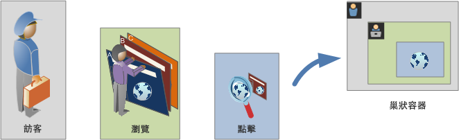-->

以下是區段容器的影片概觀：

>[!VIDEO](https://video.tv.adobe.com/v/25401/?quality=12)

## 訪客容器

「訪客」容器包含訪客在指定時間範圍內的每次造訪和頁面檢視。「訪客」層級的區段會傳回符合條件的頁面，加上訪客檢視的所有其他頁面 (並且僅限於定義的日期範圍)。「訪客」容器是定義範圍最廣的容器，在此層級產生的報告會傳回所有造訪中的頁面檢視，而可讓您進行多造訪分析。因此，「訪客」容器最容易隨定義的日期範圍而發生變更。

「訪客」容器可以包含以訪客整體歷史記錄為基礎的值：

- 首次購買間隔天數
- 原始登入頁面
- 原始反向連結網域

## 「造訪」容器

「造訪」容器可讓您識別特定 Web 工作階段的頁面互動、促銷活動或轉換。「造訪」層級的區段會傳回符合條件的頁面，加上作為造訪工作階段部份的所有其他頁面 (並且僅限於定義的日期範圍)。「造訪」容器是最常使用的容器，因為此容器會在符合規則時擷取整個造訪工作階段的行為。「造訪」容器可讓您定義當建立和套用區段時要納入或排除的造訪。它可以幫助您解惑，像是有多少個訪客在同次造訪中檢視了「新聞與體育」區段？或是，成功的銷售是來自哪些頁面？

「造訪」容器包括以每次造訪的出現次數為基礎的值：

- 造訪次數
- 登入頁面
- 回訪頻度
- 參與率量度
- 線性配置的量度

## 點擊容器

「點擊」容器定義您要在區段中納入或排除的頁面點擊。「點擊」容器是範圍最小的可用容器，可讓您識別令某條件成立的特定點按和頁面檢視。您可以在此過程中檢視單一追蹤代碼或隔離出網站特定區段內的行為。您可能也想要找出動作發生時的特定值 (例如提出訂單時所用的行銷管道)。

「點擊」容器包含以單一頁面劃分為基礎的值：

- 產品
- 清單 Prop
- eVar 清單
- 促銷 eVar (在事件的範圍中)

  >[!NOTE]
  >
  >此容器如果用在持續存在的值 (如 eVar) 上，則會納入該值持續存在於的每個點擊。如果有一週後過期的追蹤代碼，該值可能持續存在於多個造訪之間。

## 邏輯群組容器

邏輯群組容器可讓您在區段規則中提供個別容器，用以不依據階層篩選實體。例如，您可能會想在區段中提供嵌套的容器，用以依據訪客篩選。這種邏輯類型需要中斷階層 (因為您已有頂層訪客容器)，才能僅篩選選定的訪客。請參閱「[邏輯群組範例](/help/components/segmentation/segmentation-workflow/seg-sequential-build.md)」以取得詳細資訊。

## 巢狀容器 {#nest-containers}

在其他容器內建立區段容器時，其實是在區段內建立區段。對巢狀內嵌的容器使用的邏輯如下：

1. 使用最外層的容器，判斷包含的是什麼資料。不符合此外層規則的資料將在劃分的報告中遭到捨棄。
1. 套用巢狀內嵌的規則至其餘資料。巢狀內嵌的規則「不會」套用至第一個規則所排除的任何點擊。
1. 重複此動作，直到計算了所有巢狀內嵌的容器規則為止。然後，留下的資料便會納入到產生的報告中。

>[!NOTE]
>
>當您在區段內巢狀內嵌區段（例如，從「元件」面板將區段拖曳至區段定義上）時，會以拖曳區段規則的副本（而非參照）建立容器。

您可以在容器之間使用巢狀內嵌，並在容器內的規則之間使用巢狀內嵌。以下是您可以在每個容器中巢狀內嵌的項目：

| 容器名稱 | 您可以在其內巢狀內嵌的項目 |
|---|---|
| 點擊 | 僅限「事件」 |
| 造訪 | 「點擊」容器、「事件」 |
| 訪客 | 「造訪」容器、「點擊」容器、「事件」 |
| 邏輯群組中 | 「訪客」容器、「造訪」容器、「點擊」容器 |

### 在單一定義中納入多個容器

您可以將多個區段納入到新的複合區段中，以再進一步調整資料。將兩個現有區段一起拖曳，等於是在指定篩選訪客時要使用「OR」陳述式。所有資料都會受到畫布中所有容器的檢查，而任何符合容器的資料都會納入到報告中。

例如，將「國家」=「美國」的「造訪」容器與「訂購」=「True」的「造訪」容器一起拖曳，

```
Country = United States + Order = True
```

會建立動作順序如下的區段：

1. 此區段會先查看您整個資料，找出美國境內的所有訪客。
2. 然後該區段會再次查看您所有資料，搜尋是否有任何訪客提出訂單。
3. 最後，這兩組資料都會套用至報告。

## 循序區段的容器 {#containers-sequential}

循序劃分運用的是相同的基本容器，包括依階層巢狀內嵌的[!UICONTROL 訪客]、[!UICONTROL 造訪]和[!UICONTROL 點擊] (包括頁面檢視或其他維度)。

<table style="table-layout:fixed; border: none;">

<tr>
<td style="background-color: #E5E4E2;" colspan="3" width="200" height="100"> 訪客</td>
</tr>

<tr>
<td style="background-color: #E5E4E2;" width="200"></td>
<td style="background-color: #D3D3D3;" colspan="2" width="200" height="100"> 造訪</td>
</tr>

<tr>
<td style="background-color: #E5E4E2;" width="200" height="100"></td>
<td style="background-color: #D3D3D3;" width="200" height="100"></td>
<td style="background-color: #C0C0C0;" width="200" height="100" colspan="1"> 點擊</td>
</tr>
</table>

<!---->

[!UICONTROL 訪客]是循序劃分中最高順序的容器，而[!UICONTROL 訪客]中包含[!UICONTROL 造訪]、[!UICONTROL 訪客]或[!UICONTROL 造訪]容器中包含[!UICONTROL 點擊]。必須維護這種[容器階層](/help/components/segmentation/seg-overview.md#section_7FDF47B3C6A94C38AE40D3559AFFAF70)，才能建立順序良好的循序區段。

**若要建立循序區段**，請使用 [!UICONTROL THEN] 運算子將容器巢狀內嵌並以循序邏輯連結起來，此作業要求每個容器根據訪客次序都為 `true`。

<table style="table-layout:fixed; border: none;">

<tr>

<td style="background-color: #E5E4E2;" colspan="3" width="200" height="100"> 訪客</td>
</tr>

<tr>
<td style="background-color: #E5E4E2;" width="200"></td>
<td style="background-color: #D3D3D3;" colspan="2" width="200" height="100"> 造訪</td>
</tr>

<tr>
<td style="background-color: #E5E4E2;" width="200" height="100"></td>
<td style="background-color: #D3D3D3;" width="200" height="100"></td>
<td style="background-color: #C0C0C0;" width="200" height="100" colspan="1"> 點擊</td>
</tr>

<tr>
<td style="background-color: #E5E4E2;"></td><td colspan="2">THEN</td></td>
</tr>

<tr>
<td style="background-color: #E5E4E2;" width="200"></td>
<td style="background-color: #D3D3D3;" colspan="2" width="200" height="100"> 造訪</td>
</tr>

<tr>
<td style="background-color: #E5E4E2;" width="200" height="100"></td>
<td style="background-color: #D3D3D3;" width="200" height="100"></td>
<td style="background-color: #C0C0C0;" width="200" height="100" colspan="1"> 點擊</td>
</tr>
</table>

<!---->

此容器階層的唯一例外是使用[邏輯群組容器](/help/components/segmentation/segmentation-workflow/seg-sequential-build.md)。[!UICONTROL 邏輯群組]容器可讓您不依順序在容器內巢狀內嵌點擊，不依順序擷取事件和維度。

<table style="table-layout:fixed; border: none;">

<tr>
<td style="background-color: #E5E4E2;" colspan="3" width="200" height="100"> 訪客</td>
</tr>

<tr>
<td style="background-color: #E5E4E2;" width="200"></td>
<td style="background-color: #D3D3D3;" colspan="2" width="200" height="100"> 造訪</td>
</tr>

<tr>
<td style="background-color: #E5E4E2;" width="200" height="100"></td>
<td style="background-color: #D3D3D3;" width="200" height="100"></td>
<td style="background-color: #C0C0C0;" width="200" height="100" colspan="1"> 點擊</td>
</tr>

<tr>
<td style="background-color: #E5E4E2;"></td><td colspan="2">THEN</td></td>
</tr>

<tr>
<td style="background-color: #E5E4E2;" width="200"></td>
<td style="background-color: #D3D3D3;" colspan="2" width="200" height="100"> 群組</td>
</tr>

<tr>
<td style="background-color: #E5E4E2;" width="200" height="100"></td>
<td style="background-color: #D3D3D3;" width="200" height="100"></td>
<td style="background-color: #C0C0C0;" width="200" height="100" colspan="1"> 點擊</td>
</tr>

<tr>
<td style="background-color: #E5E4E2;" width="200" height="100"></td>
<td style="background-color: #D3D3D3;" width="200" height="100"></td>
<td style="background-color: #C0C0C0;" width="200" height="100" colspan="1"> 造訪</td>
</tr>

</table>

<!---->

## 以容器資料為基礎的報告 {#reports}

容器可讓您根據報告值，用不同方式篩選不同的資料，以劃分區段並將區段套用至報告。

在「訪客」>「造訪」>「點擊」容器階層的每個層級擷取的資料都會影響您建立區段的情形。如果您使用相同資料集將相同區段套用於相同報告，則根據產生報告時所用容器的不同，您會得到不同的值。容器報告層級以及值跨點擊的持續存在性等因素，都會對報告的準確度產生重大影響。

### 容器資料基本概念 {#container-data}

例如，下圖中的訪客第一次造訪某個網站；他進到首頁後，造訪了另外三個頁面，然後與網站完成了一筆銷售。這位訪客後來又造訪一次這個網站，但這次是先進到「產品」頁面，然後進到「首頁」、回到「產品」頁面，最後在查看「冬季帽子」後關閉工作階段。根據針對區段的每個容器所擷取之資料的不同，報告中也會顯示不同的值。

以下的 `Pages equals Winter Coat` 部分適用於&#x200B;**頁面報告**。


根據所選的容器，報告會為訪客後續造訪和頁面檢視顯示不同的結果。

<table style="table-layout:auto; border: 0;">

<tr>
<td style="background-color: #E5E4E2;"></td>
<td style="background-color: #E5E4E2;" colspan="4"><b>造訪 1</b></td>
</tr>
<tr>
<tr>
<td style="background-color: #E5E4E2;">

</td>
<td style="background-color: #FFFFFF; "><br/>首頁</td>
<td style="background-color: #FFFFFF;"><br/>冬季服裝</td>
<td style="background-color: #FFFFFF;"><br/>冬季大衣</td>
<td style="background-color: #FFFFFF;"><br/>購買 $100</td>
</tr>
<tr>
<td colspan="5">
</tr>
<tr>
<td style="background-color: #E5E4E2;"></td>
<td style="background-color: #E5E4E2;"colspan="4"><b>造訪 2</b></td>
</tr>
<tr>
<tr style="border: 0;">

<td style="background-color: #E5E4E2;">

</td>
<td style="background-color: #FFFFFF; "><br/>冬季服裝</td>
<td style="background-color: #FFFFFF;"><br/>冬季鞋靴</td>
<td style="background-color: #FFFFFF;"><br/>冬季服裝</td>
<td style="background-color: #FFFFFF;"><br/>冬季帽子</td>

</table>


<!--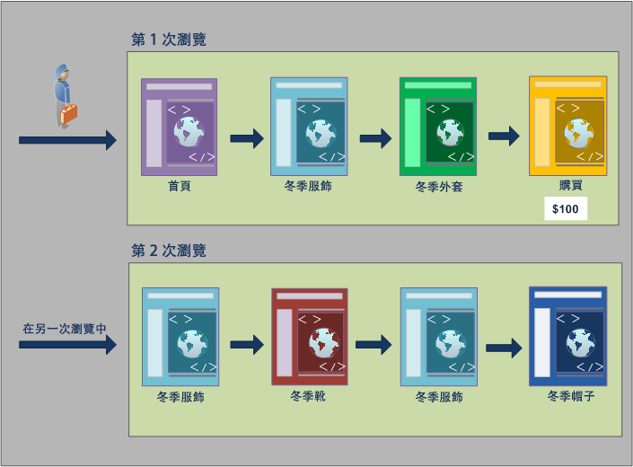-->

### 從點擊容器建立報告

當此條件是位在「點擊」容器內時，報告只會列出&#x200B;*頁面 = 冬季外套*&#x200B;的頁面。因為此條件是位在只有一個頁面的容器中，而只有一個頁面符合此條件，所以只會顯示「冬季外套」頁面。

| 頁面 | 頁面檢視次數 |
|---|--:|
| 冬季大衣 | 1 |

<!--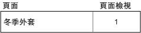-->

從「點擊」容器建立報告時，您可以看見從不同容器建立報告會如何影響整體報告值。檢視區段報告時可發現，頁面檢視次數約等於造訪次數 (約有 2,000 個訪客在單次造訪中查看一樣的頁面，這些相加即得出總頁面檢視次數)同時，不重複訪客約等於造訪次數 (約有 2,000 個獨特訪客造訪超過一次)。

|  | 量度 | # | % |
|---|---|--:|--:|
| | 頁面檢視次數：<br/>檢視次數：<br/>不重複訪客數： | **69,252** (共 351,292)<br/>**67,554** (共 165,175)<br/>**63,541** (共 113,169) | **19%**<br/>**40%**<br/>**56%** |


<!---->

>[!IMPORTANT]
>
>在此範例中，無論您是從「點擊」、「造訪」或「訪客」容器檢視資料，都有相同的訪客數 63,541。無論您如何產生報告，初始的訪客條件 (檢視了「冬季外套」頁面的訪客) 仍保持不變。不同的是您在不同層級報告的資料子集。

### 從「造訪」容器建立報告

如果此相同條件是位在「造訪」容器內，報告會列出在令&#x200B;*頁面等於冬季外套*&#x200B;成立的造訪中檢視的所有頁面。如此會篩選「冬季外套」頁面，但也會擷取在令此條件成立的造訪中查看的所有其他頁面。因為訪客在此次造訪內也造訪了「首頁」、「產品」和「購買」頁面，所以使用「訪客」容器資料建立報告時，這些額外的頁面也會列在報告中。

| 頁面 | 頁面檢視次數 |
|---|--:|
| 首頁 | 1 |
| 產品 | 1 |
| 冬季大衣 | 1 |
| 購買 | 1 |

<!--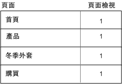-->

從「造訪」容器顯示區段值後可發現，頁面檢視次數已顯著增加。增加是因為從「造訪」容器建立報告會識別出所有符合條件的頁面，以及該次造訪中檢視的所有其他頁面 (每個「造訪」容器中都會擷取所有頁面檢視)。

|  | 量度 | # | % |
|---|---|--:|--:|
| | 頁面檢視次數：<br/>檢視次數：<br/>不重複訪客數： | **226,193** (共 351,292)<br/>**67,554** (共 165,175)<br/>**63,541** (共 113,169) | **64%**<br/>**40%**<br/>**56%** |

<!---->

### 從訪客容器建立報告

如果此相同條件是位在「訪客」容器內，報告會列出任何令&#x200B;*頁面等於冬季外套*&#x200B;成立的訪客所檢視的所有頁面。這個條件表示，如果訪客檢視了「冬季外套」頁面，則「訪客」容器中的所有頁面皆會列出 (包括在別次造訪中檢視的頁面)。因此，不合條件的頁面也會列在報告中，因為訪客先前檢視過這些頁面。報告中會列出「訪客」容器中的所有頁面，即使這些頁面是在先前檢視，而不明確符合條件也是如此。

| 造訪 1<br/>頁面 | <br/>頁面檢視次數 |
|---|--:|
| 首頁 | 1 |
| 冬季服裝 | 1 |
| 冬季大衣 | 1 |
| 購買 | 1 |

| 造訪 2<br/>頁面 | <br/>頁面檢視次數 |
|---|--:|
| 冬季服裝 | 2 |
| 冬季鞋靴 | 1 |
| 冬季帽子 | 1 |

| 造訪 1 + 造訪 2<br/>頁面 | <br/>頁面檢視次數 |
|---|--:|
| 冬季服裝 | 3 |
| 首頁 | 1 |
| 冬季大衣 | 1 |
| 購買 | 1 |
| 冬季鞋靴 | 1 |
| 冬季帽子 | 1 |

<!--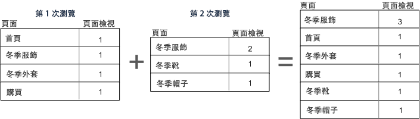-->

從「訪客」容器的區段後可發現，「頁面檢視」和「造訪」次數已增加。增加是因為就訪客層級而言，如果訪客僅造訪「冬季外套」頁面 (令此條件成立) 一次，則該訪客檢視的所有其他頁面和所有別次造訪也都會被擷取。

|  | 量度 | # | % |
|---|---|--:|--:|
| | 頁面檢視次數：<br/>檢視次數：<br/>不重複訪客數： | **240,094** (共 351,292)<br/>**83,823** (共 165,175)<br/>**63,541** (共 113,169) | **68%**<br/>**50%**<br/>**56%** |

<!--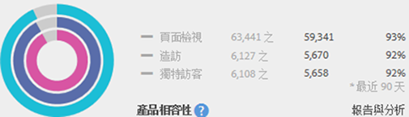-->

總而言之，了解劃分對各種資料劃分的作用方式，是正確解讀所傳回資料的關鍵。

## 根據容器建立報告 {#reporting}

每個區段資料劃分皆各自有套用的範圍。多數的劃分是以&#x200B;*頁面檢視*&#x200B;為基礎，但許多寶貴區段是以&#x200B;*造訪*&#x200B;容器為基礎，有些則是以&#x200B;*訪客*&#x200B;容器為基礎。根據容器的範圍來了解報告很重要。

使用 `Page equals Winter Coats` 區段範例，以下是此區段的結果範例 (根據容器資料的應用方式以及資料範圍如何與區段類型相符)。

### 依據相符區段規則建立的區段容器

對自然範圍的資料套用區段容器，可在行項目符合區段規則時帶來預期結果。

- **頁面等於「冬季外套」時的點擊容器***：檢視具有此區段的頁面報告只會傳回等於「冬季外套」的值。*&#x200B;所有其他頁面則會從報告中排除。
- **登入頁面等於「冬季服飾」時的「造訪」容器***：使用此區段檢視登入頁面報告只會傳回第二次造訪，因為其登入頁面符合區段規則。*
- **造訪次數等於 1 時的「造訪」容器**：檢視第一次造訪中的「造訪全部」頁面檢視會納入到報告中，因為其符合區段規則。

### 「造訪」容器層級的頁面檢視

許多區段規則都會識別每次造訪的頁面檢視數。當這種識別情況發生時，只要有一個點擊符合規則，就會套用整個「訪客」容器。此區段報告格外寶貴，因為以造訪為基礎的頁面檢視，可提供以每次造訪的頁面檢視數為基礎的分析。

- **頁面等於「冬季外套」頁面時的「造訪」容器**：「訪客」容器層級的「頁面」報告中會顯示這幾次造訪的所有頁面檢視，其中包含「冬季服飾」頁面的檢視。如果有頁面符合區段規則，則與該次造訪關聯的所有頁面檢視都會納入到報告中。
- **頁面等於「首頁」頁面時的「造訪」容器**：在含有此區段的「頁面」報告中，只會顯示第一次造訪的資料，這是因為訪客在第二次造訪中並未檢視「首頁」頁面。
- **頁面等於「冬季服飾」時的訪客容器**：在「頁面」報告中，此區段會擷取這兩次造訪的所有資料，因為在這兩次造訪中，訪客都檢視了「冬季服飾」頁面。

### 區段容器識別比頁面檢視還小的點擊

使用容器比劃分範圍還小的區段會傳回未預期的資料。使用較小的劃分仍會提取該資料範圍中的所有點擊。

- **登入頁面等於產品頁面時的點擊容器**：每個頁面皆與該次造訪的登入頁面關聯，形成以造訪為基礎的劃分。使用此區段不僅會提取登入頁面「產品頁面」，也會提取該次造訪中的所有點擊。
- **清單 Var 1 包含 ValueA 時的點擊容器**：如果已有多個值定義於與清單 Var 相同的點擊上，則所有變數值都會納入到區段中。您無法將發生在同次頁面檢視中的值再做區分，因為「點擊」容器是劃分點擊時的最小區段容器。
- **頁面等於「購買」時的點擊容器**：如果以頁面檢視作為量度，則只會顯示「購買」頁面 (如預期)。如果使用「收入參與率」報告，則第一次造訪中的所有頁面都會得到 $100，因為參與率量度是以造訪為基礎。
- **頁面等於「冬季外套」時的點擊容器**：如果以頁面檢視作為量度，則只會顯示「冬季外套」頁面 (如預期)。如果使用「收入參與率」報告，則沒有頁面會得到評價，因為此維度需要永久性維度。實際上發生購買的頁面檢視 (「購買」頁面) 不會納入到「點擊」容器中，因此沒有項目會得到收入參與值。不過，從「造訪」容器執行報告則會納入該次造訪中的所有頁面檢視，並將收入參與值 ($100) 分散給工作階段中檢視的所有頁面。

## 跨容器的持續存在性 {#persistence}

依跨某個範圍的頁面上持續存在的維度 (例如「促銷活動」eVar 或「反向連結」維度) 進行篩選，將會影響在容器層級收集的資料；必須先了解這點，才能獲得準確的報告。

區段資料可能因維度或所套用的變數在所有所選頁面上的持續存在性而有所不同。有些維度 (例如「頁面」維度) 會在頁面層級提供唯一值，而且會根據「點擊」容器中的資料受到篩選。(請參閱「[以容器資料為基礎的報告](/help/components/segmentation/seg-overview.md)」範例)。其他維度 (例如「反向連結網域」維度) 則會在同次造訪的多個頁面上持續存在。例如: `Referring Domain equals aol.com`。有些維度或套用的變數 (例如「造訪期間」) 則會跨訪客的整個歷史記錄。

<!--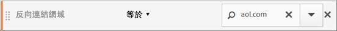-->

與「頁面」維度相反，「反向連結網域」值會附加至此次造訪中的每個頁面。例如，以下訪客是從某個網站轉來首頁。因此，在該造訪內的所有頁面都會獲派相同的反向連結網域值。

以下的 `Referring Domain equals aol.com` 部分適用於 **頁面報告**。

<table style="table-layout:fixed; border: 0;">

<tr>
<td style="background-color: #E5E4E2;"></td>
<td style="background-color: #E5E4E2;" colspan="4"><b>造訪 1</b></td>
</tr>
<tr>
<tr>
<td style="background-color: #E5E4E2;">
<br/>aol.com
</td>
<td style="background-color: #FFFFFF; "><br/>首頁</td>
<td style="background-color: #FFFFFF;"><br/>冬季服裝</td>
<td style="background-color: #FFFFFF;"><br/>冬季大衣</td>
<td style="background-color: #FFFFFF;"><br/>購買 $100</td>
</tr>
<tr>
<td colspan="5">
</tr>
<tr>
<td style="background-color: #E5E4E2;"></td>
<td style="background-color: #E5E4E2;"colspan="4"><b>造訪 2</b></td>
</tr>
<tr>
<tr style="border: 0;">

<td style="background-color: #E5E4E2;">
<br/>weather.com
</td>
<td style="background-color: #FFFFFF; "><br/>冬季服裝</td>
<td style="background-color: #FFFFFF;"><br/>冬季鞋靴</td>
<td style="background-color: #FFFFFF;"><br/>冬季服裝</td>
<td style="background-color: #FFFFFF;"><br/>冬季帽子</td>

</table>

<!--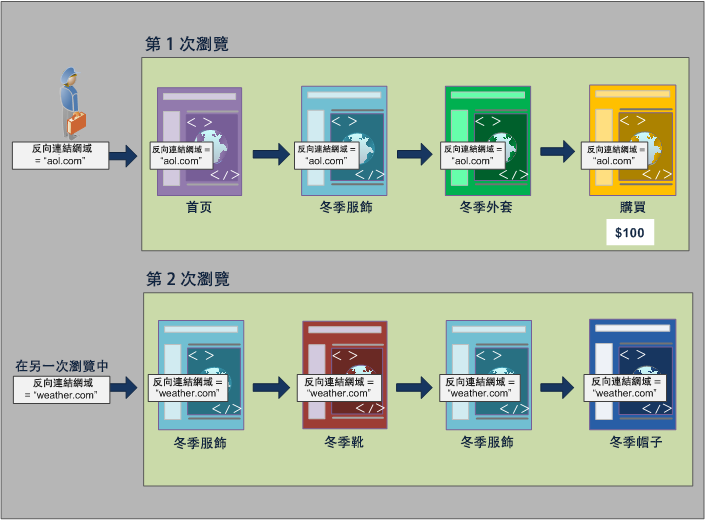-->

在新造訪中，訪客是從另一個網站轉過來。因此，新造訪中所有頁面的每個頁面檢視，都會獲派相同的反向連結網域值。

### 從點擊容器建立報告

因為同次造訪中的所有頁面檢視都獲派相同的反向連結網域值，所以在 `Referring Domain equsls 'aol.com'` 的「點擊」容器層級建立報告，將會傳回下表所列的所有頁面。

| 反向連結網域等於 &#39;aol.com&#39; | 頁面檢視次數 |
|----|---:|
| 首頁 | 1 |
| 冬季服裝 | 1 |
| 冬季大衣 | 1 |
| 購買 | 1 |

<!--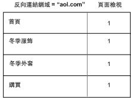-->

根據「點擊」容器中的資料，32,000 個訪客在 33,000 次造訪中進行了 92,000 次的頁面檢視。平均起來，每次造訪中進行了三次頁面檢視，而幾乎所有都是不重複訪客的造訪。

|  | 量度 | # | % |
|---|---|--:|--:|
| | 頁面檢視次數：<br/>檢視次數：<br/>不重複訪客數： | **98,234** (共 351,165)<br/>**33,203** (共 165,173)<br/>**32,269** (共 113,110) | **27%**<br/>**20%**<br/>**28%** |

<!--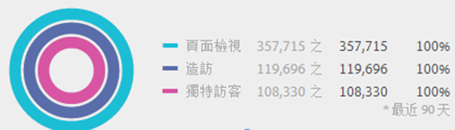-->

### 從「造訪」容器建立報告

如果「造訪」容器中篩選了相同的條件來建立「頁面」報告，則會列出造訪中 `Referring Domain equals 'aol.com'` 立成的頁面。因為反向連結網域的值是在造訪層級設定，所以「頁面檢視」和「造訪」層級的報告會相同。

| 反向連結網域等於 &#39;aol.com&#39; | 頁面檢視次數 |
|----|---:|
| 首頁 | 1 |
| 冬季服裝 | 1 |
| 冬季大衣 | 1 |
| 購買 | 1 |

<!---->

因為根據造訪，所有頁面均具有相同的反向連結網域值，所以從「造訪」容器層級得到的報告與從「頁面檢視」容器得到的報告 (幾乎) 相同。但有稍微差異 (即 98, 234 與 98,248)，這是由於有異常資料的關係

|  | 量度 | # | % |
|---|---|--:|--:|
| | 頁面檢視次數：<br/>檢視次數：<br/>不重複訪客數： | **98,248** (共 351,165)<br/>**33,203** (共 165,173)<br/>**32,269** (共 113,110) | **27%**<br/>**20%**<br/>**28%** |

<!--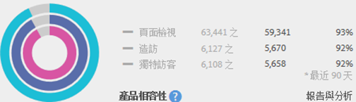-->

### 從訪客容器建立報告

從「訪客」容器得到的「頁面」報告會列出任何 `Referring Domain equals 'aol.com'` 成立的訪客所檢視的所有頁面。因此，如果訪客在歷史記錄中有任何時候 (在定義的時段內) 的反向連結網域是 *&#39;aol.com&#39;*，則會列出「訪客」容器中的所有頁面 (包括別次造訪中的頁面檢視)。「訪客」容器中即使是不符合主要條件的頁面，也會列在報告中。報告中會列出「訪客」容器中的所有頁面，即使這些頁面是在先前檢視，而不明確符合條件也是如此。

就「反向連結網域」報告而言，在四個頁面檢視中 `Referring Domain equals 'aol.com'` 成立，但是但在訪客點擊的其他頁面中  `Referring Domain equals "weather.com"` 成立。從「訪客」容器，您可以取得 &#39;aol.com&#39; 成立的訪客清單，但容器也會提供您反向連結網域為 &quot;weather.com&quot; 的頁面，而非與您在區段中的初始要求相符的值。

| 造訪 1<br/>反向連結網域 &#39;aol.com&#39; | <br/>頁面檢視次數 |
|----|---:|
| 首頁 | 1 |
| 冬季服裝 | 1 |
| 冬季大衣 | 1 |
| 購買 | 1 |

| 造訪 2<br/>反向連結網域 = &#39;weather.com&#39; | <br/>頁面檢視次數 |
|----|---:|
| 冬季服裝 | 2 |
| 冬季大衣 | 1 |
| 購買 | 1 |

| 「訪客」容器<br/>反向連結網域等旗 &#39;aol.com&#39; | 頁面檢視次數 |
|----|---:|
| 冬季服裝<br/>反向連結網域：&#39;aol.com&#39; | 1 |
| 冬季服裝<br/>反向連結網域：“weather.com” | 1 |
| 首頁<br/>反向連結網域：&#39;aol.com&#39; | 1 |
| 冬季大衣 <br/>反向連結網域：&#39;aol.com&#39; | 1 |
| 購買<br/>反向連結網域：&#39;aol.com&#39; | 1 |
| 冬季鞋靴<br/>反向連結網域：“weather.com” | 1 |
| 冬季帽子<br/>反向連結網域：&#39;weather.com&#39; | 1 |


<!--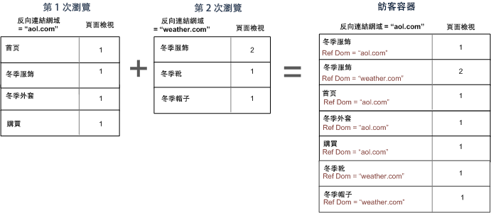-->

當您檢視「訪客」容器中的資料時，可發現頁面檢視次數已明顯增加 (從 98,248 增加到 112, 925)。增加是因為該訪客的所有頁面檢視 (包括在「訪客」容器層級儲存了其他反向連結網域值的頁面檢視) 都已列出。還有該訪客的其他造訪次數，使得造訪次數從 33,203 增加至 43,448。

|  | 量度 | # | % |
|---|---|--:|--:|
| | 頁面檢視次數：<br/>檢視次數：<br/>不重複訪客數： | **112,925** (共 351,165)<br/>**43,448** (共 165,173)<br/>**32,269** (共 113,110) | **32%**<br/>**26%**<br/>**28%** |

<!---->

## 摘要

- 「訪客」容器會針對至少有一個頁面符合準則的訪客，傳回該訪客查看的所有頁面。因此，如果只有在第 1 天的第 1 次造訪查看某個頁面，則訪客在多次造訪中檢視的所有頁面都會加到資料中。
- 「造訪」容器會針對至少有一個頁面符合準則的造訪，傳回該次造訪中查看的所有頁面。因此，如果只有在第 1 天的第 1 次造訪查看某個頁面，則在該整次造訪中檢視的所有頁面都會加到資料中。
- 請注意，您用來分段的基本條件是使用 eVar 或其他類型的永久性變數。例如，您可能會使用「where campaign contains email」條件，而此條件將在七天後到期。因此，促銷活動如果是設在第一次造訪上，則會再持續存在七天。雖然促銷活動只是設定在第一次造訪上，但每次造訪都會被納入。其他造訪也會被納入 (只要它們是在報告的日期範圍中)。如果您不想納入永久性值，請使用「instance of」事件或同等的 Prop 變數 (如有)。
