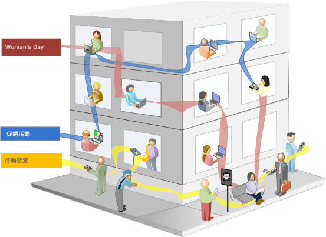

# 關於區段

區段可讓您根據特性或網站互動來識別訪客的子集。細分群體是設計為客群洞察，您可以根據自己的特定需求進行建置，然後驗證、編輯並與其他團隊成員分享，或用於其他 Adobe 產品和 Analytics 功能。

區段是根據使用巢狀容器模式的[!UICONTROL 訪客]、[!UICONTROL 造訪]和[!UICONTROL 點擊]層級階層。巢狀容器可讓您根據容器間和容器內的規則來定義訪客屬性和動作。您可以在 [!DNL Adobe Experience Cloud] 提供的多項產品和功能中，建立、核准、共用、儲存及執行 Analytics 區段。區段可以產生自報告、內建至儀表板報告，或加入書籤供快速存取。

您可以在區段產生器中建立和儲存區段，或從流失報表(在[!UICONTROL Analysis Workspace]中)產生區段。 您也可以根據巢狀內嵌的容器之間的特定規則，運用並擴充預先建立的區段，讓您可以篩選結果並套用至報告。此外，多個區段可作為[堆疊區段](/help/components/segmentation/segmentation-workflow/seg-workflow.md)搭配使用。

區段可識別

- 您的訪客身分 (國家、性別、咖啡店)、
- 他們使用的裝置和服務 (瀏覽器、搜尋引擎、行動裝置)、
- 他們從何處導覽過來 (搜尋引擎、先前的退出頁面、免費搜尋)，
- 還有許多功能。

<!---->

區段可以是根據下列值：

- 根據屬性的訪客：瀏覽器類型、裝置、造訪次數、國家/地區、性別。
- 根據互動的訪客：促銷活動、關鍵字搜尋、搜尋引擎。
- 根據進入和退出的訪客：訪客來自 Facebook、定義的登陸頁面、反向連結網域。
- 根據自訂變數的訪客：表單欄位、定義的類別、客戶 ID。

在區段產生器中建立對象區段時，您會在容器之間使用[!UICONTROL AND]和[!UICONTROL OR]運運算元定義條件。

<table style="table-layout:fixed; border: none;">

<tr>

<td style="background-color: #E5E4E2;" colspan="3" width="200" height="100"> 訪客</td>
</tr>

<tr>
<td style="background-color: #E5E4E2;" width="200"></td>
<td style="background-color: #D3D3D3;" colspan="2" width="200" height="100"> 造訪</td>
</tr>

<tr>
<td style="background-color: #E5E4E2;" width="200" height="100"></td>
<td style="background-color: #D3D3D3;" width="200" height="100"></td>
<td style="background-color: #C0C0C0;" width="200" height="100" colspan="1"> 點擊</td>
</tr>

<tr>
<td style="background-color: #E5E4E2;"></td><td colspan="2">AND</td></td>
</tr>

<tr>
<td style="background-color: #E5E4E2;" width="200"></td>
<td style="background-color: #D3D3D3;" colspan="2" width="200" height="100"> 造訪</td>
</tr>

<tr>
<td style="background-color: #E5E4E2;" width="200" height="100"></td>
<td style="background-color: #D3D3D3;" width="200" height="100"></td>
<td style="background-color: #C0C0C0;" width="200" height="100" colspan="1"> 點擊</td>
</tr>
</table>

<table style="table-layout:fixed; border: none;">

<tr>

<td style="background-color: #E5E4E2;" colspan="3" width="200" height="100"> 訪客</td>
</tr>

<tr>
<td style="background-color: #E5E4E2;" width="200"></td>
<td style="background-color: #D3D3D3;" colspan="2" width="200" height="100"> 造訪</td>
</tr>

<tr>
<td style="background-color: #E5E4E2;" width="200" height="100"></td>
<td style="background-color: #D3D3D3;" width="200" height="100"></td>
<td style="background-color: #C0C0C0;" width="200" height="100" colspan="1"> 點擊</td>
</tr>

<tr>
<td style="background-color: #E5E4E2;"></td><td colspan="2">OR</td></td>
</tr>

<tr>
<td style="background-color: #E5E4E2;" width="200"></td>
<td style="background-color: #D3D3D3;" colspan="2" width="200" height="100"> 造訪</td>
</tr>

<tr>
<td style="background-color: #E5E4E2;" width="200" height="100"></td>
<td style="background-color: #D3D3D3;" width="200" height="100"></td>
<td style="background-color: #C0C0C0;" width="200" height="100" colspan="1"> 點擊</td>
</tr>
</table>

<!---->

這類區段會篩選根據以 [!UICONTROL AND] 和 [!UICONTROL OR] 運算子連結的特性來篩選資料集。

- 您可以[將多個區段套用至報告或專案](/help/components/segmentation/segmentation-workflow/t-seg-apply.md)。
- 區段在所有報告套裝中都通用。
- [區段產生器](/help/components/segmentation/segmentation-workflow/seg-build.md)簡化了區段的建立流程。
- [區段管理員](/help/components/segmentation/segmentation-workflow/seg-manage.md)可讓您使用區段共用、標籤、驗證及核准功能來設定[工作流程](/help/components/segmentation/segmentation-workflow/seg-workflow.md)。
- 您可以[標記區段](/help/components/segmentation/segmentation-workflow/seg-tag.md)來加以組織以供稍後搜尋，而不是透過使用檔案夾的方式。
- 您可以建立[循序區段](/help/components/segmentation/segmentation-workflow/seg-sequential-build.md)。
- 此[!UICONTROL 頁面檢視]容器現在是[!UICONTROL 點擊]容器，表示此容器會將所有類型的資料分段，而不只是頁面檢視。例如，連結追蹤呼叫和來自行動SDK的追蹤動作呼叫均可在點選容器中受到納入或排除。

## Analysis Workspace 中的分段功能

Analysis Workspace 包含以下附加功能：

- 您可以[比較區段](../../analyze/analysis-workspace/c-panels/c-segment-comparison/segment-comparison.md)。
- 在自由表格視覺效果中，將區段作為維度使用。
- 在[流失分析](../../analyze/analysis-workspace/visualizations/fallout/compare-segments-fallout.md)中使用區段。

## Adobe 提供的區段

元件左側欄顯示您與貴公司建立的區段，以及現成可用的Adobe區段。 當您按一下「全部顯示&#x200B;**[!UICONTROL 」]**&#x200B;時，這些區段通常出現在清單底部，並由識別。

## 循序區段 {#sequential}

循序區段可讓您根據網站上的導覽和頁面檢視來識別訪客，提供定義動作和互動的區段。循序區段可協助您識別訪客的好惡。建立循序區段時，會使用 [!UICONTROL THEN] 運算子來定義和排序訪客的導覽。

| 造訪一 | 造訪二 | 造訪三 |
|---|---|---|
| 在第一次造訪中，訪客到主要登陸頁面 A，排除了促銷活動頁面 B，然後檢視了「產品」頁面 C。 | 在第二次造訪中，訪客再次到主要登陸頁面 A，排除了促銷活動頁面 B，再次進入「產品」頁面 C，然後到新頁面 D。 | 在第三次造訪中，訪客進入並走過與第一次和第二次造訪相同的路徑，然後排除頁面 F，直接進入目標產品頁面 G。 |

循序區段可以是根據下列點擊值：

- 根據頁面點擊序列的訪客：單次造訪中的頁面檢視、不同次造訪間的頁面檢視、排除了頁面檢視的造訪。
- 根據頁面檢視之間和之後的時間的訪客：在時限之後、在點擊之間、在事件之後。

<table style="table-layout:fixed; border: none;">

<tr>

<td style="background-color: #E5E4E2;" colspan="3" width="200" height="100"> 訪客</td>
</tr>

<tr>
<td style="background-color: #E5E4E2;" width="200"></td>
<td style="background-color: #D3D3D3;" colspan="2" width="200" height="100"> 造訪</td>
</tr>

<tr>
<td style="background-color: #E5E4E2;" width="200" height="100"></td>
<td style="background-color: #D3D3D3;" width="200" height="100"></td>
<td style="background-color: #C0C0C0;" width="200" height="100" colspan="1"> 點擊</td>
</tr>

<tr>
<td style="background-color: #E5E4E2;"></td><td colspan="2">THEN</td></td>
</tr>

<tr>
<td style="background-color: #E5E4E2;" width="200"></td>
<td style="background-color: #D3D3D3;" colspan="2" width="200" height="100"> 造訪</td>
</tr>

<tr>
<td style="background-color: #E5E4E2;" width="200" height="100"></td>
<td style="background-color: #D3D3D3;" width="200" height="100"></td>
<td style="background-color: #C0C0C0;" width="200" height="100" colspan="1"> 點擊</td>
</tr>
</table>

<table style="table-layout:fixed; border: none;">

<tr>

<td style="background-color: #E5E4E2;" colspan="3" width="200" height="100"> 訪客</td>
</tr>

<tr>
<td style="background-color: #E5E4E2;" width="200"></td>
<td style="background-color: #D3D3D3;" colspan="2" width="200" height="100"> 造訪</td>
</tr>

<tr>
<td style="background-color: #E5E4E2;" width="200" height="100"></td>
<td style="background-color: #D3D3D3;" width="200" height="100"></td>
<td style="background-color: #C0C0C0;" width="200" height="100" colspan="1"> 點擊</td>
</tr>

<tr>
<td style="background-color: #E5E4E2;"></td><td style="background-color: #D3D3D3;"></td><td>AND</td></td>
</tr>

<tr>
<td style="background-color: #E5E4E2;" width="200" height="100"></td>
<td style="background-color: #D3D3D3;" width="200" height="100"></td>
<td style="background-color: #C0C0C0;" width="200" height="100" colspan="1"> 點擊</td>
</tr>

<tr>
<td style="background-color: #E5E4E2;"></td><td colspan="2">THEN</td></td>
</tr>

<tr>
<td style="background-color: #E5E4E2;" width="200"></td>
<td style="background-color: #D3D3D3;" colspan="2" width="200" height="100"> 造訪</td>
</tr>

<tr>
<td style="background-color: #E5E4E2;" width="200" height="100"></td>
<td style="background-color: #D3D3D3;" width="200" height="100"></td>
<td style="background-color: #C0C0C0;" width="200" height="100" colspan="1"> 點擊</td>

<tr>
<td style="background-color: #E5E4E2;"></td><td style="background-color: #D3D3D3;"></td><td>OR</td></td>
</tr>

<tr>
<td style="background-color: #E5E4E2;" width="200" height="100"></td>
<td style="background-color: #D3D3D3;" width="200" height="100"></td>
<td style="background-color: #C0C0C0;" width="200" height="100" colspan="1"> 點擊</td>
</tr>
</tr>
</table>

<!---->

循序區段會根據使用 [!UICONTROL THEN] 運算子的使用者動作來篩選資料集。

## 分段操作說明影片 {#segment-video}

此影片提供區段容器的定義以及如何使用的簡短概觀。

>[!BEGINSHADEBOX]

請參閱  [區段容器](https://video.tv.adobe.com/v/25401?quality=12&learn=on){target="_blank"}的示範影片。

>[!ENDSHADEBOX]

## 權限 {#permissions}

+++ **要使用、建立和管理區段需要有什麼權限？**

依預設，所有使用者都可建立和編輯個人區段。不過，管理員可以決定誰應擁有[建立區段的權限](https://experienceleague.adobe.com/docs/analytics/admin/admin-console/home.html?lang=zh-Hant)，並可將他們指派至特定群組。這些區段可直接共用給任何其他 Analytics 使用者。

管理員可以編輯任何區段，並將區段共用給群組以及組織中的每個人。[不同角色的區段權限](/help/components/segmentation/seg-reference/seg-rights.md)

+++

+++ **我是否可以查看公司中的所有區段？**

是的，管理員可以在 [!DNL Analysis Workspace] 使用者介面中看見所有區段。

「Report Builder」會顯示您所擁有和已共用給您的區段。

+++

+++ **我是否可以在區段管理員中管理所有Analytics區段？**

是的，所有區段都可在「區段管理員」中進行管理。 區段管理員會顯示擁有者（建立區段的使用者）、共用使用者和管理員使用者可見的區段。 區段選擇器會顯示使用者所擁有和已共用給該使用者的區段。

管理員可以在 Analysis Workspace 使用者介面中看見所有區段。

Report Builder 只會顯示由您所建置的區段或特定與您共用的區段。

+++

+++ **我為何刪除不了區段？**

如果區段是[發佈至Experience Cloud](/help/components/segmentation/segmentation-workflow/seg-workflow.md)，則您無法刪除該區段或編輯該區段。 不過，您可以複製區段並編輯複製的版本。

+++
