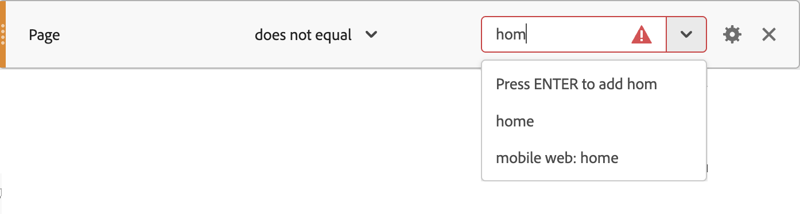

# 區段的比較運運算元

區段產生器可讓您使用選取的運運算元來比較和限制值。 運算子分為三類：標準、Data Warehouse 和不重複計數。

根據您選取的運運算元：

* 您可以輸入值
* 您可以輸入值的一部分，然後從下拉式功能表中選取（如果有的話）。
* 立即從下拉式選單中選取值（如果有的話）。

當您為驗證可用值的運運算元輸入值（例如&#x200B;**[!UICONTROL 等於]**），且值與元件可用的值不符時，您會看到圖示。 您可以從下拉式功能表中選取值，或按&#x200B;**[!UICONTROL _Enter_]**&#x200B;輸入值。

## 萬用字元

支援萬用字元的運運算元唯一支援的萬用字元是星號： `*`。 如果您需要搜尋特定的&#42;字元，可以使用反斜線（如`\*`）將其逸出。

例如，您的頁面名稱為&#x200B;*我的酷炫產品*。

* 區段規則&#x200B;**[!UICONTROL 頁面名稱]** **[!UICONTROL 符合]** `* product`將符合上述頁面名稱。
* 但是，規則&#x200B;**[!UICONTROL 頁面名稱]** **[!UICONTROL 符合]** `My \* product`只符合頁面名稱&#x200B;*My *產品*。

## 標準運算子

| 運算元 | 選取的維度、區段或量度事件... |
|--- |--- |
| **[!UICONTROL 等於]** | 傳回完全符合數值或字串值的項目。注意：如果使用萬用字元，請使用&#x200B;**[!UICONTROL 符合]**&#x200B;運運算元。 |
| **[!UICONTROL 不等於]** | 傳回所有不含輸入值的項目。注意：如果使用萬用字元，則使用&#x200B;**[!UICONTROL 不符合]**&#x200B;運運算元。 |
| **[!UICONTROL 等於任何]** | 傳回與輸入欄位中任何值完全相符的項目 (最多 500 個項目)。例如，使用此運運算元輸入&#x200B;**[!UICONTROL 頁面名稱]**&#x200B;維度的`Search Results, Homepage`會符合&#x200B;*搜尋結果*&#x200B;和&#x200B;*首頁*，並計為2個專案。 此運算子的輸入欄位採用逗號分隔方式。 |
| **[!UICONTROL 不等於任何]** | 識別與輸入欄位中任何值完全相符的項目目 (最多 500 個項目)，然後只傳回不含這些值的項目。例如，使用此運運算元輸入&#x200B;**[!UICONTROL 頁面名稱]**&#x200B;維度的`Search Results, Homepage`將會識別&#x200B;*搜尋結果*&#x200B;和&#x200B;*首頁*，然後從傳回的專案中&#x200B;**排除**&#x200B;這些專案。 此範例會計為 2 個項目。此運算子的輸入欄位採用逗號分隔方式。 |
| **[!UICONTROL 包含]** | 傳回含有輸入值字串的項目。 例如，如果規則是&#x200B;**[!UICONTROL 頁面名稱]** **[!UICONTROL 包含]** `Search`，則此規則會比對任何包含子字串`Search`的頁面，包括&#x200B;*搜尋結果*、*搜尋*&#x200B;和&#x200B;*搜尋*。 &quot;contains&quot; 子句在 Adobe Analytics 中不區分大小寫，但在 Customer Journey Analytics 中區分大小寫。 |
| **[!UICONTROL 不包含]** | 傳回&#x200B;**[!UICONTROL contains]**&#x200B;規則的倒數。 具體而言，所有符合輸入值的項目都將從輸入值中排除。例如，如果規則為&#x200B;**[!UICONTROL 頁面名稱]** **[!UICONTROL 不包含]** `Search`，則不會比對任何包含子字串`Search`的頁面，包括&#x200B;*搜尋結果*、*搜尋*&#x200B;和&#x200B;*搜尋*。 這些值都將從結果中排除。 |
| **[!UICONTROL 包含全部]** | 傳回包含子字串的項目，包括多個連結在一起的值。例如，使用此運運算元輸入&#x200B;**[!UICONTROL 頁面名稱]**&#x200B;維度的`Search Results`會符合&#x200B;*搜尋結果*&#x200B;和&#x200B;*搜尋結果*，但不會個別符合&#x200B;*搜尋*&#x200B;或&#x200B;*結果*。 此規則將符合&#x200B;*Search*&#x200B;和&#x200B;*Results*。 此運算子的輸入欄位採用空格分隔方式 (100 個字)。 |
| **[!UICONTROL 不包含任何]** | 與子字串比較以識別專案，包括多個值連結在一起，然後只傳回不含這些值的專案。 例如，使用此運運算元輸入&#x200B;**[!UICONTROL 頁面名稱]**&#x200B;維度的`Search Results`將會識別&#x200B;*搜尋結果*&#x200B;和&#x200B;*搜尋結果* （但不會分別識別&#x200B;*搜尋*&#x200B;或&#x200B;*結果*），然後排除這些專案。 此運算子的輸入欄位採用空格分隔方式 (100 個字)。 |
| **[!UICONTROL 包含任何]** | 傳回包含子字串的項目，包括多個相互連結或獨立存在的值。例如，使用此運運算元輸入`Search Results`將符合&#x200B;*搜尋結果*、*搜尋結果*、*搜尋*&#x200B;和&#x200B;*結果*。 它會同時或獨立地符合&#x200B;*搜尋*&#x200B;或&#x200B;*結果*。 此運算子的輸入欄位採用空格分隔方式 (100 個字)。 |
| **[!UICONTROL 不包含任何]** | 依據子字串識別項目，接著傳回不包含這些子字串的值。可以有多個連接值或例如，輸入&#x200B;**[!UICONTROL Page Name]**&#x200B;維度的`Search Results`會符合&#x200B;*搜尋結果*、*搜尋結果* h*、*搜尋*&#x200B;和&#x200B;*結果*，其中&#x200B;*搜尋*&#x200B;或&#x200B;*結果*&#x200B;會一起出現或分別出現。 接著會排除包含這些子字串的項目。此運算子的輸入欄位採用空格分隔方式 (100 個字)。 |
| **[!UICONTROL 開始於]** | 傳回以輸入字串值開頭的專案。 |
| **[!UICONTROL 不開始於]** | 傳回未以輸入字串值開頭的所有專案。 這與&#x200B;**[!UICONTROL 開頭為]**&#x200B;運運算元相反。 |
| **[!UICONTROL 終止於]** | 傳回結尾為輸入字串值的專案。 |
| **[!UICONTROL 不終止於]** | 傳回未以輸入字串值結尾的所有專案。 這與&#x200B;**[!UICONTROL 結尾為]**&#x200B;運運算元相反。 |
| **[!UICONTROL 符合]** | 根據給定的數值或字串值，傳回完全符合的項目。**[!UICONTROL matches]**&#x200B;子句在Adobe Analytics和Customer Journey Analytics中區分大小寫。 **注意**：使用[萬用字元](#wildcards) （萬用字元）功能時請使用此運運算元。 「萬用字元」範例：<ul><li>`a*e` 會符合 `ae`、`abcde`、`adobe` 和 `a whole sentence`</li><li>`adob*` 會符合 `adobe`、`adobe analytics` 和 `adobo recipe`</li><li>`*dobe` 會符合 `dobe`、`adobe` 和 `cute little dobe`</li></ul> |
| **[!UICONTROL 不符合]** | 傳回所有不含輸入值的項目。注意：使用[萬用字元](#wildcards) （萬用字元）功能時請使用此運運算元。 |
| **[!UICONTROL 存在]** | 傳回存在的項目數。例如，如果您使用&#x200B;**[!UICONTROL exist]**&#x200B;運運算元評估&#x200B;**[!UICONTROL 找不到頁面]**&#x200B;維度，則會傳回存在的錯誤頁面數。 |
| **[!UICONTROL 不存在]** | 傳回不存在的所有項目。例如，如果您使用&#x200B;**[!UICONTROL 不存在]**&#x200B;運運算元評估&#x200B;**[!UICONTROL 找不到頁面]**&#x200B;維度，則會傳回不存在此錯誤頁面的頁面數。 |

## Data Warehouse 運算子

| 運算元 | 選取的維度、區段或量度事件... |
| --- | --- |
| **[!UICONTROL 小於]** | 傳回數值計數小於輸入值的項目。 |
| **[!UICONTROL 小於或等於]** | 傳回數值計數小於或等於輸入值的項目。 |
| **[!UICONTROL 大於]** | 傳回數值計數大於輸入值的項目。 |
| **[!UICONTROL 大於或等於]** | 傳回數值計數大於或等於輸入值的項目。 |

## Distinct Count 運算子

您可以劃分維度內項目不重複計數的區段。範例： *檢視5個以上不重複產品的訪客*，或檢視5個以上不重複頁面的造訪&#x200B;*。*

| 運算元 | 選取的維度、區段或量度事件... |
| --- | --- |
| **[!UICONTROL 等於]** | 傳回唯一計數等於輸入值的維度項目。 |
| **[!UICONTROL 不等於]** | 傳回唯一計數不等於輸入值的維度項目。 |
| **[!UICONTROL 大於]** | 傳回唯一計數大於輸入值的維度項目。 |
| **[!UICONTROL 小於]** | 傳回唯一計數小於輸入值的維度項目。 |
| **[!UICONTROL 大於或等於]** | 傳回唯一計數大於或等於輸入值的維度項目。 |
| **[!UICONTROL 小於或等於]** | 傳回唯一計數小於或等於輸入值的維度項目。 |

>[!BEGINSHADEBOX]

如需示範影片，請參閱 [不同的維度計數](https://video.tv.adobe.com/v/27257?quality=12&learn=on){target="_blank"}。

>[!ENDSHADEBOX]
