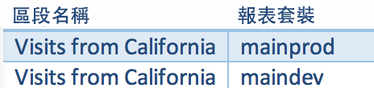

# 舊式區段

本文回答有關管理舊式區段最佳實務的常見問題。 舊式區段是建立於2014年之前的區段。

## 管理舊式區段 {#legacy}

+++ **我現有的區段有什麼改變？**

您現有的區段會如往常一樣繼續運作。 任何已套用這些區段的報表都會繼續正常運作。

大部分先前的預先定義和套裝區段會以區段範本的形式移轉至區段產生器。 區段範本可用以快速建立具有共同對象的自訂區段。 區段範本無法直接套用至報告，但可以輕易儲存成自訂區段。

區段範本在區段產生器中標示有特殊圖示。

+++

+++ **已套用區段的已計劃報告有什麼改變？**

已計劃的報告會繼續使用您定義的區段正常運作。

當您刪除區段時，已套用此區段的已計劃報告和儀表板會繼續正常運作，亦即區段或儀表板會繼續使用刪除的區段。

當您編輯同名區段時，已計劃的報告不會更新。 以下是範例：假設您有 2 個同名區段分別位在不同報告套裝中：

您有個視覺效果是參照&#x200B;**[!UICONTROL mainprod]**&#x200B;報表套裝的區段。 之後您因為該區段重複而刪除該區段。 視覺效果會參照已刪除區段的定義繼續執行。 如果您將maindev區段的區段定義變更為包含Catalina Island和Tijuana （墨西哥），則套用至視覺效果的區段不會變更，而會使用舊定義。 若要使用新定義，請更新視覺效果以參考新定義。 如果您不確定視覺效果、專案或排程報表是否正使用已刪除的區段，請變更其餘區段的名稱，以顯示視覺效果是否正使用其餘的區段。

+++

+++ **Data Warehouse 區段有何變化？**

所有現有的 Data Warehouse 區段在 Data Warehouse 中仍可繼續運作。 大部分的Data Warehouse區段也可在Analysis Workspace等其他元件中運作。

您可以在區段產生器/管理員中建立或編輯新的Data Warehouse區段。 區段產生器中的產品相容性機制會自動判斷區段是否與Data Warehouse相容。

+++

+++ **預先建立的區段有何變化？**

* **單頁存取次數**
* **來自行動裝置的造訪次數**
* **來自免費搜尋的造訪次數**
* **來自付費搜尋的造訪次數**
* **具有訪客 ID Cookie 的造訪次數**

這些區段會以區段範本的形式移轉至區段產生器。 已套用這些區段的現有報告會繼續正常運作。

+++

+++ **CX Enterprise （套裝）區段有什麼改變：**

* 非購買者
* 購買者
* 首次造訪次數
* 來自社交網站的造訪次數
* 超過 10 分鐘的造訪次數*
* 5個以上先前造訪的造訪*
* 來自 Facebook 的造訪次數*

這些區段 (具有星號 * 標記者除外) 多半以區段範本的形式移轉至區段產生器。 另外，新增了數個新的區段範本。

已套用這些區段的現有報告會繼續正常運作。

+++

+++ **管理員區段 (也稱為「全域」區段有何變化？**

**管理員**&#x200B;區段已移轉至新的區段介面，並顯示為共用給每個人的區段。

這些區段的擁有者設定為擁有最舊管理員使用者帳戶的管理員。 但是，所有管理員都可以刪除、編輯和共用這些區段。

管理員在Admin Console中建立並管理這些全域區段的區段管理介面已無法使用。 管理員現在應使用新的區段產生器來建立區段，並與適當的群組、個人或所有人共用。

使用已如本檔案所述變更之邏輯的現有區段可繼續正常運作，不過區段必須先更新，才能再次儲存。 例如，如果您有現有的區段，其中&#x200B;**[!UICONTROL 美國州]** **[!UICONTROL 包含]** `New York`，該區段會繼續正常運作。 下次編輯區段時，您需要更新區段以使用具有&#x200B;**[!UICONTROL 等於]**&#x200B;條件的列舉型別。

+++

+++ **我應該如何處理具有相同名稱，但可能有不同定義的重複區段？** 
現在，由於區段可在多個報告套裝中運作，因此您可能發現有多個區段具有相同名稱。 您應該：

* 重新命名具有相同名稱但不同定義的區段，或
* 刪除不再需要的區段。

+++

+++ **Adobe對於清除區段有什麼建議？**

* 以舊版標記標記所有區段。
* 檢閱您擁有的區段。
* 將其新增至適用的區段程式庫。
* 核准規範區段。
* 根據[最佳實務](/help/components/segmentation/segmentation-workflow/seg-workflow.md)標記區段。

+++

### 移轉提示

下列提示可協助您移轉常見維度：

* 地域城市/地區/國家 - 搜尋並選取特定城市、地區或國家，而不是使用局部比對。
* 瀏覽器 — 使用瀏覽器型別維度來取得某個型別的所有瀏覽器，例如Google Chrome
* 作業系統 — 使用「作業系統型別」維度來取得某個型別的所有作業系統，例如Microsoft Windows。
* 請參閱「新維度和經過重新命名的維度」(參閱下文)

## 新維度和經過重新命名的維度 {#renamed}

下表包含在區段產生器中重新命名的維度清單。

| 新的Dimension名稱 | 前一個名稱 | 附註 |
|--- |--- |--- |
| 作業系統類型 | 新增 | 於2015年春季新增。 |
| 瀏覽器寬度 - 分段 | 瀏覽器寬度 | 此維度與所有介面相容，且會分割為範圍列舉清單，而非特定整數值。 如果您需要區段特定值，請在Data Warehouse區段中使用此維度的精細版本。 |
| 瀏覽器高度 - 分段 | 瀏覽器高度 | 此維度與所有介面相容，且會分割為範圍列舉清單，而非特定整數值。 如果您需要區段特定值，請在Data Warehouse區段中使用此維度的精細版本。 |
| 瀏覽器寬度 - 顆粒度 | 瀏覽器寬度 | 此維度已重新命名，現在僅與Data Warehouse相容。 定義與所有介面相容的區段時，請使用列舉型別「瀏覽器寬度 — 分段」 。 |
| 瀏覽器高度 - 顆粒度 | 瀏覽器高度 | 此維度已重新命名，現在僅與Data Warehouse相容。 定義與所有介面相容的區段時，請使用列舉型別「瀏覽器高度 — 分段」 。 |
| Cookie 支援 | Cookie | - |
| 色彩深度 | 監視器色彩深度 | - |
| - | &quot;應用程式 — *&quot; | 「應用程式 — 」首碼已從許多維度型別中移除。 因為行動應用程式資料通常是擷取到不含網站資料的報告套裝中，所以這些字首不再有存在的必要。 |
| 登入頁面原始 | 原始登入頁面 | - |
| Java 已啟用 | Java | - |
| 行動瀏覽器 URL 的最大長度 | 行動瀏覽器 URL 長度 | - |
| 行動郵件裝飾 | 行動裝飾郵件支援 | - |
| 行動裝置 | 行動裝置名稱 | - |
| 行動書籤 的最大長度 | 行動書籤 URL 的最大長度 | - |
| 行動電子郵件的最大長度 | 行動郵件 URL 的最大長度 | - |
| 行動作業系統（已棄用） | 行動作業系統 | 使用「作業系統」維度並改從行動裝置區段套用造訪。 |
| 行動即按即說 (Push To Talk) | 行動 PTT | - |
| 調查檢視 | 調查檢視總數 | - |
| 調查回應 | 調查回應總數 | - |
| 造訪深度 | 路徑長度 | - |
| 郵遞區號 | 郵遞區號 | - |

{style="table-layout:auto"}

## 具有已知值的字串型維度變更 {#string-based-dims}

具有已知值集的字串型維度已變更為列舉型別。 使用這些維度建立區段時，清單會預先填入所有已知值，而唯一支援的運運算元是&#x200B;**[!UICONTROL 等於]**。 此母體值可讓您在使用限制較少的相符專案時，快速區隔您要尋找的確切值，而不需選取意外的值。

下列維度已變更為列舉清單：

| 維度名稱 | 維度名稱 | 維度名稱 |
| --- | --- | --- |
| 行動製造商 | 行動電子郵件長度 | 色彩深度 |
| 行動熒幕大小 | 行動裝置號碼 | 顯示器解析度 |
| 行動熒幕高度 | 行動即按即說 | 外掛程式 |
| 行動Cookie支援 | 行動郵件裝飾 | 作業系統 |
| 行動影像支援 | 行動資訊服務 | 反向連結型別 |
| 行動色彩深度 | 行動裝置型別 | 搜尋引擎 |
| 行動音訊支援 | 瀏覽器型別 | state |
| 行動視訊支援 | 瀏覽器 | 地理國家/地區 |
| 行動drm | 連線型別 | 地理區域 |
| 行動網路通訊協定 | 行動電信業者 | 地理城市 |
| 行動作業系統 | Cookie | 地理dma |
| 行動java vm | 客戶忠誠度 | 永久性Cookie |
| 行動書籤長度 | java已啟用 | 付費搜尋 |
| 行動url長度 | 語言 |  |

## 具有已知值的整數維度變更 {#integer-based-dims}

具有已知值集的整數維度（例如瀏覽器寬度）會分割為列舉範圍，以便您快速定義特定範圍的區段。 這些列舉清單會在維度名稱后面附加「 — 分段」。 下列畫面顯示使用舊的和新的「區段產生器」介面時，這些維度的分段方式：

小於、大於和類似的運運算元現在僅與Data Warehouse區段相容。 要與所有報表介面相容的區段，應使用含有&#x200B;**[!UICONTROL 等於]**&#x200B;運運算元的「分段」量度版本。
