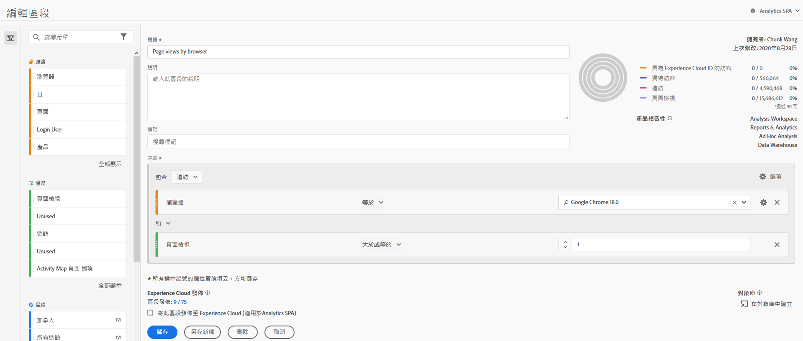
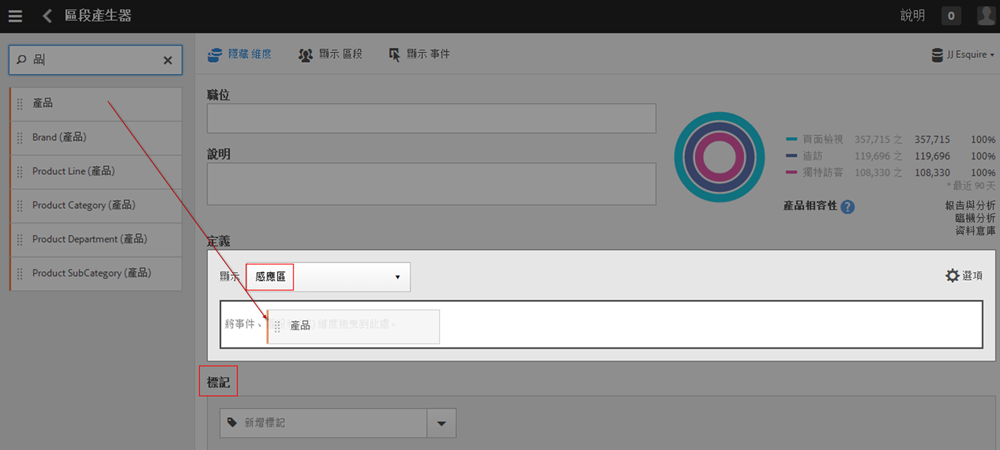

# 區段產生器

[!UICONTROL 區段產生器]可讓您建立簡單或複雜區段，用以識別各瀏覽及頁面點擊中的訪客屬性和動作。它提供畫布來拖放量度維度、事件或其他區段，以根據容器階層邏輯、規則和運算子來劃分訪客。

要存取「區段產生器」有數種方式：

* **Analytics 頂端導覽**：按一下&#x200B;**[!UICONTROL 「Analytics]** > **[!UICONTROL 元件]** > **[!UICONTROL 區段」]**。
* **[!UICONTROL Analysis Workspace]**：按一下&#x200B;**[!UICONTROL 「Analytics]** > **[!UICONTROL Workspace」]**，開啟專案並按一下&#x200B;**[!UICONTROL 「+ 新增]** > **[!UICONTROL 建立區段」]**。
* **[!UICONTROL Report Builder]**：[在 Report Builder 中新增或編輯區段](https://experienceleague.adobe.com/docs/analytics/analyze/report-builder/data-requests/segmentation.html?lang=zh-Hant)。

## 產生器條件 {#section_F61C4268A5974C788629399ADE1E6E7C}

您可以新增規則定義和容器以定義區段。

1. **[!UICONTROL 標題]**：為區段命名。
1. **[!UICONTROL 說明]**：提供區段的說明。
1. **[!UICONTROL 標記]**：選擇現有標記清單中的標記或建立新標記，[標記您正在建立的區段](/help/components/segmentation/segmentation-workflow/seg-workflow.md)。
1. **[!UICONTROL 定義]**：可在此[建立和設定區段](/help/components/segmentation/segmentation-workflow/seg-workflow.md)、新增規則、巢狀內嵌及排序容器。
1. **[!UICONTROL 顯示]**：(頂端容器選擇器)可讓您選取頂層[容器](/help/components/segmentation/seg-overview.md)層級 ([!UICONTROL 訪客]、[!UICONTROL 造訪]、[!UICONTROL 點擊])。預設的頂層容器為「點擊」容器。
1. **[!UICONTROL 選項]**：(齒輪) 圖示

   * **[!UICONTROL + 新增容器]**：可讓您新增新的容器 (在頂層容器下) 至區段定義。
   * **[!UICONTROL 排除]**：可讓您透過排除一或多個維度、區段或量度來定義區段。

1. **[!UICONTROL 維度]**：從維度清單拖放過來的元件 (橘色側欄)。
1. **[!UICONTROL 運算子]**：您可以使用選取的運算子來比較和限制值。
1. **[!UICONTROL 值]**：您針對維度、區段或量度所輸入或選取的值。
1. **[!UICONTROL 歸因模型]**：這些模型僅適用於維度，可決定要分段的維度值。維度模型在循序細分中特別有用。

   * **[!UICONTROL 重複]** (預設值)：包含維度的例項和持續值。
   * **[!UICONTROL 例項]**：包含維度的例項。
   * **[!UICONTROL 非重複例項]**：包含維度的唯一例項 (非重複)。這是在排除重複例項時套用於「流量」中的模型。

   

   **範例：eVar1 = A 的點擊區段**

   | 範例 | A | A | A (持續) | B | A | C |
   |---|---|---|---|---|---|---|
   | 重複 | X | X | X | - | X | - |
   | 例項 | X | X | - | - | X | - |
   | 非重複的例項 | X | - | - | - | X | - |
1. **[!UICONTROL And/Or/Then]**：在容器或規則之間指派 [!UICONTROL AND/OR/THEN] 運算子。THEN 運算子可用來[定義循序區段](/help/components/segmentation/segmentation-workflow/seg-sequential-build.md)。
1. **[!UICONTROL 量度]**：(綠色側欄) 從「量度」清單拖放過來的量度。
1. **[!UICONTROL 比較]**&#x200B;運算子：可使用選取的運算子來比較和限制值。
1. **[!UICONTROL 值]**：您針對維度、區段或量度所輸入或選取的值。
1. **[!UICONTROL X]**：(刪除) 可用來刪除這個部分的區段定義。
1. **[!UICONTROL Experience Cloud 發佈]**：將 Adobe Analytics 區段發佈至 Experience Cloud，可讓您在 [!DNL Audience Manager] 和其他啟用管道中，使用該區段進行行銷活動。[更多詳情...](/help/components/segmentation/segmentation-workflow/seg-publish.md)
1. **[!UICONTROL 受眾庫]**：Adobe 的受眾服務可管理將訪客資料轉譯為受眾細分的過程。因此，建立和管理受眾類似於建立和使用區隔，再加上可與 Experience Cloud 共用受眾區隔的能力。[更多詳情...](https://experienceleague.adobe.com/docs/core-services/interface/audiences/audience-library.html?lang=zh-Hant)
1. **[!UICONTROL 搜尋]**：搜尋維度、區段或量度清單。
1. **[!UICONTROL 維度]**：(清單) 按一下標題可展開。
1. **[!UICONTROL 量度]**：按一下標題可展開。
1. **[!UICONTROL 區段]**：按一下標題可展開。
1. **[!UICONTROL 報表套裝選取器]**：可讓您選取要將此區段儲存哪個報表套裝底下。您仍可以使用所有報表套裝中的區段。
1. **[!UICONTROL 區段預覽]**：可讓您預覽關鍵量度，以查看您是否具備有效的區段及區段的廣度。代表如果您套用此區段，可以預期看到的資料集劃分。顯示 3 個同心圓以及一個清單，以顯示對資料集執行之區段的[!UICONTROL 點擊]、[!UICONTROL 瀏覽]和[!UICONTROL 訪客]符合項目的數目和百分比。在您建立或對區段定義進行變更之後，此圖表會立即更新。
1. **[!UICONTROL 產品相容性]**：提供與您所建立區段相容的Adobe Analytics產品(Analysis Workspace、Data Warehouse)清單。 大多數區段與所有產品都相容。不過，並非所有運算子和維度均與所有 Analytics 產品相容，特別是 [Data Warehouse](/help/components/segmentation/seg-reference/seg-compatibility.md)。在您對區段定義進行變更之後，此圖表會立即更新。
1. **[!UICONTROL 儲存]**&#x200B;或&#x200B;**[!UICONTROL 取消]**：儲存或取消區段。按一下&#x200B;**[!UICONTROL 「儲存」]**&#x200B;之後會進入「區段管理器」，您可在此管理區段。

## 建立區段 {#build-segments}

1. 只需從左側窗格將「維度」、「區段」或「量度事件」拖放至「[!UICONTROL 定義]」欄位即可。

   

   將元素拖曳到「[!UICONTROL 定義]」之後，預設的最上層「[!UICONTROL 點擊]」容器隨即顯示。您可以透過「**[!UICONTROL 顯示]**」下拉式選單，將容器類型變更為「瀏覽」或「訪客」。

1. 從下拉式選單中設定[運算子](/help/components/segmentation/seg-reference/seg-operators.md)。
1. 針對選取的項目輸入或選取值。
1. 必要時使用 **[!UICONTROL And]**、**[!UICONTROL Or]** 或 **[!UICONTROL Then]** 規則新增額外的限制。
1. 放置好容器且設定規則後，請在右上方的驗證圖表中查看區段的結果。驗證器會指出與您所建立區段相符之頁面檢視、造訪次數和獨特訪客的百分比與絕對數量。
1. 在&#x200B;**[!UICONTROL 「標記」]**&#x200B;底下，選取現有標記或建立新標記即可[標記](/help/components/segmentation/segmentation-workflow/seg-tag.md)容器。
1. 按一下「**[!UICONTROL 儲存]**」來儲存區段。

此時會進入[區段管理器](/help/components/segmentation/segmentation-workflow/seg-manage.md)，您可在此透過多種方式標記、共用及管理區段。

## 新增容器 {#section_1C38F15703B44474B0718CEF06639EFD}

您可以[建立容器的架構](/help/components/segmentation/seg-overview.md)，然後在當中放置邏輯規則和運算子。

1. 按一下&#x200B;**[!UICONTROL 「選項 > 新增容器」]**。

   

   隨即開啟一個新的「[!UICONTROL 點擊]」容器，其中未識別「[!UICONTROL 點擊]」(頁面檢視)。

   

1. 視需要變更容器類型。
1. 從左側窗格拖曳「維度」、「區段」或「事件」至容器。
1. 繼續從定義上方的頂層「**[!UICONTROL 選項]**」>「**[!UICONTROL 新增容器]**」按鈕新增容器，或從容器內新增容器以巢狀內嵌邏輯。

   **或**

   選取一或多個規則，然後按一下「**[!UICONTROL 選項]**」>「**[!UICONTROL 從選項新增容器]**」。這會將您的選項轉變成個別容器。

## 使用日期範圍 {#concept_252A83D43B6F4A4EBAB55F08AB2A1ACE}

您可以建立包含滾動日期範圍的區段，以回答與持續性促銷活動或事件有關的問題。

舉例來說，您可以輕鬆建立包括「過去 60 天內購買過一次的人」的區段。

您可以建立「造訪」容器，在裡面添加時間範圍[!UICONTROL 「Last 60 days (過去 60 天)」]及量度[!UICONTROL 「Orders is greater than or equal to 1 (訂單數量大於或等於 1)」]，用「AND」作運算符：

以下是有關在區段中使用滾動式日期範圍的影片：

>[!VIDEO](https://video.tv.adobe.com/v/25403/?quality=12)

## 堆疊區段 {#task_58140F17FFD64FF1BC30DC7B0A1B0E6D}

堆疊區段的運作方式是使用 &#39;and&#39; 運算子結合每個區段中的準則，然後套用結合後的準則。您可以直接在 Workspace 專案中或在區段產生器中完成此作業。

例如，將「行動電話使用者」區段和「美國地區」區段堆疊在一起，只會傳回美國地區行動電話使用者的資料。

將這些區段想成可加到區段庫中的素材或模組，供想要的使用者使用。透過此方式，您便可以大量減少所需的區段數。例如，假設您有 40 個區段：

* 20 個代表不同國家/地區的行動電話使用者 (US_mobile、Germany_mobile、France_mobile、Brazil_mobile 等等)
* 20 個代表不同國家/地區的平板電腦使用者 (US_tablet、Germany_tablet、France_tablet、Brazil_tablet 等等)

透過將區段堆疊，您可以將區段的個數降至 22 個，並視需要加以堆疊。您將需要建立下列區段：

* 一個區段代表行動使用者
* 一個區段代表平板電腦使用者
* 20 個區段代表不同地區

>[!NOTE]
>
>將兩個區段堆疊在一起時，預設會使用 AND 陳述式加以連結。無法將其變更為 OR 陳述式。

1. 前往「區段產生器」。
1. 提供區段的標題和說明。

   步驟結果 1。按一下「**[!UICONTROL 顯示區段]**」以在左側導覽中開啟區段清單。

   步驟結果 1。拖放您要堆疊到區段定義畫布的區段。以下是將現有區段「來自平板電腦的瀏覽」與「美國地區」堆疊在一起的區段範例：

   

1. 儲存區段。

   步驟結果

## 區段範本 {#concept_5098446CC78D441E93B8E4D1D1EA6558}

區段範本是針對常見的細分使用案例而提供的，例如「首次造訪」或「來自行動裝置的造訪」。這些範本可在 Workspace 專案中和區段產生器中作為新區段的組成要素。

範本會以 Adobe 的「A」標誌表示。以下列出範本的範例：

<table id="table_98B87D807E9344C9BEBF072C65D87B1B"> 
 <thead> 
  <tr> 
   <th colname="col1" class="entry"> 範本名稱 </th> 
   <th colname="col2" class="entry"> 定義 </th> 
  </tr> 
 </thead>
 <tbody> 
  <tr> 
   <td colname="col1"> 放棄購物車 </td> 
   <td colname="col2">檢視已新增項目至購物車但並未訂購任何項目的訪客的相關資料。在區段定義中，容器是瀏覽。此循序區段的規則是 
 購物車新增非空值 
 
Then 
 
訂購等於 0。 
 </td> 
  </tr> 
  <tr> 
   <td colname="col1"> 首次瀏覽次數 </td> 
   <td colname="col2">檢視最多僅造訪過 1 次的訪客的相關資料。在區段定義中，容器是瀏覽。規則是 
瀏覽次數等於 1。 
 </td> 
  </tr> 
  <tr> 
   <td colname="col1"> 非購買者 </td> 
   <td colname="col2">檢視未參與訂購事件的訪客的相關資料。在區段定義中，容器是訪客。此區段使用「排除」邏輯。規則是 
訂購非空值。 
 </td> 
  </tr> 
  <tr> 
   <td colname="col1"> 非單一頁面瀏覽 (非彈回) </td> 
   <td colname="col2">檢視瀏覽超過一次的訪客的相關資料。在區段定義中，容器是訪客。此區段使用「排除」邏輯。規則是 
單次存取非空值。 
 </td> 
  </tr> 
  <tr> 
   <td colname="col1"> 付費搜尋 </td> 
   <td colname="col2">檢視來自付費搜尋的訪客的相關資料。在區段定義中，容器是瀏覽。規則是 
付費搜尋等於 1。 
 </td> 
  </tr> 
  <tr> 
   <td colname="col1"> 購買者 </td> 
   <td colname="col2">檢視參與訂購事件的訪客的相關資料。在區段定義中，容器是訪客。規則是 
訂購非空值。 
 </td> 
  </tr> 
  <tr> 
   <td colname="col1"> 回訪 </td> 
   <td colname="col2">檢視已瀏覽至少一次的訪客的相關資料。在區段定義中，容器是瀏覽。規則是 
瀏覽次數大於 1. 
 </td> 
  </tr> 
  <tr> 
   <td colname="col1"> 單頁造訪次數 </td> 
   <td colname="col2"> 檢視您看到單一頁面值之瀏覽中的資料，即使您可能在該次瀏覽期間提交多個頁面檢視亦同。帶有退出連結事件的單一頁面瀏覽會納入到區段中。在區段定義中，容器是瀏覽。規則是 
單頁造訪次數等於 1。 
 </td> 
  </tr> 
  <tr> 
   <td colname="col1"> 檢視未加到購物車的產品 </td> 
   <td colname="col2">檢視查看了產品但並未加任何項目到購物車的訪客的相關資料。在區段定義中，容器是瀏覽。此循序區段的規則是 
產品檢視非空值 
 
Then 
 
 購物車新增等於 0。 
 </td> 
  </tr> 
  <tr> 
   <td colname="col1"> 來自促銷活動的瀏覽次數 </td> 
   <td colname="col2">檢視由促銷活動引薦過來的訪客的相關資料。在區段定義中，容器是瀏覽。規則是 
追蹤代碼非空值。 
 </td> 
  </tr> 
  <tr> 
   <td colname="col1"> 來自行動裝置的瀏覽次數 </td> 
   <td colname="col2">檢視使用行動裝置的訪客的相關資料。在區段定義中，容器是瀏覽。規則是 
行動裝置非空值。 
 </td> 
  </tr> 
  <tr> 
   <td colname="col1"> 來自免費搜尋的瀏覽次數 </td> 
   <td colname="col2">檢視不是來自付費搜尋的訪客的相關資料。在區段定義中，容器是瀏覽。規則是 
付費搜尋等於 0。 
 </td> 
  </tr> 
  <tr> 
   <td colname="col1"> 來自非行動裝置的瀏覽次數 </td> 
   <td colname="col2">檢視非使用行動裝置的訪客的相關資料。在區段定義中，容器是瀏覽。此區段使用「排除」邏輯。規則是 
行動裝置類型等於行動電話 
 
或 
 
行動裝置類型等於平板電腦。 
 </td> 
  </tr> 
  <tr> 
   <td colname="col1"> 來自手機的瀏覽次數 </td> 
   <td colname="col2">檢視使用手機的訪客的相關資料。在區段定義中，容器是瀏覽。規則是 
裝置類型等於行動電話。 
 </td> 
  </tr> 
  <tr> 
   <td colname="col1"> 來自搜尋引擎的瀏覽次數 </td> 
   <td colname="col2">檢視由搜尋引擎引薦過來的訪客的相關資料。在區段定義中，容器是瀏覽。規則是 
反向連結類型等於搜尋引擎。 
 </td> 
  </tr> 
  <tr> 
   <td colname="col1"> 來自社交網站的造訪次數 </td> 
   <td colname="col2">檢視社交網站參照的訪客的相關資料。在區段定義中，容器是瀏覽。規則是 
反向連結類型等於社交網路. 
 </td> 
  </tr> 
  <tr> 
   <td colname="col1"> 來自平板電腦的瀏覽次數 </td> 
   <td colname="col2">檢視使用平板電腦的訪客的相關資料。在區段定義中，容器是瀏覽。規則是 
裝置類型等於平板電腦。 
 </td> 
  </tr> 
  <tr> 
   <td colname="col1"> 具有訪客 ID Cookie 的瀏覽次數 </td> 
   <td colname="col2">檢視到您網站 (需要永久性 Cookie) 的訪客的相關資料。在區段定義中，容器是瀏覽。規則是 
永久性 Cookie 等於 1。 
 </td> 
  </tr> 
 </tbody> 
</table>
