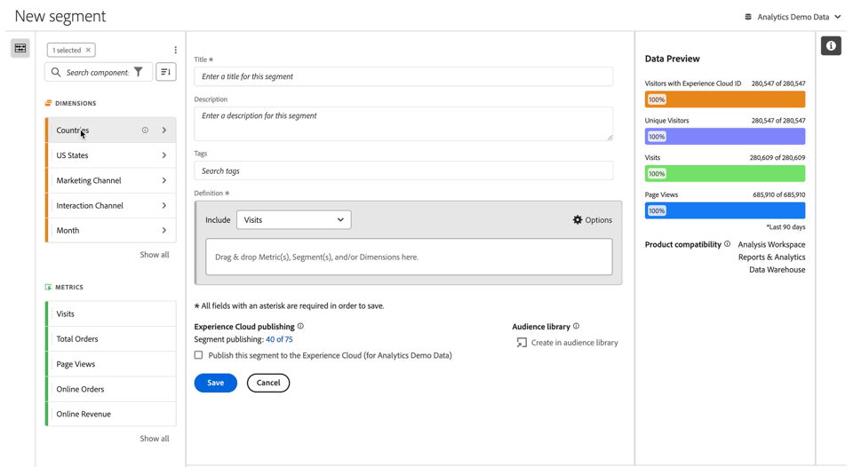

# 建立細分群體 {#build-segments}

>[!CONTEXTUALHELP]
>id="components_segments_productcompatibility"
>title="產品相容性"
>abstract="少數可用的細分群體條件與所有 Adobe Analytics 工具並不相容。此清單中列出了與細分群體相容的工具。若要讓細分群體與所有 Adobe Analytics 工具相容，請編輯您的條件。"

>[!CONTEXTUALHELP]
>id="components_filters_createaudience"
>title="建立客群"
>abstract="客群可以透過細分群體建立，並與 Adobe Experience Platform 共用以進行啟用。"

>[!CONTEXTUALHELP]
>id="components_filters_datapreview"
>title="資料預覽"
>abstract="將此區段的資料與報表套裝的資料進行比較。 預覽百分比是根據&#x200B;**過去90天**&#x200B;的總數。  如果預覽未載入，您的連線可能仍在進行回填。"

**[!UICONTROL 區段產生器]**&#x200B;對話框用於建立新區段或編輯現有區段。對於您從[[!UICONTROL 區段]管理員](/help/components/segmentation/segmentation-workflow/seg-manage.md)建立或管理的區段，對話框標題為&#x200B;**[!UICONTROL 新增區段]**&#x200B;或&#x200B;**[!UICONTROL 編輯區段]**。

>[!BEGINTABS]

>[!TAB 區段產生器]

>[!TAB 建立或編輯區段]

>[!ENDTABS]

1. 指定以下詳細資料 ( 是必要的)：

   | 元素 | 說明 |
   | --- | --- |
   | **[!UICONTROL 報告套裝]** | 您可以選取區段的報告套裝。 |
   | **[!UICONTROL 僅限專案區段]** | 說明區段僅會顯示在建立該區段的專案中的資訊方塊。 而且區段不會新增至您的元件清單中。 啟用&#x200B;**[!UICONTROL 「讓此區段適用於您的所有專案並將其新增至您的元件清單中」]**&#x200B;以變更該設定。此資訊框只會在後述情況時可見到：當您建立[快速區段](seg-quick.md)時；以及從[!UICONTROL 快速區段]介面使用「**[!UICONTROL 開啟產生器]**」，將快速區段資訊變成一般區段時。 |
   | **[!UICONTROL 標題]** | 為區段命名，例如 `Last month mobile visitors`。 |
   | **[!UICONTROL 說明]** | 提供區段說明，例如，`Segment to define the mobile customers for the last month`。 |
   | **[!UICONTROL 標記]** | 透過建立或套用一或多個標記來整理區段。開始輸入內容以尋找您可以選取的現有標記。或按一下 **[!UICONTROL ENTER]** 以新增新標記。選取以移除標記。 |
   | **[!UICONTROL 定義]**  | 使用[定義產生器](#definition-builder)來定義區段。 |

   {style="table-layout:auto"}

1. 若要驗證您的區段定義是否正確，請使用右上角不斷更新的區段結果預覽。
1. 若要將您的區段發佈至 Experience Cloud，請選取&#x200B;**[!UICONTROL 「將此區段發佈至 Experience Cloud (適用於&#x200B;*報告套裝*)」]**。如需更多資訊，請參閱[發佈區段至 Experience Cloud](/help/components/segmentation/segmentation-workflow/seg-publish.md)。
1. 選取：
   * **[!UICONTROL 儲存]**&#x200B;以儲存區段。
   * **[!UICONTROL 另存新檔]**&#x200B;以儲存區段副本。
   * **[!UICONTROL 刪除]**&#x200B;以刪除區段。
   * **[!UICONTROL 取消]**&#x200B;以取消對區段所做的任何變更或取消建立新區段。

## 定義產生器

您可以使用定義產生器來建立區段定義。在該構造中，您可以使用元件、容器、運算子和邏輯。

您可以設定定義的類型和範圍：

1. 若要指定定義的類型，請指定是否要建立一個包含定義或一個排除定義。選取 **[!UICONTROL 「選項」]**，並從下拉式選單中選取&#x200B;**[!UICONTROL 「包括」]**&#x200B;或&#x200B;**[!UICONTROL 「排除」]**。
1. 若要指定定義的範圍，請從&#x200B;**[!UICONTROL 「包括」]**&#x200B;或&#x200B;**[!UICONTROL 「排除」]**&#x200B;下拉式選單中，選取您所需的的定義範圍是&#x200B;**[!UICONTROL 「點擊」]**、**[!UICONTROL 「造訪」]**&#x200B;或&#x200B;**[!UICONTROL 「訪客」]**。

您稍後可以隨時變更這些設定。

### 元件

建立區段定義時，有個重要部分是使用維度、量度、現有區段和日期範圍。區段產生器中的元件面板提供所有這些元件。

{width=100%}

若要新增元件：

1. 將元件面板中的元件拖放至「**[!UICONTROL 將量度、區段和/或維度拖放至此處]**」。您可以使用元件列中的「」來搜尋特定元件。
1. 指定元件的詳細資訊。例如，從「**[!UICONTROL 選擇值]**」中選取一個值。或輸入一個值。指定一個或多個值的內容和方式取決於元件和運算子。
1. 可選擇修訂預設的運算子。例如，從「**[!UICONTROL 等於]**」改為「**[!UICONTROL 等於任何]**」。請參閱「[運算子](../seg-reference/seg-operators.md)」，了解可用運算子詳細概觀。

若要編輯元件：

* 從運算子下拉式選單中選取元件的新運算子。
* 若可以，請為運算子選取或指定不同的值。
* 如果元件類型是維度，則可以定義歸因模型。如需詳細資訊，請參閱「[歸因模型](#attribution)」。

若要刪除元件：

* 在元件中選取 。

### 容器

您可以將多個元件分組在一個或多個容器中，並定義容器內和容器之間的邏輯。容器可讓您為區段建置複雜的定義。

{Width=100%}

* 若要新增容器，請選取「**[!UICONTROL 新增容器]**」(從  **[!UICONTROL 選項]**)。
* 若要將現有元件新增至容器中，請將元件拖曳到容器中。
* 若要為容器新增另一個元件，請將元件從元件面板拖曳到容器中。使用藍色插入線作為準則。
* 若要在容器外部新增另一個元件，請將元件從元件面板拖曳到容器外部，但拖曳到主定義容器內部。使用藍色插入線作為準則。
* 若要修改容器內元件之間、容器之間或容器與元件之間的邏輯，請選取適當的「**[!UICONTROL 以及]**」(And)、「**[!UICONTROL 或]**」(Or)、「**[!UICONTROL 然後]**」(Then)。選取&#x200B;**[!UICONTROL 「Then」]**&#x200B;時，會將區段轉換為循序區段。如需更多資訊，請參閱[建立循序區段](seg-sequential-build.md)。
* 若要切換容器層級，請選取 **[!UICONTROL 「點擊」]**、**[!UICONTROL 「造訪」]**&#x200B;或 **[!UICONTROL 「訪客」]**。

您可以在容器中使用  來執行下列動作：

| 容器動作 | 說明 |
|---|---|
| **[!UICONTROL 新增容器]** | 新增巢狀容器至容器中。 |
| **[!UICONTROL 排除]** | 在區段定義中排除容器中的結果。左側的細紅色條是指排除容器。 |
| **[!UICONTROL 包括]** | 在區段定義中包括容器中的結果。包含為預設值。左側的細灰色條是指包含容器。 |
| **[!UICONTROL 容器名稱]** | 根據容器的預設說明為容器重新命名。在文字欄位中輸入名稱。如果您未輸入任何資料，則使用預設說明。 |
| **[!UICONTROL 刪除容器]** | 根據定義來刪除容器。 |

## 日期範圍

您可以建置包含滾動日期範圍的區段。如此一來，您便可以回答有關持續進行的活動或事件的問題。舉例來說，您可以建置包括「*過去 60 天內在線上購買過一次的人*」的區段。

>[!BEGINSHADEBOX]

請參閱  [ 在細分群體捲動日期範圍](https://video.tv.adobe.com/v/25403/?quality=12&learn=on){target="_blank"}的示範影片。

>[!ENDSHADEBOX]

## 堆疊細分群體 {#stack}

您可以使用區段來建置區段。當您在區段中使用區段時，您可以最佳化您的區段並降低複雜性。

假設您想要根據互動管道 (5) 和美國各州 (50) 的組合進行劃分。您可以建置 250 個區段，每個區段皆為裝置類型 (手機和平板電腦) 和美國各州的唯一組合。若要取得加州平板電腦使用者的結果，您可以使用該 250 個區段之一：

或者，您可以定義 55 個區段：50 個區段用於美國各州，而 5 個區段用於可能的互動管道。然後堆疊區段以取得相同的結果。若要取得加州行動應用程式使用者的結果，您需要堆疊兩個區段：

## 歸因 {#attribution}

>[!CONTEXTUALHELP]
>id="components_filters_attribution_repeating"
>title="重複"
>abstract="包括維度的執行個體和持續值。"

>[!CONTEXTUALHELP]
>id="components_filters_attribution_instance"
>title="例項"
>abstract="包括維度的執行個體。"

>[!CONTEXTUALHELP]
>id="components_filters_attribution_nonrepeatinginstance"
>title="非重複的例項"
>abstract="包括維度的唯一執行個體 (非重複) 執行個體。"

當您在區段產生器中使用維度時，您可以選擇指定該維度的歸因模型。您選取的歸因模型會決定資料是否符合您為維度元件指定的條件。

在維度元件中選取「」，然後從快顯視窗中選取一個歸因模型：

| 模型 | 說明 |
|---|---|
| **[!UICONTROL 重複模型 (預設)]** | 包含維度的實例和持續值來確定資格。 |
| **[!UICONTROL 例項]** | 僅包含維度的實例值來確定資格。 |
| **[!UICONTROL 非重複的例項]** | 包含維度的唯一實例 (非重複) 值來確定資格。 |

### 範例

作為區段定義的一部分，您已指定以下條件：頁面名稱等於「女性」。與上面的例子類似。您是使用另外兩個歸因模型來重複此區段定義。因此，您有三個區段，每個區段都有各自的歸因模型：

* 女性頁面 - 歸因 - 重複 (預設)
* 女性頁面 - 歸因 - 實例
* 女性頁面 - 歸因 - 非重複實例

下表說明每個歸因模型，其中傳入的事件是符合該條件的 。

| 女性頁面 - 歸因 -  *歸因模型* | 事件 1： 頁面名稱等於 女性 | 事件 2： 頁面名稱等於 男性 | 事件 3： 頁面名稱等於 女性 | 事件 4： 頁面名稱等於 女性  (持續) | 事件 5： 頁面名稱等於 結帳 | 事件 6： 頁面名稱等於 女性 | 事件 7： 頁面名稱等於 首頁 |
|---|:---:|:---:|:---:|:---:|:---:|:---:|:--:|
| 重複 (預設) |  |  |  |  |  |  |  |
| 例項 |  |  |  |  |  |  |  |
| 非重複的例項 |  |  |  |  |  |  |  |

使用三個區段的事件報告範例如下：

<!--

The [!UICONTROL Segment builder] lets you build simple or complex segments that identify visitor attributes and actions across visits and page hits. It provides a canvas to drag and drop metric dimensions, events, or other segments in order to segment visitors based on hierarchy logic, rules, and operators.

There are several ways to access the Segment builder:

* **Analytics top navigation**: Click **[!UICONTROL Analytics]** > **[!UICONTROL Components]** > **[!UICONTROL Segments]**.
* **[!UICONTROL Analysis Workspace]**: Click **[!UICONTROL Analytics]** > **[!UICONTROL Workspace]**, open a project and click **[!UICONTROL + New]** > **[!UICONTROL Create Segment]**.
* **[!UICONTROL Report Builder]**: [Add or edit segments in Report Builder](https://experienceleague.adobe.com/en/docs/analytics/analyze/report-builder/work-with-segments).

## Builder criteria {#section_F61C4268A5974C788629399ADE1E6E7C}

You can add rule definitions and containers to define your segments.

1. **[!UICONTROL Title]**: Name the segment.
1. **[!UICONTROL Description]**: Provide a description for the segment. 
1. **[!UICONTROL Tags]**: [Tag the segment](/help/components/segmentation/segmentation-workflow/seg-workflow.md) you are creating by picking from a list of existing tags or creating a new tag.
1. **[!UICONTROL Definitions]**: This is where you [build and configure segments](/help/components/segmentation/segmentation-workflow/seg-workflow.md), add rules, and nest and sequence containers. 
1. **[!UICONTROL Show]**: (Top Container selector.) Lets you select the top-level [container](/help/components/segmentation/seg-overview.md) ( [!UICONTROL Visitor], [!UICONTROL Visit], [!UICONTROL Hit]). The default top-level container is the Hit container.
1. **[!UICONTROL Options]**: (gear) icon

   * **[!UICONTROL + Add container]**: Lets you add a new container (below the top-level container) to the segment definition.
   * **[!UICONTROL Exclude]**: Lets you define the segment by excluding one or more dimensions, segments, or metrics.

1. **[!UICONTROL Dimensions]**: Components are dragged and dropped from the Dimensions list (orange sidebar).
1. **[!UICONTROL Operator]**: You can compare and constrain values using selected operators.
1. **[!UICONTROL Value]**: The value you entered or selected for the dimension or segment or metric.
1. **[!UICONTROL Attribution Models]**: Available for dimensions only, these models determine what values in a dimension to segment for. Dimension models are particularly useful in sequential segmentation.

   * **[!UICONTROL Repeating]** (default): Includes instances and persisted values for the dimension.
   * **[!UICONTROL Instance]**: Includes instances for the dimension.
   * **[!UICONTROL Non-repeating instance]**: Includes unique instances (non-repeating) for the dimension. This is the model applied in Flow when repeat instances are excluded.

   

   **Example: Hit segment where eVar1 = A** 

   |  Example  | A  | A  |  A (persisted) | B  | A  | C  |
   |---|---|---|---|---|---|---|
   |  Repeating  | X  | X  | X  | -  | X  | -  |
   |  Instance  | X  | X  | - | - | X | - |
   |  Non-repeating instance  | X | - | - | -  | X  | -  |

1. **[!UICONTROL And/Or/Then]**: Assigns the [!UICONTROL AND/OR/THEN] operators between containers or rules. The THEN operator lets you [define sequential segments](/help/components/segmentation/segmentation-workflow/seg-sequential-build.md).
1. **[!UICONTROL Metric]**: (Green sidebar) Metric that was dragged and dropped from the Metrics list.
1. **[!UICONTROL Comparison]** operator: You can compare and constrain values using selected operators.
1. **[!UICONTROL Value]**: The value you entered or selected for the dimension or segment or metric.
1. **[!UICONTROL X]**: (Delete) Lets you delete this part of the segment definition.
1. **[!UICONTROL Experience Cloud publishing]**: Publishing an Adobe Analytics segment to the Experience Cloud lets you use the segment for marketing activity in [!DNL Audience Manager] and in other activation channels. [Learn more...](/help/components/segmentation/segmentation-workflow/seg-publish.md)
1. **[!UICONTROL Audience library]**: Adobe's audience services manage the translation of visitor data into audience segmentation. As such, creating and managing audiences is similar to creating and using segments, with the added ability to share the audience segment to the Experience Cloud. [Learn more...](https://experienceleague.adobe.com/docs/core-services/interface/audiences/audience-library.html)
1. **[!UICONTROL Search]**: Searches the list of dimensions, segments, or metrics.
1. **[!UICONTROL Dimensions]**: (List) Click the header to expand.
1. **[!UICONTROL Metrics]**: Click the header to expand.
1. **[!UICONTROL Segments]**: Click the header to expand.
1. **[!UICONTROL Report suite selector]**: Lets you select the report suite that this segment will be saved under. You can still utilize the segment in all report suites.
1. **[!UICONTROL Segment Preview]**: Lets you preview the key metrics to see whether you have a valid segment and how broad the segment is. Represents the breakdown of the data set you can expect to see if you apply this segment. Shows 3 concentric circles and a list to show the number and percentage of matches for [!UICONTROL Hits], [!UICONTROL Visits], and [!UICONTROL Visitors] for a segment run against a data set. This chart is updated immediately after you create or make changes to your segment definition.
1. **[!UICONTROL Product Compatibility]**: Provides a list of which Adobe Analytics products (Analysis Workspace, Data Warehouse) with which the segment you created is compatible. Most segments are compatible with all products. However, not all operators and dimensions are compatible with all Analytics products, especially [Data Warehouse](/help/components/segmentation/seg-reference/seg-compatibility.md). This chart is updated immediately after you make changes to your segment definition.
1. **[!UICONTROL Save]** or **[!UICONTROL Cancel]**: Saves or cancels the segment. After clicking **[!UICONTROL Save]**, you are taken to the Segment manager where you can manage the segment.

## Build segments {#build-segments}

1. Simply drag a Dimension, Segment, or Metric Event from the left pane to the [!UICONTROL Definitions] field.

   

   The default top-level [!UICONTROL Hit] container is shown after dragging an element to [!UICONTROL Definitions]. You can change the container type to Visit or Visitor from the **[!UICONTROL Show]** drop-down menu.

1. Set the [operator](/help/components/segmentation/seg-reference/seg-operators.md) from the drop-down menu.
1. Enter or select a value for the item selected.
1. Add additional containers if needed, using **[!UICONTROL And]**, **[!UICONTROL Or]**, or **[!UICONTROL Then]** rules.
1. After placing the containers and setting the rules, see the results of the segment in the validation chart at the top right. The validator indicates the percentage and absolute number of page views, visits, and unique visitors that match the segment you created.
1. Under **[!UICONTROL Tags]**, [tag](/help/components/segmentation/segmentation-workflow/seg-tag.md) the container by selecting an existing tag or creating a new one.
1. Click **[!UICONTROL Save]** to save the segment.

You are now taken to the [Segment manager](/help/components/segmentation/segmentation-workflow/seg-manage.md), where you can tag, share, and manage your segment in multiple ways.

## Add containers {#section_1C38F15703B44474B0718CEF06639EFD}

You can [build a framework of containers](/help/components/segmentation/seg-overview.md) and then place logic rules and operators between.

1. Click **[!UICONTROL Options > Add Container]**.

   

   A new [!UICONTROL Hit] container opens without a [!UICONTROL Hit] (Page View) identified.

   

1. Change the container type as needed.
1. Drag a Dimension, Segment, or Event from the left pane to the container.
1. Continue to add new containers from the top-level **[!UICONTROL Options]** > **[!UICONTROL Add container]** button at the top of the definition, or add containers from within a container to nest logic.

   **OR**

   Select one or more rules and then click **[!UICONTROL Options]** > **[!UICONTROL Add container from selection]**. This turns your selection into a separate container.

## Use date ranges {#concept_252A83D43B6F4A4EBAB55F08AB2A1ACE}

You can build segments that contain rolling date ranges in order to answer questions about ongoing campaigns or events.

For example, you can easily build a segment that includes "everyone who has made a purchase over the past 60 days".

You create a Visit container and within it, add the [!UICONTROL Last 60 days] time range and the metric [!UICONTROL Orders is greater than or equal to 1], with an AND operator:

>[!BEGINSHADEBOX]

See  [Rolling date ranges in segments](https://video.tv.adobe.com/v/25403?quality=12&learn=on){target="_blank"} for a demo video.

>[!ENDSHADEBOX]

## Stack segments {#task_58140F17FFD64FF1BC30DC7B0A1B0E6D}

Stacking segments works by combining the criteria in each segment using an 'and' operator, and then applying the combined criteria. This can be done in a Workspace project directly or in segment builder. 

For example, stacking a "mobile phone users" segment and a "US geography" segment would return data only for mobile phone users in the US.

Think of these segments as building blocks or modules that you can include in a segment library, for users to use as they see fit. That way, you can dramatically reduce the number of segments needed. For example, assume you have 40 segments:

* 20 for mobile phone users in different countries (US_mobile, Germany_mobile, France_mobile, Brazil_mobile, etc.) 
* 20 for tablet users in different countries (US_tablet, Germany_tablet, France_tablet, Brazil_tablet, etc.)

By using segment stacking, you can reduce your segment count to 22 and stack them as needed. You would need to create these segments:

* one segment for mobile users 
* one segment for tablet users 
* 20 segments for the different geographies

>[!NOTE]
>
>When stacking two segments, they are by default joined by an AND statement. This cannot be changed to an OR statement.

1. Go to the Segment builder.
1. Provide a title and description for the segment.

   Step Result 1. Click **[!UICONTROL Show Segments]** to bring up the list of segments in the left navigation.

   Step Result 1. Drag and drop the segments you want to stack to the segment definition canvas. Here is an example of a segment that stacks the existing segments "Visits from Tablets" and "US Geo":

   

1. Save the segment.

   Step Result 

-->

## 細分群體範本 {#concept_5098446CC78D441E93B8E4D1D1EA6558}

區段範本是針對常見的細分使用案例而提供的，例如&#x200B;**[!UICONTROL 首次造訪]**&#x200B;或&#x200B;**[!UICONTROL 來自行動裝置的造訪]**。 這些範本可在 Workspace 專案中和客戶細分工具中作為新細分群體的組成要素。

Adobe標誌可識別範本。 以下列出可用範本的範例：

<table id="table_98B87D807E9344C9BEBF072C65D87B1B"> 
 <thead> 
  <tr> 
   <th colname="col1" class="entry"> 範本名稱 </th> 
   <th colname="col2" class="entry"> 定義 </th> 
  </tr> 
 </thead>
 <tbody> 
  <tr> 
   <td colname="col1"> 放棄購物車 </td> 
   <td colname="col2">檢視已新增項目至購物車但並未訂購任何項目的訪客的相關資料。在區段定義中，容器為「造訪」。 </td> 
  </tr> 
  <tr> 
   <td colname="col1"> 首次瀏覽次數 </td> 
   <td colname="col2">檢視最多僅造訪過 1 次的訪客的相關資料。在區段定義中，容器為「造訪」。 
 </td> 
  </tr> 
  <tr> 
   <td colname="col1"> 非購買者 </td> 
   <td colname="col2">檢視未參與訂單事件的訪客資料。 </td> 
  </tr> 
  <tr> 
   <td colname="col1"> 非單頁造訪次數（非跳出數） </td> 
   <td colname="col2">檢視造訪多次的訪客資料。
 </td> 
  </tr> 
  <tr> 
   <td colname="col1"> 付費搜尋 </td> 
   <td colname="col2">檢視來自付費搜尋之訪客的資料。  </td> 
  </tr> 
  <tr> 
   <td colname="col1"> 購買者 </td> 
   <td colname="col2">檢視已參與訂購事件的訪客資料。  </td> 
  </tr> 
  <tr> 
   <td colname="col1"> 回訪 </td> 
   <td colname="col2">檢視至少造訪過一次的訪客資料。  </td> 
  </tr> 
  <tr> 
   <td colname="col1"> 單頁造訪次數 </td> 
   <td colname="col2"> 檢視您看到單一頁面值之瀏覽中的資料，即使您可能在該次瀏覽期間提交多個頁面檢視亦同。含有退出連結事件的單頁造訪會包含在區段中。  </td> 
  </tr> 
  <tr> 
   <td colname="col1"> 檢視未加到購物車的產品 </td> 
   <td colname="col2">檢視檢視產品但未新增購物車的訪客資料。  </td> 
  </tr> 
  <tr> 
   <td colname="col1"> 來自促銷活動的瀏覽次數 </td> 
   <td colname="col2">檢視行銷活動引薦之訪客的資料。 </td> 
  </tr> 
  <tr> 
   <td colname="col1"> 來自行動裝置的瀏覽次數 </td> 
   <td colname="col2">檢視訪客使用行動裝置的資料。 </td> 
  </tr> 
  <tr> 
   <td colname="col1"> 來自免費搜尋的瀏覽次數 </td> 
   <td colname="col2">檢視非來自付費搜尋之訪客的資料。  </td> 
  </tr> 
  <tr> 
   <td colname="col1"> 來自非行動裝置的瀏覽次數 </td> 
   <td colname="col2">檢視未使用行動裝置之訪客的資料。 </td> 
  </tr> 
  <tr> 
   <td colname="col1"> 來自手機的瀏覽次數 </td> 
   <td colname="col2">檢視訪客使用電話的資料。  </td> 
  </tr> 
  <tr> 
   <td colname="col1"> 來自搜尋引擎的瀏覽次數 </td> 
   <td colname="col2">檢視由搜尋引擎轉介的訪客資料。</td> 
  </tr> 
  <tr> 
   <td colname="col1"> 來自社交網站的造訪數 </td> 
   <td colname="col2">檢視由社交網站轉介的訪客資料。</td> 
  </tr> 
  <tr> 
   <td colname="col1"> 來自平板電腦的瀏覽次數 </td> 
   <td colname="col2">檢視訪客使用平板電腦的資料。</td> 
  </tr> 
  <tr> 
   <td colname="col1"> 具有訪客 ID Cookie 的瀏覽次數 </td> 
   <td colname="col2">檢視網站訪客的資料，其中需要永久性Cookie。</td> 
  </tr> 
 </tbody> 
</table>

若要檢視每個區段的定義，請使用。 例如，對於&#x200B;**[!UICONTROL iOS]**&#x200B;範本：

