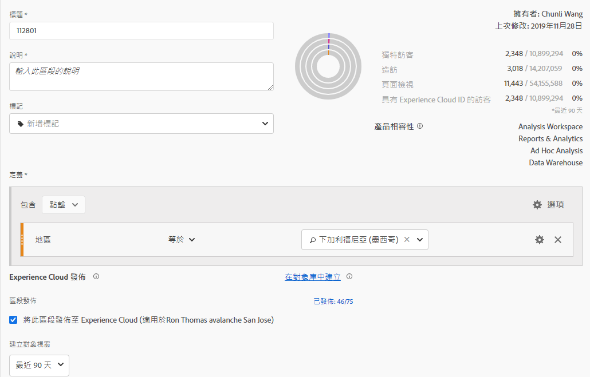

# 發佈區段 {#publish-segments}

>[!CONTEXTUALHELP]
>id="components_segments_publishing"
>title="Experience Cloud 發佈"
>abstract="您可以將此客群發佈至客群庫，即可在 Target 和其他 Experience Cloud 解決方案的行銷活動使用此客群。"

>[!CONTEXTUALHELP]
>id="components_segments_audiencelibrary"
>title="客群庫"
>abstract="在客群庫中所建立的區段可立即使用，非取決於 Analytics 更新。"

您可以將Adobe Analytics區段發佈至Experience Cloud。 因此，您可以在[!DNL Audience Manager]和其他啟用管道（包括[!DNL Advertising Cloud]、[!DNL Target]和[!DNL Campaign]）中，使用該區段進行行銷活動。

您可以在8小時內將Analytics區段發佈至Experience Cloud。 使用這些區段，在 Audience Manager 中將對象啟動至所有下游目的地。

>[!BEGINSHADEBOX]

如需示範影片，請參閱 [發佈區段](https://video.tv.adobe.com/v/32842?quality=12&learn=on){target="_blank"}。

>[!ENDSHADEBOX]

>[!NOTE]
>
>Adobe Campaign (Classic 和 Standard 版) 的運作方式不同，除了 8 小時延遲外，還會產生額外的 24 小時延遲。

## 先決條件

* 請確認您要儲存此區段的目標報表套裝已[啟用Experience Cloud](https://experienceleague.adobe.com/en/docs/analytics/components/segmentation/segmentation-workflow/seg-publish)。 否則，您無法將其發佈至Experience Cloud。
* 請確認貴組織使用 Experience Cloud ID。
* 管理員必須先在[管理控制台](https://experienceleague.adobe.com/zh-hant/docs/core-services/interface/administration/admin-tool-experience-cloud)中將[!UICONTROL 區段發佈]權限指派給產品設定檔，然後將您新增至該產品設定檔，您才能發佈區段。

## 考量事項

* **報表套裝限制**：每個報表套裝最多可發佈 75 個區段。此限制會強制執行。如果已發佈 75 個區段，則必須取消發佈足夠的區段，讓區段數少於 75 個區段的臨界值，才能發佈其他任何區段。
* **成員限制**：透過 Adobe Analytics 與 [!DNL Experience Cloud] 共用的客群不能超過 2,000 萬名不重複成員。
* **資料隱私權**：系統不會根據訪客的驗證狀態篩選客群。訪客或許可以在未驗證和已驗證狀態下瀏覽您的網站。 訪客未驗證時所發生的動作，仍可能會導致將訪客納入受眾。 請參閱 [Adobe Experience Cloud 隱私權](https://www.adobe.com/tw/privacy/experience-cloud.html)以瞭解客群共享的完整隱私權意涵。
* 如需有關&#x200B;**與[!DNL Adobe Analytics]中區段之間[!DNL Audience Manager]**&#x200B;差異的討論，請參閱[瞭解Analytics與Audience Manager中的區段](https://experienceleague.adobe.com/en/docs/analytics/integration/audience-analytics/audience-analytics-workflow/aam-analytics-segments)。

## 區段發佈時間軸

| 可用功能 | 可用時間 | 可用位置 |
|---|---|---|
| 中繼資料 (區段標題和定義) | 發佈後立即生效 | [!DNL Audience Manager]、[!UICONTROL Experience Cloud 客群庫]、[!DNL Target] |
| 可用的具成員資格區段 | 發佈後 8 小時內 | [!DNL Audience Manager] 中的訪客輪廓檢視器 |
| 特徵與成員母群體 | 24 - 48小時內 | [!DNL Audience Manager] |

>[!NOTE]
>所有資料每週都會完全同步一次，以處理上週未擷取的任何增量或差異。

## 在[!UICONTROL 區段產生器]中發佈區段

1. 在Adobe Analytics中，前往&#x200B;**[!UICONTROL 元件]** > **[!UICONTROL 區段]**
1. 選取「**[!UICONTROL 新增]**」以建立新區段。
   
1. 提供區段的標題和說明。 您必須先填寫這些欄位，才能儲存區段。
1. 在&#x200B;**[!UICONTROL Experience Cloud發佈]**&#x200B;區段中，選取選項&#x200B;**[!UICONTROL 將此區段發佈至Experience Cloud （適用於&#x200B;*報表套裝*）]**。

   >[!IMPORTANT]
   >
   >比較Experience Cloud數字與Audience Manager數字時，請務必在&#x200B;**[!UICONTROL 資料預覽]**&#x200B;中監視&#x200B;**[!UICONTROL 具有Adobe Analytics ID]**&#x200B;的訪客，而非&#x200B;**[!UICONTROL 不重複訪客]**。
   >

| 元素 | 說明 |
|---|---|
| **[!UICONTROL 將此區段發佈至Experience Cloud （針對&#x200B;*報表套裝*）]** | 啟用此選項後，區段標題和定義會立即與Experience Cloud共用，而區段會籍則每4小時評估及共用一次。  例如，將客群與 [!DNL Target] 中的活動建立關聯後，[!DNL Analytics] 會開始傳送 ID 給符合 Experience Cloud 和 [!DNL Target] 客群資格的訪客。此時，對象名稱和對應的資料開始顯示在Experience Cloud的[!DNL Audience Library]頁面上。  |
| **[!UICONTROL 建立客群視窗]** | 您選取的時間範圍會用於依滾動日曆建立對象。 例如，**[!UICONTROL 最近30天]** （預設）包含自當天日期（並非建立區段的原始日期）起最近30天符合對象資格的訪客。 |
| **[!UICONTROL 在客群庫中建立]** | 您在Experience Cloud中建立和發佈的區段可在[!DNL Audience Library]頁面上無延遲提供使用。 這些區段不依賴 Analytics 更新。這些區段不會計入 75 個已發佈區段的限制中。 |
| **[!UICONTROL 已發佈 x 個 (共 75 個)]** | 您已發佈至Experience Cloud的區段數。 按一下連結，可檢視已發佈區段及其關聯報表套裝和擁有者的清單。 |
| **[!UICONTROL 儲存]** | 儲存此區段。 |

## 取消發佈或刪除區段

>[!CAUTION]
>
>若要刪除已發佈至Experience Cloud的區段，必須先取消發佈該區段。 若要取消發佈區段，只要取消選取「**[!UICONTROL 將此區段發佈至Experience Cloud」（針對&#x200B;*報表套裝*）]**。

>[!NOTE]
>
>您&#x200B;**無法**&#x200B;取消發佈下列任何 Adobe 解決方案目前正在使用的區段：[!DNL Analytics] (在 [!DNL Audience Analytics] 中)、[!DNL Campaign]、[!DNL Advertising Cloud] (適用於 [!DNL Core Service] 和 [!DNL Audience Manager] 客戶) 以及所有其他外部合作夥伴 (適用於 [!DNL Audience Manager] 客戶)。您&#x200B;**可以**&#x200B;取消發佈 [!DNL Target] 正在使用的區段。

## 檢視區段的發佈狀態

可發佈的Adobe Analytics區段數上限為75個。

若要檢視已發佈的區段：

1. 在Adobe Analytics中，移至&#x200B;**[!UICONTROL 元件]** > **[!UICONTROL 區段]**。

1. 檢視&#x200B;**[!UICONTROL 已發佈]**&#x200B;欄。 此欄中的&#x200B;**[!UICONTROL 是]**&#x200B;表示該區段已發佈至Experience Cloud。 **[!UICONTROL 否]**&#x200B;表示區段尚未發佈。

## 擷取 [!DNL Audience Manager] UUID

有兩種方式可擷取目前與瀏覽器相關聯的Adobe Audience Manager UUID：

* Adobe Experience Cloud Debugger
* 瀏覽器中的原生開發人員工具(例如Chrome Developer Tools)

下列熒幕擷取畫面顯示如何在瀏覽器中擷取Adobe Audience Manager UUID，並在Audience Manager訪客資料檢視器中使用該UUID，以驗證特徵和區段成員資格。

### 方法 1：使用 Adobe Experience Cloud Debugger

1. 在 Chrome 線上應用程式商店中下載並安裝 [Adobe Experience Cloud Debugger](/help/implement/validate/debugger.md)。
1. 載入頁面時啟動除錯程式。
1. 捲動至Audience Manager區段，並尋找在目前瀏覽器頁面上設定的Adobe Audience Manager UUID
（下列範例中為`35721780439475290181087231320657663953`）

   

### 方法 2：使用 Chrome 開發者工具 (或其他瀏覽器開發者工具)

1. 載入頁面之前先啟動 Chrome 開發者工具
1. 載入頁面並勾選「應用程式 > Cookie」。Adobe Audience Manager UUID應在第三方中設定
Demdex Cookie （下列範例中為[adobe.demdex.net](https://experienceleague.adobe.com/en/docs/audience-manager/user-guide/reference/demdex-calls)）。 demdex欄位是Adobe Audience Manager UUID集
在瀏覽器上（以下範例中為`35721780439475290181087231320657663953`）。

   

## 使用 Audience Manager [!UICONTROL 訪客輪廓檢視器]

載入[!UICONTROL 訪客資料檢視器]時，瀏覽器上的Adobe Audience Manager UUID預設為使用。 如果您驗證其他使用者的特徵實現，請在UUID欄位中輸入UUID，然後按一下[!UICONTROL 重新整理]。 如需詳細資訊，請參閱[訪客輪廓檢視器](https://experienceleague.adobe.com/en/docs/audience-manager/user-guide/features/visitor-profile-viewer)。

## 在 [!DNL Audience Manager] 中檢視區段特徵

在Adobe Audience Manager中，當Analytics與Experience Cloud共用區段時，會評估指定區段的訪客清單（含ECID）。

1. 在[!DNL Audience Manager]中，移至&#x200B;**[!UICONTROL 對象資料]** > **[!UICONTROL 特徵]** > **[!UICONTROL 分析特徵]**。 您會看到已對應至您Experience Cloud組織的每個Analytics報表套裝的資料夾。 當輪廓和客群/人員核心服務啟動或佈建時，就會建立這些資料夾 (特徵、細分群體和資料來源)。
1. 選取您先前建立要與 [!DNL Audience Manager] 共用之區段的報表套裝資料夾。您會看到建立的區段/對象。 當您共用區段時，[!DNL Audience Manager] 中會發生下列兩件事：
   * 系統會建立一個特徵，一開始不含任何資料。大約在區段發佈 8 小時後，[!DNL Analytics] ECID 清單就會上線並與 [!DNL Audience Manager] 及其他 Experience Cloud 解決方案共用。

     

   * 系統會建立一個單一特徵區段。這個區段使用的資料來源與您發佈該區段的報表套裝相關聯。
   * 特徵過期時間已設為 16 天 (之前為 2 天)。

## 在 [!DNL Adobe Target] 中檢視區段

**[!UICONTROL 將此區段發佈至Experience Cloud]**&#x200B;可讓該區段可用於Adobe Target的自訂對象庫。 在 Analytics 或 Audience Manager 中建立的區隔皆適用於 Target 中的活動。例如，您可以根據 Analytics 中建立的 Analytics 轉換量度和客群細分群體來建立行銷活動。

在Adobe Target中：

1. 選取&#x200B;**[!UICONTROL 對象]**。
1. 在&#x200B;**[!UICONTROL 客群]**&#x200B;頁面上，找到來源為 [!DNL Experience Cloud] 的客群。這些客群可在 [!DNL Target] 活動中使用。

   
