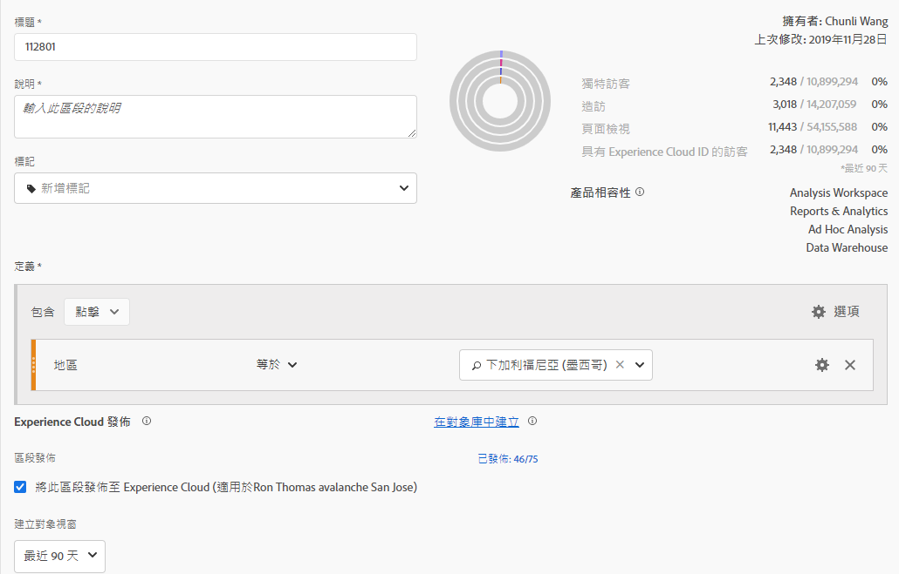

# 發佈區段 {#publish-segments}

>[!CONTEXTUALHELP]
>id="components_segments_publishing"
>title="Experience Cloud 發佈"
>abstract="您可以將此客群發佈至客群庫，即可在 Target 和其他 Experience Cloud 解決方案的行銷活動使用此客群。"

>[!CONTEXTUALHELP]
>id="components_segments_audiencelibrary"
>title="客群庫"
>abstract="在客群庫中所建立的區段可立即使用，非取決於 Analytics 更新。"

You can publish an Adobe Analytics segment to the Experience Cloud. So, you can use the segment for marketing activity in [!DNL Audience Manager] and in other activation channels, including [!DNL Advertising Cloud], [!DNL Target], and [!DNL Campaign].

You can publish Analytics segments to Experience Cloud in under 8 hours. 使用這些區段，在 Audience Manager 中將對象啟動至所有下游目的地。

>[!BEGINSHADEBOX]

See  [Publish segments](https://experienceleague.adobe.com/zh-hant/docs/analytics-learn/tutorials/integrations/experience-cloud/improved-experience-cloud-audience-publishing){target="_blank"} for a demo video.

>[!ENDSHADEBOX]

>[!NOTE]
>
>Adobe Campaign (Classic 和 Standard 版) 的運作方式不同，除了 8 小時延遲外，還會產生額外的 24 小時延遲。

## 先決條件

* Ensure that the report suite that you are saving this segment to is [enabled for Experience Cloud](/help/components/segmentation/segmentation-workflow/seg-publish.md). Otherwise, you cannot publish it to Experience Cloud.
* 請確認貴組織使用 Experience Cloud ID。
* 管理員必須先在[管理控制台](https://experienceleague.adobe.com/zh-hant/docs/core-services/interface/administration/admin-tool-experience-cloud)中將[!UICONTROL 區段發佈]權限指派給產品設定檔，然後將您新增至該產品設定檔，您才能發佈區段。

## 考量事項

* **報表套裝限制**：每個報表套裝最多可發佈 75 個區段。此限制會強制執行。如果已發佈 75 個區段，則必須取消發佈足夠的區段，讓區段數少於 75 個區段的臨界值，才能發佈其他任何區段。
* **成員限制**：透過 Adobe Analytics 與 [!DNL Experience Cloud] 共用的客群不能超過 2,000 萬名不重複成員。
* **資料隱私權**：系統不會根據訪客的驗證狀態篩選客群。訪客或許可以在未驗證和已驗證狀態下瀏覽您的網站。 訪客未驗證時所發生的動作，仍可能會導致將訪客納入受眾。 請參閱 [Adobe Experience Cloud 隱私權](https://www.adobe.com/tw/privacy/experience-cloud.html)以瞭解客群共享的完整隱私權意涵。
* 如需有關&#x200B;**與[!DNL Adobe Analytics]中區段之間[!DNL Audience Manager]**&#x200B;差異的討論，請參閱[瞭解Analytics與Audience Manager中的區段](/help/integrate/c-audience-analytics/aam-analytics-segments.md)。

## 區段發佈時間軸

| 可用功能 | 可用時間 | 可用位置 |
|---|---|---|
| 中繼資料 (區段標題和定義) | 發佈後立即生效 | [!DNL Audience Manager]、[!UICONTROL Experience Cloud 客群庫]、[!DNL Target] |
| 可用的具成員資格區段 | 發佈後 8 小時內 | [!DNL Audience Manager] 中的訪客輪廓檢視器 |
| 特徵與成員母群體 | 24 - 48小時內 | [!DNL Audience Manager] |

>[!NOTE]
>Once a week, all data is fully synced to account for any deltas or discrepancies not captured in the previous week.

## Publish segments in [!UICONTROL Segment builder]

1. 在Adobe Analytics中，前往&#x200B;**[!UICONTROL 元件]** > **[!UICONTROL 區段]**
1. 選取「**[!UICONTROL 新增]**」以建立新區段。
   
1. 提供區段的標題和說明。 您必須先填寫這些欄位，才能儲存區段。
1. 在&#x200B;**[!UICONTROL Experience Cloud發佈]**&#x200B;區段中，選取選項&#x200B;**[!UICONTROL 將此區段發佈至Experience Cloud （適用於&#x200B;*報表套裝*）]**。

   >[!IMPORTANT]
   >
   >比較Experience Cloud數字與Audience Manager數字時，請務必在&#x200B;**[!UICONTROL 資料預覽]**&#x200B;中監視&#x200B;**[!UICONTROL 具有Adobe Analytics ID]**&#x200B;的訪客，而非&#x200B;**[!UICONTROL 不重複訪客]**。
   >

| 元素 | 說明 |
|---|---|
| **[!UICONTROL Publish this segment to the Experience Cloud (for *report suite*)]** | When this option is enabled, the segment title and definition are shared with Experience Cloud instantaneously, while the segment membership is evaluated and shared every 4 hours.  例如，將客群與 [!DNL Target] 中的活動建立關聯後，[!DNL Analytics] 會開始傳送 ID 給符合 Experience Cloud 和 [!DNL Target] 客群資格的訪客。At that point, the audience name and corresponding data begin displaying on the [!DNL Audience Library] page in Experience Cloud.   |
| **[!UICONTROL 建立客群視窗]** | 您選取的時間範圍會用於依滾動日曆建立對象。 For example, **[!UICONTROL Last 30 days]** (default) includes visitors that have qualified for the audience over the last 30 days from today&#39;s date (NOT from the original date when the segment was created). |
| **[!UICONTROL 在客群庫中建立]** | The segments that you create and publish can be made available without latency on the [!DNL Audience Library] page in Experience Cloud. 這些區段不依賴 Analytics 更新。這些區段不會計入 75 個已發佈區段的限制中。 |
| **[!UICONTROL 已發佈 x 個 (共 75 個)]** | 您已發佈至Experience Cloud的區段數。 按一下連結，可檢視已發佈區段及其關聯報表套裝和擁有者的清單。 |
| **[!UICONTROL 儲存]** | 儲存此區段。 |

## 取消發佈或刪除區段

>[!CAUTION]
>
>若要刪除已發佈至Experience Cloud的區段，必須先取消發佈該區段。 若要取消發佈區段，只要取消選取「**[!UICONTROL 將此區段發佈至Experience Cloud」（針對&#x200B;*報表套裝*）]**。

>[!NOTE]
>
>您&#x200B;**無法**&#x200B;取消發佈下列任何 Adobe 解決方案目前正在使用的區段：[!DNL Analytics] (在 [!DNL Audience Analytics] 中)、[!DNL Campaign]、[!DNL Advertising Cloud] (適用於 [!DNL Core Service] 和 [!DNL Audience Manager] 客戶) 以及所有其他外部合作夥伴 (適用於 [!DNL Audience Manager] 客戶)。您&#x200B;**可以**&#x200B;取消發佈 [!DNL Target] 正在使用的區段。

## 檢視區段的發佈狀態

可發佈的Adobe Analytics區段數上限為75個。

To view published segments:

1. In Adobe Analytics, go to **[!UICONTROL Components]** > **[!UICONTROL Segments]**.

1. View the **[!UICONTROL Published]** column. **[!UICONTROL Yes]** in this column indicates that the segment is published to Experience Cloud. **[!UICONTROL No]** indicates that the segment is not published.

## 擷取 [!DNL Audience Manager] UUID

There are two ways to capture the Adobe Audience Manager UUID currently associated with the browser:

* Adobe Experience Cloud Debugger
* Native developer tool in browsers (for example, Chrome Developer Tools)

The following screenshots show you how to retrieve the Adobe Audience Manager UUID in your browser and use it in Audience Manager Visitor Profile Viewer to validate trait &amp; segment membership.

### 方法 1：使用 Adobe Experience Cloud Debugger

1. 在 Chrome 線上應用程式商店中下載並安裝 [Adobe Experience Cloud Debugger](/help/implement/validate/debugger.md)。
1. 載入頁面時啟動除錯程式。
1. 捲動至Audience Manager區段，並尋找在目前瀏覽器頁面上設定的Adobe Audience Manager UUID
（下列範例中為`35721780439475290181087231320657663953`）

   

### 方法 2：使用 Chrome 開發者工具 (或其他瀏覽器開發者工具)

1. 載入頁面之前先啟動 Chrome 開發者工具
1. 載入頁面並勾選「應用程式 > Cookie」。Adobe Audience Manager UUID應在第三方中設定
Demdex Cookie （下列範例中為[adobe.demdex.net](https://experienceleague.adobe.com/zh-hant/docs/audience-manager/user-guide/reference/demdex-calls)）。 demdex欄位是Adobe Audience Manager UUID集
在瀏覽器上（以下範例中為`35721780439475290181087231320657663953`）。

   

## 使用 Audience Manager [!UICONTROL 訪客輪廓檢視器]

載入[!UICONTROL 訪客資料檢視器]時，瀏覽器上的Adobe Audience Manager UUID預設為使用。 如果您驗證其他使用者的特徵實現，請在UUID欄位中輸入UUID，然後按一下[!UICONTROL 重新整理]。 如需詳細資訊，請參閱[訪客輪廓檢視器](https://experienceleague.adobe.com/zh-hant/docs/audience-manager/user-guide/features/visitor-profile-viewer)。

## 在 [!DNL Audience Manager] 中檢視區段特徵

In Adobe Audience Manager, the list of visitors with ECIDs for a given segment is evaluated while Analytics shares segments with Experience Cloud.

1. In [!DNL Audience Manager], go to **[!UICONTROL Audience Data]** > **[!UICONTROL Traits]** > **[!UICONTROL Analytics Traits]**. You see a folder for each Analytics reports suite that is mapped to your Experience Cloud organization. 當輪廓和客群/人員核心服務啟動或佈建時，就會建立這些資料夾 (特徵、細分群體和資料來源)。
1. 選取您先前建立要與 [!DNL Audience Manager] 共用之區段的報表套裝資料夾。您會看到建立的區段/對象。 當您共用區段時，[!DNL Audience Manager] 中會發生下列兩件事：
   * 系統會建立一個特徵，一開始不含任何資料。大約在區段發佈 8 小時後，[!DNL Analytics] ECID 清單就會上線並與 [!DNL Audience Manager] 及其他 Experience Cloud 解決方案共用。

     

   * 系統會建立一個單一特徵區段。這個區段使用的資料來源與您發佈該區段的報表套裝相關聯。
   * 特徵過期時間已設為 16 天 (之前為 2 天)。

## 在 [!DNL Adobe Target] 中檢視區段

**[!UICONTROL 將此區段發佈至Experience Cloud]**&#x200B;可讓該區段可用於Adobe Target的自訂對象庫。 在 Analytics 或 Audience Manager 中建立的區隔皆適用於 Target 中的活動。例如，您可以根據 Analytics 中建立的 Analytics 轉換量度和客群細分群體來建立行銷活動。

在Adobe Target中：

1. 選取&#x200B;**[!UICONTROL 對象]**。
1. 在&#x200B;**[!UICONTROL 客群]**&#x200B;頁面上，找到來源為 [!DNL Experience Cloud] 的客群。這些客群可在 [!DNL Target] 活動中使用。

   
