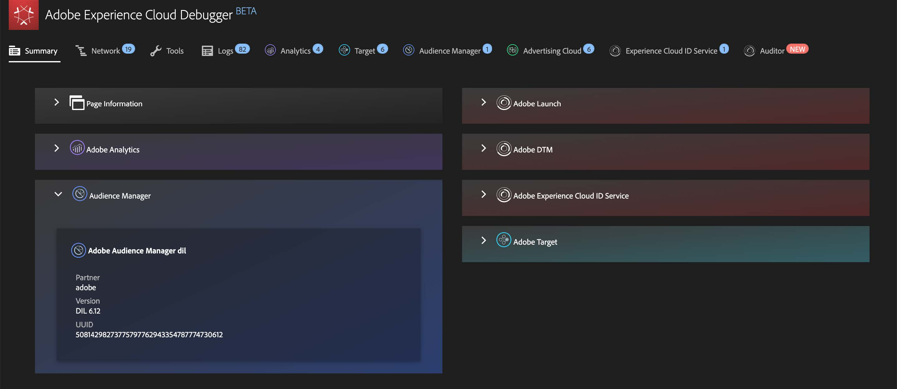

# 要Experience Cloud的Publish區段

將Adobe Analytics區段發佈至Experience Cloud，可讓您在[!DNL Audience Manager]和其他啟用管道(包括Adobe的[!DNL Advertising Cloud]、[!DNL Target]和[!DNL Campaign])中，使用該區段進行行銷活動。 近期的更新已大幅最佳化發佈工作流程。現在，您可以在 8 小時內便將 Analytics 區段發佈至 Experience Cloud。使用這些區段，在 Audience Manager 中將對象啟動至所有下游目的地。

我們也將可發佈的 Adobe Analytics 區段數量上限從 20 個增加到 75 個。您可以在[!UICONTROL 「Analytics > 元件 > 區段」]中檢視已發佈的區段。

如需詳細資訊，請觀看這段影片：

>[!VIDEO](https://video.tv.adobe.com/v/32842/?quality=12)

>[!NOTE]
>
>Adobe Campaign (Classic 和 Standard 版) 的運作方式不同，除了 8 小時延遲外，還會產生額外的 24 小時延遲。

## 先決條件

* 確定您要儲存此區段的目標報表套裝已[啟用Experience Cloud](https://experienceleague.adobe.com/docs/core-services/interface/audiences/t-publish-audience-segment.html?lang=zh-Hant)。 否則，您無法將其發佈到Experience Cloud。
* 請確認貴組織使用 Experience Cloud ID。
* 管理員必須先在[管理控制台](https://experienceleague.adobe.com/docs/core-services/interface/manage-users-and-products/admin-getting-started.html?lang=zh-Hant)中將[!UICONTROL 區段發佈]權限指派給產品設定檔，然後將您新增至該產品設定檔，您才能發佈區段。

## 考量事項

* **報表套裝限制**：每個報表套裝最多可發佈 75 個區段。此限制會強制執行。如果已發佈 75 個區段，則必須取消發佈足夠的區段，讓區段數少於 75 個區段的臨界值，才能發佈其他任何區段。
* **成員限制**：透過 Adobe Analytics 與 [!DNL Experience Cloud] 共用的客群不能超過 2,000 萬名不重複成員。
* **資料隱私權**：系統不會根據訪客的驗證狀態篩選客群。如果訪客可在未驗證和已驗證狀態下瀏覽您的網站，當訪客未驗證時發生的動作仍會使系統將訪客納入客群。請參閱 [Adobe Experience Cloud 隱私權](https://www.adobe.com/tw/privacy/experience-cloud.html)以瞭解客群共享的完整隱私權意涵。
* 有關 **[!DNL Adobe Analytics] 和[!DNL Audience Manager]** 中區段之間差異的探討，請前往[這裡](https://experienceleague.adobe.com/docs/analytics/integration/audience-analytics/audience-analytics-workflow/aam-analytics-segments.html?lang=zh-Hant)。

## 區段發佈時間軸

| 可用功能 | 可用時間 | 可用位置 |
|---|---|---|
| 中繼資料 (區段標題和定義) | 發佈後立即生效 | [!DNL Audience Manager]、[!UICONTROL Experience Cloud 客群庫]、[!DNL Target] |
| 可用的具成員資格區段 | 發佈後 8 小時內 | [!DNL Audience Manager] 中的訪客資料檢視器 |
| 特徵與成員母群體 | 24 - 48小時內 | [!DNL Audience Manager] |

>[!NOTE]
>所有資料每週都會完全同步一次，以更新前一週未擷取的任何增量或差異。

## 在[!UICONTROL 區段產生器]中發佈區段

1. 導覽至 **[!UICONTROL Analytics > Workspace > 元件 > 區段] > +**
1. 在[!UICONTROL 區段產生器]中建立區段。
1. 提供區段的標題和說明 (如未提供便無法儲存)。
1. 請參閱&#x200B;**[!UICONTROL 將此區段發佈至 Experience Cloud (適用於&#x200B;*報表套裝*)]**。

>[!IMPORTANT]
>在 Analytics 中查看區段預覽時，請務必使用「具有 Experience Cloud ID 的訪客」，而非比較 Adobe Analytics 數字與 Audience Manager 數字時的「不重複訪客」區段預覽總數：
>
>

| 元素 | 說明 |
|---|---|
| **[!UICONTROL 將此區段Publish至Experience Cloud（針對&#x200B;*`<report suite>`*）]** | 啟用此選項後，區段標題和定義（即廣告平台中常用的殼層對象）會立即與Experience Cloud共用，而區段會籍每4小時評估及共用一次。  例如，將客群與 [!DNL Target] 中的活動建立關聯後，[!DNL Analytics] 會開始傳送 ID 給符合 Experience Cloud 和 [!DNL Target] 客群資格的訪客。此時，對象名稱和對應的資料會開始在Experience Cloud的[!DNL Audience Library]頁面上顯示。  |
| **[!UICONTROL 建立客群視窗]** | 您選取的時間範圍會用於依時序建立客群。例如，「最近 30 天」(預設值) 包含自當天 (並非建立細分群體的原始日期) 起的過去 30 天內符合客群資格的訪客。 |
| **[!UICONTROL 在客群庫中建立]** | 您建立和發佈的區段可在Experience Cloud的[!DNL Audience Library]頁面上無延遲提供使用。 這些區段不依賴 Analytics 更新。這些區段不會計入 75 個已發佈區段的限制中。 |
| **[!UICONTROL 已發佈 x 個 (共 75 個)]** | 顯示您已發佈至Experience Cloud的區段數。 按一下連結，可檢視已發佈區段及其關聯報表套裝和擁有者的清單。 |
| **[!UICONTROL 儲存]** | 儲存此區段。 |

## 取消發佈或刪除區段

若要刪除已發佈至Experience Cloud的區段，必須先將其取消發佈。 若要取消發佈區段，只需&#x200B;**取消勾選**&#x200B;您用來發佈該區段的核取方塊即可。

>[!NOTE]
>
>您&#x200B;**無法**&#x200B;取消發佈下列任何 Adobe 解決方案目前正在使用的區段：[!DNL Analytics] (在 [!DNL Audience Analytics] 中)、[!DNL Campaign]、[!DNL Advertising Cloud] (適用於 [!DNL Core Service] 和 [!DNL Audience Manager] 客戶) 以及所有其他外部合作夥伴 (適用於 [!DNL Audience Manager] 客戶)。您&#x200B;**可以**&#x200B;取消發佈 [!DNL Target] 正在使用的區段。

## 在[!UICONTROL 區段管理器]中檢視區段發佈狀態

1. 導覽至 [!UICONTROL Analytics > 元件 > 區段]。
1. 請注意新的[!UICONTROL 已發佈]欄。「是/否」指的是區段是否已發佈至Experience Cloud。

## 擷取 [!DNL Audience Manager] UUID

有兩種方式可擷取目前與瀏覽器相關聯的Adobe Audience Manager UUID：

* Adobe Experience Cloud Debugger
* 瀏覽器中的原生開發者工具 (例如 Chrome 開發者工具)

下列熒幕擷取畫面顯示如何在瀏覽器上擷取Adobe Audience Manager UUID，並在Audience Manager訪客資料檢視器中使用該UUID，以驗證特徵和區段成員資格。

### 方法 1：使用 Adobe Experience Cloud Debugger

1. 在 Chrome 線上應用程式商店中下載並安裝 [Adobe Experience Cloud Debugger](/help/implement/validate/debugger.md)。
1. 載入頁面時啟動除錯程式。
1. 捲動至「Audience Manager」區段，並尋找在目前瀏覽器頁面上設定的Adobe Audience Manager UUID
（下列範例中為`50814298273775797762943354787774730612`）

### 方法 2：使用 Chrome 開發者工具 (或其他瀏覽器開發者工具)

1. 載入頁面之前先啟動 Chrome 開發者工具
1. 載入頁面並勾選「應用程式 > Cookie」。Adobe Audience Manager UUID應在第三方中設定
Demdex Cookie （下列範例中為[adobe.demdex.net](https://experienceleague.adobe.com/docs/audience-manager/user-guide/reference/demdex-calls.html?lang=zh-Hant)）。 demdex欄位是Adobe Audience Manager UUID集
在瀏覽器上（以下範例中為`50814298273775797762943354787774730612`）。

## 使用 Audience Manager [!UICONTROL 訪客資料檢視器]

載入[!UICONTROL 訪客資料檢視器]時，預設會使用瀏覽器上的Adobe Audience Manager UUID。 若要驗證其他使用者的特徵實現，請在 UUID 欄位中輸入 UUID，然後按一下[!UICONTROL 「重新整理」]。如需詳細資訊，請參閱[訪客資料檢視器](https://experienceleague.adobe.com/docs/audience-manager/user-guide/features/visitor-profile-viewer.html?lang=zh-Hant)。

## 在 [!DNL Audience Manager] 中檢視區段特徵

在Adobe Audience Manager中，當Analytics與Experience Cloud共用區段時，會以串流方式評估指定區段的訪客清單（含ECID）。

1. 在 [!DNL Audience Manager] 中，前往[!UICONTROL 客群資料 > 特徵 > Analytics 特徵]。您將會看到已對應至您 Experience Cloud 組織的每個 Analytics 報表套裝的資料夾。當輪廓和客群/人員核心服務啟動或佈建時，就會建立這些資料夾 (特徵、細分群體和資料來源)。
1. 選取您先前建立要與 [!DNL Audience Manager] 共用之區段的報表套裝資料夾。這時會看到您建立的細分群體/客群。當您共用區段時，[!DNL Audience Manager] 中會發生下列兩件事：
   * 系統會建立一個特徵，一開始不含任何資料。大約在區段發佈 8 小時後，[!DNL Analytics] ECID 清單就會上線並與 [!DNL Audience Manager] 及其他 Experience Cloud 解決方案共用。

     

   * 系統會建立一個單一特徵區段。這個區段使用的資料來源與您發佈該區段的報表套裝相關聯。
   * 特徵過期時間已設為 16 天 (之前為 2 天)。

## 在 [!DNL Adobe Target] 中檢視區段

[!UICONTROL 將此細分群體發佈至 Experience Cloud] 核取方塊會在 Adobe Analytics 細分群體建立程序進行期間顯示，勾選後該細分群體將可供 Adobe Target 的自訂客群庫使用。在 Analytics 或 Audience Manager 中建立的區隔皆適用於 Target 中的活動。例如，您可以根據 Analytics 中建立的 Analytics 轉換量度和客群細分群體來建立行銷活動。

1. 按一下[!UICONTROL 「客群」]。
1. 在[!UICONTROL 客群]頁面上，找到來源為 [!DNL Experience Cloud] 的客群。這些客群可在 [!DNL Target] 活動中使用。
