# 建立循序區段

循序區段是使用 THEN 運算子所建立，而非 AND 或 OR 運算子。THEN 表示某個區段標準發生，然後接著另一個標準。依預設，循序區段會識別所有相符的資料，並顯示「包括所有人」篩選條件。可使用「僅限序列之前」和「僅限序列之後」選項，將循序區段進一步篩選成相符點擊的子集。

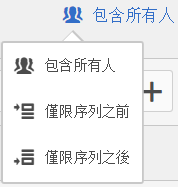

此外，您可以使用 [After 和 Within 運算子](/help/components/segmentation/segmentation-workflow/seg-sequential-build.md)，將查核點之間的循序區段限制為特定時段、詳細程度和計數。

以下是有關循序分段的影片：

>[!VIDEO](https://video.tv.adobe.com/v/25405/?quality=12)

## 包括所有人 {#section_75ADDD5D41F04800A09E592BB2940B35}

當建立一個區段並設定「包括所有人」，區段會識別整體符合指定模式的路徑。這是基本序列區段尋找同一位造訪者的一個點擊 (頁面 A )然後又一個點擊 (頁面 B) 的例子。這個區段設定為「包括所有人」。

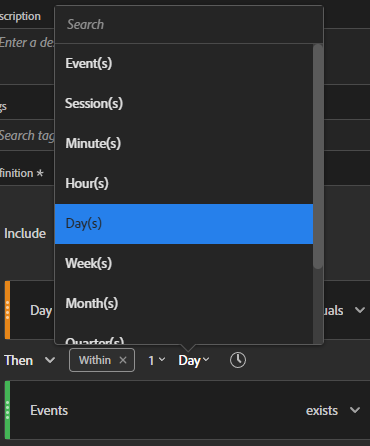

| 如果結果… | 序列 |
|--- |--- |
| 符合 | A 然後 B A 然後 (在不同次造訪中) B A 然後 D 然後 B |
| 不符合 | B 然後 A |

## 「僅限序列之前」與「僅限序列之後」 {#section_736E255C8CFF43C2A2CAAA6D312ED574}

**[!UICONTROL 「僅限序列之前」]**&#x200B;與&#x200B;**[!UICONTROL 「僅限序列之後」選項可讓您在指定的序列之前或之後，將區段篩選為資料子集。]**

* **「僅限序列之前」**：包括序列之前的所有點擊，以及該序列本身的首次點擊 (請參閱範例 1、3)。如果序列在路徑中出現多次，則「僅限序列之前」包括最後一個出現序列的首次點擊，以及先前的所有點擊 (請參閱範例 2)。
* **「僅限序列之後」**：包括序列之後的所有點擊，以及該序列本身的最後點擊 (請參閱範例 1、3)。如果序列在路徑中出現多次，則「僅限序列之後」包括第一個出現序列的最後點擊，以及之後的所有點擊 (請參閱範例 2)。

例如，假設有一個 B -> D 的序列。這三種篩選條件會依照下列方式識別點擊：

**範例 1：B 然後 D 出現一次**

| 範例 | A | B | C | D | E | F |
|---|---|---|---|---|---|---|
| 包括所有人 | A | B | C | D | E | F |
| 只限之前序列 | A | B |  |  |  |  |
| 只限之後序列 |  |  |  | D | E | F |

**範例 2：B 然後 D 出現多次**

| 範例 | A | B | C | D | B | C | D | E |
|---|---|---|---|---|---|---|---|---|
| 包括所有人 | A | B | C | D | B | C | D | E |
| 只限之前序列 | A | B | C | D | B |  |  |  |
| 只限之後序列 |  |  |  | D | B | C | D | E |

讓我們用「點擊深度」維度來建構此概念。

**範例 3：點擊深度 3 然後 5**

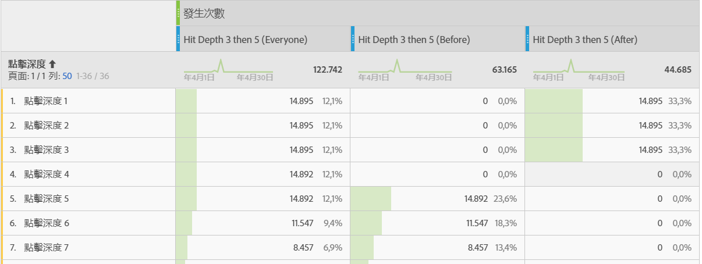

## 維度限制 {#section_EAFD755F8E674F32BCE9B642F7F909DB}

在「within」子句裡，您可以在「THEN」陳述式之間加入「within 1 search keyword instance」、「within 1 eVar 47 instance」之類的文字。這樣會將區段限制在某個維度的一個例項內。

在規則之間設定「維度內」子句，讓區段可以限制資料為只符合該子句的序列。請看下面的例子，其限制設定為「1 頁面以內」：

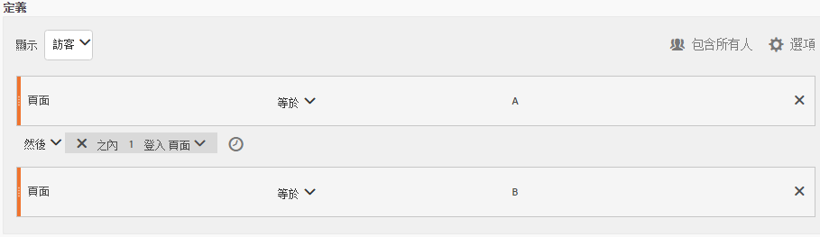

| 如果結果… | 序列 |
|--- |--- |
| 符合 | A 然後 B |
| 不符合 | A 然後 C 然後 B (因為 B 不在 A 的第 1 頁內)  **注意**：如果取出維度限制，「A 然後 B」和「A 然後 C 然後 B」都符合。 |

## 簡易頁面檢視序列

識別先檢視某個頁面再檢視另一個頁面的訪客。點擊層級資料在篩選此序列時不會考慮以前、過去或過渡作業，或之間發生的頁面檢視的時間或次數。

**範例**：訪客檢視頁面 A，然後在同次造訪或另一次造訪中檢視頁面 B。

**使用個案**

以下是如何使用此區段的範例。

1. 體育網站的訪客檢視足球登陸頁面，之後檢視籃球登陸頁面，這兩個動作是依序進行，但不一定是在同次瀏覽中進行。如此會在足球季提示行銷活動，以將籃球內容推送給足球觀眾。
1. 車輛零售商識別進行以下活動的訪客彼此之間的關係：先登陸客戶忠誠度頁面，然後在任何時候於當次或另一次瀏覽期間前往影片頁面。

**建立此區段**

您在頂層的「[!UICONTROL 訪客]」容器內巢狀內嵌兩個頁面規則，並使用 [!UICONTROL THEN] 運算子將頁面點擊排序。

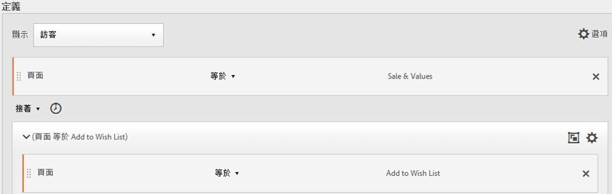

## 跨造訪的訪客序列

識別離開行銷活動但在其他作業中返回頁面檢視序列的訪客。

**範例**：訪客在單次造訪中檢視頁面 A，接著在另一次造訪中檢視頁面 B。

**使用個案**

以下是如何使用這類區段的範例：

* 訪客到新聞網站的體育頁面，然後在另一次作業中重新瀏覽體育頁面。
* 服飾零售商查看進行下列活動的訪客之間的關係：在某次作業中進入登陸頁面，然後在另一次作業中直接進入結帳頁面。

**建立此區段**

此範例會在頂層的「**[!UICONTROL 訪客]**」容器內巢狀內嵌兩個「**[!UICONTROL 瀏覽]**」容器，並使用 [!UICONTROL THEN] 運算子排序區段。

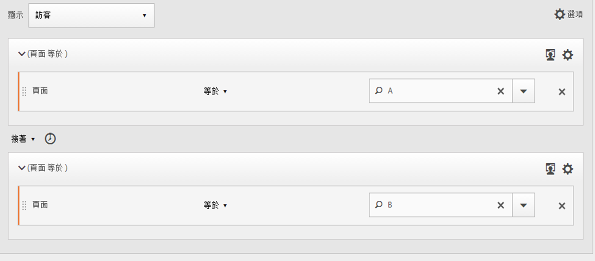

## 混合層級序列

識別在次數不定的瀏覽中檢視兩個頁面，然後在另一次瀏覽中檢視第三個頁面的訪客。

**範例**：訪客在一或多次造訪中造訪頁面 A 然後造訪頁面 B，接著在另一次造訪中造訪頁面 C。

**使用個案**

以下是如何使用這類區段的範例：

* 訪客先瀏覽新聞網站，然後在同次瀏覽中檢視體育頁面。在另一次瀏覽中，訪客瀏覽氣象頁面。
* 零售商定義的訪客先進入了主要頁面，然後前往「我的帳戶」頁面。這些訪客在另一次瀏覽中瀏覽「檢視購物車」頁面。

**建立此區段**

1. 從左側窗格拖曳兩個「頁面」維度到頂層的「[!UICONTROL 訪客]」容器內。
1. 在它們之間加入 THEN 運算子。
1. 按一下「**[!UICONTROL 選項]**」>「**[!UICONTROL 新增容器]**」，然後在「[!UICONTROL 訪客]」層級下新增「[!UICONTROL 瀏覽]」容器，並使用 [!UICONTROL THEN] 運算子設定序列順序。

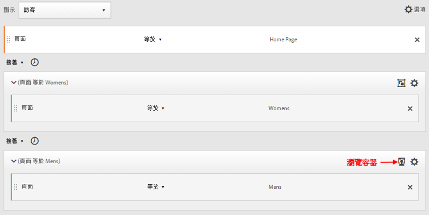

## 彙總容器

您可以在「[!UICONTROL 訪客]」容器中新增多個「[!UICONTROL 點擊]」容器，以在同類容器之間運用適當運算子並且使用規則和維度 (如「頁面」和「訪問次數」) 來定義頁面檢視，並在「[!UICONTROL 點擊]」容器內提供序列維度。在「點擊」層級套用邏輯可讓您在「[!UICONTROL 訪客]」容器內的相同點擊層級限制並結合相符項目，以建立各種區段類型。

**範例**：訪客在頁面檢視序列的首次點擊 (在範例中為頁面 D) 後瀏覽頁面 A，接著瀏覽頁面 B 或頁面 C (不管瀏覽幾次)。

**使用個案**

以下是如何使用這類區段的範例：

* 識別在某次瀏覽中前往「主要」登陸頁面、在另一次瀏覽中檢視「男性」服飾頁面、並又在不同次瀏覽中檢視「女性」或「兒童」登陸頁面的訪客。
* 電子雜誌進行下列活動的訪客：在某次瀏覽中前往首頁、在另一次瀏覽中前往「體育」頁面、並又在另一次瀏覽中前往「意見」頁面。

**建立此區段**

1. 選取「[!UICONTROL 訪客]」容器做為頂層容器。
1. 新增兩個「[!UICONTROL 點擊]」層級容器 — 這是一個維度和一個適當的數值維度，透過 [!UICONTROL AND] 和 [!UICONTROL OR] 運算子在相同的「[!UICONTROL 點擊]」層級連結在一起。
1. 在「[!UICONTROL 造訪]」容器中，新增另一個「[!UICONTROL 點擊]」容器並巢狀內嵌另兩個以 [!UICONTROL OR] 或 [!UICONTROL AND] 運算子連結在一起的「[!UICONTROL 點擊]」容器。

   使用 [!UICONTROL THEN] 運算子序列排序這些巢狀[!UICONTROL 「點擊」]容器。

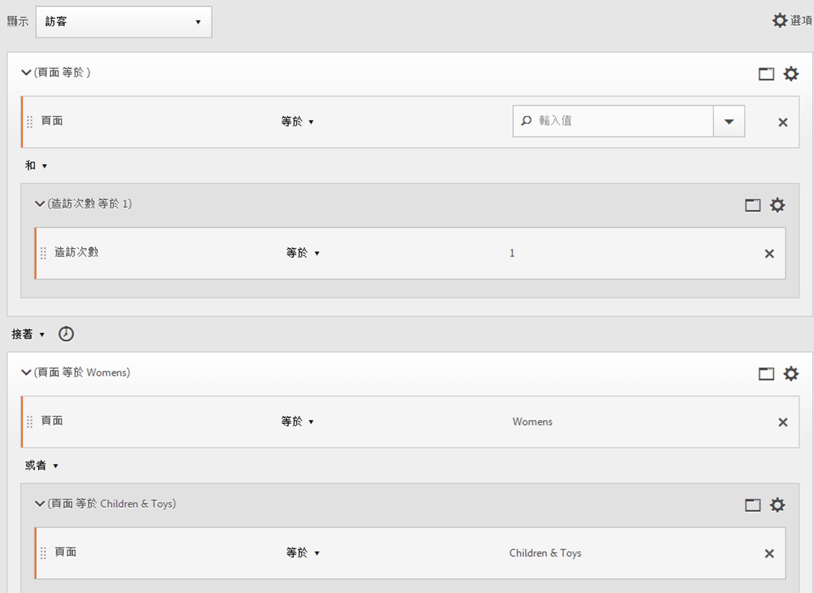

## 循序區段中的「巢狀內嵌」

同時在[!UICONTROL 瀏覽]和[!UICONTROL 點擊]層級放置查核點，可以限制區段符合特定瀏覽以及特定點擊的要求。

**範例**：訪客在同次造訪內先造訪頁面 A，接著造訪頁面 B。在新瀏覽中，訪客接著前往頁面 C。

**建立此區段**

1. 拖曳兩個頁面到頂層的「[!UICONTROL 瀏覽]」容器下。
1. 將兩個規則均選取，按一下「**[!UICONTROL 選項]**」>「**[!UICONTROL 從選項新增容器]**」並變更為「[!UICONTROL 瀏覽]」容器。
1. 使用 [!UICONTROL THEN] 運算子將它們連結。
1. 建立與「[!UICONTROL 瀏覽]」容器位於同層級的「點擊」容器，然後拖曳頁面維度到其中。
1. 使用另一個 [!UICONTROL THEN] 運算子將巢狀內嵌於「[!UICONTROL 瀏覽]」容器內的序列與「[!UICONTROL 點擊]容器」連結。

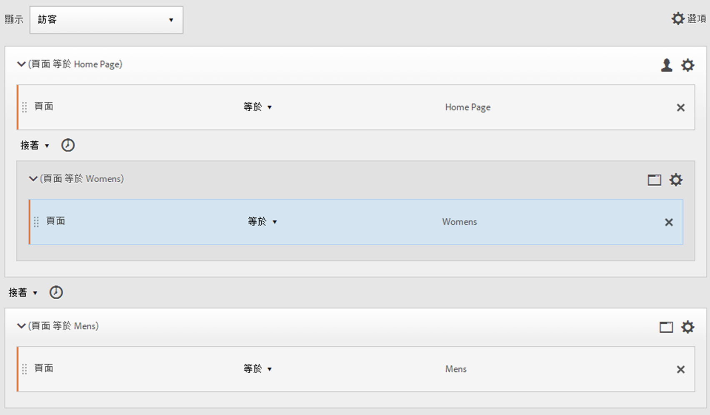

## 排除點擊

除非您使用「[!UICONTROL 排除]」規則特別排除[!UICONTROL 訪客]、[!UICONTROL 瀏覽]或[!UICONTROL 點擊]資料，否則區段規則會包含所有資料。此功能可讓您移除常見資料，建立焦點更明確的區段。也能讓您建立區段來排除找到的群組，用以識別剩餘資料集，例如可以建立規則來包含下訂單的成功訪客，然後排除這些訪客，以找出「未購買者」。不過，在大多數情況下，此功能較適合用來建立排除廣泛值的規則，而非使用[!UICONTROL 「排除」]規則來鎖定特定的包含值。

例如：

* **排除頁面**。使用區段規則從報告中移除特定頁面（例如&#x200B;*`Home Page`*）、建立頁面等於「首頁」的點選規則，然後排除它。 此規則會自動包含「首頁」以外的所有值。
* **排除反向連結網域**。使用僅包含來自 Google.com 之反向連結網域的規則，然後排除所有其他值。
* **找出未購買者**。找出訂單大於零的情形，然後排除該[!UICONTROL 訪客]。

可採用[!UICONTROL 「排除」]運算子，以識別訪客未執行特定瀏覽或點擊的序列。[!UICONTROL 排除查核點]也可以包含在[邏輯群組](/help/components/segmentation/segmentation-workflow/seg-sequential-build.md)中。

### 查核點之間排除

當另兩個查核點之間未明確發生查核點時，強制對區段訪客執行邏輯。

**範例**：訪客造訪了頁面 A，然後就造訪頁面 C 而未造訪頁面 B。

**使用個案**

以下是如何使用這類區段的範例：

* 訪客進入「生活品味」頁面後就進入「電影院」區，而未進入「藝術」頁面。
* 汽車零售商查看進行下列活動的訪客彼此之間的關係：瀏覽主要登陸頁面，然後直接進入「不感興趣」行銷活動，而未進入「汽車」頁面。

**建立此區段**

像建立簡單、混合層級或巢狀循序區段一樣建立區段，然後設定容器元素的[!UICONTROL EXCLUDE]運運算元。 以下範例為彙總區段，其中將三個[!UICONTROL 點擊]容器拖曳至畫布，並指派 [!UICONTROL THEN] 運算子來連結容器邏輯，接著排除中間頁面檢視容器，僅包含依序從頁面 A 前往頁面 C 的訪客。

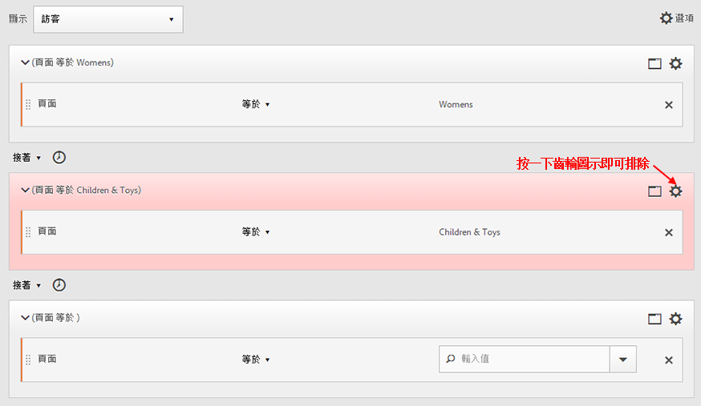

### 在序列開頭處排除

如果排除查核點位於循序區段的開頭，則可確保排除的頁面檢視不會發生在第一個非排除的點擊之前。

例如，餐廳想要檢視傾向於避開主要登陸頁面，直接進入「外送」頁面的使用者。 您可以排除登陸頁面的點選，並在循序區段中包含「結帳」頁面的點選，以檢視此資料。

**建立此區段**

在頂層的「訪客」容器內建立兩個不同的「點擊」容器。接著設定第一個容器的 [!UICONTROL EXCLUDE] 運算子。

### 在序列結尾處排除

如果排除查核點位於序列結尾，則可確保最後一個非排除查核點與訪客序列結尾之間不會出現此查核點。

例如，一家服裝店希望檢視所有造訪過產品頁面後從未造訪購物車的訪客。此範例可以簡化為訪客造訪頁面 A 後，在當下或之後的造訪中從未造訪頁面 B。

**建立此區段**

建立簡單序列區段，方法是拖曳兩個[!UICONTROL 點擊]容器至畫布並使用 [!UICONTROL THEN] 運算子將其連接。然後指派 [!UICONTROL EXCLUDE] 運算子至序列中的第二個[!UICONTROL 點擊]容器。

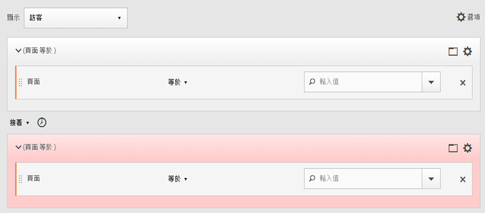

## 邏輯群組容器

邏輯群組容器必須將條件分組至單一循序區段查核點。特殊邏輯群組容器僅適用於循序區段，以確保其條件在任何先前的循序查核點之後，以及任何後續的循序查核點之前皆符合。邏輯群組查核點本身內的條件可依任何順序符合。相較之下，非循序容器 (點擊、造訪、訪客) 不要求其條件在整個序列中均符合，如果搭配使用 THEN 運算子會產生非直覺式結果。[!UICONTROL 邏輯群組]容器可將&#x200B;*數個查核點視為群組*，*而不需在群組查核點間排序*。換句話說，該群組內的查核點順序並無影響。例如，您不能在[!UICONTROL 訪客]容器中巢狀內嵌[!UICONTROL 訪客]容器。反之，您可以在具有特定[!UICONTROL 造訪]層級和[!UICONTROL 點擊]層級查核點的[!UICONTROL 訪客]容器中巢狀內嵌[!UICONTROL 邏輯群組]容器。

>[!NOTE]
>
>一個[!UICONTROL 邏輯群組]僅可在一個循序區段中加以定義，這代表需在運算式中使用 [!UICONTROL THEN] 運算子。

| 容器階層 | 圖例 | 定義 |
|---|---|---|
| 標準容器階層 |  | 在[!UICONTROL 訪客]容器中，[!UICONTROL 造訪]和[!UICONTROL 點擊]容器會依序巢狀，以根據點擊、造訪次數和訪客來擷取區段。 |
| 邏輯容器階層 |  | [!UICONTROL 邏輯群組]容器外部也要求標準容器階層。但在[!UICONTROL 邏輯群組]容器中，查核點不要求既定的順序或階層 — 這些查核點只要求符合一定順序的訪客。 |

邏輯群組似乎令人望之卻步，以下是一些使用邏輯群組的最佳作法：

**邏輯群組或點擊/造訪容器？**
如果要將循序查核點分組，則「容器」為邏輯群組。不過，如果這些循序查核點必須發生在單一點擊或造訪範圍內，則需要「點擊」或「造訪」容器。(當然，「點擊」對於一組循序查核點來說並沒有意義，因為一次點擊最多只會評為一個查核點)。

**邏輯群組是否可簡化建立循序區段的流程？**
是的，可以。假設您正嘗試識別此訪客區段：**檢視了頁面 A，接著分別檢視頁面 B、C 和 D 的訪客**

您可以在不使用邏輯群組容器的情況下建立此區段，但是過程既複雜又費力.您必須指定訪客可檢視的每個頁面順序：
* `Visitor Container [Page A THEN Page B THEN Page C THEN Page D] or`
* `Visitor Container [Page A THEN Page B THEN Page D THEN Page C] or`
* `Visitor Container [Page A THEN Page C THEN Page B THEN Page D] or`
* `Visitor Container [Page A THEN Page C THEN Page D THEN Page B] or`
* `Visitor Container [Page A THEN Page D THEN Page B THEN Page C] or`
* `Visitor Container [Page A THEN Page D THEN Page C THEN Page B]`

邏輯群組容器可大幅簡化建立此區段的流程，如下所示：

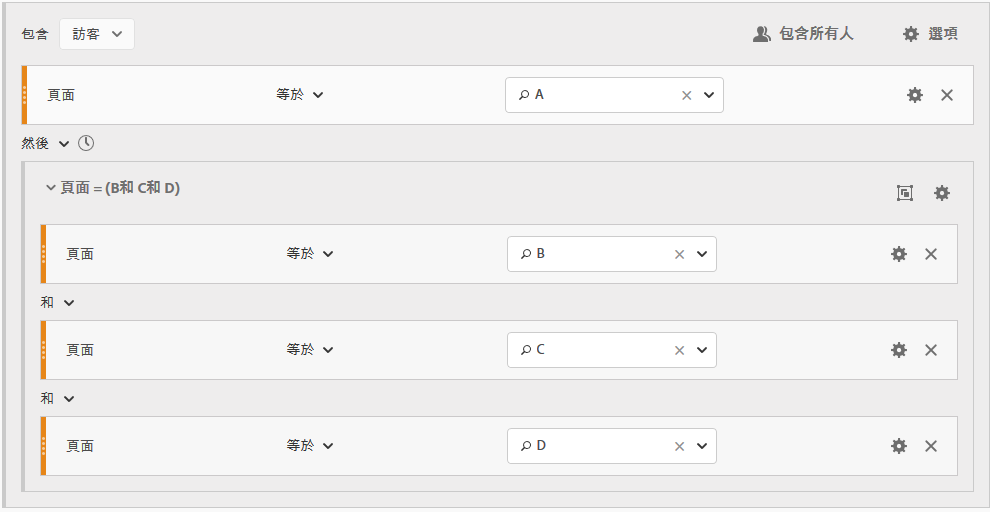

### 建立邏輯群組區段 {#section_A5DDC96E72194668AA91BBD89E575D2E}

和其他容器一樣，[!UICONTROL 區段產生器]中提供多種建立[!UICONTROL 邏輯群組]容器的方式。以下是巢狀內嵌[!UICONTROL 邏輯群組]容器的建議方式：

1. 從左側窗格拖曳維度、事件或區段。
1. 變更頂層容器為[!UICONTROL 訪客]容器。
1. 將預設插入的 [!UICONTROL AND] 或 [!UICONTROL OR] 運算子變更為 THEN 運算子。
1. 選取「[!UICONTROL 點擊]」容器 (「維度」、「事件」或「項目」)，然後按一下「**[!UICONTROL 選項]**」>「**[!UICONTROL 從選項新增容器]**」。
1. 按一下容器圖示，然後選取&#x200B;**[!UICONTROL 「邏輯群組」]**。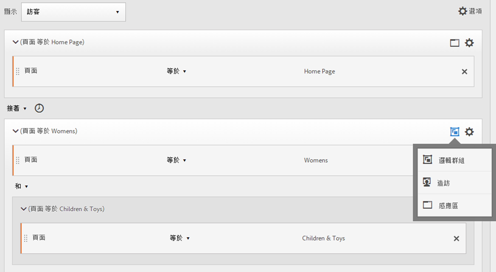
1. 您現在可以在[!UICONTROL 邏輯群組]容器中設定點擊，而不考慮[!UICONTROL 階層]。

### 任意順序的邏輯群組查核點

使用[!UICONTROL 邏輯群組]可讓您在不依照順序的群組中符合條件。這可讓您建立區段，其中[!UICONTROL 瀏覽]或[!UICONTROL 點擊]容器的發生不考慮正常階層。

**範例**：訪客造訪頁面 A，接著以任意順序造訪頁面 B 和頁面 C。

**建立此區段**

頁面 B 和 C 會巢狀內嵌於外層「[!UICONTROL 訪客]」容器內的「[!UICONTROL 邏輯群組]」容器中。A 的「[!UICONTROL 點擊]」容器後面接著含 B 和 C (以 [!UICONTROL AND] 運算子相連) 的「[!UICONTROL 邏輯群組]」容器。因為是在[!UICONTROL 邏輯群組]中，因此未定義序列，以任何順序點擊頁面 B 和 C 都會讓引數為 True。

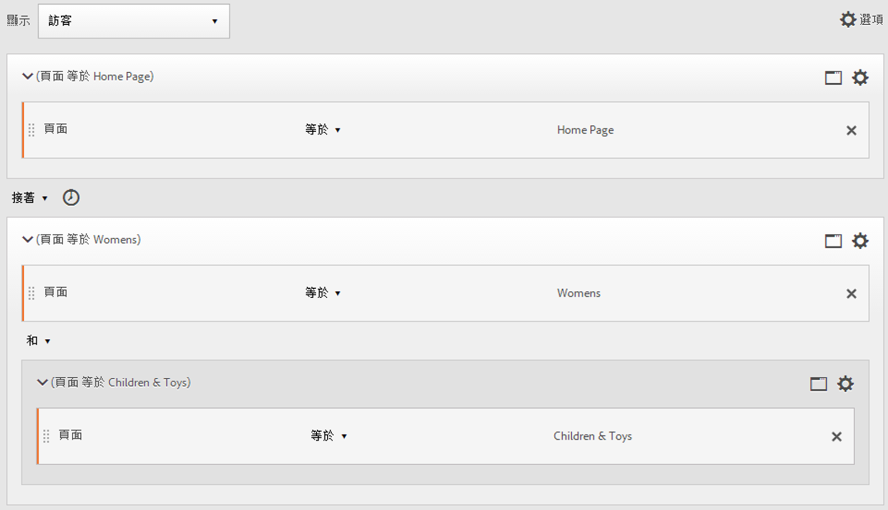

**另一個範例**：訪客造訪頁面 B 或頁面 C，接著造訪頁面 A：

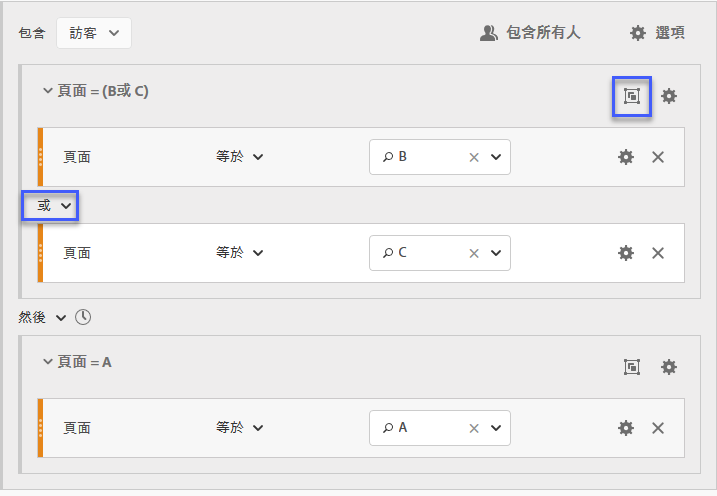

區段至少必須符合一個邏輯群組的查核點 (B 或 C)。此外，邏輯群組條件也可在相同點擊或跨多個點擊中符合。

### 邏輯群組第一個相符

使用[!UICONTROL 邏輯群組]可讓您在不依照順序的群組中符合條件。在這個無順序的第一個相符區段中，[!UICONTROL 邏輯群組]規則識別先檢視頁面 B 或頁面 C，接著必須檢視頁面 A。

**範例**：訪客造訪頁面 B 或頁面 C，接著造訪頁面 A。

**建立此區段**

頁面 B 和頁面 C 維度會在選取 [!UICONTROL OR] 運算子的情況下分組於「[!UICONTROL 邏輯群組]」容器中，然後就是一個識別頁面 A 的頁面檢視作為值的「[!UICONTROL 點擊]」容器。

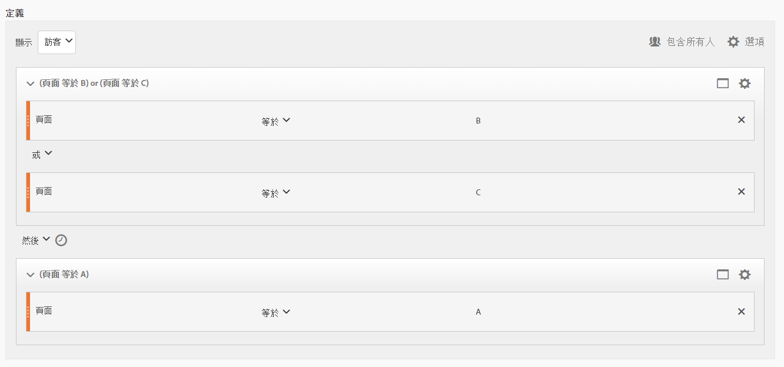

### 邏輯群組排除 AND

使用[!UICONTROL 邏輯群組]建立區段，其中總和多個頁面檢視來定義哪些頁面必須點擊，並明確遺漏其他頁面。****

**範例**：訪客造訪頁面 A，接著明確地未造訪頁面 B 或 C，但點擊了頁面 D。

**建立此區段**

從左窗格拖曳維度、事件和預先建立的區段，以建立此區段。請參閱[建立邏輯群組區段](/help/components/segmentation/segmentation-workflow/seg-sequential-build.md)。

在[!UICONTROL 邏輯群組]中巢狀內嵌值，按一下&#x200B;**[!UICONTROL 邏輯群組]**&#x200B;容器內的[!UICONTROL 「排除」]按鈕。

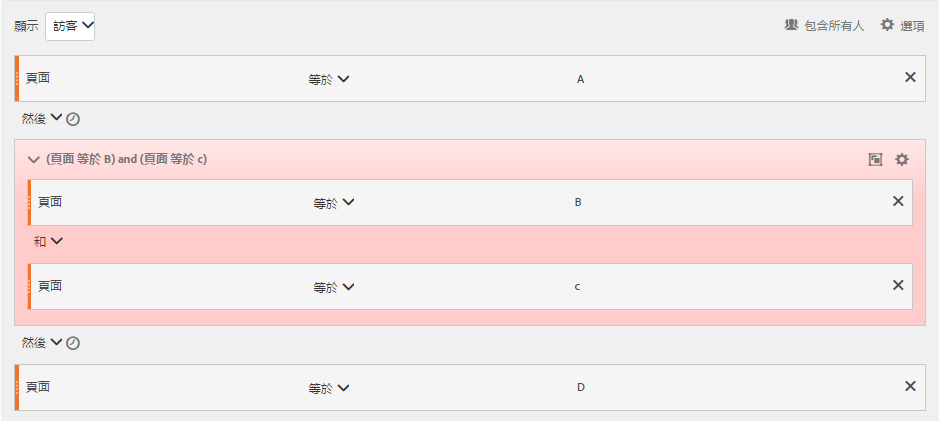

### 邏輯群組排除 OR

使用[!UICONTROL 邏輯群組]建立區段，其中總和多個頁面檢視來定義哪些頁面必須點擊，並明確遺漏其他頁面。

**範例**：訪客造訪頁面 A，但未在頁面 A 之前造訪頁面 B 或頁面 C。

**建立此區段**

初始 B 和 C 頁面識別於[!UICONTROL 邏輯群組]容器中，該容器經排除，隨後是訪客對頁面 A。

從左窗格拖曳維度、事件和預先建立的區段，以建立此區段。

在[!UICONTROL 邏輯群組]中巢狀內嵌值，按一下&#x200B;**[!UICONTROL 邏輯群組]**&#x200B;容器內的[!UICONTROL 「排除」]按鈕。

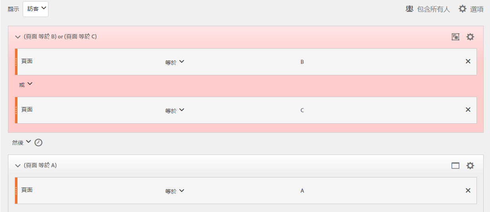

## 建立時間內與時間後區段

使用每個容器標題內建的 [!UICONTROL Within] 和 [!UICONTROL After] 運算子，可以定義時間、事件和計數。

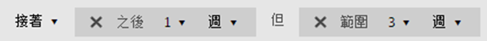

您可以使用 [!UICONTROL Within] 和 [!UICONTROL After] 容器並指定精細度和計數，將符合限制至指定的持續時間。[!UICONTROL Within] 運算子用來指定兩個查核點之間時間量的上限。[!UICONTROL After] 運算子用來指定兩個查核點之間時間量的下限。

>[!NOTE]
>
>在類似命名的元素（如&#x200B;**天**&#x200B;或&#x200B;**天**）之間評估有差異。 針對「之內」和「之後」的時間定義，請利用彈出式視窗中第一個列出的選項：
>
>
>
>針對Within和After的維度定義，請利用子功能表&#x200B;*其他Dimension*&#x200B;下的選項：
>
>

### After 和 Within 運算子 {#section_CCAF5E44719447CFA7DF8DA4192DA6F8}

持續時間的指定方式是使用代表精細度的單一大寫字母，後接代表精細度重複計數的數字。

**[!UICONTROL Within]** 包括端點 (小於或等於)。

**[!UICONTROL After]** 不包含端點 (大於)。

| 運算子 | 說明 |
|--- |--- |
| AFTER | After 運算子用來指定兩個查核點之間時間量的下限。設定 After 值時，在套用區段後開始時間限制。例如，如果在容器上設定 After 運算子，以便識別造訪了頁面 A 但直到一天後才返回造訪頁面 B 的訪客，則該日將從訪客離開頁面 A 開始。若要將訪客納入區段中，在離開頁面 A 至檢視頁面 B 期間，至少須經過 1440 分鐘 (一天)。 |
| WITHIN | Within 運算子用來指定兩個查核點之間時間量的上限。例如，如果在容器上設定 Within 運算子，以便識別在一天內造訪了頁面 A 然後返回造訪頁面 B 的訪客，則當訪客離開頁面 A 時，該日即開始。若要納入區段中，訪客在開啟頁面 B 前最多有一天的時間。若要將訪客納入區段中，造訪頁面 B 的時間必須落在離開頁面 A 至檢視頁面 B 的 1440 分鐘 (一天) 之內。 |
| AFTER/WITHIN | 同時使用 After 和 Within 運算子時，請務必了解兩個運算子是並行開始和結束，而非連續操作。例如，如果您建立了區段並將容器設為： `After = 1 Week(s) and Within = 2 Week(s)` ，則區段中用以識別訪客的條件僅符合 1 週和 2 週之間。兩個條件都從第一個頁面點擊開始執行。 |

### 使用 After 運算子

* 「之後時間」可讓您根據年、月、日、小時和分鐘來比對瀏覽，進行追蹤。
* 「之後時間」只能套用至[!UICONTROL 「點擊」]容器，因為這是可定義此種精細度的唯一層級。

**範例**：訪客造訪頁面 A，接著在 2 週後才造訪頁面 B。

**建立區段**：建立此區段的方法為新增一個[!UICONTROL 訪客]容器和兩個[!UICONTROL 點擊]容器。您可以接著設定 [!UICONTROL THEN] 運算子，然後開啟 [!UICONTROL AFTER] 運算子下拉式清單，設定週數。

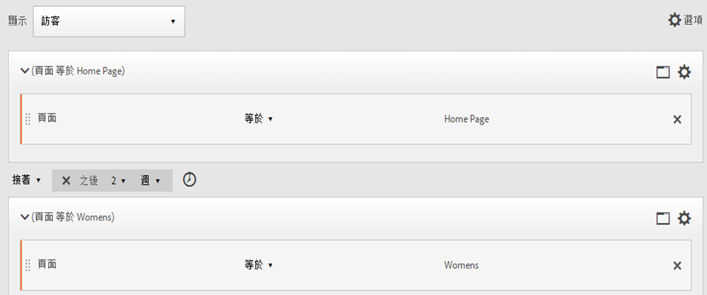

**符合**

設定 “After 2 weeks” 時，如果點擊頁面 A 發生在 2019 年 6 月 1 日 00:01，則後續點擊頁面 B 只要發生在 2019 年 6 月 15 日 00:01 之前 (14 天後) 便符合。

| 點擊 A | 點擊 B | 比對 |
|--- |--- |--- |
| **A** 點擊：2019 年 6 月 1 日 00:01 | **B** 點擊：2019 年 6 月 15 日 00:01 | **符合**：這個時間限制符合，因為是在 2019 年 6 月 1 日之後 (兩週)。 |
| **A** 點擊：2019 年 6 月 1 日 00:01 | **B** 點擊：2019 年 6 月 8 日 00:01 B 點擊：2019 年 6 月 15 日 00:01 | **不符合**：頁面 B 的第一次點擊不符合，因為與要求兩週後的限制衝突。 |

### 使用 Within 運算子

* [!UICONTROL Within] 可讓您根據年、月、日、小時和分鐘來比對瀏覽，進行追蹤。
* [!UICONTROL Within] 只能套用至[!UICONTROL 「點擊」]容器，因為這是可定義此種精細度的唯一層級。

>[!TIP]
>
>在「within」子句裡，您可以在「THEN」陳述式之間加入「within 1 search keyword instance」、「within 1 eVar 47 instance」之類的文字。這樣會將區段限制在某個維度的一個例項內。

**範例**：訪客造訪頁面 A，接著在 5 分鐘內造訪頁面 B。

**建立區段**：建立此區段的方法為新增一個[!UICONTROL 訪客]容器，然後拖曳兩個[!UICONTROL 點擊]容器進來。您可以接著設定 [!UICONTROL THEN] 運算子，然後開啟 [!UICONTROL AFTER] 運算子下拉式清單並設定間隔：點擊數、頁面檢視次數、瀏覽次數、分鐘數、小時數、日數、週數、月數、季數或年數。

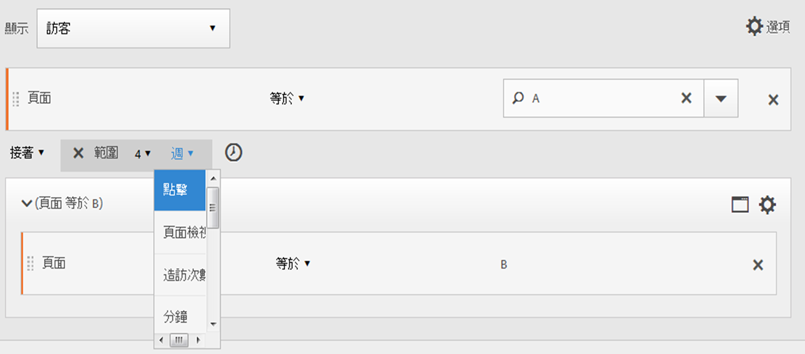

**符合**

必須發生在時間限制內才符合。對於運算式 ，如果訪客點擊頁面 A 發生在 00:01，則後續點擊頁面 B 只要發生在 00:06 時或之前 (5 分鐘後，包括 00:06) 便符合。在該分鐘時點擊也符合。

### Within 和 After 運算子

使用 [!UICONTROL Within] 和 [!UICONTROL After] 可提供區段兩端的最大和最小端點。

**範例**：訪客造訪頁面 A，接著在 2 週後 (一個月內) 造訪頁面 B。

**建立區段**：建立區段的方法為在[!UICONTROL 訪客]容器內排序兩個[!UICONTROL 點擊]容器。然後設定 [!UICONTROL After] 和 [!UICONTROL Within] 運算子。

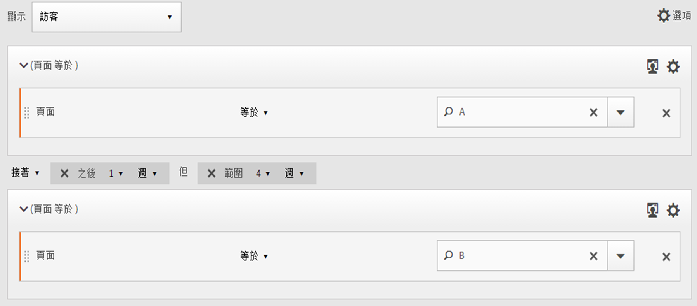

**符合**

在 2019 年 6 月 1 日點擊頁面 A，然後在 2019 年 6 月 15 日 00:01 之後及 2019 年 7 月 1 日&#x200B;*之前*&#x200B;返回的任何訪客，都會納入區段。與[時間介於排除](/help/components/segmentation/segmentation-workflow/seg-sequential-build.md)比較。

[!UICONTROL After] 和 [!UICONTROL Within] 運算子可一起使用來定義循序區段。

此範例說明在兩週後且一個月內第二次瀏覽並點擊頁面 B。
