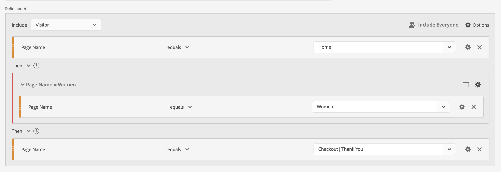

# 循序區段

您在元件、容器和元件或容器之間使用[!UICONTROL Then]邏輯運運算元建立循序區段。 [!UICONTROL Then]邏輯運運算元表示有一個區段條件發生，接著是另一個區段條件。

此外，您可以使用&#x200B;**[!UICONTROL After]**&#x200B;和&#x200B;**[!UICONTROL Within運運算元]**，將查核點之間的循序區段限製為特定時段、詳細程度和計數。

>[!BEGINSHADEBOX]

如需示範影片，請參閱 [循序分段](https://video.tv.adobe.com/v/25405?quality=12&learn=on){target="_blank"}。

>[!ENDSHADEBOX]

循序區段具有某些[基本功能](#basics)以及您可以設定的其他選項，以增加循序區段的複雜性：

## 基本知識

建立循序區段的基本概念與使用[區段產生器](seg-build.md)建立一般區段並無不同。 只要您在主要定義或您在&#x200B;**[!UICONTROL 分段產生器]**&#x200B;內使用的任何容器中選取[Then](seg-build.md)運運算元，一般區段就會自動變成循序區段。

### 範例

以下範例說明如何在各種使用案例中使用循序區段。

#### 簡單順序

識別先檢視某個頁面再檢視另一個頁面的訪客。點選層級資料會使用此序列分段。 無論先前、過去或臨時訪客造訪，或兩次造訪之間發生之頁面檢視的時間或次數為何。

#### 跨造訪的序列

識別在一次造訪中檢視了頁面，然後在另一次造訪中檢視另一個頁面的訪客。 若要區分造訪，請使用容器來建置順序，並為每個容器定義 **[!UICONTROL 造訪]**&#x200B;層級。

#### 混合層級序列

識別在次數不定的瀏覽中檢視兩個頁面，然後在另一次瀏覽中檢視第三個頁面的訪客。 再次強調，請使用容器來建置順序，並在定義個別造訪的容器上定義 **[!UICONTROL 造訪]**&#x200B;層級。

#### 彙總序列

識別在第一次造訪時造訪特定頁面，接著造訪部分其他頁面的訪客。 若要區分點選順序，請使用容器來分隔 **[!UICONTROL 造訪]**&#x200B;容器層級的邏輯。

#### 巢狀內嵌序列

識別訪客先造訪一個頁面再造訪另一個頁面，然後進行涉及其他兩個頁面的後續造訪的所有造訪。 例如，識別訪客先造訪首頁，接著類別1頁面再有其他造訪在其中，分別造訪類別2和類別3頁面的所有造訪。

## [!UICONTROL After]和[!UICONTROL Within]

您可以使用 **[!UICONTROL After]**&#x200B;與 **[!UICONTROL Within]** **[!UICONTROL Then]**&#x200B;運運算元來定義點選、造訪或維度的其他[時間限制](#time-constraints)或[限制](#event-session-and-dimension-constraints)。

### 時間限制

若要將時間限制套用至&#x200B;**[!UICONTROL Then]**&#x200B;運運算元：

1. 選取。
1. 從內容功能表中選取&#x200B;**[!UICONTROL Within]**&#x200B;或&#x200B;**[!UICONTROL After]**。
1. 指定時段（**[!UICONTROL 分鐘]**，**[!UICONTROL 小時]**，直到&#x200B;**[!UICONTROL 年]**）。
1. 選取 **[!UICONTROL *數字&#x200B;*]**&#x200B;以開啟快顯視窗，讓您使用&#x200B;**[!UICONTROL -]**&#x200B;或&#x200B;**[!UICONTROL +]**&#x200B;輸入或指定數字。

若要移除時間限制，請使用。

下表更詳細地說明時間限制運運算元。

| 運算子 | 說明 |
|--- |--- |
| **[!UICONTROL After]** | [!UICONTROL After]運運算元用來指定兩個查核點之間時間量的下限。 設定After值時，時間限制從套用區段時開始。 例如，如果在容器上設定[!UICONTROL After]運運算元，以識別造訪頁面A，但直到一天後才返回造訪頁面B的訪客，則該日將從訪客離開頁面A時開始。 若要將訪客納入區段中，離開頁面A後必須至少經過1440分鐘（一天）才能檢視頁面B。 |
| **[!UICONTROL Within]** | [!UICONTROL Within] 運算子用來指定兩個查核點之間時間量的上限。例如，如果在容器上設定[!UICONTROL Within]運運算元，以識別造訪頁面A，然後在一天內返回造訪頁面B的訪客，則該日從訪客離開頁面A時開始。若要納入區段中，訪客在開啟頁面B前的最長時間為一天。若要將訪客納入區段中，在離開頁面A以檢視頁面B後，最多必須在1440分鐘（一天）內開啟頁面B。 |
| **[!UICONTROL 晚於]**&#x200B;但以內 | 同時使用[!UICONTROL After]和[!UICONTROL Within]運運算元時，兩個運運算元會同時開始和結束，而非連續進行。  例如，您建置容器設為`After = 1 Week(s) and Within = 2 Week(s)`的區段。 識別此區段中的訪客的條件僅符合一週到兩週之間。 這兩個條件都會從第一個頁面檢視的時間開始執行。 |

#### 範例

使用時間限制的一些範例。

##### [!UICONTROL After]運運算元

識別僅於兩週後造訪一個頁面然後造訪另一個頁面的訪客。 例如，造訪過首頁的訪客，但女性訪客 | 僅於兩週後顯示鞋頁面。

之後

如果首頁的頁面檢視發生在2024年6月1日00:01，則為頁面女性提供頁面檢視 | 只要2024年6月15日00:01之後發生頁面檢視，鞋子就會符合。

##### [!UICONTROL Within]運運算元

識別在五分鐘內造訪一個頁面然後造訪另一個頁面的訪客。 例如，訪客造訪首頁，接著造訪女性網站 | 在5分鐘內完成「鞋子」頁面。

內的順序

如果首頁的頁面檢視發生於2024年6月1日12:01，則對頁面的頁面檢視為「女性」 | 只要2024年6月15日12:16之前發生該頁面檢視，鞋子就會相符。

##### [!UICONTROL After]但[!UICONTROL Within]運運算元

識別在兩週後但在一個月內造訪過一個頁面然後造訪另一個頁面的訪客。 例如，訪客造訪首頁，兩週後在一個月內造訪女性 | 鞋子頁面。

但以內

2024年6月1日點選首頁及回訪女性網站的任何訪客 | 2019年6月15日之後00:01，但2019年7月1日之前的「鞋子」頁面符合該區段的資格。

### [!UICONTROL 點選]、[!UICONTROL 造訪]和[!UICONTROL Dimension]限制

 **[!UICONTROL After]**&#x200B;與 **[!UICONTROL Within]**&#x200B;限制不僅可讓您指定時間限制，也可指定點選、造訪或維度限制。 選取&#x200B;**[!UICONTROL 點選]**、**[!UICONTROL 造訪]**&#x200B;或&#x200B;**[!UICONTROL 其他維度]**  **[!UICONTROL *Dimension名稱&#x200B;*]**。 您可以使用&#x200B;[!UICONTROL *搜尋*]欄位來搜尋維度。

#### 範例

以下是循序區段的範例，此區段會尋找造訪過一個產品類別頁面的訪客（女性） | 鞋子)，接著是結帳頁面（結帳） | 感謝您)。

內排序區段

以下範例序列符合或不符合：

| 序列 |  |
|--- | :---: |
| 頁面`Women \| Shoes`後面接著頁面`Checkout \| Thank You` |  |
| 頁面`Women \| Shoes`後接頁面`Women \| Tops`後接頁面`Checkout \| Thank You` |  |

## [!UICONTROL 包括]

您可以指定要包含在循序區段或屬於循序區段一部分的循序容器中的資料。

### [!UICONTROL 所有人] {#include_everyone}

若要建立包含每個人的循序區段，請選取 **[!UICONTROL 包含每個人]**&#x200B;選項。

循序區段會識別整體符合指定模式的資料。  以下是基本序列區段的範例，此區段會尋找造訪過某個產品類別頁面的訪客（女性） | 鞋子)，接著是結帳頁面（結帳） | 感謝您)。 區段已設定為 **[!UICONTROL 包含所有人]**。

以下範例序列符合或不符合：

| | 序列 |  |
|---:|--- | --- |
| 1 | 在同一次造訪中`Women \| Shoes`然後`Checkout \| Thank You` |  |
| 2 | `Women \| Shoes`然後`Men \| Shoes`然後`Checkout \| Thank You` （跨不同的造訪） |  |
| 3 | `Checkout \| Thank You`然後`Women \| Shoes` |  |

### [!UICONTROL 僅於序列之前]且[!UICONTROL 僅於序列之後]

選項 **[!UICONTROL Only Before Sequence]**&#x200B;與 **[!UICONTROL Only After Sequence]**&#x200B;在指定的序列之前或之後，將資料分割成子集。

*  **Only Before Sequence**：包含序列之前的所有資料，以及序列本身的第一個資料。 如果序列作為資料的一部分出現多次，則[!UICONTROL 僅在序列之前]包括最後一個出現序列的首次點選和所有先前的點選。
*  **Only After Sequence**：包含序列之後的所有點選，以及序列本身的最後資料。 如果序列作為資料的一部分出現多次，則[!UICONTROL 僅在序列之後]包含第一個出現序列的最後點選，以及之後的所有點選。

請考慮使用以B識別之條件指定元件順序的定義，接著使用以D識別之條件指定(Then)的元件。三個選項可識別資料，如下所示：

| B然後D | A | B | C | D | E | F |
|---|:---:|:---:|:---:|:---:|:---:|:---:|
| 包括所有人 |  |  |  |  |  |  |
| 只限之前序列 |  |  |  |  |  |  |
| 只限之後序列 |  |  |  |  |  |  |

| B然後D （發生多次） | A | B | C | D | B | C | D | E |
|---|:---:|:---:|:---:|:---:|:---:|:---:|:---:|:---:|
| 包括所有人 |  |  |  |  |  |  |  |  |
| 只限之前序列 |  |  |  |  |  |  |  |  |
| 只限之後序列 |  |  |  |  |  |  |  |  |

#### 範例

您已為網站區段定義三個版本的循序區段。 一個具有選項 **[!UICONTROL 包含所有人]**，一個具有選項 **[!UICONTROL 僅在Sequence]**&#x200B;之前，另一個具有選項 **[!UICONTROL 僅在Sequence]**&#x200B;之後。 您相應地為三個區段命名。

使用這三個區段製作網站區域報表時，自由表格中的範例輸出看起來會像這樣：

## [!UICONTROL 排除]

區段定義包含所有資料，除非您明確排除 [!UICONTROL 人員]、 [!UICONTROL 造訪]或 [!UICONTROL 點選]資料（使用&#x200B;**[!UICONTROL 排除]**）。

[!UICONTROL 排除]可讓您關閉常見資料，並建立重點更明確的區段。 「排除」也可讓您建立排除特定訪客群組的區段。 例如，定義區段，指定下訂單的訪客，然後排除該訪客群組，以識別&#x200B;*非購買者*。 最佳作法是建立使用廣泛定義的規則，而非嘗試使用[!UICONTROL 排除]來鎖定符合特定包含值的特定訪客。

排除定義的範例為：

* **排除頁面**。使用區段定義從報告中移除特定頁面（例如&#x200B;*首頁*）、建立頁面等於`Home Page`的點選規則，然後排除該規則。 此定義會自動包含&#x200B;*首頁*&#x200B;以外的所有頁面。
* **排除反向連結網域**。請使用僅包含來自Google.com的反向連結網域並排除所有其他網域的定義。
* **找出未購買者**。識別訂單大於零的時間，然後排除[!UICONTROL 人員]。

[!UICONTROL 排除]可用來識別訪客不屬於特定造訪或執行特定點選的順序。 [!UICONTROL 排除]也可以包含在[!UICONTROL 邏輯群組]中（請參閱下文）。

您可以排除容器，而非元件。

### 範例

請參閱下列範例以取得使用[!UICONTROL 排除]的範例。

#### [!UICONTROL 排除]於

識別造訪了一個頁面、未造訪另一個頁面，然後又造訪另一個頁面的訪客。 您使用 [!UICONTROL 排除]來排除容器。 左側的紅色細列可識別已排除的容器。

#### 開始時[!UICONTROL 排除]

識別造訪過一個頁面而從未造訪過另一個頁面的訪客。 例如，訪客結帳後從未造訪過首頁。

#### [!UICONTROL 排除]於結尾

識別造訪過一個頁面但從未造訪過其他頁面的訪客。 例如，訪客造訪您的首頁，但從未造訪過您的任何結帳頁面。

## [!UICONTROL 邏輯群組]

>[!NOTE]
>
>[!UICONTROL 邏輯群組]只能在循序區段中定義，這表示容器內會使用[!UICONTROL Then]運運算元。

邏輯群組讓您能將條件分組至單一循序區段查核點。作為序列的一部分，在任何先前的循序查核點之後，任何後續的循序查核點之前，都會評估識別為邏輯群組的容器中定義的邏輯。

邏輯群組本身內的條件可依任何順序符合。 相較之下，非循序容器（點選、造訪、訪客）不要求其條件在整個序列中均符合，如果搭配&#x200B;**[!UICONTROL Then]**&#x200B;運運算元使用，可能會產生非直覺式結果。

[!UICONTROL 邏輯群組]設計成將&#x200B;*數個條件視為群組，在群組條件中沒有任何排序*。 若另有說明，邏輯群組中條件的順序並不相關。

使用邏輯群組的部分最佳實務如下：

* 若要將循序查核點分組。
* 簡化循序區段的建構。

### 範例

以下是如何使用邏輯群組容器的範例。

#### 任何訂單

識別造訪過一個頁面，接著以任意順序從另一組頁面檢視每個頁面的訪客。 例如，訪客造訪首頁，接著造訪每個「男性」頁面、「女性」頁面和「孩子」頁面，無論順序為何。

您可以在不使用[!UICONTROL 邏輯群組]的情況下建置此區段，但建置將會是複雜而費力的工作。 指定訪客可檢視的每個頁面順序。 為清楚起見，只有第一個容器開啟，而其他容器關閉。 您可以透過標題衍生出其他容器的內容。

您可以使用[!UICONTROL 邏輯群組]來簡化建立此區段的流程，如下所示。 請確保為容器選取 **[!UICONTROL 邏輯群組]**。

#### 第一個相符

識別造訪過一個頁面或其他頁面，然後又造訪另一個頁面的訪客。 例如，訪客造訪了「女性」頁面或「男性」頁面，接著造訪了「結帳」 | 感謝頁面。

#### [!UICONTROL 排除] [!UICONTROL 和]

識別造訪過某個頁面，接著又明確未造訪其他頁面集，但確實造訪其他頁面的訪客。 例如，訪客造訪了首頁，但未造訪男性或女性頁面，但造訪了兒童頁面。

#### [!UICONTROL 排除] [!UICONTROL 或]

識別造訪過某個頁面，接著明確地未造訪一組頁面中的任何頁面，但確實造訪了另一個頁面的訪客。 例如，訪客造訪了首頁，但未造訪男性與女性頁面，但造訪了兒童頁面。

<!--
An example of a complex sequential segment if you want to find the visitors that 

| visit One | visit Two | visit Three |
| --- | --- | --- |
| The visitor went to the main landing page A, excluded the campaign page B, and then viewed the Product page C.| The visitor again went to the main landing page A, excluded the campaign page B, and went again to the Product page C, and then to a new page D. | The visitor entered and followed that same path as in the first and second visits, then excluded page F to go directly to a targeted product on page G. |
-->

## 最後一個範例

最後一個範例，您想要識別瞭解特定產品頁面的訪客，不讓這些訪客受到您的「啟用您的移動」行銷活動的影響。 第一次造訪您的線上商店時，他們檢視了首頁，但並未進一步檢視「男性」類別的任何健身（裝備）產品。 但是，之後他們直接在造訪時，就會前往產品頁面並下達線上訂單，而未先瀏覽首頁。

>[!MORELIKETHIS]
>
> * [在AA與CJA中掌握循序邏輯： THEN](https://experienceleaguecommunities.adobe.com/t5/adobe-analytics-blogs/mastering-sequential-logic-in-aa-amp-cja-introduction-to-then/ba-p/738131)簡介
