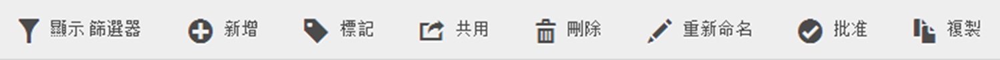
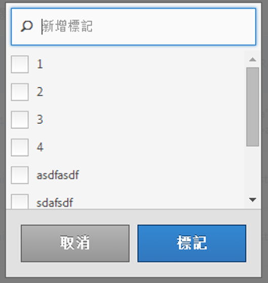

# 標記區段

在「區段管理員」中，您可透過將區段進行標記來組織區段。

所有使用者均可建立區段標記，並套用一或多個標記至區段。不過，您僅可以看見自己所擁有或已共用給您之區段的標記。您應該建立什麼樣的標記？以下是一些建議的實用標記：

* 以&#x200B;**團隊名稱**&#x200B;為基礎的標記，例如「社交行銷」、「手機行銷」。
* **專案**&#x200B;標記 (分析標記)，例如「登入頁面分析」。
* **類別**&#x200B;標記：「男性」、地理區。
* **工作流程**&#x200B;標記：「待核准」、策劃 (特定的業務單位)

1. 在「區段管理員」中，勾選您要標記之區段旁的核取方塊。區段管理工具列隨即出現：

   

1. 按一下「**[!UICONTROL 標記]**」，然後

   * 選取現有標記或是
   * 加入新標記並按 **[!UICONTROL Enter]**。

     

1. 再按一下「**[!UICONTROL 標記]**」來標記區段。

標記現在應該出現在「標記」欄中。(按一下右上方的齒輪圖示來管理您的欄。)

您也可以前往「**[!UICONTROL 篩選]**」>「**[!UICONTROL 標記]**」來依標記篩選。
