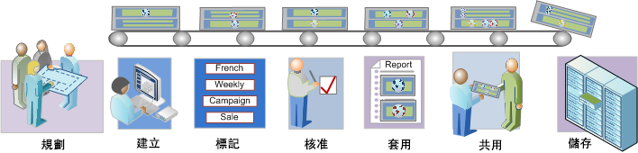

# 區段工作流程概觀

針對以「區段產生器」建立並透過「區段管理員」管理的區段，說明建議的工作流程。

 [計畫區段](/help/components/segmentation/segmentation-workflow/seg-plan.md)

在建立區段及設定區段管理環境之前，您是否已問過自己所有正確的問題？您設計區段時，是否已想好區段的用途和用法？

檢視「區段規劃檢查清單」，取得規劃及組織區段的協助。

 [建立區段](/help/components/segmentation/segmentation-workflow/seg-build.md)

建立和編輯區段，以用於所有 Analytics 功能中。

請參閱[建立循序區段](/help/components/segmentation/segmentation-workflow/seg-sequential-build.md)，以瞭解如何使用THEN運運算元建立區段。

 [標籤區段](/help/components/segmentation/segmentation-workflow/seg-tag.md)

標記區段以方便進行組織和共用。請參閱如何規劃和指派標記來進行簡易與進階的搜尋及組織。

 [核准區段](/help/components/segmentation/segmentation-workflow/seg-approve.md)

核准區段以使成為標準區段。

 [套用區段](/help/components/segmentation/segmentation-workflow/t-seg-apply.md)

您可以使用區段邊欄 (顯示區段) 直接在報表中套用區段。

 [共用區段](/help/components/segmentation/segmentation-workflow/t-seg-share.md)

將細分群體共用給其他 Analytics 工具、Adobe Target 和 Adobe Experience Cloud 中的預定客群。

 [篩選區段](/help/components/segmentation/segmentation-workflow/t-seg-filter.md)

依標記、擁有者和其他篩選器 (「全部顯示」、「我的」、「已共用給我」、「我的最愛」和「已核准」) 進行篩選。

 [將區段標示為我的最愛](/help/components/segmentation/segmentation-workflow/t-seg-favorite.md)

將區段標示為我的最愛是組織區段以方便使用的另一種方法。

[管理區段](/help/components/segmentation/segmentation-workflow/seg-manage.md)

「區段管理員」提供許多管理區段的方式，例如共用、篩選、標記、核准、複製、刪除和標示為我的最愛。
