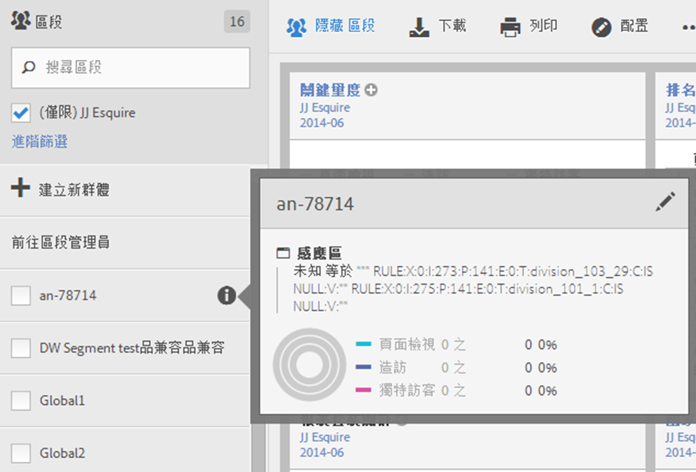

# 選擇與套用區段

如何從區段邊欄套用一或多個區段至報表。

1. 開啟您要套用區段的報表，例如[!UICONTROL 頁面報表]。
1. 按一下報表上方的&#x200B;**[!UICONTROL 「顯示區段」]**。區段邊欄隨即開啟。

   

1. 標記一或多個區段旁的核取方塊，或&#x200B;**[!UICONTROL 搜尋區段]**&#x200B;以尋找所需的區段。

   >[!NOTE]
   >
   >您可以套用不只一個區段至報表 (這稱為區段堆疊)。套用多個區段時，會先以 &#39;and&#39; 運算子結合每個區段中的準則，然後再進行套用。可以堆疊的區段數目沒有限制。

   >[!NOTE]
   >
   >按一下區段名稱旁的資訊圖示 (i) 可以預覽關鍵量度，以查看您是否具備有效的區段，以及區段的範圍廣度。

1. 您可以依報告套裝來篩選，方法是選取 **[!UICONTROL (僅)`<report suite name>`]** 核取方塊。如此將只會顯示上次在該報告套裝中儲存的區段。
1. 按一下&#x200B;**[!UICONTROL 「套用區段」]**，報表即會重新整理。套用的一或多個區段現在會顯示在報表頂端：

   
