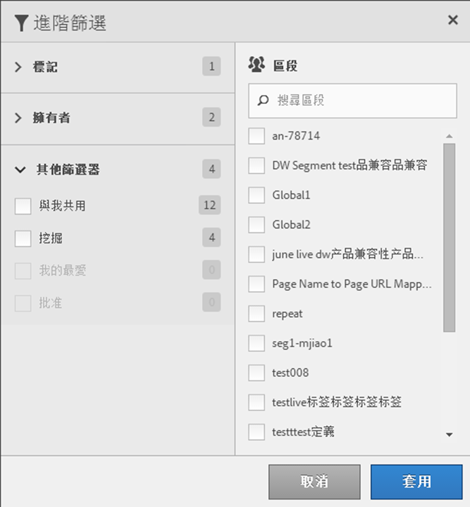

# 篩選區段

依標記、擁有者和其他篩選器 (「全部顯示」、「我的」、「已共用給我」、「我的最愛」和「已核准」) 進行篩選。

篩選可讓您更易於在區段邊欄中搜尋區段。

1. 在區段管理員中，按一下&#x200B;**[!UICONTROL 篩選器]**&#x200B;圖示： 

   

2. 下列為可使用的篩選：

   | 篩選器名稱 | 說明 |
   |---|---|
   | 標記 | 可讓您篩選具有特定[標籤](/help/components/segmentation/segmentation-workflow/seg-tag.md)的區段。 預設會顯示「標記」欄。 |
   | 擁有者 | 可讓您依擁有者來篩選區段。 |
   | 報表套裝 | 可讓您依報表套裝來篩選。 |
   | 其他篩選器 > 全部顯示 | **(僅限管理員)** 顯示所有區段、其擁有者和上次修改日期。 |
   | 其他篩選器 > 我的 | 顯示您擁有的所有區段。 |
   | 其他篩選器 > 與我共用 | 顯示其他[與您共用](/help/components/segmentation/segmentation-workflow/t-seg-share.md)的所有區段。 |
   | 其他篩選條件 > 我的最愛 | 顯示您標示為[我的最愛](/help/components/segmentation/segmentation-workflow/t-seg-favorite.md)的所有區段。 |
   | 其他篩選條件 > 批准 | 顯示所有正式[核准的](/help/components/segmentation/segmentation-workflow/seg-approve.md)區段。 |
   | 搜尋區段 | 可讓您依名稱來搜尋區段。 |
