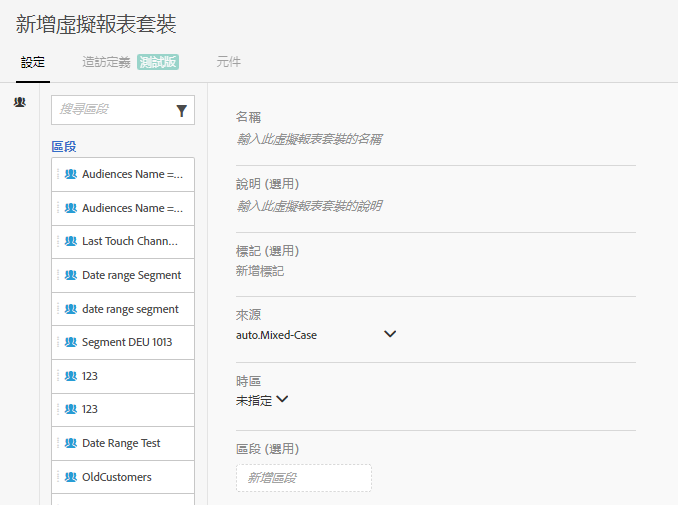
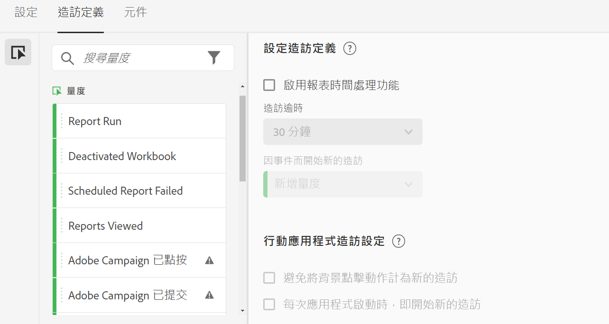
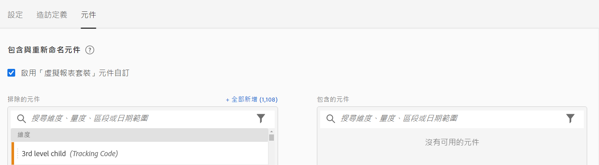

# 建立虛擬報告套裝

開始建立虛擬報告套裝前，請謹記以下一些注意事項。

* 非管理員使用者看不到「虛擬報表套裝」管理員。
* 虛擬報告套裝無法共用。「共用」是透過群組/權限達成。
* 在虛擬報表套裝管理員中，您只看得到您自己的虛擬報表套裝。 必須按一下「全部顯示」才能查看其他人的虛擬報告套裝。

1. 導覽至&#x200B;**[!UICONTROL 元件]** > **[!UICONTROL 虛擬報表套裝]**。
1. 按一下&#x200B;**[!UICONTROL 「新增 +」]**。

   

## 定義設定

在「[!UICONTROL 設定]」索引標籤上，定義這些設定，然後按一下「**[!UICONTROL 繼續]**」。

| 元素 | 說明 |
| --- |--- |
| 名稱 | 虛擬報告套裝的名稱不會繼承自父報告套裝，且應為不同的名稱。 |
| 說明 | 為您的企業使用者著想，加入適當說明。 |
| 標記 | 您可新增標記來組織報告套裝。 |
| 來源 | 此虛擬報套裝會繼承報告套裝的以下設定。繼承大部分的服務層級和功能 (例如 eVar 設定、處理規則、分類等)。若要在虛擬報表套裝上變更這些繼承設定，您必須編輯父報表套裝（「管理員>報表套裝」）。 |
| 時區 | 選擇時區是選用的。如果您選擇時區，則會與虛擬報表套裝一併儲存。 如果您沒有選擇時區，則系統會使用父報告套裝的時區。編輯虛擬報表套裝時，與虛擬報表套裝一併儲存的時區會顯示在下拉式選取器中。 如果虛擬報表套裝是在新增時區支援之前建立，則父報表套裝的時區會顯示在下拉式選取器中。 |
| 客戶細分 | 您可以只新增一個區段，也可以堆疊區段。注意：將兩個區段堆疊在一起時，會使用 AND 陳述式加以連結。無法變更為 OR 陳述式。如果嘗試刪除或修改虛擬報告套裝目前使用中的區段，便會出現警告。 |

## 定義造訪定義

在「[!UICONTROL 造訪定義]」索引標籤上，定義這些設定，然後按一下「**[!UICONTROL 繼續]**」。

>[!BEGINSHADEBOX]

檢視 [調整示範視訊的造訪定義](https://video.tv.adobe.com/v/23545?quality=12&learn=on){target="_blank"}。

>[!ENDSHADEBOX]

| 元素 | 說明 |
| --- |--- |
| **設定造訪定義** |  |
| 啟用報表時間處理功能 | 使用報表時間處理功能，以變更預設造訪逾時長度。這些設定不具破壞性，只會套用至 Analysis Workspace。[了解更多](/help/components/vrs/vrs-report-time-processing.md) |
| 造訪逾時 | 定義自動開始新的造訪之前，不重複訪客需達到的閒置時間。這會影響造訪量度、造訪區段容器，以及在造訪時過期的 eVar。 |
| 因事件而開始新的造訪 | 不論工作階段是否逾期，只要觸發了指定事件，就會作為新的工作階段開始。 |
| **行動應用程式造訪設定** | 修改Adobe行動SDK收集之行動應用程式點選的造訪次數定義方式。 這些設定不具破壞性，只會套用至Analysis Workspace。 |
| 避免將背景點擊動作計為新的造訪 | 避免將背景點擊動作計為新的造訪，以及避免造訪次數和不重複訪客量度誇大不實。 |
| 每次應用程式啟動時，即開始新的造訪 | 應用程式啟動後，便開始新的工作階段。[了解更多](/help/components/vrs/vrs-mobile-visit-processing.md) |

## 包含和重新命名元件

1. 在「[!UICONTROL 元件]」索引標籤上，選取核取方塊以套用組織至 Analysis Workspace 中此虛擬報告套裝的包含、排除和重新命名元件。
如需虛擬報表套裝組織的詳細資訊，請參閱[虛擬報表套裝元件組織](https://experienceleague.adobe.com/docs/analytics/components/virtual-report-suites/vrs-components.html?lang=zh-Hant#virtual-report-suites)。

1. 將要包含在虛擬報表套裝中的元件（維度、量度、區段或日期範圍）拖曳至「[!UICONTROL 包含的元件]」區段。

1. 完成後，按一下「**[!UICONTROL 儲存]**」。

## 預覽資料

在每個索引標籤的右側，您可以預覽此虛擬報表套裝中的總點選數、總造訪數和總訪客數，並與原始報表套裝相比。

## 檢視產品相容性

並非所有Adobe Analytics產品都支援虛擬報表套裝的某些功能。 產品相容性清單可讓您根據目前的虛擬報表套裝設定，檢視Adobe Analytics中的哪些產品受到支援。
