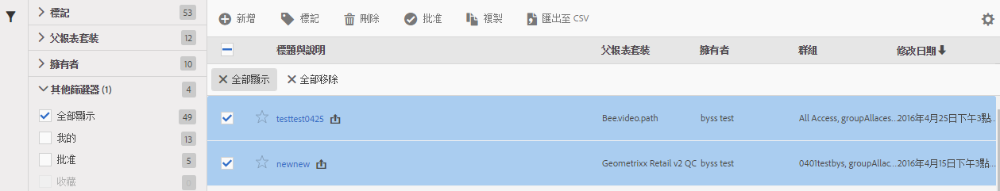

# 管理虛擬報告套裝

虛擬報表套裝管理員可讓管理員編輯、新增、標籤、刪除、重新命名、核准、複製、匯出以及篩選虛擬報表套裝。 但不會顯示給非管理員使用者。

**[!UICONTROL Analytics]** > **[!UICONTROL 元件]** > **[!UICONTROL 虛擬報告套裝]**

>[!NOTE]
>
>在「虛擬報表套裝管理器」中，您只看得到您自己的虛擬報表套裝。 必須按一下&#x200B;**[!UICONTROL 「全部顯示」]**&#x200B;才能查看其他人的虛擬報告套裝。

| 任務 | 說明 |
| --- | --- |
| 新增 | 將您導向虛擬報告套裝產生器，您可在此處建立新的虛擬報告套裝。 |
| 標記 | 所有使用者均可為虛擬報表套裝建立標記，並將一個或多個標記套用於虛擬報表套裝。不過，您只能看見自己所擁有的那些虛擬報表套裝的標記。您應該建立什麼樣的標記？以下是一些建議的實用標記：<ul><li>以團隊名稱為基礎的標記，例如「社交行銷」、「手機行銷」</li><li>專案標記 (分析標記)，例如「登入頁面分析」</li><li>類別標記：「男性」、地理區</li><li>工作流程標記：為 (特定業務部門) 所組織、已批准</li></ul> |
| 刪除 | 如果刪除虛擬報告套裝，已套用此虛擬報告套裝的排程報表和控制面板可繼續正常運作。報表或控制面板仍會繼續使用已刪除的虛擬報告套裝，直到您重新儲存排程報表為止。當您編輯同名的虛擬報告套裝時，排程報表不會更新。 例如：假設您有兩個名稱相同的虛擬報告套裝和不同的父報告套裝： 您有個書籤是引用 mainprod 報告套裝的虛擬報告套裝。接著您刪除該虛擬報告套裝，因為它是副本。書籤會繼續執行，並參考已刪除的虛擬報表套裝的定義。 如果您變更其餘虛擬報表套裝的定義，套用至書籤的虛擬報表套裝不會變更。 而是會沿用舊的定義。若要修正此問題，請將書籤更新為引用新的定義。如果您不確定書籤、控制面板或排程報表是否正使用已刪除的虛擬報表套裝，可以變更其餘虛擬報表套裝的名稱，如此就更能清楚知道書籤是否正使用其餘的虛擬報表套裝。 |
| 重新命名 | 任何顯示虛擬報告套裝的位置 (例如報告套裝選取器) 都會顯示新名稱。 |
| 批准/取消批准 | 批准虛擬報告套裝，讓它成為「正式」或「典範」。並可透過取消批准來回復此程序。 |
| Copy | 以新的報告套裝 ID 建立不同的副本，但具有相同的名稱和定義。 |
| 匯出至 CSV | 將虛擬報告套裝定義匯出至 .csv 檔案。 |
| 篩選 | 依標記、父報告套裝、擁有者和其他篩選器 (全部顯示、我的、收藏和已批准) 進行篩選。 |
