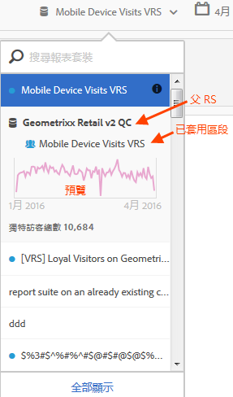

# 檢視虛擬報告套裝資訊

按一下報告套裝名稱旁的 i (資訊) 圖示可取得相關資訊。

## 在報告套裝選取器中 {#section_74E43B60C1CA4180B5ACA57574C1FA0F}

按一下報告套裝選取器中虛擬報告套裝旁的「資訊」圖示，可提供下列資訊：

* 父報告套裝的名稱。
* 套用至該區段的任何區段名稱。
* 已套用區段之報告套裝的簡單預覽。
* 不重複訪客總數。

