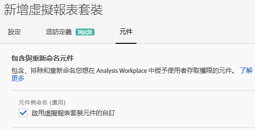
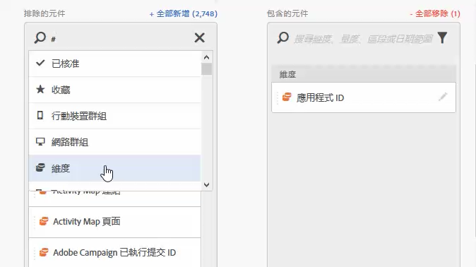
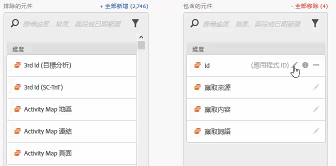
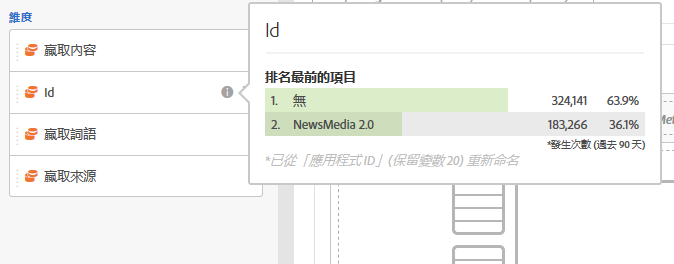

# 虛擬報表套裝元件策劃

虛擬報表套裝可以組織為在Analysis Workspace中包含和排除元件。

>[!BEGINSHADEBOX]

如需示範影片，請參閱 [元件組織](https://experienceleague.adobe.com/en/docs/analytics-learn/tutorials/components/virtual-report-suites/component-curation-in-virtual-report-suites){target="_blank"}。

>[!ENDSHADEBOX]

>[!NOTE]
>
>管理員與非管理員可在已監管的 Workspace 專案和虛擬報告套裝中查看哪些元件有所變動。 過去，只要按一下&#x200B;**[!UICONTROL 「顯示所有元件」]**，任何人都能查看未監管的元件。 [更新的組織體驗](/help/analyze/analysis-workspace/curate-share/curate.md)可讓您對可檢視的元件執行更細微的控制。

啟用元件管理：

1. 移至&#x200B;**[!UICONTROL Analytics]** > **[!UICONTROL 元件]** > **[!UICONTROL 虛擬報表套裝]** > **[!UICONTROL 建立新的虛擬報表套裝]**。
1. 定義&#x200B;**[!UICONTROL 「設定」]**&#x200B;後，按一下&#x200B;**[!UICONTROL 「元件」]**&#x200B;標籤。

1. 選取&#x200B;**[!UICONTROL 啟用虛擬報表套裝元件自訂核取方塊]**：

   

   >[!NOTE]
   >
   >如已啟用元件自訂，則&#x200B;**只能在 Analysis Workspace 中**&#x200B;存取虛擬報表套裝，且無法在以下項目中存取：
   >
   >* [!UICONTROL Data Warehouse]
   >* [!UICONTROL Report Builder]
   >* [!UICONTROL Activity Map]
   >* Analytics 報表 API

   一旦勾選，您就可以將適用的元件從「排除的元件」欄拖曳至「包含的元件」欄，新增您要包含在虛擬報表套裝中的元件。 可包含和排除的元件有：

   * 維度
   * 量度
   * 區段
   * 日期範圍

   >[!NOTE]
   >
   >不需要&#x200B;*共用*&#x200B;已監管的元件 (區段、計算量度、日期範圍)。 只要元件是針對虛擬報表套裝而進行管理，即使不共用，也會一律顯示在 Analysis Workspace 中。

1. 此外，還可以篩選或搜尋元件，以及按一下&#x200B;**[!UICONTROL 「新增全部」]**，將整個經過篩選的選取項目新增至已包含的欄中。

   

## 重新命名元件 {#section_0F7CD9F684FE4765BC00A2AFED56550E}

您可以變更虛擬報表套裝專用的已包含元件顯示名稱。 例如，如果您想在虛擬報表套裝中加入「頁面名稱」，但想將其重新命名為更適合行動裝置的內容，您可將其變更為「應用程式Screens」。 只要使用此虛擬報表套裝，Analysis Workspace中就會顯示新名稱。

在 Analysis Workspace 中，按一下任何已包含元件的資訊圖示，以顯示已重新命名元件的原始名稱：

## 元件群組 {#section_483BEC76F49E46ADAAA03F0A12E48426}

使用元件群組對虛擬報表套裝進行大量元件新增。 例如，如果您想要匯入一組行動應用程式分析專用的預設元件，請選取行動應用程式群組。 對應的維度和量度組合（已重新命名）會自動新增至虛擬報表套裝的「已包含」清單中。

## Workspace 行為 {#section_6C32F8B642804C0097FCB14E21028D4A}

如需有關在 Analysis Workspace 中進行監控的詳細資訊，請參閱「[監管和共用專案 ](/help/analyze/analysis-workspace/curate-share/curate.md)」。
