# 內容感知作業

虛擬報表套裝中的內容感知作業，變更了 Adobe Analytics 計算從任何裝置造訪次數的方式。本文也針對行動造訪次數定義的方式，說明背景點擊數與應用程式啟動事件數 (兩者均由行動 SDK 設定) 的處理含意。

您可在不變更基礎資料的情況下，依需要的任何方式定義造訪，以符合訪客與數位體驗互動的方式。

>[!BEGINSHADEBOX]

如需示範影片，請參閱 [內容感知工作階段](https://video.tv.adobe.com/v/3428480?captions=chi_hant&quality=12&learn=on){target="_blank"}。

>[!ENDSHADEBOX]

## 客戶角度URL引數

Adobe Analytics資料收集程式可讓您設定查詢字串引數，以指定客戶角度（表示為「cp」查詢字串引數）。 此欄位會指定一般使用者數位應用程式的狀態。 這可協助您知道點選是否產生於行動應用程式處於背景狀態時。

## 背景點選處理

背景點擊是指：當應用程式於背景狀態發出追蹤請求時，由 Adobe Mobile SDK 版本 4.13.6 (及更新版本) 傳送至 Analytics 的某類型點擊。典型範例包括：

* 越過地理圍欄期間傳送的資料
* 推播通知互動

下列範例概述邏輯，用於判斷虛擬報表套裝的「避免背景點選數開始一次新造訪」設定已啟用或未啟用時，任何訪客的造訪開始和結束時間。

**如果您未啟用「避免背景點擊數開始一次新造訪」：**

如果虛擬報表套裝未啟用此功能，背景點選的處理方式將與任何其他點選相同，這表示它們會開始新的造訪，且與前景點選的處理方式相同。 例如，如果發生背景點選不到30分鐘（報表套裝的標準工作階段逾時）就會在一組前景點選前，該背景點選是工作階段的一部分。

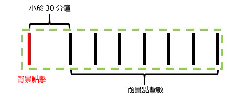

如果背景點選在任何前景點選之前發生30分鐘以上，背景點選會建立自己的造訪，造訪總數為2。

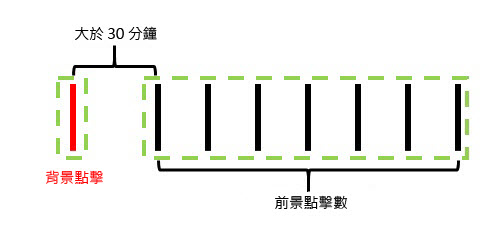

**如果您啟用「避免背景點擊數開始一次新造訪」：**

下列範例將說明啟用此功能時會發生的背景點擊行為。

範例 1：發生一連串前景點擊前，將會出現一個發生一段時間 (t) 的背景點擊。

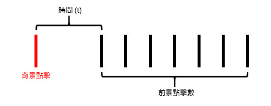

在此範例中，如果&#x200B;*t*&#x200B;大於虛擬報表套裝所設定的造訪逾時，則系統會從前景點選所形成的造訪中排除背景點選。 例如，如果虛擬報表套裝造訪逾時設為15分鐘，而&#x200B;*t*&#x200B;為20分鐘，則由這一連串點選所形成的造訪（以綠色外框顯示）將排除背景點選。 這表示在背景點選上設定「造訪」過期時間的任何eVar將&#x200B;**不會**&#x200B;持續存在後續造訪中，而造訪區段容器只會包含綠色外框內的前景點選。

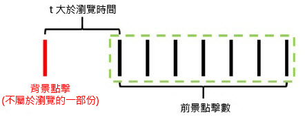

相反地，如果&#x200B;*t*&#x200B;小於虛擬報表套裝所設定的造訪逾時，則系統會將背景點選納入造訪中，就像是前景點選（由綠色外框顯示）：

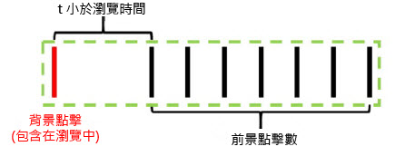

這表示：

* 在背景點選上設定了「造訪」過期時間的任何eVar，都會將其值保留至此造訪中的其他點選。
* 在背景點選中設定的任何值都會納入造訪層級區段容器邏輯評估中。

在這兩種情況下，總造訪次數都是1。

範例 2：如果發生一連串前景點擊後出現一個背景點擊，則會發生類似行為：

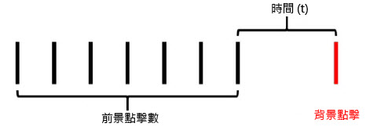

如果背景點擊在虛擬報表套裝所設定的逾時後發生，則背景點擊不會成為作業的一部分 (以綠色框線表示)：

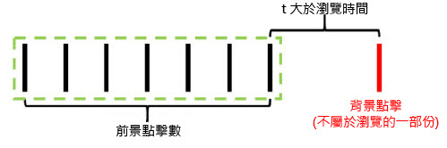

同樣地，如果時間 *t* 小於虛擬報表套裝所設定的造訪逾時，則系統會將背景點擊納入先前前景點擊所形成的造訪中：

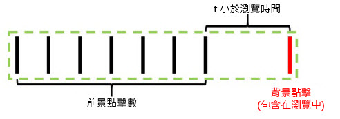

這表示：

* 任何在先前前景點選上設定有「造訪」過期時間的eVar，都會將其值保留至本次造訪的背景點選。
* 在背景點選中設定的任何值都會納入造訪層級區段容器邏輯評估中。

和之前一樣，在任何一種情況下，總造訪次數都是1。

範例 3：在部分情況下，背景點擊會將先前兩個獨立的造訪，合併為單一造訪。在下列情況下，背景點擊前後均會出現一連串的前景點擊：

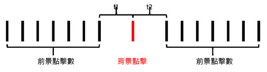

在此範例中，如果 *t1* 與 *t2* 均小於虛擬報表套裝所設定的造訪逾時，則所有點擊均會合併為單一造訪，即使 *t1* 與 *t2* 值加總大於造訪逾時亦然：

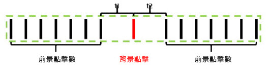

然而，如果 *t1* 與 *t2* 均大於虛擬報表套裝鎖定的逾時，則這些點擊會區分為兩個不同的造訪：

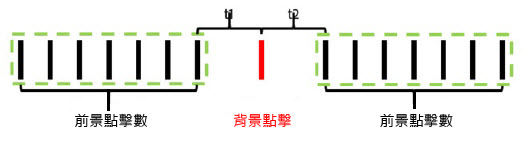

同樣地（如同先前範例），如果&#x200B;*t1*&#x200B;小於逾時，且&#x200B;*t2*&#x200B;大於逾時，則系統會將該背景點選納入第一個造訪中：

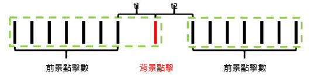

如果 *t1* 大於逾時，而 *t2* 小於逾時，則系統會將該背景點擊納入第二個造訪中：

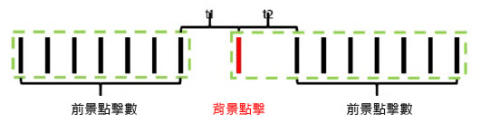

範例 4：在一連串背景點擊發生於虛擬報表套裝造訪逾時期間的情況下，這些點擊將會形成隱藏的「背景造訪」，但不會計入造訪次數，且無法透過造訪區段容器進行存取。

雖然這些點擊無法視為造訪，但任何設定擁有造訪過期時間的 eVar，將會保存其值至此「背景造訪」中的其他背景點擊。

範例 5：若是多個背景點擊發生於一連串前景點擊之後的情況，背景點擊可能 (視逾時設定而定) 會保存一個運作時間超過造訪逾時期間的造訪。舉例而言，如果 *t1* 與 *t2* 加總大於虛擬報表套裝造訪逾時，但兩者個別小於逾時，則造訪仍會延伸以納入這兩個背景點擊：

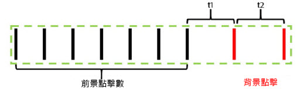

同樣地，如有一連串背景點擊發生於一連串前景事件之前，則會發生類似行為：

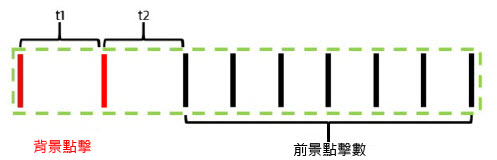

背景點選以此方式運作，以保留eVar或在背景點選期間設定的其他變數的任何歸因效果。 這可讓下游前景轉換事件可歸屬到應用程式處於背景狀態時所執行的動作。 它也能讓造訪區段容器包含產生下游前景工作階段的背景點選，而這個工作階段對於測量推送訊息有效性非常有用。

## 造訪量度行為

造訪計數只會以包含至少一個前景點選的造訪計數為基礎。 這表示任何孤立的背景點選或「背景造訪」不會計入造訪量度。

## 每次造訪逗留時間量度行為

系統仍會透過各點擊間的時間，以類似不納入背景點擊的方式計算逗留時間。不過，如果造訪包含背景點選（因為這些點選的發生距離前景點選夠近），這些點選會納入每次造訪逗留時間計算，就像是前景點選一樣。

## 背景點擊處理設定

由於背景點擊處理僅可使用報表時間處理提供給虛擬報表套裝使用，因此 Adobe Analytics 支援兩種處理背景點擊的方式，以保留基本報表套裝 (不使用報表時間處理) 中的造訪次數。若要存取此設定，請導覽至Adobe Analytics管理工具，接著導覽至適用的基本報表套裝設定，然後導覽至「行動管理」功能表，再導覽至「行動應用程式報表」子功能表。

1. 「舊版處理開啟」：此為適用於所有報表套裝的預設設定。就非報表時間歸因基本報表套裝而言，將處理背景點選的舊版處理保留為我們處理管道中的正常點選。 這表示基本報表套裝中出現的任何背景點選都會以一般點選的形式增加造訪次數。 如果您不希望基礎報表套裝中出現背景點選，請將此設定變更為「關閉」。
1. 「舊版處理功能關閉」：如果將適用於背景點擊的舊版處理功能關閉，則所有傳送至基本報表套裝的背景點擊均會遭到忽略；而且，只有當建立於此基本報表套裝中的虛擬報表套裝設定為使用「報表時間處理功能」時，才可存取。這表示透過傳送至此基本報表套裝的背景點選所擷取的任何資料，只會顯示在已啟用「報表時間處理」的虛擬報表套裝中。

   此設定適用於想要利用新的背景點選處理，而不變更其基本報表套裝的造訪計數的客戶。

無論是哪種情況，背景點選的計費方式與傳送至Analytics的任何其他點選的費用相同。

## 每次應用程式啟動後開始新的造訪

除了背景點選處理之外，虛擬報表套裝可在行動SDK傳送應用程式啟動事件時，強制開始新的造訪。 啟用此設定後，每當從SDK傳送應用程式啟動事件時，無論開啟的造訪是否已逾時，都會強制開始新的造訪。 包含應用程式啟動事件的點選會納入為下一次造訪中的第一次點選，且會增加造訪次數，並建立用於細分的獨特造訪容器。
