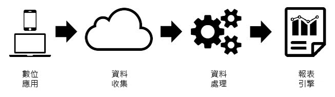
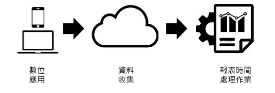

# 報表時間處理功能

[!UICONTROL 報表時間處理]是虛擬報表套裝設定，可讓Analysis Workspace中的資料以非破壞性的追溯方式處理。

[!UICONTROL 報表時間處理]僅會影響虛擬報表套裝中的資料，不會影響基本報表套裝中的任何資料或資料集合。 您可透過下列圖表，詳細了解[!UICONTROL 報表時間處理]與傳統 Analytics 處理功能的差異：

在 Analytics 處理資料期間，資料會透過資料收集管道流動，而進入前置處理步驟，以準備資料進行報告。此前置處理步驟會在收集資料時，將造訪過期時間邏輯與 eVar 持續性邏輯 (與其他項目) 套用至資料。此前置處理模式的主要缺點，在於需要在資料收集前完成所有設定。這表示任何前置處理設定變更僅會套用至該時間之後的新資料。如果發生資料接收順序錯亂或設定失誤，將會造成問題。

[!UICONTROL 報表時間處理]在處理 Analytics 用於報告的資料時，所採用的方法是截然不同的。 Analytics 不會在資料收集前預先定義處理邏輯，而是會在前置處理步驟進行期間忽略資料集，並在每次執行報表時套用此邏輯。

此處理架構可提供更具彈性的報告選項。例如，您可以採用非破壞性方式，將造訪逾時期間變更為任何時間長度，而這些變更會反映在整個報告期間的eVar持續性和區段容器中。 此外，您可以建立任意數量的虛擬報表套裝，並根據相同的基本報表套裝，讓每個套裝使用不同的「報表時間處理功能」選項，而不變更基本報表套裝中的任何資料。

[!UICONTROL 報表時間處理功能]也可讓Analytics防止背景點選開始新的造訪，並可讓[Adobe Experience Platform Mobile SDK](https://experienceleague.adobe.com/docs/mobile.html?lang=zh-Hant)在每次應用程式啟動事件被觸發時，開始新的造訪。

## 設定選項

下列為啟用「報表時間處理」時，目前可供虛擬報表套裝使用的設定選項：

* **[!UICONTROL 造訪逾時]：**&#x200B;造訪逾時設定會在自動開始新造訪前，定義不重複訪客必須達到的閒置時間。 已預設為 30 分鐘。例如，若您將造訪逾時設為 15 分鐘，系統便會針對收集到的各點擊順序建立新的造訪分組，並按照 15 分鐘閒置時間加以區隔。此設定不僅會影響您的造訪計數，也會影響評估造訪區段容器的方式，以及造訪時過期之任何 eVar 的造訪過期時間邏輯。降低造訪逾時可能會增加報告中的造訪總數，但是增加造訪逾時可能會減少報告中的造訪總數。
* **[!UICONTROL 行動應用程式造訪設定]：**&#x200B;若報表套裝包含行動應用程式透過 [Adobe Mobile SDK](https://experienceleague.adobe.com/docs/mobile.html?lang=zh-Hant) 產生的資料，則可使用其他造訪設定。 這些非破壞性設定僅會影響已透過 Mobile SDK 收集的點擊數。該設定不會影響非透過 Mobile SDK 收集的資料。
* **[!UICONTROL 避免背景點擊數開始新造訪]：**&#x200B;當應用程式處於背景狀態時，Mobile SDK 會收集背景點擊數。
* **[!UICONTROL 每次應用程式啟動後都開始新的造訪]：**&#x200B;除了造訪逾時設定外，每當 Mobile SDK 記錄應用程式啟動事件時，您也可以強制開始造訪，而不考量閒置視窗。 此設定會影響造訪量度與造訪區段容器，以及 eVar 的造訪過期邏輯。
* **[!UICONTROL 透過事件開始新的造訪]：**&#x200B;不論作業階段是否已逾期，某個事件被觸發時，就會開始新的工作階段。 新建立的工作階段將會包含啟動的事件。此外，您可以使用多個事件來啟動工作階段，如果資料中觀察到其中一個事件，就會觸發新的工作階段。此設定將會影響您的造訪計數、造訪區段容器以及 eVar 的造訪過期時間邏輯。

>[!BEGINSHADEBOX]

如需示範影片，請參閱 [以事件](https://video.tv.adobe.com/v/23129?quality=12&learn=on){target="_blank"}開始新的造訪。

>[!ENDSHADEBOX]

## 報表時間處理限制

「報表時間處理」並非傳統 Analytics 報告中提供的所有量度與維度都可支援。 您只能在Analysis Workspace中存取運用「報表時間處理」功能的虛擬報表套裝，無法在Data Warehouse、Report Builder、資料摘要或報表API中存取。

此外，「報表時間處理功能」僅會處理來自報告日期範圍內 (以下稱為「日期時段」) 的資料。這表示在報告日期範圍前，針對訪客設定為「永不過期」的 eVar 值不會保存至報告視窗，也不會出現在報表中。另外，這也表示客戶忠誠度測量均僅以顯示於報告日期範圍內的資料為根據，而非報告日期範圍前的完整記錄。

「報表時間處理功能」不支援下列維度和量度：

* **目標分析**
* **Analytics for Advertising Cloud維度/量度**
* **計數器eVar**
* [**首次購買間隔天數**](/help/components/dimensions/days-before-first-purchase.md)
* [**上次購買間隔天數**](/help/components/dimensions/days-since-last-purchase.md)
* [**上次造訪間隔天數**](/help/components/dimensions/days-since-last-visit.md)
* **原始登入頁面**
* **線性配置eVar**
* **清單變數**
* [**「行銷管道」維度**](/help/components/dimensions/marketing-channel.md)
* [**原始反向連結網域**](/help/components/dimensions/original-referring-domain.md)
* [**回訪頻率**](/help/components/dimensions/return-frequency.md)
* [**單次存取**](/help/components/metrics/single-access.md)
* **交易ID資料來源**
* [**造訪次數**](/help/components/dimensions/visit-number.md)

## 受影響的維度和量度

以下為根據選取之「報表時間處理功能」設定，而受影響的維度與量度清單：

* 若啟用「避免背景點擊數開始一次新造訪」，便會發生下列變更。如需詳細資訊，請參閱[內容感知作業化](vrs-mobile-visit-processing.md)。
   * [**彈回數**](/help/components/metrics/bounces.md) / [**彈回率：**](/help/components/metrics/bounce-rate.md)&#x200B;系統不會將前景點選未追蹤的背景點選視為彈回，也不會對彈回率產生任何影響。
   * [**每次造訪逗留秒數：**](/help/components/metrics/time-spent-per-visit.md)&#x200B;只有包含前景點擊的造訪會歸入此量度。
   * **每次造訪逗留時間：**&#x200B;只有包含前景點擊的造訪會歸入此量度。
   * [**登入量度**](/help/components/metrics/entries.md) / [**退出量度：**](/help/components/metrics/exits.md)&#x200B;此維度中只會顯示包含前景點選的登入與退出造訪。
   * [**登入維度**](/help/components/dimensions/entry-dimensions.md) / [**退出維度：**](/help/components/dimensions/exit-dimensions.md)&#x200B;此維度中只會顯示包含前景點選的登入與退出造訪。
   * [**獨特訪客量度：**](/help/components/metrics/unique-visitors.md)&#x200B;獨特訪客不包含在報表日期範圍內只有背景點擊的訪客。
* [**造訪數：**](/help/components/metrics/visits.md)&#x200B;造訪數會反映虛擬報表套裝的所有設定，而這些設定可能會與基本報表套裝有所差異。
* **具有事件 ID 的序列化事件：**&#x200B;使用事件序列化與事件 ID 的事件，只會針對訪客在報表日期範圍內發生的事件刪除重複項目。由於「報表時間處理」日期範圍的緣故，不會針對所有日期或訪客刪除這些事件的全域重複項目。
* **購買** / [**收入**](/help/components/metrics/revenue.md) / [**訂單**](/help/components/metrics/orders.md) / [**單位：**](/help/components/metrics/units.md)&#x200B;使用購買ID時，這些量度僅會因為「報表時間處理」日期範圍的緣故，針對報表日期範圍內某訪客所發生的重複購買ID刪除重複的專案，而非針對所有日期或所有訪客刪除全域的重複專案。
* [**非銷售eVars**](/help/components/dimensions/evar.md) / **保留的eVars：**&#x200B;在報表中設定的值只有在因為「報表時間處理」日期範圍的緣故而設定於報表日期範圍內時，才會持續存在eVar。 此外，如果持續存在期間跨越日光節約時間轉換，則過期時間可能會提前或延後一小時。
* [**銷售eVar**](/help/components/dimensions/evar-merchandising.md) / **保留的eVar：**&#x200B;請參閱上文。 此外，針對轉換語法方面，其中設定為「any event」(任何事件) 的綁定項目，將會改用「any hit」(任何點擊)。
* [**點擊類型：**](/help/components/dimensions/hit-type.md)&#x200B;此維度會將點擊類型指定為前景或背景。
* **具有 (低流量) 或「已超出不重複限制」的維度：**(低流量) 條列項目在使用報告時間處理時的決定稍有不同，並且不能保證符合在基本報表套裝上產生報表時所觀察到的結果。不屬於低流量的Dimension條列專案不能保證代表該條列專案的100%資料。 維度中存在的唯一值數量越多，這些差異就越明顯。
