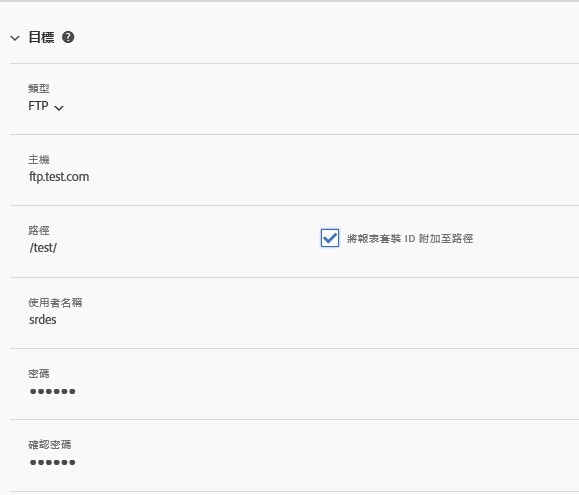
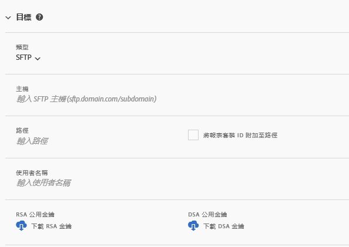
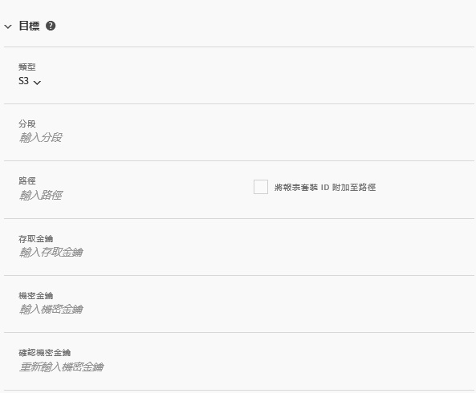
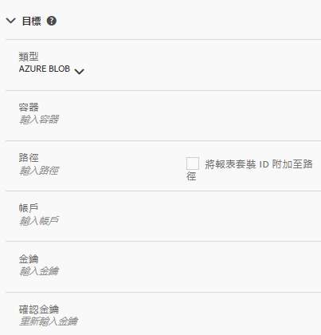

# 摘要目的地

「摘要目的地」區段定義摘要的散布方式。

分送管道有四種:

* FTP
* SFTP
* Amazon S3
* Azure Blob

## FTP {#section_D2B521C49BDE4F91A1999FE222CF306F}

資料饋送資料可以傳送至 Adobe 或客戶託管的 FTP 位置。

如果您選擇將資料上傳至您的 FTP 伺服器，您必須提供正確的使用者名稱、密碼和上傳路徑給 Adobe。您必須自行管理您的伺服器磁碟空間，因為 Adobe 不會刪除伺服器上的任何資料。

## SFTP {#section_8D9215E441474D2BBC56228C2BC926E5}

資料摘要資料可以傳送至 Adobe 或客戶託管的 sFTP 位置。

如果您選擇將資料上傳至您的 FTP 伺服器，您必須提供正確的使用者名稱和上傳路徑給 Adobe。

<!-- 

Adobe Customer Care will provide you with a Public key. Verify in recording.

 -->

您必須自行管理您的伺服器磁碟空間，因為 Adobe 不會刪除伺服器上的任何資料。

## Amazon S3 {#section_4191CD7B8D3F419EB850B286B542C14A}

您可以將檔案上傳到 Amazon S3 分段。Amazon 會自動加密 (Amazon 伺服器上的) 閒置資料。下載資料時，則會自動解密。

如果您選擇透過 Amazon S3 上傳資料，則需提供分段名稱、存取金鑰 ID、祕密金鑰以及資料夾名稱。

資料饋送通訊現在可以傳送至以下 11 個標準 AWS 區域 (必要時需使用適當的簽章演算法):

* us-east-1
* us-west-1
* us-west-2
* ap-south-1
* ap-northeast-2
* ap-southeast-1
* ap-southeast-2
* ap-northeast-1
* eu-central-1
* eu-west-1
* sa-east-1

我們目前尚不支援中國北京 AWS 區域 (cn-north-1)。

## Azure Blob {#section_1E9F1D0E7EAB4189A5D748FCA57D63D1}

您可以將檔案上傳到 Amazon Blob。

## 欄位 {#section_AD54B41BC7C945DC85F5FB8FCD4A4792}

下表展示所有分送管道的所有選項。可用選項取決於選取的分送管道。

<table id="table_F743C620C82349D9943A13B99EA312BA"> 
 <thead> 
  <tr> 
   <th colname="col1" class="entry"> 欄位 </th> 
   <th colname="col2" class="entry"> 說明 </th> 
  </tr> 
 </thead>
 <tbody> 
  <tr> 
   <td colname="col1"> 
存取金鑰 
 </td> 
   <td colname="col2"> 
輸入 Amazon S3 存取金鑰。 
 </td> 
  </tr> 
  <tr> 
   <td colname="col1"> 
分段 
 </td> 
   <td colname="col2"> 
輸入 Amazon S3 分段位置。 
 
該值應符合適當的 S3 分段格式。(See <a href="https://docs.aws.amazon.com/awscloudtrail/latest/userguide/cloudtrail-s3-bucket-naming-requirements.html" format="html" scope="external"> https://docs.aws.amazon.com/awscloudtrail/latest/userguide/cloudtrail-s3-bucket-naming-requirements.html</a>.) 
 
 
附註: 如需 Amazon S3 設定的詳細資訊，請參閱下文中的 <a href="../../../export/analytics-data-feed/feed-troubleshooting.md#section_6797EBBB7E6D44D4B00C7AEDF4C2EE1D" format="dita" scope="local">Amazon S3 資料摘要的 BucketOwnerFullControl 設定</a>。 
 
 </td> 
  </tr> 
  <tr> 
   <td colname="col1"> 
容器 
 </td> 
   <td colname="col2"> 
輸入 Azure Blob 容器名稱。 
 </td> 
  </tr> 
  <tr> 
   <td colname="col1"> 
 主機 
 </td> 
   <td colname="col2"> 
指定 FTP 或 SFTP 主機位置。 
 
值必須符合適當的 ftp/sftp 格式:·<code>ftp.domain.com/subdomain</code> 或 <code>sftp.domain.com/subdomain</code>。 
 
 須使用 FTP 和 sFTP 的標準連接埠 21 和 22。 
 </td> 
  </tr> 
  <tr> 
   <td colname="col1"> 
密碼 
 
確認密碼 
 </td> 
   <td colname="col2"> 
輸入 FTP 密碼。重新輸入以資確認 
 </td> 
  </tr> 
  <tr> 
   <td colname="col1"> 
路徑 
 </td> 
   <td colname="col2"> 
選取主機或分段的路徑。建立摘要前該路徑即必須存在。 
 
 
附註: 如需 Amazon S3 設定的詳細資訊，請參閱下文中的 <a href="../../../export/analytics-data-feed/feed-troubleshooting.md#section_6797EBBB7E6D44D4B00C7AEDF4C2EE1D" format="dita" scope="local">Amazon S3 資料摘要的 BucketOwnerFullControl 設定</a>。 
 
 </td> 
  </tr> 
  <tr> 
   <td colname="col1"> 
帳戶 
 </td> 
   <td colname="col2"> 
 輸入 Azure 儲存裝置帳戶。 
 </td> 
  </tr> 
  <tr> 
   <td colname="col1"> 
公開金鑰 
 </td> 
   <td colname="col2"> 
提供 SFTP 公開金鑰。 
 
您必須下載公開金鑰以設定 SFTP 存放庫。 
 
 
附註: 建立摘要不需要下載公開金鑰。 
 
 
在建立先前的摘要時，您可以使用已下載的公開金鑰。 
 
如需詳細資訊，請參閱 <a href="https://marketing.adobe.com/resources/help/en_US/whitepapers/ftp/ftp_sftp_dw.html" format="html" scope="external">https://marketing.adobe.com/resources/help/zh_TW/whitepapers/ftp/ftp_sftp_dw.html</a>。 
 </td> 
  </tr> 
  <tr> 
   <td colname="col1"> 
金鑰 
 
確認金鑰 
 </td> 
   <td colname="col2"> 
 輸入儲存裝置存取金鑰。再次輸入以資確認。 
 
 
注意: 請參閱 <a href="https://docs.microsoft.com/en-us/azure/storage/common/storage-create-storage-account#view-and-copy-storage-access-keys" format="https" scope="external">https://docs.microsoft.com/zh-tw/azure/storage/common/storage-create-storage-account#view-and-copy-storage-access-keys</a> 瞭解如何存取存取金鑰。 
 
 </td> 
  </tr> 
  <tr> 
   <td colname="col1"> 
機密金鑰 
 
確認機密金鑰 
 </td> 
   <td colname="col2"> 
輸入 Amazon S3 機密金鑰。重新輸入以資確認。 
 </td> 
  </tr> 
  <tr> 
   <td colname="col1"> 
類型 
 </td> 
   <td colname="col2"> 
選取目的地類型。 
 
 
     <ul id="ul_B893EEDA73A34DE0AEB8570BE9027F21"> 
      <li id="li_325546FCEB404C50AA6829573CCA340B">FTP (預設) </li> 
      <li id="li_6A2C03115903484797485D073A610607">AmazonS3 </li> 
      <li id="li_C24540F6FCD24702B7693A515CEBE977">SFTP </li> 
      <li id="li_8E03CA78E7FE427C9F6F8B112BC76266">Azure Blob </li> 
     </ul> 
 
選取目的地類型後，欄位清單會變更以反映選定目的地的可用選項。 
 </td> 
  </tr> 
  <tr> 
   <td colname="col1"> 
使用者名稱 
 </td> 
   <td colname="col2"> 
輸入 FTP 使用者名稱。 
 </td> 
  </tr> 
 </tbody> 
</table>

