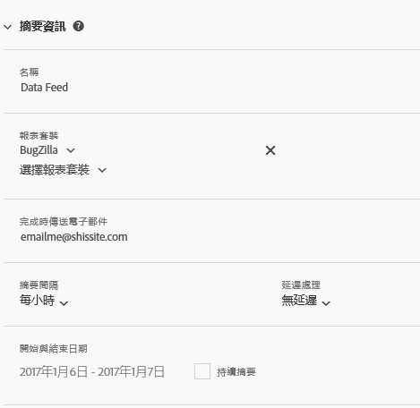

# 摘要資訊

「摘要資訊」區段可用來為摘要命名、指定執行摘要時依據的報表套裝、決定摘要循環，以及指定摘要的開始和結束時間。

<table id="table_C98C7C3CE4194BEF819E792793EBC517">
 <thead>
  <tr>
   <th colname="col1" class="entry"> 欄位 </th>
   <th colname="col2" class="entry"> 說明 </th>
  </tr>
 </thead>
 <tbody> 
  <tr> 
   <td colname="col1"> 
名稱 (必填) 
 </td>
   <td colname="col2"> 
輸入摘要名稱。 
 
名稱在選取的報表套裝內必須是唯一的，其長度上限為 255 個字元。 
 </td>
  </tr>
  <tr>
   <td colname="col1"> 
報表套裝 (必要) 
 </td>
   <td colname="col2"> 
指定摘要查詢的報表套裝。 
 
至少需要選取一個報表套裝。您不能列出同一個報表套裝兩次。 
 
可供登入使用者使用的所有非虛擬報表套裝都可供使用。 
</td>
  </tr>
  <tr>
   <td colname="col1"> 
完成時傳送電子郵件 (必要) 
 </td>
   <td colname="col2"> 
指定要接收摘要提交更新的電子郵件收件者。 
 
此欄位不能空白。必須包含格式正確的電子郵件地址。 
 </td>
  </tr>
  <tr>
   <td colname="col1"> 
摘要間隔 (必要) 
 </td>
   <td colname="col2"> 
指定排程循環。 
 
附註: 由於資料饋送壓縮檔案的潛在大小，請務必確認 ETL 程序使用 64 位元壓縮公用程式。 
 </td>
  </tr>
  <tr>
   <td colname="col1"> 
延遲處理 (可選) 
 </td>
   <td colname="col2"> 
指定套用至每個排程例項的延遲時間。 
 </td>
  </tr>
  <tr>
   <td colname="col1"> 
開始與結束日期 (必要) 
 
持續摘要 (可選) 
 </td>
   <td colname="col2"> 
排程摘要的開始和結束日期。 
 

     <ul id="ul_509977336CD34032924B48E043E8CBC7">
      <li id="li_BFB5B6ADCB184D839C9BA42DB3DCAF32">開始日期: 預設值為今天的日期 </li>
      <li id="li_34F8DB45D9B54076840D1A0B782812D3">結束日期: 預設值為明天的日期 </li>
     </ul>
     
 </td>
  </tr>
 </tbody>
</table>