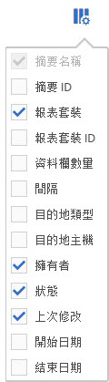

# 排序欄

您可以決定要顯示哪些欄，以及根據需求予以排序。

1. To determine which columns are visible, click the **[!UICONTROL Columns Configuration]** button.

   

1. 若要排列欄的順序，請按一下欄標題。

   字母順序欄會以字母順序排序。按一下標題可依照反向的字母順序排序。

   數值欄會以依照數字順序排序。按一下標題可切換由低到高或由高到低排序。
