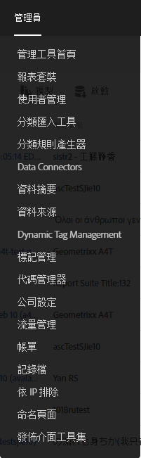
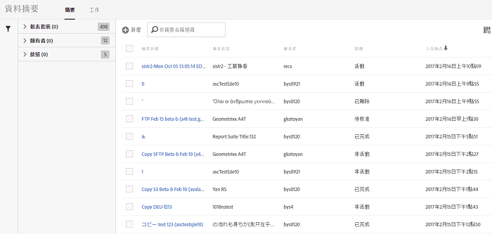

# 開啓資料饋送介面

「資料摘要」使用者介面可從「」管理索引標籤存取。

1. 開啟管理索引標籤。 
1. Select **[!UICONTROL Data Feeds]**.

   

「資料摘要」著陸頁面會針對管理使用者可存取的所有報表套裝列出目前為公司定義的所有摘要。

如果尚未設定摘要，頁面會顯示&#x200B;**[!UICONTROL 「建立新的資料摘要」]按鈕。**

To view your [jobs](../../../export/analytics-data-feed/c-data-feed-actions/t-feed-job-history.md#task_0D05F2D1B41B4E4A95B570DC78014480), click **[!UICONTROL Jobs]**. To return to the feeds view, click **[!UICONTROL Feeds]**.