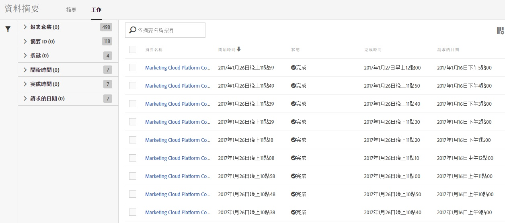
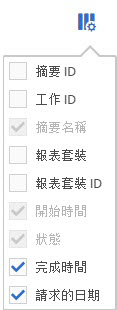

# 資料饋送工作-概述

使用「工作」索引標籤來檢視工作記錄及執行工作管理任務。

「工作」清單能提供如工作狀態、工作開始和完成時間、工作執行時間等資訊。

按一下欄標題可切換工作的顯示順序。

若要設定「工作」清單顯示的資訊，請按一下「設定」圖示，然後選取需要的欄名稱。

「摘要名稱」、「開始時間」及「狀態」是必要的欄，因此無法將其從「工作」清單中移除。

| 欄 | 說明 |
|---|---|
| 摘要 ID | 摘要的唯一識別碼。 |
| 工作 ID | 工作的唯一識別碼。 |
| 摘要名稱 | 摘要的名稱。 |
| 開始時間 | 以您所在時區顯示的工作開始時間。 |
| 執行時間 | 工作執行所需的時間。顯示格式為 dd hh:mm:ss。 |
| 狀態 | 工作目前的[狀態](../../../export/analytics-data-feed/c-df-jobs/r-job-status.md#reference_7A39A327F643447F9B5AE3A2502C72BA)。 |
| 完成時間 | 工作執行完成時的時間。以您的所在時區為顯示。 |
| 請求的日期 | 工作包含之資料的資料戳記。 |

